# Introduction 

This section visualises distributions of variables, and describes the scales involved.


Clicking the "Code"-buttons on the right shows code for each chunk.

To start data analysis, we run a data compilation file to enable compiling the document. This file can be found [here](https://raw.githubusercontent.com/heinonmatti/baseline-visu/master/baseline-datasetup.R).


```r
source("baseline-datasetup.R")
```

*Note on using package brms*

To use package brms (Bayesian Regression Models using 'Stan') you need RStan and Rtools, and to manually set Rtools folder if it's not C:/Rtools/. 


```r

# Sometimes, having BINPREF in .Renviron file of the R directory, doesn't work and you keep needing the code below.

# Sys.setenv("BINPREF" = "C:/Rtools/mingw_$(WIN)/bin/")

```


<a id="accelerometry"></a>

# Description of accelerometer measurement

The hip-worn accelerometer (Hookie AM 20, Traxmeet Ltd, Espoo, Finland) using a digital triaxial acceleration sensor (ADXL45; Analog Devices, Norwood MA) was attached to a flexible belt and participants were instructed to wear the belt around their right hip for seven consecutive days during waking hours, except during shower and other water activities. The acceleration signal was collected at 100 Hz sampling frequency, ± 16 g acceleration range and 0.004 g resolution. PA-parameters were based on mean amplitude deviation (MAD) of the resultant acceleration analysed in 6s epochs [1]. The MAD values were then converted to metabolic equivalent (MET) values [2]. The epoch-wise MET values were further smoothed by calculating 1min exponential moving average. Using the smoothed MET values total PA was classified in terms of energy consumption covering MET values higher than 1.5 and moderate-to-vigorous PA (MVPA) covering MET values equal to or higher than 3 [1,2]. According to the definition of SB [3], time spent in sitting and reclining positions were combined to indicate SB, whereas standing was analysed separately as another form of stationary behaviour. Body postures were recognised from the raw acceleration data by employing both direction and intensity information from all three measurement axes. The recognition was based on the low intensity of movement (<1.5 MET) and the accelerometer orientation in relation to identified upright position (angle for posture estimation, APE) calculated at the end of each 6 s epoch [4].

1. Vähä-Ypyä H, Vasankari T, Husu P, Suni J, Sievänen H. A universal, accurate intensity-based classification of different physical activities using raw data of accelerometer. Clinical physiology and functional imaging. 2015;35:64–70. 
2. Vähä-Ypyä H, Vasankari T, Husu P, Mänttäri A, Vuorimaa T, Suni J, et al. Validation of cut-points for evaluating the intensity of physical activity with accelerometry-based mean amplitude deviation (MAD). PLoS One. 2015;10:e014813. 
3. Tremblay MS, Aubert S, Barnes JD, Saunders TJ, Carson V, Latimer-Cheung AE, et al. Sedentary Behavior Research Network (SBRN) – Terminology Consensus Project process and outcome. International Journal of Behavioral Nutrition and Physical Activity. 2017;14:75. Available from: https://doi.org/10.1186/s12966-017-0525-8
4. Vähä-Ypyä H, Husu P, Suni J, Vasankari T, Sievänen H. Reliable recognition of lying, sitting, and standing with a hip-worn accelerometer. Scand J Med Sci Sports. 2018;28:1092–102.

<a id="items"></a>

# Descriptions of scales used to measure main theoretical predictors of PA

All scales, their properties and individual items can be found in the [codebook](https://heinonmatti.github.io/baseline-visu/codebook_elaborate.html).

*Outcome expectations.* Outcome expectations were measured using a 12-item scale, with the items based on a belief elicitation study conducted in the study population, in line with standard procedures (Francis et al., 2004). The scale consisted of 9 positive outcome expectations items and three negative ones.

*Autonomous motivation.* We used 15 items from the 19-item BREQ-2 questionnaire (Markland & Tobin, 2004), combined with three items from the integrated regulation scale from Wilson et al. (2006).

*Perceived environmental opportunities.* Environmental and social opportunities for PA were measured using an 8-item scale developed for this study.

*Descriptive norms.* PA descriptive norm was gauged by two questions, one on the behaviour of friends and the other on the behaviour of parents.

*Intention.* Participants were queried about their intention to be physically active with two questions. Both were formed as "I intend to be physically active for at least 1,5 hours weekly, during the next month". Both had a scale from 1 to 7, the first ranging from "unlikely" to "likely" and the other ranging from "absolutely not" to "absolutely yes".

*Action- and coping planning.* Action- and coping planning was measured with an 8-item scale (Sniehotta et al., 2005).

*Self-efficacy/perceived behavioural control.* PA self-efficacy was measured with 2 items, perceived behavioural control with 3 items (Hagger et al., 2003).

**Behaviour change technique (BCT) use:**

Use of BCTs was assessed by asking whether the participants had engaged in them during the last three weeks. The scale was not previously validated, but was used in (improved from?) the feasibility study (Hankonen et al 2017). Two types of BCTs were assessed; those judged to benefit from repeated enactment (such as reminding oneself of positive consequences) and others, such as goal setting.

*Agreement-dependent BCTs.* 

Agreement-dependent BCTs were asked with the lead "Have you done the following during the last three weeks?". The response scale ranged from 1 = not at all true to 6 = completely true. Items are as follows: 

1. I have set PA goals for myself.  
2. I have personally made a specific plan ("what, where, how") to implement my PA.  
3. I have a PA plan, which has been made by someone else, e.g. my sports club (e.g. a workout schedule).  
4. I have a way by which I remind myself of my PA plan, e.g. I write it down in the calendar.  
5. I have broken down larger PA goals to smaller subgoals.  
6. I have tried out new ways for me to be physically active.  
7. I have pondered, what kind of difficult situations or barriers prevent me from implementing my PA plan.  
8. I have planned for ways to overcome barriers to doing PA.  
9. I have thought about how PA fits my identity (self concept).  
10. I have attempted to find ways to exercise so, that it won't obstruct but instead helps actualise my other life values.  

*Frequency-dependent BCTs.* 

The answer scale for frequency-dependent BCTs was as follows: 1 = not once, 2 = once, 3 = twice, 4 = weekly, 5 = about every second day, 6 = daily. Items are as follows: 

1. I have reminded myself in my spare time what kind of positive consequences frequent PA would have in my life.
2. I have monitored my PA by marking the PA occasions on an exercise log on paper.
3. I have monitored my PA by using a smartphone, e.g. the Moves-app.
4. I have used memory cues with which I remember to implement my PA intention.
5. I have compared my actualized PA with the PA goal I have set.
6. I have thought about which reasons to do PA are important to me personally.
7. I have made changes in my home (e.g. my room or my computer), so that starting PA would be easier.
8. I have asked my friends or family for support to reach my PA goals.
9. If I haven't reached my PA goal, I have evaluated, what went wrong.


<!-- # Visualising random effects using full posterior -->

<!-- TODO: Delete this section? -->

<!-- ## Using rstanarm -->

<!-- Plot below shows credible intervals deviations   -->


<!-- Next section omitted, as not currently seen as relevant -->


<!-- ## Random effects in autonomous motivation -->


$~$
$~$
<a id="stackedGraph"></a>

# Average day's activity as proportions {.tabset} 

These plots show the average proportions of daily activity by gender and intervention. Note, that they hide the variability in these values.

## Stacking raw values 


```r

averageDayActivityPlot_gender <- df %>%  
  dplyr::select(girl, intervention, track,
                     "Sedentary behavior" = sitLieAccelerometer_T1, 
                     "Standing still" = standingAccelerometer_T1, 
                     "Light PA" = lpaAccelerometer_T1, 
                     "Moderate PA" = mpaAccelerometer_T1, 
                     "Vigorous PA" = vpaAccelerometer_T1) %>%
  dplyr::filter(track != "Other") %>% # Drop small track "Other"
  tidyr::gather(variable, value, -(girl:track)) %>% # Convert data to long form
  dplyr::mutate(track = factor(track, ordered = TRUE,
                               levels = c("Nur",
                                          "HRC",
                                          "BA",
                                          "IT",
                                          "Other")), # Order factors, to preserve presentation order
                variable = factor(variable, ordered = TRUE,
                                  levels = c("Sedentary behavior", 
                                             "Standing still", 
                                             "Light PA", 
                                             "Moderate PA", 
                                             "Vigorous PA"))) %>% 
  ggplot2::ggplot(aes(y = value, x = girl)) +
  # coord_flip() +
  geom_bar(aes(fill = variable), 
           position = position_fill(reverse = TRUE),
           stat = "identity") +
  scale_y_continuous(labels = scales::percent) +
  scale_fill_viridis_d(option = "inferno", begin = 0.1, end = 0.8) +
  labs(x = NULL, y = NULL) +
  theme(legend.title=element_blank()) +
  guides(fill = guide_legend(reverse = TRUE)) + # Make the legend order match the plot order
  facet_wrap("track", nrow = 1)

# Same plot but for intervention/control:

averageDayActivityPlot_intervention <- df %>% dplyr::select(girl, intervention, track,
                     "Sedentary behavior" = sitLieAccelerometer_T1, 
                     "Standing still" = standingAccelerometer_T1, 
                     "Light PA" = lpaAccelerometer_T1, 
                     "Moderate PA" = mpaAccelerometer_T1, 
                     "Vigorous PA" = vpaAccelerometer_T1) %>%
  dplyr::filter(track != "Other") %>% # Drop small track "Other"
  tidyr::gather(variable, value, -(girl:track)) %>% # Convert data to long form
  dplyr::mutate(track = factor(track, ordered = TRUE,
                               levels = c("Nur",
                                          "HRC",
                                          "BA",
                                          "IT",
                                          "Other")), 
                variable = factor(variable, ordered = TRUE,
                                  levels = c("Sedentary behavior", 
                                             "Standing still", 
                                             "Light PA", 
                                             "Moderate PA", 
                                             "Vigorous PA")),
                intervention = factor(intervention, ordered = TRUE,
                                      levels = c(0, 1),
                                      labels = c("Control", "Intervention"))) %>% 
  ggplot2::ggplot(aes(y = value, x = intervention)) +
  # coord_flip() +
  geom_bar(aes(fill = variable), 
           position = position_fill(reverse = TRUE),
           stat = "identity") +
  scale_y_continuous(labels = scales::percent) +
  scale_fill_viridis_d(option = "inferno", begin = 0.1, end = 0.8) +
  labs(x = NULL, y = NULL) +
  theme(legend.title=element_blank(),
        axis.text.x = element_text(angle = 45, hjust = 1, size = 10)) + # Adjust label text
  guides(fill = guide_legend(reverse = TRUE)) + # Make the legend order match the plot order
  facet_wrap("track", nrow = 1)


averageDayActivityPlot_gender
```

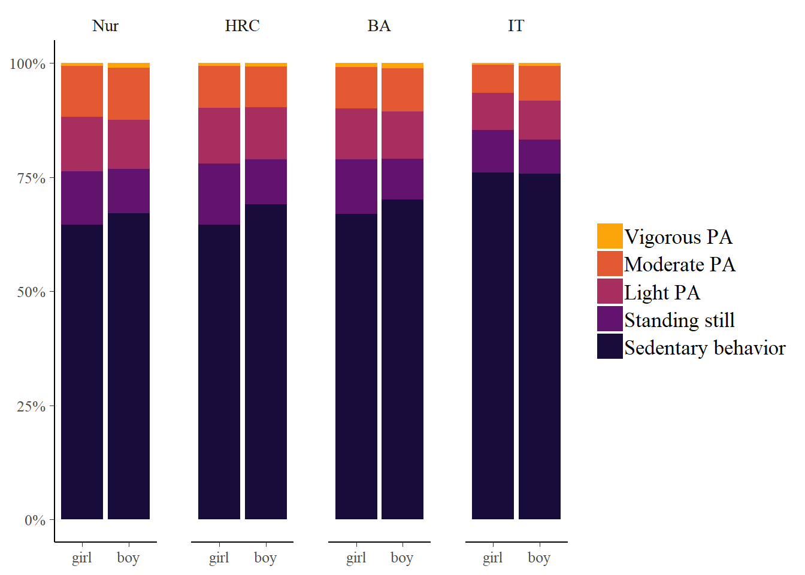<!-- -->

```r
averageDayActivityPlot_intervention
```

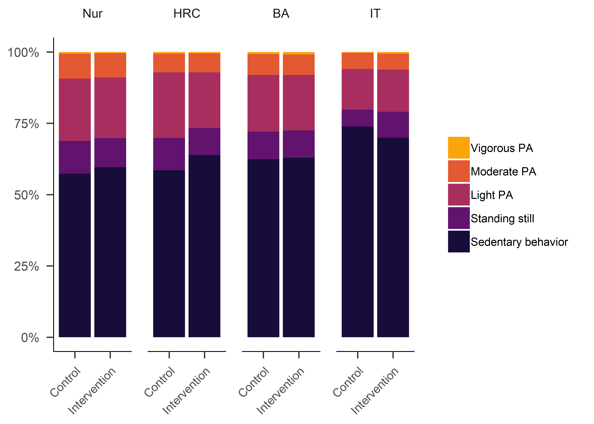<!-- -->
 
## Stacking percentages

In these plots, the time values are first converted to proportions for each participant. The function dplyr::mutate_at is used to take each variable which contains the word Accelerometer, but not those that contain the word weartime, and for each of those variables, a division by weartime is conducted. 

As can be seen, the result is exactly the same, as when raw values were stacked.


```r

averageDayActivityPlot_gender <- df %>% 
  dplyr::mutate_at(vars(contains("Accelerometer"), -contains("weartime")), funs(./weartimeAccelerometer_T1)) %>% 
  dplyr::select(girl, intervention, track,
                     "Sedentary behavior" = sitLieAccelerometer_T1, 
                     "Standing still" = standingAccelerometer_T1, 
                     "Light PA" = lpaAccelerometer_T1, 
                     "Moderate PA" = mpaAccelerometer_T1, 
                     "Vigorous PA" = vpaAccelerometer_T1) %>%
  dplyr::filter(track != "Other") %>% # Drop small track "Other"
  tidyr::gather(variable, value, -(girl:track)) %>% # Convert data to long form
  dplyr::mutate(track = factor(track, ordered = TRUE,
                               levels = c("Nur",
                                          "HRC",
                                          "BA",
                                          "IT",
                                          "Other")), # Order factors, to preserve presentation order
                variable = factor(variable, ordered = TRUE,
                                  levels = c("Sedentary behavior", 
                                             "Standing still", 
                                             "Light PA", 
                                             "Moderate PA", 
                                             "Vigorous PA"))) %>% 
  ggplot2::ggplot(aes(y = value, x = girl)) +
  # coord_flip() +
  geom_bar(aes(fill = variable), 
           position = position_fill(reverse = TRUE),
           stat = "identity") +
  scale_y_continuous(labels = scales::percent) +
  scale_fill_viridis_d(option = "inferno", begin = 0.1, end = 0.8) +
  labs(x = NULL, y = NULL) +
  theme(legend.position="none", 
        axis.text.x = element_text(angle = 55, hjust = 1, size = 10)) + # Adjust label text
  guides(fill = guide_legend(reverse = TRUE)) + # Make the legend order match the plot order
  facet_wrap("track", nrow = 1)

# Same plot but for intervention/control:

averageDayActivityPlot_intervention <- df %>% 
  dplyr::mutate_at(vars(contains("Accelerometer"), -contains("weartime")), funs(./weartimeAccelerometer_T1)) %>% 
  dplyr::select(girl, intervention, track,
                     "Sedentary behavior" = sitLieAccelerometer_T1, 
                     "Standing still" = standingAccelerometer_T1, 
                     "Light PA" = lpaAccelerometer_T1, 
                     "Moderate PA" = mpaAccelerometer_T1, 
                     "Vigorous PA" = vpaAccelerometer_T1) %>% 
  dplyr::filter(track != "Other") %>% # Drop small track "Other"
  tidyr::gather(variable, value, -(girl:track)) %>% # Convert data to long form
  dplyr::mutate(track = factor(track, ordered = TRUE,
                               levels = c("Nur",
                                          "HRC",
                                          "BA",
                                          "IT",
                                          "Other")), 
                variable = factor(variable, ordered = TRUE,
                                  levels = c("Sedentary behavior", 
                                             "Standing still", 
                                             "Light PA", 
                                             "Moderate PA", 
                                             "Vigorous PA")),
                intervention = factor(intervention, ordered = TRUE,
                                      levels = c(0, 1),
                                      labels = c("Control", "Intervention"))) %>% 
  ggplot2::ggplot(aes(y = value, x = intervention)) +
  # coord_flip() +
  geom_bar(aes(fill = variable), 
           position = position_fill(reverse = TRUE),
           stat = "identity") +
  scale_y_continuous(labels = scales::percent) +
  scale_fill_viridis_d(option = "inferno", begin = 0.1, end = 0.8) +
  labs(x = NULL, y = NULL) +
  theme(legend.title=element_blank(),
        axis.text.x = element_text(angle = 55, hjust = 1, size = 10)) + # Adjust label text
  guides(fill = guide_legend(reverse = TRUE)) + # Make the legend order match the plot order
  facet_wrap("track", nrow = 1)


averageDayActivityPlot_gender +
averageDayActivityPlot_intervention
```

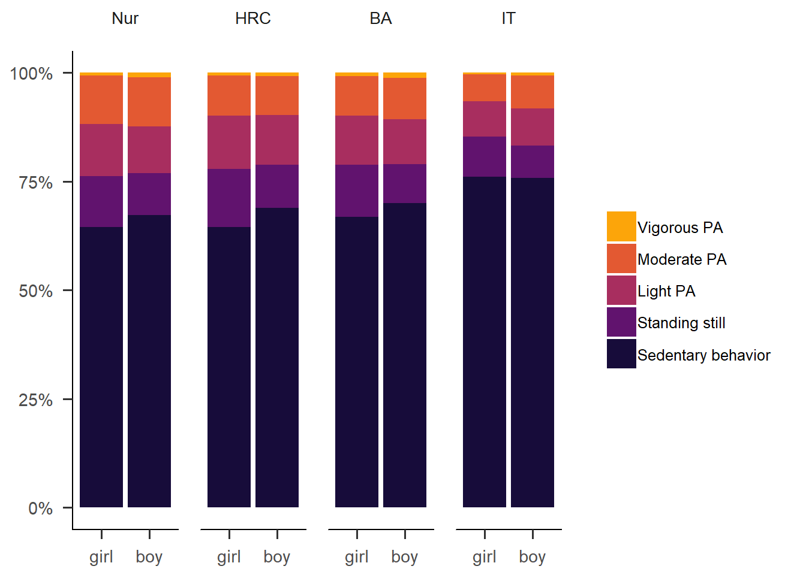<!-- -->

# Primary outcome variables

[code chunk below transforms MVPA, SB and wear time to hours for ease of interpretation]


```r

d <- d %>% dplyr::mutate(
                         mvpaAccelerometer_T1 = mvpaAccelerometer_T1 / 60, 
                         # mvpaAccelerometer_T3 = mvpaAccelerometer_T3 / 60,
                         weartimeAccelerometer_T1 = weartimeAccelerometer_T1 / 60,
                         # weartimeAccelerometer_T3 = weartimeAccelerometer_T3 / 60,
                         sitLieAccelerometer_T1 = sitLieAccelerometer_T1 / 60
                         # sitLieAccelerometer_T3 = sitLieAccelerometer_T3 / 60
                         )

df <- df %>% dplyr::mutate(
                         mvpaAccelerometer_T1 = mvpaAccelerometer_T1 / 60, 
                         # mvpaAccelerometer_T3 = mvpaAccelerometer_T3 / 60,
                         weartimeAccelerometer_T1 = weartimeAccelerometer_T1 / 60,
                         # weartimeAccelerometer_T3 = weartimeAccelerometer_T3 / 60,
                         sitLieAccelerometer_T1 = sitLieAccelerometer_T1 / 60
                         # sitLieAccelerometer_T3 = sitLieAccelerometer_T3 / 60
                         )
```


## Self-reported vs. accelerometer-measured MVPA

<!-- TODO: Change Red line for the decided cutoff -->


```r

ggstatsplot::ggscatterstats(
  data = na.omit(dplyr::select(df, mvpaAccelerometer_T1, padaysLastweek_T1)),
  x = mvpaAccelerometer_T1,
  y = padaysLastweek_T1,
  type = "robust",                               # type of test that needs to be run
  results.subtitle = FALSE,
  xlab = "Accelerometer-measured MVPA hours (following week)",              # label for x axis
  ylab = "Self-reported days of >30min MVPA (previous week)",              # label for y axis 
  line.color = "black",                     # changing regression line colour line
  title = "",       # title text for the plot
  # caption = expression(                          # caption text for the plot
  #  paste(italic("Note"), ": this is a demo")
  #  ),
  marginal.type = "histogram",                     # type of marginal distribution to be displayed
  xfill = "blue",                                # colour fill for x-axis marginal distribution 
  yfill = "red",                                 # colour fill for y-axis marginal distribution
  centrality.para = "median"                          # which type of intercept line is to be displayed  
  # width.jitter = 0,                            # amount of horizontal jitter for data points
  # height.jitter = 0                            # amount of vertical jitter for data points
) 
## Warning: This plot can't be further modified with `ggplot2` functions.
## In case you want a `ggplot` object, set `marginal = FALSE`.
```

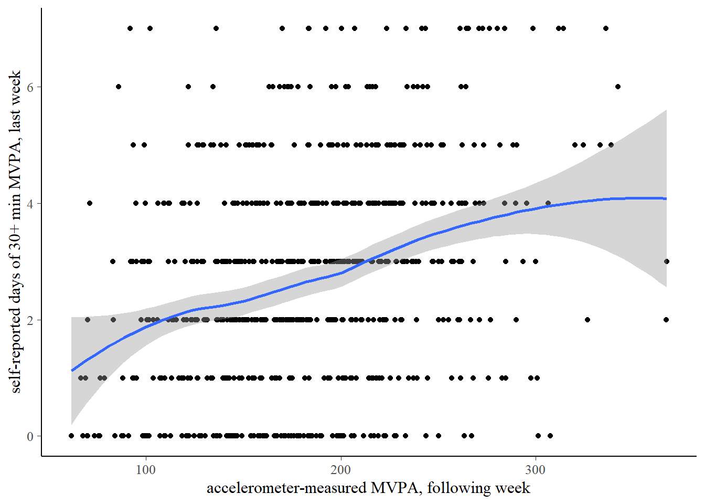<!-- -->

```r

df %>% ggplot2::ggplot(aes(x = mvpaAccelerometer_T1, y = padaysLastweek_T1)) + geom_point() + geom_smooth(method = "loess") +
  # geom_vline(xintercept = 120, col = "red") +
  labs(x = "accelerometer-measured MVPA hours, following week", y = "self-reported days of 30+ min MVPA, last week")
```

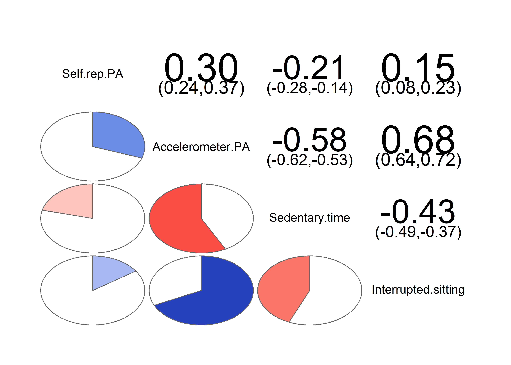<!-- -->

```r

corrgram::corrgram(data.frame("Self-rep PA" = df$padaysLastweek_T1, 
                              "Accelerometer PA" = df$mvpaAccelerometer_T1, 
                              "Sedentary time" = df$sitLieAccelerometer_T1, 
                              "Interrupted sitting" = df$sitBreaksAccelerometer_T1), 
                   lower.panel = corrgram::panel.pie, upper.panel = corrgram::panel.conf)
```

<!-- -->

## Accelerometer weartime

### Density plot by intervention and gender


```r

# Create data frame
densplot <- d
levels(densplot$intervention) <- c("Control", "Intervention")
levels(densplot$girl) <- recode(densplot$girl, "boy" = "Boys", "girl" = "Girls")

# This gives side-by-side plots. There's a third plot below the two, which is fake to include x-axis text.
layout(matrix(c(1, 2, 3, 3), nrow = 2, ncol = 2, byrow = TRUE),
       widths = c(0.5, 0.5), heights = c(0.45, 0.05))

# Minimise whitespace; see https://stackoverflow.com/questions/15848942/how-to-reduce-space-gap-between-multiple-graphs-in-r
par(mai = c(0.3, 0.3, 0.1, 0.0)) 

## Girls vs. boys
# Choose only the variables needed and drop NA
dens <- densplot %>% dplyr::select(weartimeAccelerometer_T1, girl) %>% 
  dplyr::filter(complete.cases(.))

# Set random number generator for reproducibility of bootstrap test of equal densities
set.seed(10)

# Make plot
sm.weartimeAccelerometer_T1_2 <- sm.density.compare2(as.numeric(dens$weartimeAccelerometer_T1), 
                                               as.factor(dens$girl), 
                                               model = "equal",
                                               xlab = "", ylab = "",
                                               col = viridis::viridis(4, end  =  0.8)[c(3, 1)], 
                                               lty = c(1,3), yaxt = "n",
                                               bandcol = 'LightGray', 
                                               lwd = (c(2,2)))
## 
## Test of equal densities:  p-value =  0.41
legend("topright", levels(dens$girl), col = viridis::viridis(4, end = 0.8)[c(1, 3)], lty = c(3,1), lwd = (c(2,2)))
mtext(side = 2, "Density", line = 0.5)

## Intervention vs. control
# Choose only the variables needed and drop NA
dens <- densplot %>% dplyr::select(weartimeAccelerometer_T1, intervention) %>% 
  dplyr::filter(complete.cases(.))

# Set random number generator for reproducibility of bootstrap test of equal densities
set.seed(10)
# Make plot
sm.weartimeAccelerometer_T1_2 <- sm.density.compare2(as.numeric(dens$weartimeAccelerometer_T1), 
                                               as.factor(dens$intervention), 
                                               model = "equal", 
                                               xlab = "", ylab = "",
                                               col = viridis::viridis(4, end = 0.8)[c(2, 4)], 
                                               lty = c(3,1), yaxt = "n",
                                               bandcol = 'LightGray', 
                                               lwd = (c(2,2)))
## 
## Test of equal densities:  p-value =  0
legend("topright", levels(dens$intervention), col = viridis::viridis(4, end = 0.8)[c(2, 4)], lty=c(3,1), lwd=(c(2,2)))

# Create x-axis label. See https://stackoverflow.com/questions/11198767/how-to-annotate-across-or-between-plots-in-multi-plot-panels-in-r
par(mar = c(0,0,0,0)) 
plot(1, 1, type = "n", frame.plot = FALSE, axes = FALSE) # Fake plot for x-axis label
text(x = 1.02, y = 1.3, labels = "Weartime hours", pos = 1)
```

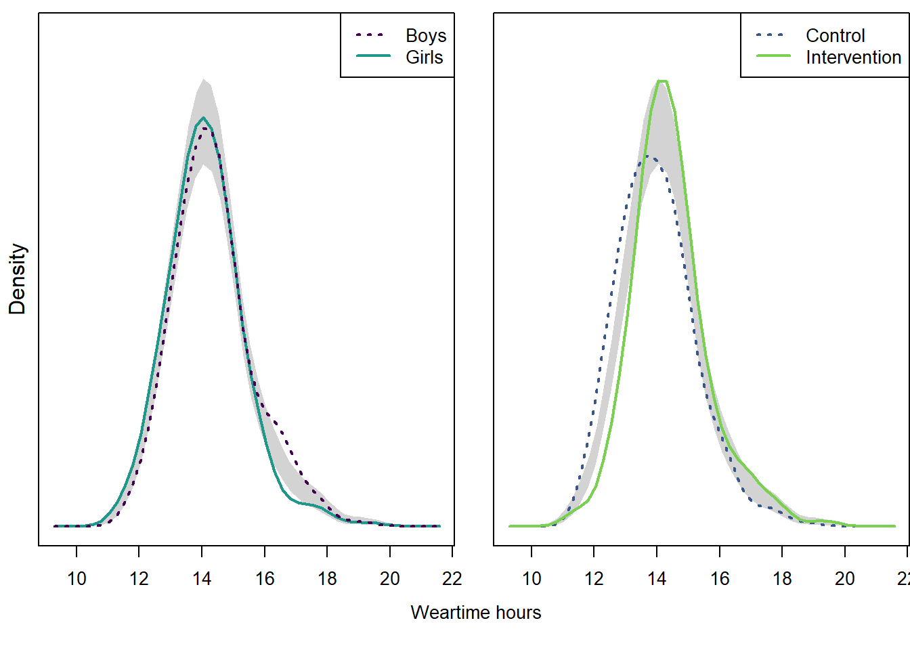<!-- -->

### Data preparation {.tabset}

#### Description

The tab "Information on data preparation" of this section present information on data preparation for the plot

#### Information on data preparation

Prepare data


```r
# m_weartimeAccelerometer_trackgirl <- brms::bf(weartimeAccelerometer_T1 ~ (1 | track:girl)) %>% 
#   brms::brm(., data = df, chains = 4, iter = 4000, control = list(adapt_delta = 0.95))
# 
# brms::prior_summary(m_weartimeAccelerometer_trackgirl, data = df)
# 
# m_weartimeAccelerometer_trackgirl
# 
# b_intercept <- brms::fixef(m_weartimeAccelerometer_trackgirl)[1]
# 
# # This gives estimates only:
# Weartime_trackgirl_estimates <- brms::ranef(m_weartimeAccelerometer_trackgirl)[[1]][1:10]
# 
# # The 2.5%ile:
# Weartime_trackgirl_CIL <- brms::ranef(m_weartimeAccelerometer_trackgirl)[[1]][21:30]
# 
# # The 97.5%ile:
# Weartime_trackgirl_CIH <- brms::ranef(m_weartimeAccelerometer_trackgirl)[[1]][31:40]
# 
# Weartime_trackgirl_ci <- data.frame(Weartime_trackgirl_CIL, Weartime_trackgirl_estimates, Weartime_trackgirl_CIH, Variable = labels(brms::ranef(m_weartimeAccelerometer_trackgirl))) %>% 
#   dplyr::mutate(b_intercept = rep(b_intercept, 10)) %>% 
#   dplyr::mutate(Weartime_trackgirl_CIL = Weartime_trackgirl_CIL + b_intercept,
#          Weartime_trackgirl_estimates = Weartime_trackgirl_estimates + b_intercept,
#          Weartime_trackgirl_CIH = Weartime_trackgirl_CIH + b_intercept,
#          track = c('BA_boy',
#                    'BA_girl',
#                    'HRC_boy',
#                    'HRC_girl',
#                    'IT_boy',
#                    'IT_girl',
#                    'Nur_boy',
#                    'Nur_girl',
#                    'Other_boy',
#                    'Other_girl'
# ))
# 
# Weartime_trackgirl_diamonds_girl <- rbind(
# Weartime_trackgirl_ci %>% dplyr::filter(track == "Nur_girl"),
# Weartime_trackgirl_ci %>% dplyr::filter(track == "HRC_girl"),
# Weartime_trackgirl_ci %>% dplyr::filter(track == "BA_girl"),
# Weartime_trackgirl_ci %>% dplyr::filter(track == "IT_girl")) %>% 
#   arrange(-row_number()) # reverse order of rows to make them right for the plot to come
# 
# Weartime_trackgirl_diamonds_boy <- rbind(
# Weartime_trackgirl_ci %>% dplyr::filter(track == "Nur_boy"),
# Weartime_trackgirl_ci %>% dplyr::filter(track == "HRC_boy"),
# Weartime_trackgirl_ci %>% dplyr::filter(track == "BA_boy"),
# Weartime_trackgirl_ci %>% dplyr::filter(track == "IT_boy")) %>% 
#   arrange(-row_number()) # reverse order of rows to make them right for the plot to come
# 
# 
# m_weartimeAccelerometer_trackintervention <- brms::bf(weartimeAccelerometer_T1 ~ (1 | track:intervention)) %>% 
#   brms::brm(., data = df, chains = 4, iter = 4000, control = list(adapt_delta = 0.95))
# 
# brms::prior_summary(m_weartimeAccelerometer_trackintervention, data = df)
# 
# m_weartimeAccelerometer_trackintervention
# 
# b_intercept <- brms::fixef(m_weartimeAccelerometer_trackintervention)[1]
# 
# # This gives estimates only:
# Weartime_trackintervention_estimates <- brms::ranef(m_weartimeAccelerometer_trackintervention)[[1]][1:10]
# 
# 
# # The 2.5%ile:
# Weartime_trackintervention_CIL <- brms::ranef(m_weartimeAccelerometer_trackintervention)[[1]][21:30]
# 
# # The 97.5%ile:
# Weartime_trackintervention_CIH <- brms::ranef(m_weartimeAccelerometer_trackintervention)[[1]][31:40]
# 
# Weartime_trackintervention_ci <- data.frame(Weartime_trackintervention_CIL, Weartime_trackintervention_estimates, Weartime_trackintervention_CIH, Variable = labels(brms::ranef(m_weartimeAccelerometer_trackintervention))) %>% 
#   dplyr::mutate(b_intercept = rep(b_intercept, 10)) %>% 
#   dplyr::mutate(Weartime_trackintervention_CIL = Weartime_trackintervention_CIL + b_intercept,
#          Weartime_trackintervention_estimates = Weartime_trackintervention_estimates + b_intercept,
#          Weartime_trackintervention_CIH = Weartime_trackintervention_CIH + b_intercept,
#          track = c('BA_control',
#                    'BA_intervention',
#                    'HRC_control',
#                    'HRC_intervention',
#                    'IT_control',
#                    'IT_intervention',
#                    'Nur_control',
#                    'Nur_intervention',
#                    'Other_control',
#                    'Other_intervention'
# ))
# 
# Weartime_trackintervention_diamonds_intervention <- rbind(
# Weartime_trackintervention_ci %>% dplyr::filter(track == "Nur_intervention"),
# Weartime_trackintervention_ci %>% dplyr::filter(track == "HRC_intervention"),
# Weartime_trackintervention_ci %>% dplyr::filter(track == "BA_intervention"),
# Weartime_trackintervention_ci %>% dplyr::filter(track == "IT_intervention")) %>% 
#   arrange(-row_number()) # reverse order of rows to make them right for the plot to come
# 
# Weartime_trackintervention_diamonds_control <- rbind(
# Weartime_trackintervention_ci %>% dplyr::filter(track == "Nur_control"),
# Weartime_trackintervention_ci %>% dplyr::filter(track == "HRC_control"),
# Weartime_trackintervention_ci %>% dplyr::filter(track == "BA_control"),
# Weartime_trackintervention_ci %>% dplyr::filter(track == "IT_control")) %>% 
#   arrange(-row_number()) # reverse order of rows to make them right for the plot to come
# 
# save(Weartime_trackgirl_diamonds_girl, file = "./Rdata_files/Weartime_trackgirl_diamonds_girl.Rdata")
# save(Weartime_trackgirl_diamonds_boy, file = "./Rdata_files/Weartime_trackgirl_diamonds_boy.Rdata")
# save(Weartime_trackintervention_diamonds_intervention, file = "./Rdata_files/Weartime_trackintervention_diamonds_intervention.Rdata")
# save(Weartime_trackintervention_diamonds_control, file = "./Rdata_files/Weartime_trackintervention_diamonds_control.Rdata")

load("./Rdata_files/Weartime_trackgirl_diamonds_girl.Rdata")
load("./Rdata_files/Weartime_trackgirl_diamonds_boy.Rdata")
load("./Rdata_files/Weartime_trackintervention_diamonds_intervention.Rdata")
load("./Rdata_files/Weartime_trackintervention_diamonds_control.Rdata")

Weartime_trackgirl_diamonds_girl
```

<div data-pagedtable="false">
  <script data-pagedtable-source type="application/json">
{"columns":[{"label":["Weartime_trackgirl_CIL"],"name":[1],"type":["dbl"],"align":["right"]},{"label":["Weartime_trackgirl_estimates"],"name":[2],"type":["dbl"],"align":["right"]},{"label":["Weartime_trackgirl_CIH"],"name":[3],"type":["dbl"],"align":["right"]},{"label":["Variable"],"name":[4],"type":["fctr"],"align":["left"]},{"label":["b_intercept"],"name":[5],"type":["dbl"],"align":["right"]},{"label":["track"],"name":[6],"type":["chr"],"align":["left"]}],"data":[{"1":"818.6757","2":"843.6090","3":"860.1943","4":"track:girl","5":"850.0678","6":"IT_girl"},{"1":"831.4844","2":"847.7250","3":"861.2620","4":"track:girl","5":"850.0678","6":"BA_girl"},{"1":"824.2838","2":"841.9867","3":"854.0774","4":"track:girl","5":"850.0678","6":"HRC_girl"},{"1":"833.0613","2":"846.4882","3":"857.4484","4":"track:girl","5":"850.0678","6":"Nur_girl"}],"options":{"columns":{"min":{},"max":[10]},"rows":{"min":[10],"max":[10]},"pages":{}}}
  </script>
</div>

```r
Weartime_trackgirl_diamonds_boy
```

<div data-pagedtable="false">
  <script data-pagedtable-source type="application/json">
{"columns":[{"label":["Weartime_trackgirl_CIL"],"name":[1],"type":["dbl"],"align":["right"]},{"label":["Weartime_trackgirl_estimates"],"name":[2],"type":["dbl"],"align":["right"]},{"label":["Weartime_trackgirl_CIH"],"name":[3],"type":["dbl"],"align":["right"]},{"label":["Variable"],"name":[4],"type":["fctr"],"align":["left"]},{"label":["b_intercept"],"name":[5],"type":["dbl"],"align":["right"]},{"label":["track"],"name":[6],"type":["chr"],"align":["left"]}],"data":[{"1":"846.9408","2":"858.6078","3":"875.9802","4":"track:girl","5":"850.0678","6":"IT_boy"},{"1":"835.0435","2":"849.8101","3":"863.6825","4":"track:girl","5":"850.0678","6":"BA_boy"},{"1":"829.6737","2":"846.8282","3":"861.0871","4":"track:girl","5":"850.0678","6":"HRC_boy"},{"1":"840.7207","2":"854.5491","3":"872.0521","4":"track:girl","5":"850.0678","6":"Nur_boy"}],"options":{"columns":{"min":{},"max":[10]},"rows":{"min":[10],"max":[10]},"pages":{}}}
  </script>
</div>

```r
Weartime_trackintervention_diamonds_intervention
```

<div data-pagedtable="false">
  <script data-pagedtable-source type="application/json">
{"columns":[{"label":["Weartime_trackintervention_CIL"],"name":[1],"type":["dbl"],"align":["right"]},{"label":["Weartime_trackintervention_estimates"],"name":[2],"type":["dbl"],"align":["right"]},{"label":["Weartime_trackintervention_CIH"],"name":[3],"type":["dbl"],"align":["right"]},{"label":["Variable"],"name":[4],"type":["fctr"],"align":["left"]},{"label":["b_intercept"],"name":[5],"type":["dbl"],"align":["right"]},{"label":["track"],"name":[6],"type":["chr"],"align":["left"]}],"data":[{"1":"845.5967","2":"864.5076","3":"884.5545","4":"track:intervention","5":"851.3101","6":"IT_intervention"},{"1":"837.3360","2":"855.8128","3":"873.7370","4":"track:intervention","5":"851.3101","6":"BA_intervention"},{"1":"840.4959","2":"860.1772","3":"880.8435","4":"track:intervention","5":"851.3101","6":"HRC_intervention"},{"1":"840.5298","2":"856.8863","3":"872.9107","4":"track:intervention","5":"851.3101","6":"Nur_intervention"}],"options":{"columns":{"min":{},"max":[10]},"rows":{"min":[10],"max":[10]},"pages":{}}}
  </script>
</div>

```r
Weartime_trackintervention_diamonds_control
```

<div data-pagedtable="false">
  <script data-pagedtable-source type="application/json">
{"columns":[{"label":["Weartime_trackintervention_CIL"],"name":[1],"type":["dbl"],"align":["right"]},{"label":["Weartime_trackintervention_estimates"],"name":[2],"type":["dbl"],"align":["right"]},{"label":["Weartime_trackintervention_CIH"],"name":[3],"type":["dbl"],"align":["right"]},{"label":["Variable"],"name":[4],"type":["fctr"],"align":["left"]},{"label":["b_intercept"],"name":[5],"type":["dbl"],"align":["right"]},{"label":["track"],"name":[6],"type":["chr"],"align":["left"]}],"data":[{"1":"828.1666","2":"848.7799","3":"867.9705","4":"track:intervention","5":"851.3101","6":"IT_control"},{"1":"822.3281","2":"841.9817","3":"859.1114","4":"track:intervention","5":"851.3101","6":"BA_control"},{"1":"812.7191","2":"832.2673","3":"848.8877","4":"track:intervention","5":"851.3101","6":"HRC_control"},{"1":"810.5641","2":"830.7804","3":"848.4880","4":"track:intervention","5":"851.3101","6":"Nur_control"}],"options":{"columns":{"min":{},"max":[10]},"rows":{"min":[10],"max":[10]},"pages":{}}}
  </script>
</div>

#### Sensitivity analyses and robustness checks

Ideally, one would perform sensitivity analyses and robustness checks; e.g. comparing the estimates with frequentist multilevel models and following the [WAMBS-checklist](https://doi.org/10.1037/met0000065). Due to resource constraints, we are forced to forego this phase of analysis and instead, only show the linear model results for intercepts in each intervention-gender-track combination separately.


```r

# To test the code with a single variable:
df_for_models_nested <- df %>% 
  dplyr::select(track, weartimeAccelerometer_T1, girl, intervention) %>% 
  dplyr::mutate(track = forcats::fct_recode(track, NULL = "Other")) %>%
  na.omit() %>% 
  dplyr::group_by(girl, intervention, track) %>% 
  tidyr::nest()

# This produced a data frame with columns "girl", "intervention", "track" and "data", the last of which is a data frame in each cell. E.g. for row wit intervention group girls in IT, there's a data frame for their values in the last column.

df_fitted <- df_for_models_nested %>% 
  dplyr::mutate(fit = map(data, ~ lm(weartimeAccelerometer_T1 ~ 1, data = .x)))
# Now there's a linear model for each combination in the data frame

df_fitted <- df_fitted %>% 
  dplyr::mutate(
    mean = map_dbl(fit, ~ coef(.x)[["(Intercept)"]]),
    ci_low = map_dbl(fit, ~ confint(.x)["(Intercept)", 1]),
    ci_high = map_dbl(fit, ~ confint(.x)["(Intercept)", 2]),
    nonmissings = map_dbl(fit, ~ nobs(.x))
  ) %>% 
  dplyr::mutate(mean = round(mean, 2),
         ci_low = round(ci_low, 2),
         ci_high = round(ci_high, 2))

## (here was an earlier attempt for random effects)
# df_fitted <- df_fitted %>% 
#   dplyr::mutate(
#     mean = map_dbl(fit, ~ lme4::fixef(.x)),
#     m_p = map(fit, ~ profile(.x)),
#     ci_low = map_dbl(m_p, ~ confint(.x)["(Intercept)", 1]),
#     ci_high = map_dbl(m_p, ~ confint(.x)["(Intercept)", 2]),
#     nonmissings = map_dbl(fit, ~ length(.x@resp$y))
#   )

## (here was was an earlier attempt to use sandwich estimator 
# df_for_sandwich_nested_withClusters <- df_for_sandwich_nested %>% 
#   dplyr::mutate(sandwich_clusters = purrr::map(data, magrittr::extract, c("group", "school", "track")))
# The last line selected the cluster variables from the data frame of each intervention-gender combination)

DT::datatable(df_fitted)
```

<!--html_preserve--><div id="htmlwidget-9d2bc4d01c8d95eaccae" style="width:100%;height:auto;" class="datatables html-widget"></div>
<script type="application/json" data-for="htmlwidget-9d2bc4d01c8d95eaccae">{"x":{"filter":"none","data":[["1","2","3","4","5","6","7","8","9","10","11","12","13","14","15","16"],["girl","boy","boy","girl","boy","girl","boy","girl","boy","girl","girl","boy","boy","girl","boy","girl"],["1","1","1","1","0","0","0","0","0","0","1","1","1","1","0","0"],["BA","IT","BA","IT","IT","IT","BA","BA","Nur","Nur","Nur","Nur","HRC","HRC","HRC","HRC"],[{"weartimeAccelerometer_T1":[14.482,13.3636666666667,15.3638888888889,15.1188095238095,14.2611111111111,13.1645238095238,15.0591666666667,13.6408333333333,13.9590476190476,13.4706666666667,14.8873333333333,15.698,14.2830952380952,13.1055555555556,15.415,14.2336666666667,14.1754761904762,14.7876666666667,15.7319047619048,12.9704166666667,14.9921428571429,15.6776190476191,15.2188888888889,12.5195833333333,15.5616666666667,15.602,14.4335714285714,13.5127777777778,13.3175,14.7419444444444,13.7025,14.5058333333333,12.9427777777778,14.0569047619048,12.4970833333333]},{"weartimeAccelerometer_T1":[15.9,14.4716666666667,14.0342857142857,14.505,14.5616666666667,15.2214285714286,15.6620833333333,14.9064285714286,14.5909523809524,14.7002380952381,13.8325,13.1447619047619,15.0607142857143,13.827380952381,17.3476666666667,14.102380952381,12.78,14.69,14.1373333333333,14.6808333333333,12.4908333333333,13.7926666666667,13.3123333333333,14.4436666666667,15.9780555555556,16.4042857142857,15.0097619047619,16.2197619047619,14.8095238095238,13.6669047619048,13.6830952380952,12.5193333333333,14.1002380952381,14.12125,13.3423333333333,13.9335714285714,13.7104166666667,14.6455555555556,14.8333333333333,15.6802380952381,12.99,17.0120833333333,14.1038888888889,15.0683333333333,14.6820833333333,16.1780952380952]},{"weartimeAccelerometer_T1":[15.5058333333333,13.0843333333333,12.9441666666667,13.3629166666667,15.0088095238095,13.7119444444444,14.3526666666667,14.3976666666667,15.1283333333333,14.0780555555556,14.6970833333333,14.4320833333333,14.7183333333333,14.1941666666667,14.0797619047619,13.6313333333333,15.84125,14.7290476190476,14.4516666666667,14.7786666666667,13.81,12.7583333333333,15.7380555555556,15.4475,15.2745833333333,13.8943333333333,12.3772222222222,14.2261111111111,14.0138095238095,12.5016666666667,14.0997222222222,15.991,15.6609523809524,13.511,14.9841666666667,13.5541666666667,14.1377777777778,13.8104761904762,14.1293333333333,14.1386111111111,12.7546666666667,15.3496666666667,12.9680555555556,14.7623333333333,13.642,13.765,16.33375]},{"weartimeAccelerometer_T1":[13.5136111111111,13.47,14.685,13.7833333333333,15.7780952380952,13.5522222222222,15.1645238095238,13.5628571428571]},{"weartimeAccelerometer_T1":[15.2692857142857,14.2657142857143,15.4266666666667,17.6319047619048,11.895,15.8216666666667,14.0875,12.4991666666667,14.0677777777778,14.7629166666667,14.9483333333333,14.7947222222222,13.5278571428571,12.8613333333333,13.02,14.577380952381,12.438,13.5543333333333,16.0461904761905,15.6075,14.5476666666667,12.9113333333333,13.412619047619,15.257380952381,15.8371428571429,13.6377777777778,16.2688888888889,14.7435714285714,13.5333333333333,14.317619047619,15.1726666666667,15.1161904761905,13.8861111111111,13.9588095238095,13.7066666666667,13.5111904761905,13.268,14.2961111111111,14.2105555555556,13.1420833333333]},{"weartimeAccelerometer_T1":[12.69,13.6422222222222,12.8442857142857,12.7983333333333,12.4583333333333,15.1877777777778,14.0461111111111,12.9964285714286,13.295,14.7278571428571,14.4376666666667]},{"weartimeAccelerometer_T1":[14.9447222222222,16.1166666666667,14.3680952380952,13.2019444444444,14.625,13.4825,13.9938095238095,15.3602380952381,17.5416666666667,14.758,13.112,14.7096666666667,13.6369047619048,14.0453333333333,14.3609523809524,11.8883333333333,12.9757142857143,12.5075,14.3619444444444,14.6013888888889,13.4225,11.915,14.6125,11.95875,12.9420833333333,13.4314285714286,14.28875,14.2342857142857,15.6885714285714,12.1643333333333,13.0066666666667,16.4330555555556,14.4496666666667,14.2519047619048,16.2402380952381,15.2991666666667,15.2069444444444,13.4126666666667,13.37,13.4573333333333,13.541,14.6953333333333,13.75125,14.786,12.3658333333333,14.7338888888889,14.8392857142857,12.1711111111111]},{"weartimeAccelerometer_T1":[12.4830555555556,12.5153333333333,14.142,13.0408333333333,15.2821428571429,13.957619047619,13.2022222222222,13.1328571428571,13.5954761904762,13.3564285714286,14.1296666666667,12.29,14.3890476190476,13.5695238095238,13.9095238095238,16.5811904761905,14.6116666666667,14.4821428571429,13.366,14.4395238095238,14.652,12.91125,14.6472222222222,14.5627777777778,16.247380952381,14.9673333333333,13.925,13.7478571428571,12.61,12.8456666666667,14.632380952381,16.2826666666667,13.9903333333333,12.3516666666667,13.7892857142857,11.954]},{"weartimeAccelerometer_T1":[14.6302380952381,13.8875,13.947619047619,12.6083333333333,12.9416666666667,15.1673333333333,16.0075,13.2019047619048,15.0986111111111,13.7283333333333,12.3627777777778,13.7361111111111,14.7178571428571,13.50125]},{"weartimeAccelerometer_T1":[13.3875,13.5686111111111,12.9430555555556,13.2895238095238,15.3354761904762,13.3183333333333,15.0004761904762,14.892,13.6709523809524,14.7016666666667,13.9295833333333,12.6461904761905,12.6063888888889,14.0186666666667,14.0311111111111,13.6875,13.3725,12.9672222222222,12.731,15.8914285714286,12.6170833333333,12.275,12.9278571428571,14.0747619047619,11.815,14.5191666666667,12.23375,14.075,14.9691666666667,16.1263888888889,14.1802380952381,13.4705555555556,15.4928571428571,13.2241666666667,14.4130952380952,12.8788095238095,12.56625,14.2097619047619,12.7235714285714,14.8366666666667,13.8853333333333,14.4488095238095,12.687380952381,12.9493333333333,12.4155555555556,12.2693333333333,14.062,11.6758333333333,12.2,12.6456666666667,13.5438888888889,13.5073333333333,12.5107142857143,11.9625,14.7511904761905,14.6042857142857,13.5813333333333,17.765,12.8166666666667,13.4876666666667,13.4358333333333,14.7957142857143,14.5866666666667,15.108,13.027619047619,14.0126666666667,14.9593333333333,14.897619047619,14.4616666666667,14.2758333333333,14.859,13.57,14.9572222222222,13.042380952381,12.8147222222222]},{"weartimeAccelerometer_T1":[14.4741666666667,13.7540476190476,14.1309523809524,14.5157142857143,14.8555555555556,16.6763888888889,13.8353333333333,14.9444444444444,14.9152380952381,12.7716666666667,15.2109523809524,13.17375,13.3161904761905,14.3891666666667,14.5153333333333,14.0216666666667,14.5036111111111,13.4526666666667,14.6752380952381,13.9866666666667,16.8097222222222,13.9353333333333,14.3376190476191,14.008,13.6813333333333,15.2895238095238,14.9041666666667,15,12.5616666666667,11.33625,12.691,16.6609523809524,13.7195238095238,13.7623333333333,13.3735714285714,13.5413888888889,16.0530555555556,12.4179166666667,15.8072222222222,13.7936111111111,13.3758333333333,15.0297222222222,14.2497619047619,16.3638095238095,14.4406666666667,13.9438888888889,14.7656666666667,13.7588888888889,13.8129166666667,13.6005555555556,14.7166666666667,14.0990476190476,11.5225,15.2966666666667,14.2580555555556,15.1377777777778,14.8891666666667,14.142380952381,14.8257142857143,14.27875,13.5391666666667,13.5129166666667,15.392380952381,14.694,13.25,14.4157142857143,14.4576666666667,11.3458333333333,13.8272222222222,14.1361904761905,16.9552380952381,14.4057142857143,14.9758333333333,14.2603333333333,16.0344444444444,12.7655555555556,14.3947222222222,13.33125,14.472380952381,13.9003333333333,14.282619047619,13.1558333333333,15.8433333333333,13.7404761904762,13.7566666666667,14.267619047619,14.8380555555556,13.4738095238095,15.7353333333333,15.2254761904762,14.867380952381,13.8583333333333,14.3794444444444,13.805,15.4854761904762,16.1902380952381,13.46,13.9121428571429,12.5038888888889,13.405,14.16375,13.827380952381,14.1980952380952,15.7619047619048,15.5791666666667,14.6904761904762,14.6892857142857,11.3383333333333,14.5371428571429,13.7171428571429,14.0247222222222,14.2788095238095,13.6213333333333,14.8245238095238,14.4904761904762,13.8795238095238,15.3319444444444,14.2947619047619,14.7390476190476,15.1738095238095,13.9277777777778,14.7954761904762,12.5156666666667,14.9908333333333,15.7321428571429,14.3840476190476,12.0392857142857,13.5102777777778,14.2038888888889,13.6408333333333,14.6316666666667,15.3571428571429,12.7716666666667,14.6925,14.914,14.1535714285714,14.1919047619048,16.6973809523809,14.7511111111111,13.7591666666667,17.6590476190476,12.6825,13.8845238095238,15.6223333333333,14.3309523809524,13.2343333333333,12.92,14.507380952381,14.4283333333333,14.2619444444444,13.3933333333333,14.7661904761905,14.2019047619048,13.3345238095238,15.2345238095238,13.5088095238095,12.5491666666667,13.2786111111111,15.2078571428571,14.5730952380952,12.7733333333333,13.4830952380952,14.0358333333333]},{"weartimeAccelerometer_T1":[11.9833333333333,16.316,13.236,13.7630952380952,13.5116666666667,15.8441666666667,14.5336111111111,15.9480952380952,16.8445833333333,14.2093333333333,14.7359523809524,14.023,15.2986111111111,16.3880555555556,15.2703333333333,15.2740476190476,14.4840476190476,14.1203333333333,15.3671428571429,14.4186111111111,12.1606666666667,16.5266666666667,17.2864285714286,16.3852380952381,12.5653333333333,14.142,13.966,14.1440476190476,12.9406666666667,13.4925,14.4488888888889,13.077380952381,11.7979166666667,15.1680952380952,14.3886111111111,14.0740476190476,13.2969444444444]},{"weartimeAccelerometer_T1":[14.0136111111111,14.2025,18.1393333333333,14.1283333333333,13.512,16.1188888888889,16.3847619047619,12.71,16.5725,15.3008333333333,13.9442857142857,14.1709523809524,13.567380952381,13.2236111111111,14.1322222222222,13.0491666666667,13.5826666666667,13.9903333333333,17.6620833333333,14.2525]},{"weartimeAccelerometer_T1":[14.8125,13.5356666666667,13.7183333333333,14.0347222222222,14.5209523809524,15.0086666666667,14.4075,14.0261904761905,14.349,14.6486666666667,14.7259523809524,15.9133333333333,15.0729166666667,16.0497619047619,14.1072222222222,13.7642857142857,14.0926666666667,13.244,14.2035714285714,14.3352380952381,13.4263888888889,13.5580555555556,13.0858333333333,13.8461904761905,13.2447222222222,14.0476666666667]},{"weartimeAccelerometer_T1":[14.4585714285714,12.9702380952381,12.9206666666667,13.0816666666667,13.3814285714286,13.2369444444444,13.8271428571429,12.6836666666667,14.6159523809524,14.1661111111111,14.4030555555556,11.6427777777778,13.6613333333333,13.6644444444444,13.44,13.1209523809524,13.4841666666667,14.0491666666667,14.0545238095238,14.2766666666667,13.828,12.285,15.0409523809524,15.0630952380952,13.545,15.6702380952381,15.0083333333333,12.7416666666667,14.1888888888889,13.5972222222222,13.1780952380952,13.8463888888889,14.8033333333333,13.5820833333333,13.856,13.3136666666667,14.4219444444444]},{"weartimeAccelerometer_T1":[11.9230555555556,13.29375,12.449,13.7369047619048,14.1571428571429,15.8908333333333,12.7093333333333,12.3126666666667,14.9161904761905,13.0808333333333,14.7814285714286,12.6169444444444,12.519,14.2075,14.3414285714286,13.2552380952381,11.5236111111111,14.8859523809524,14.1014285714286,13.4728571428571,12.3743333333333,11.7408333333333,14.6379166666667,12.9956666666667,14.3080555555556,12.5904166666667,13.9883333333333,13.98,13.0795238095238,13.329,14.034,12.1043333333333,15.8544444444444,14.5955555555556,15.406,14.38,12.2064285714286,13.1952777777778,12.1008333333333,12.7254761904762,12.9941666666667,16.5369444444444,13.6397222222222,14.1361904761905,13.8795238095238,12.0580555555556,14.1614285714286,13.1245833333333,13.3259523809524,14.7530952380952,13.6291666666667,16.1071428571429,15.2757142857143,13.8633333333333,17.5938888888889,13.5042857142857,15.3380952380952,13.5783333333333,13.3891666666667,13.8219047619048,13.0802380952381,15.4238888888889,13.7670833333333,13.3,14.9380555555556,15.3283333333333,14.3338095238095,15.0402777777778,15.775,13.2233333333333,14.2004166666667]}],[{"coefficients":14.2987035147392,"residuals":[0.183296485260782,-0.935036848072564,1.06518537414966,0.820106009070291,-0.0375924036281184,-1.13417970521542,0.760463151927438,-0.657870181405898,-0.339655895691609,-0.828036848072563,0.588629818594105,1.39929648526077,-0.0156082766439906,-1.19314795918367,1.11629648526077,-0.065036848072565,-0.123227324263037,0.488963151927437,1.43320124716553,-1.32828684807256,0.69343934240363,1.37891553287982,0.920185374149658,-1.7791201814059,1.26296315192744,1.30329648526077,0.134867913832198,-0.78592573696145,-0.981203514739229,0.443240929705213,-0.596203514739231,0.207129818594104,-1.35592573696145,-0.241798752834465,-1.8016201814059],"effects":[-84.5922707880842,-0.961539793528557,1.03868242869367,0.793603063614299,-0.064095349084111,-1.16068265067141,0.733960206471446,-0.684373126861891,-0.366158841147602,-0.854539793528556,0.562126873138112,1.37279353980478,-0.0421112220999831,-1.21965090463967,1.08979353980478,-0.0915397935285576,-0.149730269719029,0.462460206471444,1.40669830170954,-1.35478979352856,0.666936396947637,1.35241258742383,0.893682428693666,-1.80562312686189,1.23646020647145,1.27679353980478,0.108364968376206,-0.812428682417442,-1.00770646019522,0.41673798424922,-0.622706460195223,0.180626873138111,-1.38242868241745,-0.268301698290458,-1.82812312686189],"rank":1,"fitted.values":[14.2987035147392,14.2987035147392,14.2987035147392,14.2987035147392,14.2987035147392,14.2987035147392,14.2987035147392,14.2987035147392,14.2987035147392,14.2987035147392,14.2987035147392,14.2987035147392,14.2987035147392,14.2987035147392,14.2987035147392,14.2987035147392,14.2987035147392,14.2987035147392,14.2987035147392,14.2987035147392,14.2987035147392,14.2987035147392,14.2987035147392,14.2987035147392,14.2987035147392,14.2987035147392,14.2987035147392,14.2987035147392,14.2987035147392,14.2987035147392,14.2987035147392,14.2987035147392,14.2987035147392,14.2987035147392,14.2987035147392],"assign":0,"qr":{"qr":[[-5.91607978309962],[0.169030850945703],[0.169030850945703],[0.169030850945703],[0.169030850945703],[0.169030850945703],[0.169030850945703],[0.169030850945703],[0.169030850945703],[0.169030850945703],[0.169030850945703],[0.169030850945703],[0.169030850945703],[0.169030850945703],[0.169030850945703],[0.169030850945703],[0.169030850945703],[0.169030850945703],[0.169030850945703],[0.169030850945703],[0.169030850945703],[0.169030850945703],[0.169030850945703],[0.169030850945703],[0.169030850945703],[0.169030850945703],[0.169030850945703],[0.169030850945703],[0.169030850945703],[0.169030850945703],[0.169030850945703],[0.169030850945703],[0.169030850945703],[0.169030850945703],[0.169030850945703]],"qraux":1.1690308509457,"pivot":1,"tol":1e-007,"rank":1},"df.residual":34,"call":{},"terms":{},"model":{"weartimeAccelerometer_T1":[14.482,13.3636666666667,15.3638888888889,15.1188095238095,14.2611111111111,13.1645238095238,15.0591666666667,13.6408333333333,13.9590476190476,13.4706666666667,14.8873333333333,15.698,14.2830952380952,13.1055555555556,15.415,14.2336666666667,14.1754761904762,14.7876666666667,15.7319047619048,12.9704166666667,14.9921428571429,15.6776190476191,15.2188888888889,12.5195833333333,15.5616666666667,15.602,14.4335714285714,13.5127777777778,13.3175,14.7419444444444,13.7025,14.5058333333333,12.9427777777778,14.0569047619048,12.4970833333333]}},{"coefficients":14.5410644409938,"residuals":[1.35893555900621,-0.0693977743271212,-0.506778726708075,-0.0360644409937915,0.0206022256728787,0.680364130434783,1.12101889233954,0.365364130434783,0.0498879399585935,0.159173654244307,-0.708564440993789,-1.39630253623188,0.519649844720496,-0.713683488612838,2.80660222567288,-0.438683488612838,-1.76106444099379,0.148935559006214,-0.403731107660455,0.139768892339545,-2.05023110766046,-0.748397774327125,-1.22873110766046,-0.0973977743271234,1.43699111456177,1.86322127329192,0.468697463768117,1.67869746376811,0.26845936853002,-0.874159679089027,-0.857969202898551,-2.02173110766046,-0.440826345755695,-0.419814440993791,-1.19873110766045,-0.607493012422361,-0.830647774327122,0.104491114561765,0.292268892339545,1.13917365424431,-1.55106444099379,2.47101889233954,-0.437175552104898,0.527268892339546,0.141018892339544,1.63703079710145],"effects":[-98.6222973447088,-0.24401585939327,-0.681396811774224,-0.210682526059941,-0.154015859393271,0.505746045368634,0.946400807273394,0.190746045368634,-0.124730145107556,-0.0154444308218427,-0.883182526059938,-1.57092062129803,0.345031759654347,-0.888301573678987,2.63198414060673,-0.613301573678987,-1.93568252605994,-0.0256825260599349,-0.578349192726604,-0.0348491927266039,-2.22484919272661,-0.923015859393274,-1.4033491927266,-0.272015859393273,1.26237302949562,1.68860318822578,0.294079378701968,1.50407937870196,0.0938412834638704,-1.04877776415518,-1.0325872879647,-2.19634919272661,-0.615444430821844,-0.59443252605994,-1.3733491927266,-0.78211109748851,-1.00526585939327,-0.0701269705043845,0.117650807273396,0.96455556917816,-1.72568252605994,2.2964008072734,-0.611793637171047,0.352650807273397,-0.0335991927266051,1.4624127120353],"rank":1,"fitted.values":[14.5410644409938,14.5410644409938,14.5410644409938,14.5410644409938,14.5410644409938,14.5410644409938,14.5410644409938,14.5410644409938,14.5410644409938,14.5410644409938,14.5410644409938,14.5410644409938,14.5410644409938,14.5410644409938,14.5410644409938,14.5410644409938,14.5410644409938,14.5410644409938,14.5410644409938,14.5410644409938,14.5410644409938,14.5410644409938,14.5410644409938,14.5410644409938,14.5410644409938,14.5410644409938,14.5410644409938,14.5410644409938,14.5410644409938,14.5410644409938,14.5410644409938,14.5410644409938,14.5410644409938,14.5410644409938,14.5410644409938,14.5410644409938,14.5410644409938,14.5410644409938,14.5410644409938,14.5410644409938,14.5410644409938,14.5410644409938,14.5410644409938,14.5410644409938,14.5410644409938,14.5410644409938],"assign":0,"qr":{"qr":[[-6.78232998312527],[0.147441956154897],[0.147441956154897],[0.147441956154897],[0.147441956154897],[0.147441956154897],[0.147441956154897],[0.147441956154897],[0.147441956154897],[0.147441956154897],[0.147441956154897],[0.147441956154897],[0.147441956154897],[0.147441956154897],[0.147441956154897],[0.147441956154897],[0.147441956154897],[0.147441956154897],[0.147441956154897],[0.147441956154897],[0.147441956154897],[0.147441956154897],[0.147441956154897],[0.147441956154897],[0.147441956154897],[0.147441956154897],[0.147441956154897],[0.147441956154897],[0.147441956154897],[0.147441956154897],[0.147441956154897],[0.147441956154897],[0.147441956154897],[0.147441956154897],[0.147441956154897],[0.147441956154897],[0.147441956154897],[0.147441956154897],[0.147441956154897],[0.147441956154897],[0.147441956154897],[0.147441956154897],[0.147441956154897],[0.147441956154897],[0.147441956154897],[0.147441956154897]],"qraux":1.1474419561549,"pivot":1,"tol":1e-007,"rank":1},"df.residual":45,"call":{},"terms":{},"model":{"weartimeAccelerometer_T1":[15.9,14.4716666666667,14.0342857142857,14.505,14.5616666666667,15.2214285714286,15.6620833333333,14.9064285714286,14.5909523809524,14.7002380952381,13.8325,13.1447619047619,15.0607142857143,13.827380952381,17.3476666666667,14.102380952381,12.78,14.69,14.1373333333333,14.6808333333333,12.4908333333333,13.7926666666667,13.3123333333333,14.4436666666667,15.9780555555556,16.4042857142857,15.0097619047619,16.2197619047619,14.8095238095238,13.6669047619048,13.6830952380952,12.5193333333333,14.1002380952381,14.12125,13.3423333333333,13.9335714285714,13.7104166666667,14.6455555555556,14.8333333333333,15.6802380952381,12.99,17.0120833333333,14.1038888888889,15.0683333333333,14.6820833333333,16.1780952380952]}},{"coefficients":14.2715406957109,"residuals":[1.23429263762243,-1.18720736237758,-1.32737402904424,-0.90862402904424,0.737268828098614,-0.559596251266466,0.081125970955759,0.126125970955759,0.856792637622425,-0.193485140155353,0.425542637622425,0.160542637622426,0.446792637622425,-0.0773740290442428,-0.191778790949003,-0.640207362377575,1.56970930428909,0.457506923336709,0.180125970955757,0.507125970955756,-0.461540695710907,-1.51320736237758,1.46651485984465,1.17595930428909,1.00304263762243,-0.377207362377571,-1.89431847348869,-0.0454295845997978,-0.257731171901387,-1.76987402904424,-0.171818473488688,1.71945930428909,1.38941168524147,-0.760540695710908,0.71262597095576,-0.71737402904424,-0.133762917933129,-0.46106450523472,-0.142207362377577,-0.132929584599798,-1.51687402904424,1.07812597095576,-1.30348514015535,0.490792637622425,-0.629540695710909,-0.50654069571091,2.06220930428909],"effects":[-97.8407536253612,-1.34432891371964,-1.48449558038631,-1.0657455803863,0.58014727675655,-0.71671780260853,-0.0759955803863051,-0.0309955803863051,0.699671086280361,-0.350606691497417,0.268421086280361,0.00342108628036186,0.289671086280361,-0.234495580386307,-0.348900342291067,-0.797328913719639,1.41258775294703,0.300385371994645,0.0230044196136934,0.350004419613692,-0.618662247052971,-1.67032891371964,1.30939330850258,1.01883775294703,0.845921086280363,-0.534328913719635,-2.05144002483075,-0.202551135941862,-0.414852723243451,-1.92699558038631,-0.328940024830752,1.56233775294703,1.23229013389941,-0.917662247052972,0.555504419613696,-0.874495580386304,-0.290884469275193,-0.618186056576784,-0.299328913719641,-0.290051135941862,-1.6739955803863,0.921004419613693,-1.46060669149742,0.333671086280361,-0.786662247052973,-0.663662247052974,1.90508775294703],"rank":1,"fitted.values":[14.2715406957109,14.2715406957109,14.2715406957109,14.2715406957109,14.2715406957109,14.2715406957109,14.2715406957109,14.2715406957109,14.2715406957109,14.2715406957109,14.2715406957109,14.2715406957109,14.2715406957109,14.2715406957109,14.2715406957109,14.2715406957109,14.2715406957109,14.2715406957109,14.2715406957109,14.2715406957109,14.2715406957109,14.2715406957109,14.2715406957109,14.2715406957109,14.2715406957109,14.2715406957109,14.2715406957109,14.2715406957109,14.2715406957109,14.2715406957109,14.2715406957109,14.2715406957109,14.2715406957109,14.2715406957109,14.2715406957109,14.2715406957109,14.2715406957109,14.2715406957109,14.2715406957109,14.2715406957109,14.2715406957109,14.2715406957109,14.2715406957109,14.2715406957109,14.2715406957109,14.2715406957109,14.2715406957109],"assign":0,"qr":{"qr":[[-6.85565460040104],[0.145864991497895],[0.145864991497895],[0.145864991497895],[0.145864991497895],[0.145864991497895],[0.145864991497895],[0.145864991497895],[0.145864991497895],[0.145864991497895],[0.145864991497895],[0.145864991497895],[0.145864991497895],[0.145864991497895],[0.145864991497895],[0.145864991497895],[0.145864991497895],[0.145864991497895],[0.145864991497895],[0.145864991497895],[0.145864991497895],[0.145864991497895],[0.145864991497895],[0.145864991497895],[0.145864991497895],[0.145864991497895],[0.145864991497895],[0.145864991497895],[0.145864991497895],[0.145864991497895],[0.145864991497895],[0.145864991497895],[0.145864991497895],[0.145864991497895],[0.145864991497895],[0.145864991497895],[0.145864991497895],[0.145864991497895],[0.145864991497895],[0.145864991497895],[0.145864991497895],[0.145864991497895],[0.145864991497895],[0.145864991497895],[0.145864991497895],[0.145864991497895],[0.145864991497895]],"qraux":1.14586499149789,"pivot":1,"tol":1e-007,"rank":1},"df.residual":46,"call":{},"terms":{},"model":{"weartimeAccelerometer_T1":[15.5058333333333,13.0843333333333,12.9441666666667,13.3629166666667,15.0088095238095,13.7119444444444,14.3526666666667,14.3976666666667,15.1283333333333,14.0780555555556,14.6970833333333,14.4320833333333,14.7183333333333,14.1941666666667,14.0797619047619,13.6313333333333,15.84125,14.7290476190476,14.4516666666667,14.7786666666667,13.81,12.7583333333333,15.7380555555556,15.4475,15.2745833333333,13.8943333333333,12.3772222222222,14.2261111111111,14.0138095238095,12.5016666666667,14.0997222222222,15.991,15.6609523809524,13.511,14.9841666666667,13.5541666666667,14.1377777777778,13.8104761904762,14.1293333333333,14.1386111111111,12.7546666666667,15.3496666666667,12.9680555555556,14.7623333333333,13.642,13.765,16.33375]}},{"coefficients":14.1887053571429,"residuals":[-0.675094246031747,-0.718705357142858,0.496294642857146,-0.405372023809523,1.58938988095238,-0.636483134920637,0.975818452380954,-0.625848214285714],"effects":[-40.1317190971744,-0.54236812411364,0.672631875886363,-0.229034790780306,1.7657271139816,-0.460145901891419,1.15215568541017,-0.449510981256497],"rank":1,"fitted.values":[14.1887053571429,14.1887053571429,14.1887053571429,14.1887053571429,14.1887053571429,14.1887053571429,14.1887053571429,14.1887053571429],"assign":0,"qr":{"qr":[[-2.82842712474619],[0.353553390593274],[0.353553390593274],[0.353553390593274],[0.353553390593274],[0.353553390593274],[0.353553390593274],[0.353553390593274]],"qraux":1.35355339059327,"pivot":1,"tol":1e-007,"rank":1},"df.residual":7,"call":{},"terms":{},"model":{"weartimeAccelerometer_T1":[13.5136111111111,13.47,14.685,13.7833333333333,15.7780952380952,13.5522222222222,15.1645238095238,13.5628571428571]}},{"coefficients":14.2959742063492,"residuals":[0.973311507936483,-0.0302599206349191,1.13069246031746,3.33593055555555,-2.4009742063492,1.52569246031746,-0.208474206349207,-1.79680753968254,-0.228196428571426,0.46694246031746,0.652359126984126,0.498748015873015,-0.76811706349206,-1.43464087301587,-1.2759742063492,0.281406746031747,-1.85797420634921,-0.741640873015872,1.75021626984127,1.31152579365079,0.25169246031746,-1.38464087301587,-0.88335515873016,0.961406746031746,1.54116865079365,-0.658196428571426,1.97291468253968,0.447597222222224,-0.762640873015873,0.0216448412698428,0.87669246031746,0.820216269841271,-0.409863095238095,-0.337164682539684,-0.589307539682539,-0.784783730158728,-1.02797420634921,0.000136904761903478,-0.0854186507936512,-1.15389087301587],"effects":[-90.4156797261629,-0.163143278786924,0.997809102165457,3.20304719740355,-2.53385756450121,1.39280910216545,-0.341357564501212,-1.92969089783454,-0.361079786723431,0.334059102165455,0.519475768832121,0.36586465772101,-0.901000421644065,-1.56752423116788,-1.40885756450121,0.148523387879742,-1.99085756450121,-0.874524231167877,1.61733291168926,1.17864243549879,0.118809102165455,-1.51752423116788,-1.01623851688217,0.828523387879741,1.40828529264165,-0.791079786723431,1.84003132438768,0.314713864070219,-0.895524231167878,-0.111238516882162,0.743809102165455,0.687332911689266,-0.5427464533901,-0.470048040691688,-0.722190897834544,-0.917667088310733,-1.16085756450121,-0.132746453390101,-0.218302008945656,-1.28677423116788],"rank":1,"fitted.values":[14.2959742063492,14.2959742063492,14.2959742063492,14.2959742063492,14.2959742063492,14.2959742063492,14.2959742063492,14.2959742063492,14.2959742063492,14.2959742063492,14.2959742063492,14.2959742063492,14.2959742063492,14.2959742063492,14.2959742063492,14.2959742063492,14.2959742063492,14.2959742063492,14.2959742063492,14.2959742063492,14.2959742063492,14.2959742063492,14.2959742063492,14.2959742063492,14.2959742063492,14.2959742063492,14.2959742063492,14.2959742063492,14.2959742063492,14.2959742063492,14.2959742063492,14.2959742063492,14.2959742063492,14.2959742063492,14.2959742063492,14.2959742063492,14.2959742063492,14.2959742063492,14.2959742063492,14.2959742063492],"assign":0,"qr":{"qr":[[-6.32455532033676],[0.158113883008419],[0.158113883008419],[0.158113883008419],[0.158113883008419],[0.158113883008419],[0.158113883008419],[0.158113883008419],[0.158113883008419],[0.158113883008419],[0.158113883008419],[0.158113883008419],[0.158113883008419],[0.158113883008419],[0.158113883008419],[0.158113883008419],[0.158113883008419],[0.158113883008419],[0.158113883008419],[0.158113883008419],[0.158113883008419],[0.158113883008419],[0.158113883008419],[0.158113883008419],[0.158113883008419],[0.158113883008419],[0.158113883008419],[0.158113883008419],[0.158113883008419],[0.158113883008419],[0.158113883008419],[0.158113883008419],[0.158113883008419],[0.158113883008419],[0.158113883008419],[0.158113883008419],[0.158113883008419],[0.158113883008419],[0.158113883008419],[0.158113883008419]],"qraux":1.15811388300842,"pivot":1,"tol":1e-007,"rank":1},"df.residual":39,"call":{},"terms":{},"model":{"weartimeAccelerometer_T1":[15.2692857142857,14.2657142857143,15.4266666666667,17.6319047619048,11.895,15.8216666666667,14.0875,12.4991666666667,14.0677777777778,14.7629166666667,14.9483333333333,14.7947222222222,13.5278571428571,12.8613333333333,13.02,14.577380952381,12.438,13.5543333333333,16.0461904761905,15.6075,14.5476666666667,12.9113333333333,13.412619047619,15.257380952381,15.8371428571429,13.6377777777778,16.2688888888889,14.7435714285714,13.5333333333333,14.317619047619,15.1726666666667,15.1161904761905,13.8861111111111,13.9588095238095,13.7066666666667,13.5111904761905,13.268,14.2961111111111,14.2105555555556,13.1420833333333]}},{"coefficients":13.5567287157287,"residuals":[-0.86672871572873,0.0854935064935092,-0.712443001443001,-0.75839538239538,-1.09839538239538,1.63104906204906,0.489382395382395,-0.560300144300142,-0.261728715728716,1.17112842712843,0.880937950937953],"effects":[-44.9625825347088,0.286282029430517,-0.511654478505994,-0.557606859458373,-0.897606859458373,1.83183758498607,0.690170918319403,-0.359511621363135,-0.0609401927917084,1.37191695006544,1.08172647387496],"rank":1,"fitted.values":[13.5567287157287,13.5567287157287,13.5567287157287,13.5567287157287,13.5567287157287,13.5567287157287,13.5567287157287,13.5567287157287,13.5567287157287,13.5567287157287,13.5567287157287],"assign":0,"qr":{"qr":[[-3.3166247903554],[0.301511344577764],[0.301511344577764],[0.301511344577764],[0.301511344577764],[0.301511344577764],[0.301511344577764],[0.301511344577764],[0.301511344577764],[0.301511344577764],[0.301511344577764]],"qraux":1.30151134457776,"pivot":1,"tol":1e-007,"rank":1},"df.residual":10,"call":{},"terms":{},"model":{"weartimeAccelerometer_T1":[12.69,13.6422222222222,12.8442857142857,12.7983333333333,12.4583333333333,15.1877777777778,14.0461111111111,12.9964285714286,13.295,14.7278571428571,14.4376666666667]}},{"coefficients":14.0679568452381,"residuals":[0.87676537698413,2.04870982142857,0.300138392857143,-0.86601240079365,0.557043154761905,-0.585456845238099,-0.0741473214285727,1.29228125,3.47370982142857,0.690043154761907,-0.955956845238095,0.64170982142857,-0.431052083333331,-0.0226235119047617,0.292995535714286,-2.17962351190476,-1.09224255952381,-1.5604568452381,0.293987599206348,0.533432043650794,-0.645456845238094,-2.1529568452381,0.544543154761905,-2.10920684523809,-1.12587351190476,-0.636528273809525,0.220793154761903,0.166328869047618,1.62061458333333,-1.90362351190476,-1.06129017857143,2.36509871031746,0.38170982142857,0.183947916666666,2.17228125,1.23120982142857,1.13898759920635,-0.655290178571429,-0.697956845238096,-0.610623511904763,-0.526956845238095,0.627376488095237,-0.316706845238096,0.718043154761906,-1.70212351190476,0.665932043650795,0.77132886904762,-1.89684573412698],"effects":[-97.465664058555,1.9381216652577,0.189550236686269,-0.976600556964524,0.446454998591031,-0.696045001408972,-0.184735477599446,1.18169309382913,3.3631216652577,0.579454998591034,-1.06654500140897,0.531121665257697,-0.541640239504204,-0.133211668075635,0.182407379543413,-2.29021166807564,-1.20283071569468,-1.67104500140897,0.183399443035475,0.422843887479921,-0.756045001408967,-2.26354500140897,0.433954998591032,-2.21979500140897,-1.23646166807564,-0.747116429980398,0.11020499859103,0.0557407128767444,1.51002642716246,-2.01421166807564,-1.1718783347423,2.25451055414659,0.271121665257697,0.0733597604957925,2.06169309382913,1.1206216652577,1.02839944303548,-0.765878334742302,-0.808545001408969,-0.721211668075636,-0.637545001408968,0.516788331924364,-0.42729500140897,0.607454998591033,-1.81271166807564,0.555343887479921,0.660740712876747,-2.00743389029786],"rank":1,"fitted.values":[14.0679568452381,14.0679568452381,14.0679568452381,14.0679568452381,14.0679568452381,14.0679568452381,14.0679568452381,14.0679568452381,14.0679568452381,14.0679568452381,14.0679568452381,14.0679568452381,14.0679568452381,14.0679568452381,14.0679568452381,14.0679568452381,14.0679568452381,14.0679568452381,14.0679568452381,14.0679568452381,14.0679568452381,14.0679568452381,14.0679568452381,14.0679568452381,14.0679568452381,14.0679568452381,14.0679568452381,14.0679568452381,14.0679568452381,14.0679568452381,14.0679568452381,14.0679568452381,14.0679568452381,14.0679568452381,14.0679568452381,14.0679568452381,14.0679568452381,14.0679568452381,14.0679568452381,14.0679568452381,14.0679568452381,14.0679568452381,14.0679568452381,14.0679568452381,14.0679568452381,14.0679568452381,14.0679568452381,14.0679568452381],"assign":0,"qr":{"qr":[[-6.92820323027551],[0.144337567297406],[0.144337567297406],[0.144337567297406],[0.144337567297406],[0.144337567297406],[0.144337567297406],[0.144337567297406],[0.144337567297406],[0.144337567297406],[0.144337567297406],[0.144337567297406],[0.144337567297406],[0.144337567297406],[0.144337567297406],[0.144337567297406],[0.144337567297406],[0.144337567297406],[0.144337567297406],[0.144337567297406],[0.144337567297406],[0.144337567297406],[0.144337567297406],[0.144337567297406],[0.144337567297406],[0.144337567297406],[0.144337567297406],[0.144337567297406],[0.144337567297406],[0.144337567297406],[0.144337567297406],[0.144337567297406],[0.144337567297406],[0.144337567297406],[0.144337567297406],[0.144337567297406],[0.144337567297406],[0.144337567297406],[0.144337567297406],[0.144337567297406],[0.144337567297406],[0.144337567297406],[0.144337567297406],[0.144337567297406],[0.144337567297406],[0.144337567297406],[0.144337567297406],[0.144337567297406]],"qraux":1.14433756729741,"pivot":1,"tol":1e-007,"rank":1},"df.residual":47,"call":{},"terms":{},"model":{"weartimeAccelerometer_T1":[14.9447222222222,16.1166666666667,14.3680952380952,13.2019444444444,14.625,13.4825,13.9938095238095,15.3602380952381,17.5416666666667,14.758,13.112,14.7096666666667,13.6369047619048,14.0453333333333,14.3609523809524,11.8883333333333,12.9757142857143,12.5075,14.3619444444444,14.6013888888889,13.4225,11.915,14.6125,11.95875,12.9420833333333,13.4314285714286,14.28875,14.2342857142857,15.6885714285714,12.1643333333333,13.0066666666667,16.4330555555556,14.4496666666667,14.2519047619048,16.2402380952381,15.2991666666667,15.2069444444444,13.4126666666667,13.37,13.4573333333333,13.541,14.6953333333333,13.75125,14.786,12.3658333333333,14.7338888888889,14.8392857142857,12.1711111111111]}},{"coefficients":13.9053632054674,"residuals":[-1.42230764991184,-1.39002987213404,0.23663679453263,-0.864529872134038,1.37677965167549,0.0522558421516743,-0.703140983245151,-0.772506062610225,-0.309887014991182,-0.548934634038798,0.224303461199296,-1.61536320546737,0.483684413580247,-0.335839395943561,0.00416060405643834,2.67582727072311,0.706303461199291,0.576779651675486,-0.53936320546737,0.53416060405644,0.746636794532631,-0.994113205467372,0.741859016754851,0.657414572310407,2.34201774691358,1.06197012786596,0.0196367945326292,-0.157506062610231,-1.29536320546737,-1.05969653880071,0.727017746913581,2.3773034611993,0.0849701278659589,-1.55369653880071,-0.116077491181657,-1.95136320546737],"effects":[-83.4321792328042,-1.18684306500378,0.439823601662892,-0.661343065003775,1.57996645880575,0.255442649281937,-0.499954176114889,-0.569319255479963,-0.10670020786092,-0.345747826908536,0.427490268329558,-1.41217639833711,0.686871220710509,-0.132652588813299,0.207347411186701,2.87901407785337,0.909490268329554,0.779966458805749,-0.336176398337107,0.737347411186702,0.949823601662894,-0.79092639833711,0.945045823885113,0.86060137944067,2.54520455404385,1.26515693499622,0.222823601662892,0.0456807445200322,-1.09217639833711,-0.856509731670442,0.930204554043844,2.58049026832956,0.288156934996222,-1.35050973167044,0.0871093159486058,-1.74817639833711],"rank":1,"fitted.values":[13.9053632054674,13.9053632054674,13.9053632054674,13.9053632054674,13.9053632054674,13.9053632054674,13.9053632054674,13.9053632054674,13.9053632054674,13.9053632054674,13.9053632054674,13.9053632054674,13.9053632054674,13.9053632054674,13.9053632054674,13.9053632054674,13.9053632054674,13.9053632054674,13.9053632054674,13.9053632054674,13.9053632054674,13.9053632054674,13.9053632054674,13.9053632054674,13.9053632054674,13.9053632054674,13.9053632054674,13.9053632054674,13.9053632054674,13.9053632054674,13.9053632054674,13.9053632054674,13.9053632054674,13.9053632054674,13.9053632054674,13.9053632054674],"assign":0,"qr":{"qr":[[-6],[0.166666666666667],[0.166666666666667],[0.166666666666667],[0.166666666666667],[0.166666666666667],[0.166666666666667],[0.166666666666667],[0.166666666666667],[0.166666666666667],[0.166666666666667],[0.166666666666667],[0.166666666666667],[0.166666666666667],[0.166666666666667],[0.166666666666667],[0.166666666666667],[0.166666666666667],[0.166666666666667],[0.166666666666667],[0.166666666666667],[0.166666666666667],[0.166666666666667],[0.166666666666667],[0.166666666666667],[0.166666666666667],[0.166666666666667],[0.166666666666667],[0.166666666666667],[0.166666666666667],[0.166666666666667],[0.166666666666667],[0.166666666666667],[0.166666666666667],[0.166666666666667],[0.166666666666667]],"qraux":1.16666666666667,"pivot":1,"tol":1e-007,"rank":1},"df.residual":35,"call":{},"terms":{},"model":{"weartimeAccelerometer_T1":[12.4830555555556,12.5153333333333,14.142,13.0408333333333,15.2821428571429,13.957619047619,13.2022222222222,13.1328571428571,13.5954761904762,13.3564285714286,14.1296666666667,12.29,14.3890476190476,13.5695238095238,13.9095238095238,16.5811904761905,14.6116666666667,14.4821428571429,13.366,14.4395238095238,14.652,12.91125,14.6472222222222,14.5627777777778,16.247380952381,14.9673333333333,13.925,13.7478571428571,12.61,12.8456666666667,14.632380952381,16.2826666666667,13.9903333333333,12.3516666666667,13.7892857142857,11.954]}},{"coefficients":13.966931122449,"residuals":[0.663306972789118,-0.0794311224489802,-0.0193120748299317,-1.35859778911565,-1.02526445578231,1.20040221088435,2.04056887755102,-0.765026360544219,1.13167998866213,-0.238597789115648,-1.6041533446712,-0.230820011337869,0.750926020408164,-0.465681122448979],"effects":[-52.2594710048741,-0.219320388729438,-0.159201341110389,-1.4984870553961,-1.16515372206277,1.0605129446039,1.90067961127056,-0.904915626824677,0.991790722381673,-0.378487055396105,-1.74404261095166,-0.370709277618326,0.611036754127706,-0.605570388729436],"rank":1,"fitted.values":[13.966931122449,13.966931122449,13.966931122449,13.966931122449,13.966931122449,13.966931122449,13.966931122449,13.966931122449,13.966931122449,13.966931122449,13.966931122449,13.966931122449,13.966931122449,13.966931122449],"assign":0,"qr":{"qr":[[-3.74165738677394],[0.267261241912424],[0.267261241912424],[0.267261241912424],[0.267261241912424],[0.267261241912424],[0.267261241912424],[0.267261241912424],[0.267261241912424],[0.267261241912424],[0.267261241912424],[0.267261241912424],[0.267261241912424],[0.267261241912424]],"qraux":1.26726124191242,"pivot":1,"tol":1e-007,"rank":1},"df.residual":13,"call":{},"terms":{},"model":{"weartimeAccelerometer_T1":[14.6302380952381,13.8875,13.947619047619,12.6083333333333,12.9416666666667,15.1673333333333,16.0075,13.2019047619048,15.0986111111111,13.7283333333333,12.3627777777778,13.7361111111111,14.7178571428571,13.50125]}},{"coefficients":13.7358991534391,"residuals":[-0.348399153439242,-0.167288042328038,-0.792843597883596,-0.446375343915342,1.59957703703704,-0.417565820105819,1.26457703703704,1.15610084656085,-0.0649467724867717,0.965767513227514,0.193684179894181,-1.08970867724868,-1.12951026455026,0.282767513227516,0.295211957671955,-0.0483991534391522,-0.363399153439152,-0.76867693121693,-1.00489915343915,2.15552941798942,-1.11881582010582,-1.46089915343915,-0.80804201058201,0.338862751322753,-1.92089915343915,0.783267513227517,-1.50214915343915,0.339100846560847,1.23326751322751,2.39048973544974,0.444338941798945,-0.265343597883594,1.75695798941799,-0.511732486772485,0.677196084656087,-0.857089629629626,-1.16964915343915,0.473862751322753,-1.01232772486772,1.10076751322751,0.14943417989418,0.71291037037037,-1.0485182010582,-0.786565820105819,-1.3203435978836,-1.46656582010582,0.326100846560849,-2.06006582010582,-1.53589915343915,-1.09023248677249,-0.192010264550264,-0.228565820105822,-1.22518486772487,-1.77339915343915,1.01529132275132,0.868386560846564,-0.154565820105821,4.02910084656085,-0.919232486772486,-0.248232486772485,-0.300065820105819,1.05981513227513,0.850767513227516,1.37210084656085,-0.708280105820103,0.276767513227514,1.22343417989418,1.1617198941799,0.725767513227514,0.539934179894182,1.12310084656085,-0.165899153439152,1.22132306878307,-0.693518201058198,-0.92117693121693],"effects":[-118.956376106995,-0.13122282581568,-0.756778381371237,-0.410310127402983,1.6356422535494,-0.38150060359346,1.30064225354939,1.19216606307321,-0.0288815559744133,1.00183272973987,0.22974939640654,-1.05364346073632,-1.09344504803791,0.318832729739874,0.331277174184313,-0.0123339369267939,-0.327333936926793,-0.732611714704571,-0.968833936926794,2.19159463450178,-1.08275060359346,-1.42483393692679,-0.771976794069651,0.374927967835111,-1.88483393692679,0.819332729739875,-1.46608393692679,0.375166063073205,1.26933272973987,2.4265549519621,0.480404158311304,-0.229278381371236,1.79302320593035,-0.475667270260127,0.713261301168446,-0.821024413117268,-1.13358393692679,0.509927967835111,-0.976262508355365,1.13683272973987,0.185499396406538,0.748975586882729,-1.01245298454584,-0.75050060359346,-1.28427838137124,-1.43050060359346,0.362166063073207,-2.02400060359346,-1.49983393692679,-1.05416727026013,-0.155945048037905,-0.192500603593464,-1.18911965121251,-1.73733393692679,1.05135653926368,0.904451777358922,-0.118500603593462,4.0651660630732,-0.883167270260127,-0.212167270260126,-0.264000603593461,1.09588034878749,0.886832729739874,1.4081660630732,-0.672214889307744,0.312832729739872,1.25949939640654,1.19778511069226,0.761832729739872,0.575999396406541,1.15916606307321,-0.129833936926794,1.25738828529543,-0.65745298454584,-0.885111714704571],"rank":1,"fitted.values":[13.7358991534392,13.7358991534392,13.7358991534392,13.7358991534392,13.7358991534392,13.7358991534392,13.7358991534392,13.7358991534392,13.7358991534392,13.7358991534392,13.7358991534392,13.7358991534392,13.7358991534392,13.7358991534392,13.7358991534392,13.7358991534392,13.7358991534392,13.7358991534392,13.7358991534392,13.7358991534392,13.7358991534392,13.7358991534392,13.7358991534392,13.7358991534392,13.7358991534392,13.7358991534392,13.7358991534392,13.7358991534392,13.7358991534392,13.7358991534392,13.7358991534392,13.7358991534392,13.7358991534392,13.7358991534392,13.7358991534392,13.7358991534392,13.7358991534392,13.7358991534392,13.7358991534392,13.7358991534392,13.7358991534392,13.7358991534392,13.7358991534392,13.7358991534392,13.7358991534392,13.7358991534392,13.7358991534392,13.7358991534392,13.7358991534392,13.7358991534392,13.7358991534392,13.7358991534392,13.7358991534392,13.7358991534392,13.7358991534392,13.7358991534392,13.7358991534392,13.7358991534392,13.7358991534392,13.7358991534392,13.7358991534392,13.7358991534392,13.7358991534392,13.7358991534392,13.7358991534392,13.7358991534392,13.7358991534392,13.7358991534392,13.7358991534392,13.7358991534392,13.7358991534392,13.7358991534392,13.7358991534392,13.7358991534392,13.7358991534392],"assign":0,"qr":{"qr":[[-8.66025403784439],[0.115470053837925],[0.115470053837925],[0.115470053837925],[0.115470053837925],[0.115470053837925],[0.115470053837925],[0.115470053837925],[0.115470053837925],[0.115470053837925],[0.115470053837925],[0.115470053837925],[0.115470053837925],[0.115470053837925],[0.115470053837925],[0.115470053837925],[0.115470053837925],[0.115470053837925],[0.115470053837925],[0.115470053837925],[0.115470053837925],[0.115470053837925],[0.115470053837925],[0.115470053837925],[0.115470053837925],[0.115470053837925],[0.115470053837925],[0.115470053837925],[0.115470053837925],[0.115470053837925],[0.115470053837925],[0.115470053837925],[0.115470053837925],[0.115470053837925],[0.115470053837925],[0.115470053837925],[0.115470053837925],[0.115470053837925],[0.115470053837925],[0.115470053837925],[0.115470053837925],[0.115470053837925],[0.115470053837925],[0.115470053837925],[0.115470053837925],[0.115470053837925],[0.115470053837925],[0.115470053837925],[0.115470053837925],[0.115470053837925],[0.115470053837925],[0.115470053837925],[0.115470053837925],[0.115470053837925],[0.115470053837925],[0.115470053837925],[0.115470053837925],[0.115470053837925],[0.115470053837925],[0.115470053837925],[0.115470053837925],[0.115470053837925],[0.115470053837925],[0.115470053837925],[0.115470053837925],[0.115470053837925],[0.115470053837925],[0.115470053837925],[0.115470053837925],[0.115470053837925],[0.115470053837925],[0.115470053837925],[0.115470053837925],[0.115470053837925],[0.115470053837925]],"qraux":1.11547005383793,"pivot":1,"tol":1e-007,"rank":1},"df.residual":74,"call":{},"terms":{},"model":{"weartimeAccelerometer_T1":[13.3875,13.5686111111111,12.9430555555556,13.2895238095238,15.3354761904762,13.3183333333333,15.0004761904762,14.892,13.6709523809524,14.7016666666667,13.9295833333333,12.6461904761905,12.6063888888889,14.0186666666667,14.0311111111111,13.6875,13.3725,12.9672222222222,12.731,15.8914285714286,12.6170833333333,12.275,12.9278571428571,14.0747619047619,11.815,14.5191666666667,12.23375,14.075,14.9691666666667,16.1263888888889,14.1802380952381,13.4705555555556,15.4928571428571,13.2241666666667,14.4130952380952,12.8788095238095,12.56625,14.2097619047619,12.7235714285714,14.8366666666667,13.8853333333333,14.4488095238095,12.687380952381,12.9493333333333,12.4155555555556,12.2693333333333,14.062,11.6758333333333,12.2,12.6456666666667,13.5438888888889,13.5073333333333,12.5107142857143,11.9625,14.7511904761905,14.6042857142857,13.5813333333333,17.765,12.8166666666667,13.4876666666667,13.4358333333333,14.7957142857143,14.5866666666667,15.108,13.027619047619,14.0126666666667,14.9593333333333,14.897619047619,14.4616666666667,14.2758333333333,14.859,13.57,14.9572222222222,13.042380952381,12.8147222222222]}},{"coefficients":14.2531165644172,"residuals":[0.221050102249547,-0.49906894536956,-0.122164183464797,0.262597721297107,0.602438991138378,2.42327232447171,-0.417783231083844,0.691327880027266,0.662121530820917,-1.48144989775051,0.957835816535201,-1.07936656441718,-0.9369260882267,0.136050102249488,0.262216768916156,-0.23144989775051,0.250494546693932,-0.800449897750514,0.422121530820917,-0.266449897750512,2.55660565780505,-0.317783231083842,0.0845024832018718,-0.245116564417179,-0.571783231083847,1.03640724510663,0.651050102249488,0.746883435582825,-1.69144989775051,-2.91686656441718,-1.56211656441718,2.4078358165352,-0.533592754893368,-0.490783231083844,-0.879545135845749,-0.711727675528291,1.79993899113838,-1.83519989775051,1.55410565780505,-0.459505453306065,-0.877283231083844,0.776605657805044,-0.00335465965527435,2.11069295939235,0.187550102249487,-0.309227675528291,0.512550102249488,-0.494227675528288,-0.440199897750512,-0.652561008861621,0.463550102249488,-0.154068945369561,-2.73061656441718,1.04355010224949,0.00493899113837584,0.884661213360601,0.636050102249488,-0.110735612036224,0.572597721297109,0.0256334355828204,-0.71394989775051,-0.740199897750515,1.13926438796378,0.440883435582821,-1.00311656441718,0.162597721297107,0.204550102249488,-2.90728323108385,-0.425894342194956,-0.116926088226702,2.70212153082092,0.152597721297109,0.722716768916152,0.00721676891615699,1.78132788002726,-1.48756100886162,0.141605657805044,-0.921866564417178,0.219264387963776,-0.352783231083844,0.0295024832018686,-1.09728323108384,1.59021676891615,-0.512640373940988,-0.496449897750514,0.0145024832018698,0.584938991138379,-0.779307040607655,1.48221676891615,0.972359626059012,0.614264387963773,-0.394783231083846,0.126327880027269,-0.448116564417179,1.23235962605901,1.93712153082092,-0.793116564417177,-0.340973707274319,-1.74922767552829,-0.848116564417179,-0.0893665644171762,-0.425735612036226,-0.055021326321942,1.50878819748758,1.32605010224949,0.437359626059013,0.436169149868537,-2.91478323108385,0.284026292725679,-0.535973707274323,-0.228394342194958,0.0256929593923462,-0.631783231083846,0.571407245106629,0.237359626059014,-0.37359275489337,1.07882788002727,0.0416453403447274,0.48593105463044,0.920692959392346,-0.325338786639401,0.542359626059014,-1.73744989775051,0.737716768916156,1.47902629272568,0.130931054630441,-2.21383085013146,-0.7428387866394,-0.0492276755282878,-0.612283231083847,0.378550102249489,1.10402629272568,-1.48144989775051,0.439383435582821,0.66088343558282,-0.0995451358457516,-0.0612118025124158,2.44426438796377,0.497994546693931,-0.493949897750513,3.40593105463044,-1.57061656441718,-0.368592754893369,1.36921676891615,0.0778358165352006,-1.01878323108384,-1.33311656441718,0.254264387963774,0.175216768916156,0.00882788002726711,-0.859783231083844,0.513073911773299,-0.0512118025124143,-0.91859275489337,0.981407245106633,-0.744307040607655,-1.70394989775051,-0.974505453306069,0.954740578439962,0.31997867367806,-1.47978323108384,-0.77002132632194,-0.217283231083846],"effects":[-181.971610651812,-0.515125295242669,-0.138220533337906,0.246541371423998,0.586382641265269,2.4072159745986,-0.433839580956953,0.675271530154157,0.646065180947808,-1.49750624762362,0.941779466662092,-1.09542291429029,-0.952982438099809,0.119993752376379,0.246160419043047,-0.247506247623619,0.234438196820824,-0.816506247623623,0.406065180947808,-0.282506247623621,2.54054930793194,-0.333839580956951,0.0684461333287629,-0.261172914290288,-0.587839580956956,1.02035089523352,0.63499375237638,0.730827085709716,-1.70750624762362,-2.93292291429029,-1.57817291429029,2.39177946666209,-0.549649104766477,-0.506839580956953,-0.895601485718858,-0.7277840254014,1.78388264126527,-1.85125624762362,1.53804930793194,-0.475561803179174,-0.893339580956953,0.760549307931935,-0.0194110095283833,2.09463660951924,0.171493752376378,-0.3252840254014,0.496493752376379,-0.510284025401397,-0.456256247623621,-0.66861735873473,0.44749375237638,-0.17012529524267,-2.74667291429029,1.02749375237638,-0.0111173587347331,0.868604863487493,0.619993752376379,-0.126791961909333,0.556541371424,0.0095770857097115,-0.730006247623619,-0.756256247623623,1.12320803809067,0.424827085709712,-1.01917291429029,0.146541371423998,0.188493752376379,-2.92333958095695,-0.441950692068065,-0.132982438099811,2.68606518094781,0.136541371424,0.706660419043043,-0.00883958095695192,1.76527153015416,-1.50361735873473,0.125549307931935,-0.937922914290287,0.203208038090667,-0.368839580956953,0.0134461333287597,-1.11333958095695,1.57416041904304,-0.528696723814097,-0.512506247623623,-0.00155386667123913,0.568882641265271,-0.795363390480764,1.46616041904304,0.956303276185903,0.598208038090664,-0.410839580956955,0.11027153015416,-0.464172914290288,1.2163032761859,1.92106518094781,-0.809172914290286,-0.357030057147428,-1.7652840254014,-0.864172914290288,-0.105422914290285,-0.441791961909335,-0.0710776761950509,1.49273184761447,1.30999375237638,0.421303276185904,0.420112799995428,-2.93083958095695,0.26796994285257,-0.552030057147432,-0.244450692068067,0.00963660951923728,-0.647839580956955,0.55535089523352,0.221303276185905,-0.389649104766479,1.06277153015416,0.0255889904716184,0.469874704757331,0.904636609519237,-0.34139513651251,0.526303276185905,-1.75350624762362,0.721660419043047,1.46296994285257,0.114874704757332,-2.22988720000457,-0.758895136512509,-0.0652840254013967,-0.628339580956956,0.36249375237638,1.08796994285257,-1.49750624762362,0.423327085709712,0.644827085709711,-0.115601485718861,-0.0772681523855248,2.42820803809066,0.481938196820822,-0.510006247623622,3.38987470475733,-1.58667291429029,-0.384649104766478,1.35316041904304,0.0617794666620917,-1.03483958095695,-1.34917291429029,0.238208038090665,0.159160419043047,-0.0072284698458418,-0.875839580956953,0.49701756190019,-0.0672681523855232,-0.934649104766478,0.965350895233524,-0.760363390480764,-1.72000624762362,-0.990561803179178,0.938684228566853,0.303922323804951,-1.49583958095695,-0.786077676195049,-0.233339580956955],"rank":1,"fitted.values":[14.2531165644171,14.2531165644172,14.2531165644172,14.2531165644172,14.2531165644172,14.2531165644172,14.2531165644172,14.2531165644172,14.2531165644172,14.2531165644172,14.2531165644172,14.2531165644172,14.2531165644172,14.2531165644172,14.2531165644172,14.2531165644172,14.2531165644172,14.2531165644172,14.2531165644172,14.2531165644172,14.2531165644172,14.2531165644172,14.2531165644172,14.2531165644172,14.2531165644172,14.2531165644172,14.2531165644172,14.2531165644172,14.2531165644172,14.2531165644172,14.2531165644172,14.2531165644172,14.2531165644172,14.2531165644172,14.2531165644172,14.2531165644172,14.2531165644172,14.2531165644172,14.2531165644172,14.2531165644172,14.2531165644172,14.2531165644172,14.2531165644172,14.2531165644172,14.2531165644172,14.2531165644172,14.2531165644172,14.2531165644172,14.2531165644172,14.2531165644172,14.2531165644172,14.2531165644172,14.2531165644172,14.2531165644172,14.2531165644172,14.2531165644172,14.2531165644172,14.2531165644172,14.2531165644172,14.2531165644172,14.2531165644172,14.2531165644172,14.2531165644172,14.2531165644172,14.2531165644172,14.2531165644172,14.2531165644172,14.2531165644172,14.2531165644172,14.2531165644172,14.2531165644172,14.2531165644172,14.2531165644172,14.2531165644172,14.2531165644172,14.2531165644172,14.2531165644172,14.2531165644172,14.2531165644172,14.2531165644172,14.2531165644172,14.2531165644172,14.2531165644172,14.2531165644172,14.2531165644172,14.2531165644172,14.2531165644172,14.2531165644172,14.2531165644172,14.2531165644172,14.2531165644172,14.2531165644172,14.2531165644172,14.2531165644172,14.2531165644172,14.2531165644172,14.2531165644172,14.2531165644172,14.2531165644172,14.2531165644172,14.2531165644172,14.2531165644172,14.2531165644172,14.2531165644172,14.2531165644172,14.2531165644172,14.2531165644172,14.2531165644172,14.2531165644172,14.2531165644172,14.2531165644172,14.2531165644172,14.2531165644172,14.2531165644172,14.2531165644172,14.2531165644172,14.2531165644172,14.2531165644172,14.2531165644172,14.2531165644172,14.2531165644172,14.2531165644172,14.2531165644172,14.2531165644172,14.2531165644172,14.2531165644172,14.2531165644172,14.2531165644172,14.2531165644172,14.2531165644172,14.2531165644172,14.2531165644172,14.2531165644172,14.2531165644172,14.2531165644172,14.2531165644172,14.2531165644172,14.2531165644172,14.2531165644172,14.2531165644172,14.2531165644172,14.2531165644172,14.2531165644172,14.2531165644172,14.2531165644172,14.2531165644172,14.2531165644172,14.2531165644172,14.2531165644172,14.2531165644172,14.2531165644172,14.2531165644172,14.2531165644172,14.2531165644172,14.2531165644172,14.2531165644172,14.2531165644172,14.2531165644172,14.2531165644172,14.2531165644172,14.2531165644172,14.2531165644172,14.2531165644172],"assign":0,"qr":{"qr":[[-12.7671453348037],[0.0783260449987957],[0.0783260449987957],[0.0783260449987957],[0.0783260449987957],[0.0783260449987957],[0.0783260449987957],[0.0783260449987957],[0.0783260449987957],[0.0783260449987957],[0.0783260449987957],[0.0783260449987957],[0.0783260449987957],[0.0783260449987957],[0.0783260449987957],[0.0783260449987957],[0.0783260449987957],[0.0783260449987957],[0.0783260449987957],[0.0783260449987957],[0.0783260449987957],[0.0783260449987957],[0.0783260449987957],[0.0783260449987957],[0.0783260449987957],[0.0783260449987957],[0.0783260449987957],[0.0783260449987957],[0.0783260449987957],[0.0783260449987957],[0.0783260449987957],[0.0783260449987957],[0.0783260449987957],[0.0783260449987957],[0.0783260449987957],[0.0783260449987957],[0.0783260449987957],[0.0783260449987957],[0.0783260449987957],[0.0783260449987957],[0.0783260449987957],[0.0783260449987957],[0.0783260449987957],[0.0783260449987957],[0.0783260449987957],[0.0783260449987957],[0.0783260449987957],[0.0783260449987957],[0.0783260449987957],[0.0783260449987957],[0.0783260449987957],[0.0783260449987957],[0.0783260449987957],[0.0783260449987957],[0.0783260449987957],[0.0783260449987957],[0.0783260449987957],[0.0783260449987957],[0.0783260449987957],[0.0783260449987957],[0.0783260449987957],[0.0783260449987957],[0.0783260449987957],[0.0783260449987957],[0.0783260449987957],[0.0783260449987957],[0.0783260449987957],[0.0783260449987957],[0.0783260449987957],[0.0783260449987957],[0.0783260449987957],[0.0783260449987957],[0.0783260449987957],[0.0783260449987957],[0.0783260449987957],[0.0783260449987957],[0.0783260449987957],[0.0783260449987957],[0.0783260449987957],[0.0783260449987957],[0.0783260449987957],[0.0783260449987957],[0.0783260449987957],[0.0783260449987957],[0.0783260449987957],[0.0783260449987957],[0.0783260449987957],[0.0783260449987957],[0.0783260449987957],[0.0783260449987957],[0.0783260449987957],[0.0783260449987957],[0.0783260449987957],[0.0783260449987957],[0.0783260449987957],[0.0783260449987957],[0.0783260449987957],[0.0783260449987957],[0.0783260449987957],[0.0783260449987957],[0.0783260449987957],[0.0783260449987957],[0.0783260449987957],[0.0783260449987957],[0.0783260449987957],[0.0783260449987957],[0.0783260449987957],[0.0783260449987957],[0.0783260449987957],[0.0783260449987957],[0.0783260449987957],[0.0783260449987957],[0.0783260449987957],[0.0783260449987957],[0.0783260449987957],[0.0783260449987957],[0.0783260449987957],[0.0783260449987957],[0.0783260449987957],[0.0783260449987957],[0.0783260449987957],[0.0783260449987957],[0.0783260449987957],[0.0783260449987957],[0.0783260449987957],[0.0783260449987957],[0.0783260449987957],[0.0783260449987957],[0.0783260449987957],[0.0783260449987957],[0.0783260449987957],[0.0783260449987957],[0.0783260449987957],[0.0783260449987957],[0.0783260449987957],[0.0783260449987957],[0.0783260449987957],[0.0783260449987957],[0.0783260449987957],[0.0783260449987957],[0.0783260449987957],[0.0783260449987957],[0.0783260449987957],[0.0783260449987957],[0.0783260449987957],[0.0783260449987957],[0.0783260449987957],[0.0783260449987957],[0.0783260449987957],[0.0783260449987957],[0.0783260449987957],[0.0783260449987957],[0.0783260449987957],[0.0783260449987957],[0.0783260449987957],[0.0783260449987957],[0.0783260449987957],[0.0783260449987957],[0.0783260449987957],[0.0783260449987957],[0.0783260449987957],[0.0783260449987957],[0.0783260449987957]],"qraux":1.0783260449988,"pivot":1,"tol":1e-007,"rank":1},"df.residual":162,"call":{},"terms":{},"model":{"weartimeAccelerometer_T1":[14.4741666666667,13.7540476190476,14.1309523809524,14.5157142857143,14.8555555555556,16.6763888888889,13.8353333333333,14.9444444444444,14.9152380952381,12.7716666666667,15.2109523809524,13.17375,13.3161904761905,14.3891666666667,14.5153333333333,14.0216666666667,14.5036111111111,13.4526666666667,14.6752380952381,13.9866666666667,16.8097222222222,13.9353333333333,14.3376190476191,14.008,13.6813333333333,15.2895238095238,14.9041666666667,15,12.5616666666667,11.33625,12.691,16.6609523809524,13.7195238095238,13.7623333333333,13.3735714285714,13.5413888888889,16.0530555555556,12.4179166666667,15.8072222222222,13.7936111111111,13.3758333333333,15.0297222222222,14.2497619047619,16.3638095238095,14.4406666666667,13.9438888888889,14.7656666666667,13.7588888888889,13.8129166666667,13.6005555555556,14.7166666666667,14.0990476190476,11.5225,15.2966666666667,14.2580555555556,15.1377777777778,14.8891666666667,14.142380952381,14.8257142857143,14.27875,13.5391666666667,13.5129166666667,15.392380952381,14.694,13.25,14.4157142857143,14.4576666666667,11.3458333333333,13.8272222222222,14.1361904761905,16.9552380952381,14.4057142857143,14.9758333333333,14.2603333333333,16.0344444444444,12.7655555555556,14.3947222222222,13.33125,14.472380952381,13.9003333333333,14.282619047619,13.1558333333333,15.8433333333333,13.7404761904762,13.7566666666667,14.267619047619,14.8380555555556,13.4738095238095,15.7353333333333,15.2254761904762,14.867380952381,13.8583333333333,14.3794444444444,13.805,15.4854761904762,16.1902380952381,13.46,13.9121428571429,12.5038888888889,13.405,14.16375,13.827380952381,14.1980952380952,15.7619047619048,15.5791666666667,14.6904761904762,14.6892857142857,11.3383333333333,14.5371428571429,13.7171428571429,14.0247222222222,14.2788095238095,13.6213333333333,14.8245238095238,14.4904761904762,13.8795238095238,15.3319444444444,14.2947619047619,14.7390476190476,15.1738095238095,13.9277777777778,14.7954761904762,12.5156666666667,14.9908333333333,15.7321428571429,14.3840476190476,12.0392857142857,13.5102777777778,14.2038888888889,13.6408333333333,14.6316666666667,15.3571428571429,12.7716666666667,14.6925,14.914,14.1535714285714,14.1919047619048,16.6973809523809,14.7511111111111,13.7591666666667,17.6590476190476,12.6825,13.8845238095238,15.6223333333333,14.3309523809524,13.2343333333333,12.92,14.507380952381,14.4283333333333,14.2619444444444,13.3933333333333,14.7661904761905,14.2019047619048,13.3345238095238,15.2345238095238,13.5088095238095,12.5491666666667,13.2786111111111,15.2078571428571,14.5730952380952,12.7733333333333,13.4830952380952,14.0358333333333]}},{"coefficients":14.4711203346203,"residuals":[-2.48778700128696,1.84487966537966,-1.23512033462034,-0.708025096525097,-0.95945366795367,1.37304633204633,0.0624907764907754,1.4769749034749,2.373462998713,-0.261787001287001,0.264832046332045,-0.448120334620335,0.827490776490774,1.91693522093522,0.799212998712997,0.802927284427281,0.0129272844272841,-0.350787001287005,0.896022522522519,-0.0525092235092248,-2.31045366795367,2.05554633204633,2.81530823680824,1.91411776061776,-1.905787001287,-0.329120334620335,-0.505120334620335,-0.327072715572716,-1.53045366795367,-0.978620334620335,-0.0222314457314485,-1.39373938223938,-2.67320366795367,0.696974903474906,-0.0825092235092242,-0.397072715572716,-1.17417589017589],"effects":[-88.0243885428653,2.19612495853256,-0.883875041467437,-0.356779803372199,-0.608208374800771,1.72429162519923,0.413736069643674,1.8282201966278,2.7247082918659,0.0894582918658973,0.616077339484944,-0.0968750414674364,1.17873606964367,2.26818051408812,1.1504582918659,1.15417257758018,0.364172577580183,0.000458291865893301,1.24726781567542,0.298736069643674,-1.95920837480077,2.40679162519923,3.16655352996114,2.26536305377066,-1.5545417081341,0.0221249585325634,-0.153875041467437,0.0241725775801829,-1.17920837480077,-0.627375041467436,0.32901384742145,-1.04249408908649,-2.32195837480077,1.0482201966278,0.268736069643674,-0.0458274224198174,-0.822930597022994],"rank":1,"fitted.values":[14.4711203346203,14.4711203346203,14.4711203346203,14.4711203346203,14.4711203346203,14.4711203346203,14.4711203346203,14.4711203346203,14.4711203346203,14.4711203346203,14.4711203346203,14.4711203346203,14.4711203346203,14.4711203346203,14.4711203346203,14.4711203346203,14.4711203346203,14.4711203346203,14.4711203346203,14.4711203346203,14.4711203346203,14.4711203346203,14.4711203346203,14.4711203346203,14.4711203346203,14.4711203346203,14.4711203346203,14.4711203346203,14.4711203346203,14.4711203346203,14.4711203346203,14.4711203346203,14.4711203346203,14.4711203346203,14.4711203346203,14.4711203346203,14.4711203346203],"assign":0,"qr":{"qr":[[-6.08276253029822],[0.164398987305357],[0.164398987305357],[0.164398987305357],[0.164398987305357],[0.164398987305357],[0.164398987305357],[0.164398987305357],[0.164398987305357],[0.164398987305357],[0.164398987305357],[0.164398987305357],[0.164398987305357],[0.164398987305357],[0.164398987305357],[0.164398987305357],[0.164398987305357],[0.164398987305357],[0.164398987305357],[0.164398987305357],[0.164398987305357],[0.164398987305357],[0.164398987305357],[0.164398987305357],[0.164398987305357],[0.164398987305357],[0.164398987305357],[0.164398987305357],[0.164398987305357],[0.164398987305357],[0.164398987305357],[0.164398987305357],[0.164398987305357],[0.164398987305357],[0.164398987305357],[0.164398987305357],[0.164398987305357]],"qraux":1.16439898730536,"pivot":1,"tol":1e-007,"rank":1},"df.residual":36,"call":{},"terms":{},"model":{"weartimeAccelerometer_T1":[11.9833333333333,16.316,13.236,13.7630952380952,13.5116666666667,15.8441666666667,14.5336111111111,15.9480952380952,16.8445833333333,14.2093333333333,14.7359523809524,14.023,15.2986111111111,16.3880555555556,15.2703333333333,15.2740476190476,14.4840476190476,14.1203333333333,15.3671428571429,14.4186111111111,12.1606666666667,16.5266666666667,17.2864285714286,16.3852380952381,12.5653333333333,14.142,13.966,14.1440476190476,12.9406666666667,13.4925,14.4488888888889,13.077380952381,11.7979166666667,15.1680952380952,14.3886111111111,14.0740476190476,13.2969444444444]}},{"coefficients":14.6328982142857,"residuals":[-0.619287103174628,-0.430398214285711,3.50643511904762,-0.504564880952378,-1.12089821428571,1.48599067460318,1.75186369047619,-1.92289821428571,1.93960178571429,0.667935119047618,-0.688612500000001,-0.461945833333334,-1.06551726190476,-1.40928710317461,-0.500675992063492,-1.58373154761905,-1.05023154761905,-0.642564880952379,3.02918511904762,-0.380398214285714],"effects":[-65.4403102299563,-0.317227213369913,3.61960611996342,-0.391393880036579,-1.00772721336991,1.59916167551897,1.86503469139199,-1.80972721336991,2.05277278663009,0.781106119963416,-0.575441499084203,-0.348774832417536,-0.952346260988962,-1.29611610225881,-0.387504991147694,-1.47056054670325,-0.937060546703249,-0.529393880036581,3.14235611996342,-0.267227213369916],"rank":1,"fitted.values":[14.6328982142857,14.6328982142857,14.6328982142857,14.6328982142857,14.6328982142857,14.6328982142857,14.6328982142857,14.6328982142857,14.6328982142857,14.6328982142857,14.6328982142857,14.6328982142857,14.6328982142857,14.6328982142857,14.6328982142857,14.6328982142857,14.6328982142857,14.6328982142857,14.6328982142857,14.6328982142857],"assign":0,"qr":{"qr":[[-4.47213595499958],[0.223606797749979],[0.223606797749979],[0.223606797749979],[0.223606797749979],[0.223606797749979],[0.223606797749979],[0.223606797749979],[0.223606797749979],[0.223606797749979],[0.223606797749979],[0.223606797749979],[0.223606797749979],[0.223606797749979],[0.223606797749979],[0.223606797749979],[0.223606797749979],[0.223606797749979],[0.223606797749979],[0.223606797749979]],"qraux":1.22360679774998,"pivot":1,"tol":1e-007,"rank":1},"df.residual":19,"call":{},"terms":{},"model":{"weartimeAccelerometer_T1":[14.0136111111111,14.2025,18.1393333333333,14.1283333333333,13.512,16.1188888888889,16.3847619047619,12.71,16.5725,15.3008333333333,13.9442857142857,14.1709523809524,13.567380952381,13.2236111111111,14.1322222222222,13.0491666666667,13.5826666666667,13.9903333333333,17.6620833333333,14.2525]}},{"coefficients":14.2223078449329,"residuals":[0.590192155067174,-0.68664117826618,-0.503974511599512,-0.187585622710622,0.298644536019533,0.786358821733819,0.185192155067157,-0.196117368742372,0.126692155067156,0.426358821733818,0.503644536019536,1.69102548840049,0.85060882173382,1.82745405982906,-0.115085622710624,-0.458022130647131,-0.129641178266181,-0.978307844932846,-0.0187364163614146,0.11293025030525,-0.795918956043957,-0.664252289377287,-1.13647451159951,-0.37611736874237,-0.977585622710622,-0.174641178266179],"effects":[-72.5198252296364,-0.783409544681769,-0.600742878015101,-0.284353989126211,0.201876169603944,0.68959045531823,0.0884237886515677,-0.292885735157961,0.0299237886515673,0.329590455318229,0.406876169603947,1.5942571219849,0.753840455318231,1.73068569341347,-0.211853989126213,-0.55479049706272,-0.22640954468177,-1.07507621134843,-0.115504782777004,0.0161618838896604,-0.892687322459546,-0.761020655792876,-1.2332428780151,-0.472885735157959,-1.07435398912621,-0.271409544681768],"rank":1,"fitted.values":[14.2223078449328,14.2223078449328,14.2223078449328,14.2223078449328,14.2223078449328,14.2223078449328,14.2223078449328,14.2223078449328,14.2223078449328,14.2223078449328,14.2223078449328,14.2223078449328,14.2223078449328,14.2223078449328,14.2223078449328,14.2223078449328,14.2223078449328,14.2223078449328,14.2223078449328,14.2223078449328,14.2223078449328,14.2223078449328,14.2223078449328,14.2223078449328,14.2223078449328,14.2223078449328],"assign":0,"qr":{"qr":[[-5.09901951359278],[0.196116135138184],[0.196116135138184],[0.196116135138184],[0.196116135138184],[0.196116135138184],[0.196116135138184],[0.196116135138184],[0.196116135138184],[0.196116135138184],[0.196116135138184],[0.196116135138184],[0.196116135138184],[0.196116135138184],[0.196116135138184],[0.196116135138184],[0.196116135138184],[0.196116135138184],[0.196116135138184],[0.196116135138184],[0.196116135138184],[0.196116135138184],[0.196116135138184],[0.196116135138184],[0.196116135138184],[0.196116135138184]],"qraux":1.19611613513818,"pivot":1,"tol":1e-007,"rank":1},"df.residual":25,"call":{},"terms":{},"model":{"weartimeAccelerometer_T1":[14.8125,13.5356666666667,13.7183333333333,14.0347222222222,14.5209523809524,15.0086666666667,14.4075,14.0261904761905,14.349,14.6486666666667,14.7259523809524,15.9133333333333,15.0729166666667,16.0497619047619,14.1072222222222,13.7642857142857,14.0926666666667,13.244,14.2035714285714,14.3352380952381,13.4263888888889,13.5580555555556,13.0858333333333,13.8461904761905,13.2447222222222,14.0476666666667]}},{"coefficients":13.7597131059631,"residuals":[0.698858322608314,-0.789475010725011,-0.839046439296438,-0.678046439296438,-0.378284534534532,-0.522768661518662,0.067429751179751,-1.07604643929644,0.856239274989275,0.406398005148005,0.64334244959245,-2.11693532818533,-0.0983797726297704,-0.0952686615186602,-0.319713105963108,-0.638760725010726,-0.27554643929644,0.289453560703561,0.294810703560702,0.516953560703562,0.0682868940368939,-1.47471310596311,1.28123927498927,1.30338213213213,-0.214713105963106,1.91052498927499,1.24862022737023,-1.01804643929644,0.429175782925785,-0.162490883740882,-0.581617867867869,0.0866757829257833,1.04362022737023,-0.177629772629772,0.0962868940368944,-0.446046439296439,0.662231338481338],"effects":[-83.6970673086057,-0.888145313395583,-0.93771674196701,-0.776716741967011,-0.476954837205104,-0.621438964189235,-0.0312405514908214,-1.17471674196701,0.757568972318703,0.307727702477433,0.544672146921878,-2.2156056308559,-0.197050075300343,-0.193938964189233,-0.41838340863368,-0.737431027681298,-0.374216741967013,0.190783258032988,0.19614040089013,0.418283258032989,-0.0303834086336785,-1.57338340863368,1.1825689723187,1.20471182946156,-0.313383408633678,1.81185468660442,1.14994992469965,-1.11671674196701,0.330505480255212,-0.261161186411455,-0.680288170538441,-0.011994519744789,0.944949924699655,-0.276300075300345,-0.00238340863367803,-0.544716741967012,0.563561035810766],"rank":1,"fitted.values":[13.7597131059631,13.7597131059631,13.7597131059631,13.7597131059631,13.7597131059631,13.7597131059631,13.7597131059631,13.7597131059631,13.7597131059631,13.7597131059631,13.7597131059631,13.7597131059631,13.7597131059631,13.7597131059631,13.7597131059631,13.7597131059631,13.7597131059631,13.7597131059631,13.7597131059631,13.7597131059631,13.7597131059631,13.7597131059631,13.7597131059631,13.7597131059631,13.7597131059631,13.7597131059631,13.7597131059631,13.7597131059631,13.7597131059631,13.7597131059631,13.7597131059631,13.7597131059631,13.7597131059631,13.7597131059631,13.7597131059631,13.7597131059631,13.7597131059631],"assign":0,"qr":{"qr":[[-6.08276253029822],[0.164398987305357],[0.164398987305357],[0.164398987305357],[0.164398987305357],[0.164398987305357],[0.164398987305357],[0.164398987305357],[0.164398987305357],[0.164398987305357],[0.164398987305357],[0.164398987305357],[0.164398987305357],[0.164398987305357],[0.164398987305357],[0.164398987305357],[0.164398987305357],[0.164398987305357],[0.164398987305357],[0.164398987305357],[0.164398987305357],[0.164398987305357],[0.164398987305357],[0.164398987305357],[0.164398987305357],[0.164398987305357],[0.164398987305357],[0.164398987305357],[0.164398987305357],[0.164398987305357],[0.164398987305357],[0.164398987305357],[0.164398987305357],[0.164398987305357],[0.164398987305357],[0.164398987305357],[0.164398987305357]],"qraux":1.16439898730536,"pivot":1,"tol":1e-007,"rank":1},"df.residual":36,"call":{},"terms":{},"model":{"weartimeAccelerometer_T1":[14.4585714285714,12.9702380952381,12.9206666666667,13.0816666666667,13.3814285714286,13.2369444444444,13.8271428571429,12.6836666666667,14.6159523809524,14.1661111111111,14.4030555555556,11.6427777777778,13.6613333333333,13.6644444444444,13.44,13.1209523809524,13.4841666666667,14.0491666666667,14.0545238095238,14.2766666666667,13.828,12.285,15.0409523809524,15.0630952380952,13.545,15.6702380952381,15.0083333333333,12.7416666666667,14.1888888888889,13.5972222222222,13.1780952380952,13.8463888888889,14.8033333333333,13.5820833333333,13.856,13.3136666666667,14.4219444444444]}},{"coefficients":13.8439811088755,"residuals":[-1.92092555331995,-0.550231108875477,-1.39498110887547,-0.107076346970714,0.313161748267382,2.04685222445786,-1.13464777554214,-1.53131444220881,1.072209367315,-0.763147775542142,0.937447462553098,-1.22703666443103,-1.32498110887547,0.363518891124527,0.497447462553096,-0.588743013637378,-2.32036999776436,1.04197127207691,0.257447462553094,-0.37112396601833,-1.46964777554214,-2.10314777554214,0.793935557791191,-0.848314442208806,0.464074446680084,-1.25356444220881,0.144352224457859,0.136018891124524,-0.764457299351667,-0.514981108875474,0.190018891124524,-1.73964777554214,2.01046333556897,0.75157444668008,1.56201889112453,0.536018891124526,-1.63755253744691,-0.648703331097696,-1.74314777554214,-1.11850491839928,-0.849814442208808,2.69296333556897,-0.204258886653253,0.292209367315,0.0355427006483396,-1.78592555331992,0.317447462553097,-0.719397775542141,-0.518028727923093,0.909114129219763,-0.214814442208806,2.26316174826738,1.43173317683881,0.0193522244578588,3.74990778001341,-0.33969539458976,1.49411412921976,-0.265647775542143,-0.454814442208808,-0.0220763469707112,-0.76374301363738,1.57990778001341,-0.0768977755421407,-0.543981108875474,1.09407444668008,1.48435222445786,0.489828414934051,1.1962966689023,1.93101889112452,-0.62064777554214,0.356435557791191],"effects":[-116.651458280409,-0.346444239417254,-1.19119423941725,0.0967105224875091,0.516948617725605,2.25063909391608,-0.930860906083916,-1.32752757275058,1.27599623677322,-0.559360906083919,1.14123433201132,-1.02324979497281,-1.12119423941725,0.56730576058275,0.701234332011319,-0.384956144179155,-2.11658312830614,1.24575814153513,0.461234332011317,-0.167337096560107,-1.26586090608392,-1.89936090608392,0.997722427249414,-0.644527572750583,0.667861316138307,-1.04977757275059,0.348139093916082,0.339805760582747,-0.560670429893444,-0.311194239417251,0.393805760582747,-1.53586090608392,2.2142502050272,0.955361316138303,1.76580576058275,0.739805760582749,-1.43376566798868,-0.444916461639473,-1.53936090608392,-0.914718048941062,-0.646027572750585,2.89675020502719,-0.00047201719502965,0.495996236773223,0.239329570106563,-1.5821386838617,0.52123433201132,-0.515610906083918,-0.31424185846487,1.11290099867799,-0.0110275727505833,2.4669486177256,1.63552004629704,0.223139093916082,3.95369464947164,-0.135908525131537,1.69790099867799,-0.0618609060839201,-0.251027572750585,0.181710522487512,-0.559956144179157,1.78369464947164,0.126889093916082,-0.340194239417251,1.2978613161383,1.68813909391608,0.693615284392274,1.40008353836053,2.13480576058275,-0.416860906083917,0.560222427249414],"rank":1,"fitted.values":[13.8439811088755,13.8439811088755,13.8439811088755,13.8439811088755,13.8439811088755,13.8439811088755,13.8439811088755,13.8439811088755,13.8439811088755,13.8439811088755,13.8439811088755,13.8439811088755,13.8439811088755,13.8439811088755,13.8439811088755,13.8439811088755,13.8439811088755,13.8439811088755,13.8439811088755,13.8439811088755,13.8439811088755,13.8439811088755,13.8439811088755,13.8439811088755,13.8439811088755,13.8439811088755,13.8439811088755,13.8439811088755,13.8439811088755,13.8439811088755,13.8439811088755,13.8439811088755,13.8439811088755,13.8439811088755,13.8439811088755,13.8439811088755,13.8439811088755,13.8439811088755,13.8439811088755,13.8439811088755,13.8439811088755,13.8439811088755,13.8439811088755,13.8439811088755,13.8439811088755,13.8439811088755,13.8439811088755,13.8439811088755,13.8439811088755,13.8439811088755,13.8439811088755,13.8439811088755,13.8439811088755,13.8439811088755,13.8439811088755,13.8439811088755,13.8439811088755,13.8439811088755,13.8439811088755,13.8439811088755,13.8439811088755,13.8439811088755,13.8439811088755,13.8439811088755,13.8439811088755,13.8439811088755,13.8439811088755,13.8439811088755,13.8439811088755,13.8439811088755,13.8439811088755],"assign":0,"qr":{"qr":[[-8.42614977317636],[0.118678165819385],[0.118678165819385],[0.118678165819385],[0.118678165819385],[0.118678165819385],[0.118678165819385],[0.118678165819385],[0.118678165819385],[0.118678165819385],[0.118678165819385],[0.118678165819385],[0.118678165819385],[0.118678165819385],[0.118678165819385],[0.118678165819385],[0.118678165819385],[0.118678165819385],[0.118678165819385],[0.118678165819385],[0.118678165819385],[0.118678165819385],[0.118678165819385],[0.118678165819385],[0.118678165819385],[0.118678165819385],[0.118678165819385],[0.118678165819385],[0.118678165819385],[0.118678165819385],[0.118678165819385],[0.118678165819385],[0.118678165819385],[0.118678165819385],[0.118678165819385],[0.118678165819385],[0.118678165819385],[0.118678165819385],[0.118678165819385],[0.118678165819385],[0.118678165819385],[0.118678165819385],[0.118678165819385],[0.118678165819385],[0.118678165819385],[0.118678165819385],[0.118678165819385],[0.118678165819385],[0.118678165819385],[0.118678165819385],[0.118678165819385],[0.118678165819385],[0.118678165819385],[0.118678165819385],[0.118678165819385],[0.118678165819385],[0.118678165819385],[0.118678165819385],[0.118678165819385],[0.118678165819385],[0.118678165819385],[0.118678165819385],[0.118678165819385],[0.118678165819385],[0.118678165819385],[0.118678165819385],[0.118678165819385],[0.118678165819385],[0.118678165819385],[0.118678165819385],[0.118678165819385]],"qraux":1.11867816581939,"pivot":1,"tol":1e-007,"rank":1},"df.residual":70,"call":{},"terms":{},"model":{"weartimeAccelerometer_T1":[11.9230555555556,13.29375,12.449,13.7369047619048,14.1571428571429,15.8908333333333,12.7093333333333,12.3126666666667,14.9161904761905,13.0808333333333,14.7814285714286,12.6169444444444,12.519,14.2075,14.3414285714286,13.2552380952381,11.5236111111111,14.8859523809524,14.1014285714286,13.4728571428571,12.3743333333333,11.7408333333333,14.6379166666667,12.9956666666667,14.3080555555556,12.5904166666667,13.9883333333333,13.98,13.0795238095238,13.329,14.034,12.1043333333333,15.8544444444444,14.5955555555556,15.406,14.38,12.2064285714286,13.1952777777778,12.1008333333333,12.7254761904762,12.9941666666667,16.5369444444444,13.6397222222222,14.1361904761905,13.8795238095238,12.0580555555556,14.1614285714286,13.1245833333333,13.3259523809524,14.7530952380952,13.6291666666667,16.1071428571429,15.2757142857143,13.8633333333333,17.5938888888889,13.5042857142857,15.3380952380952,13.5783333333333,13.3891666666667,13.8219047619048,13.0802380952381,15.4238888888889,13.7670833333333,13.3,14.9380555555556,15.3283333333333,14.3338095238095,15.0402777777778,15.775,13.2233333333333,14.2004166666667]}}],[14.3,14.54,14.27,14.19,14.3,13.56,14.07,13.91,13.97,13.74,14.25,14.47,14.63,14.22,13.76,13.84],[13.97,14.21,13.99,13.44,13.92,12.94,13.71,13.53,13.36,13.48,14.09,14.01,13.91,13.92,13.48,13.55],[14.63,14.87,14.55,14.94,14.68,14.18,14.43,14.29,14.57,13.99,14.42,14.93,15.35,14.52,14.04,14.13],[35,46,47,8,40,11,48,36,14,75,163,37,20,26,37,71]],"container":"<table class=\"display\">\n  <thead>\n    <tr>\n      <th> <\/th>\n      <th>girl<\/th>\n      <th>intervention<\/th>\n      <th>track<\/th>\n      <th>data<\/th>\n      <th>fit<\/th>\n      <th>mean<\/th>\n      <th>ci_low<\/th>\n      <th>ci_high<\/th>\n      <th>nonmissings<\/th>\n    <\/tr>\n  <\/thead>\n<\/table>","options":{"columnDefs":[{"className":"dt-center","targets":"_all"},{"orderable":false,"targets":0}],"order":[],"autoWidth":false,"orderClasses":false}},"evals":[],"jsHooks":[]}</script><!--/html_preserve-->


#### Density plot of girls and boys in different educational tracks and schools


```r

df %>% dplyr::select(weartimeAccelerometer_T1, girl, trackSchool) %>% 
  group_by(girl, trackSchool) %>% 
  summarise(mean = mean(weartimeAccelerometer_T1, na.rm = TRUE),
            median = median(weartimeAccelerometer_T1, na.rm = TRUE),
            max = max(weartimeAccelerometer_T1, na.rm = TRUE),
            min = min(weartimeAccelerometer_T1, na.rm = TRUE),
            sd = sd(weartimeAccelerometer_T1, na.rm = TRUE),
            n = n()) %>% 
  DT::datatable() #papaja::apa_table()
```

<!--html_preserve--><div id="htmlwidget-2263fec70fc0c3721460" style="width:100%;height:auto;" class="datatables html-widget"></div>
<script type="application/json" data-for="htmlwidget-2263fec70fc0c3721460">{"x":{"filter":"none","data":[["1","2","3","4","5","6","7","8","9","10","11","12","13","14","15","16","17","18","19","20","21","22","23","24","25","26","27","28","29"],["girl","girl","girl","girl","girl","girl","girl","girl","girl","girl","girl","girl","girl","boy","boy","boy","boy","boy","boy","boy","boy","boy","boy","boy","boy","boy","boy","boy",null],["BA1","BA2","BA4","HRC1","HRC5","IT1","IT2","Nur3","Nur4","Other1","Other3","Other4","Other5","BA1","BA2","BA4","HRC1","HRC2","HRC5","IT1","IT2","Nur2","Nur3","Nur4","Other2","Other3","Other4","Other5","NANA"],[14.2987035147392,13.9053632054674,null,14.2223078449328,13.8439811088755,14.1887053571429,13.5567287157287,13.7358991534392,14.2531165644172,18.2054761904762,13.4347158730159,14.0256706349206,13.7529166666667,14.2715406957109,14.0679568452381,null,14.6328982142857,null,13.7597131059631,14.5410644409938,14.2959742063492,14.6302380952381,13.9159075091575,14.4711203346203,15.1052380952381,16.0835714285714,17.1957142857143,15.6992857142857,14.301598015873],[14.2830952380952,13.9172619047619,null,14.0999444444444,13.7670833333333,13.6730952380952,13.295,13.57,14.2603333333333,18.2054761904762,13.6293333333333,14.4436111111111,13.7529166666667,14.1386111111111,14.2430952380952,null,14.1302777777778,null,13.6644444444444,14.5333333333333,14.2381349206349,14.6302380952381,13.7361111111111,14.3886111111111,15.1052380952381,16.0835714285714,17.1957142857143,15.6992857142857,14.2737698412698],[15.7319047619048,16.5811904761905,null,16.0497619047619,17.5938888888889,15.7780952380952,15.1877777777778,17.765,17.6590476190476,18.2054761904762,15.4152380952381,15.0054166666667,13.7529166666667,16.33375,17.5416666666667,null,18.1393333333333,null,15.6702380952381,17.3476666666667,17.6319047619048,14.6302380952381,16.0075,17.2864285714286,16.2185714285714,16.0835714285714,17.1957142857143,15.6992857142857,16.86],[12.4970833333333,11.954,null,13.0858333333333,11.5236111111111,13.47,12.4583333333333,11.6758333333333,11.33625,18.2054761904762,11.8628571428571,12.7277777777778,13.7529166666667,12.3772222222222,11.8883333333333,null,12.71,null,11.6427777777778,12.4908333333333,11.895,14.6302380952381,12.3627777777778,11.7979166666667,13.9919047619048,16.0835714285714,17.1957142857143,15.6992857142857,12.3283333333333],[0.968482503960734,1.12261767406509,null,0.747460397942952,1.22558630313628,0.899055305439401,0.920738107119756,1.12245180082862,1.07132568649806,null,1.41934188191309,1.08016818354942,null,0.956237635788322,1.24936730792456,null,1.53832087406819,null,0.830429094751925,1.10610040140866,1.18813630879966,null,1.07257122415417,1.38271869543164,1.57449109944205,null,null,null,1.37492661943607],[56,53,1,39,90,12,14,104,227,1,7,7,2,93,78,1,28,1,55,64,73,1,20,50,3,1,2,1,82]],"container":"<table class=\"display\">\n  <thead>\n    <tr>\n      <th> <\/th>\n      <th>girl<\/th>\n      <th>trackSchool<\/th>\n      <th>mean<\/th>\n      <th>median<\/th>\n      <th>max<\/th>\n      <th>min<\/th>\n      <th>sd<\/th>\n      <th>n<\/th>\n    <\/tr>\n  <\/thead>\n<\/table>","options":{"columnDefs":[{"className":"dt-center","targets":"_all"},{"orderable":false,"targets":0}],"order":[],"autoWidth":false,"orderClasses":false}},"evals":[],"jsHooks":[]}</script><!--/html_preserve-->

```r

df %>% dplyr::select(weartimeAccelerometer_T1, girl, trackSchool) %>% 
  group_by(girl) %>% 
  summarise(mean = mean(weartimeAccelerometer_T1, na.rm = TRUE),
            median = median(weartimeAccelerometer_T1, na.rm = TRUE),
            max = max(weartimeAccelerometer_T1, na.rm = TRUE),
            min = min(weartimeAccelerometer_T1, na.rm = TRUE),
            sd = sd(weartimeAccelerometer_T1, na.rm = TRUE),
            n = n()) %>% 
  DT::datatable() #papaja::apa_table()
```

<!--html_preserve--><div id="htmlwidget-1236d40281a5434a541f" style="width:100%;height:auto;" class="datatables html-widget"></div>
<script type="application/json" data-for="htmlwidget-1236d40281a5434a541f">{"x":{"filter":"none","data":[["1","2","3"],["girl","boy",null],[14.0482718117758,14.2812148256128,14.301598015873],[14.034,14.1403055555556,14.2737698412698],[18.2054761904762,18.1393333333333,16.86],[11.33625,11.6427777777778,12.3283333333333],[1.11705669492888,1.1923790247844,1.37492661943607],[613,471,82]],"container":"<table class=\"display\">\n  <thead>\n    <tr>\n      <th> <\/th>\n      <th>girl<\/th>\n      <th>mean<\/th>\n      <th>median<\/th>\n      <th>max<\/th>\n      <th>min<\/th>\n      <th>sd<\/th>\n      <th>n<\/th>\n    <\/tr>\n  <\/thead>\n<\/table>","options":{"columnDefs":[{"className":"dt-center","targets":"_all"},{"orderable":false,"targets":0}],"order":[],"autoWidth":false,"orderClasses":false}},"evals":[],"jsHooks":[]}</script><!--/html_preserve-->


```r

plot1 <- df %>% dplyr::select(id,
                              trackSchool = trackSchool,
                              girl,
                              Weartime = weartimeAccelerometer_T1)  %>%
  dplyr::filter(!is.na(trackSchool), !grepl('Other|NANA|BA4|HRC2|Nur2', trackSchool)) %>% # Drop categories with just few participants
  ggplot2::ggplot(aes(y = trackSchool)) +
  ggridges::geom_density_ridges2(aes(x = Weartime, colour = "black", 
                                    fill = paste(trackSchool, girl)),
                                  scale = 1,
                                  alpha = 0.6, size = 0.25,
                                  from = 0, #to = 450,
                                  jittered_points=TRUE, point_shape=21,
                                  point_fill="black") +
  labs(x = "",
       y = "") +
  scale_y_discrete(expand = c(0.01, 0)) +
  scale_x_continuous(expand = c(0.01, 0)) +
  ggridges::scale_fill_cyclical(
                                labels = c('BA1 boy' = "Boy", 'BA1 girl' = "Girl"),
                                values = viridis::viridis(4, end = 0.8)[c(1, 3)],
                                name = "", guide = guide_legend(override.aes = list(alpha = 1))) +
  ggridges::scale_colour_cyclical(values = "black") +
  ggridges::theme_ridges(grid = FALSE) +
  theme(legend.position="bottom", axis.text=element_text(size=10))

plot1
```

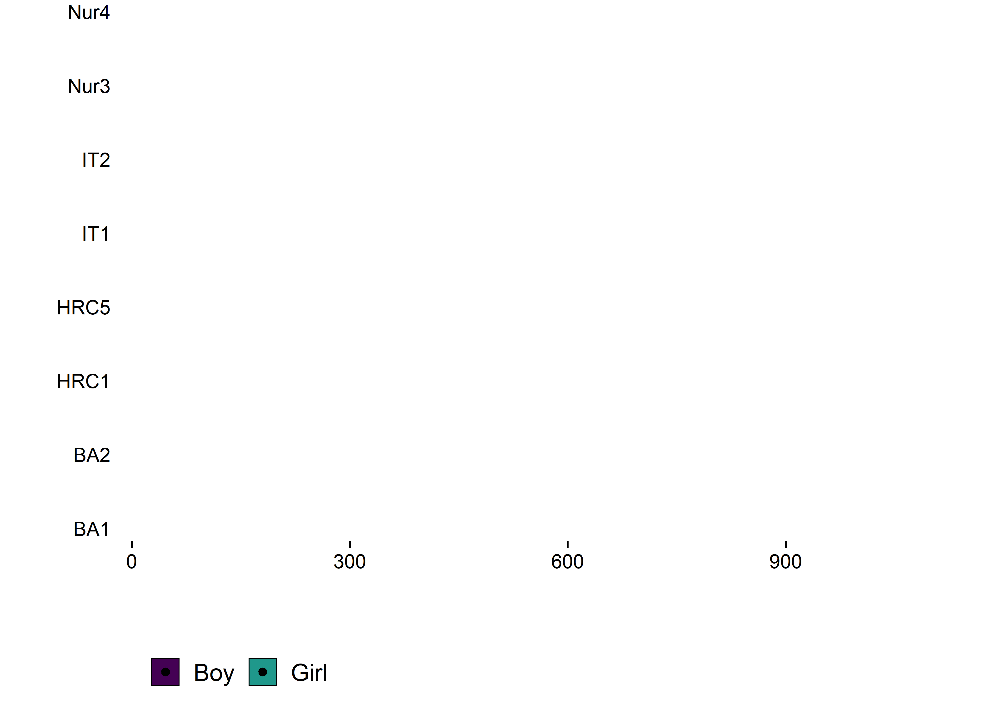<!-- -->

### Density plot by track


```r

plot1 <- df %>% dplyr::select(id,
                              track = track,
                              girl,
                              Weartime = weartimeAccelerometer_T1)  %>%
  dplyr::filter(!is.na(track), track != "Other") %>% # Drop category "Other"
  dplyr::mutate(track = factor(track, levels = c("IT", "BA", "HRC", "Nur")),
                track = recode_factor(track, "IT" = "IT", "BA" = "BA", 
                                      "HRC" = "HRC", "Nur" = "Nur")) %>% 
  ggplot2::ggplot(aes(y = track)) +
  ggridges::geom_density_ridges2(aes(x = Weartime, colour = "black", 
                                    fill = paste(track, girl),
                                    point_color = girl,
                                    point_fill = girl,
                                    point_shape = girl),
                                  scale = .75, alpha = 0.6, size = 0.25,
                                  position = position_raincloud(width = 0.05, height = 0.15),
                                  # from = 0, to = 450,
                                  jittered_points = TRUE,
                                  point_size = 1) +
  labs(x = NULL,
       y = NULL) +
  scale_y_discrete(expand = c(0.1, 0)) +
  scale_x_continuous(expand = c(0.01, 0)) +
  ggridges::scale_fill_cyclical(
                                labels = c('BA boy' = "Boy", 'BA girl' = "Girl"),
                                values = viridis::viridis(4, end = 0.8)[c(1, 3)],
                                name = "", 
                                guide = guide_legend(override.aes = list(alpha = 1, 
                                                                         point_shape = c(3, 4),
                                                                         point_size = 2))) +
  ggridges::scale_colour_cyclical(values = "black") +
  ggridges::theme_ridges(grid = FALSE) +
  # ggplot2::scale_fill_manual(values = c("#A0FFA0", "#A0A0FF")) +
  ggridges::scale_discrete_manual(aesthetics = "point_color", 
                                  values = viridis::viridis(4, end = 0.8)[c(3, 1)],
                                  guide = "none") +
  ggridges::scale_discrete_manual(aesthetics = "point_fill",
                                  values = viridis::viridis(4, end = 0.8)[c(3, 1)],
                                  guide = "none") +
  ggridges::scale_discrete_manual(aesthetics = "point_shape", 
                                  values = c(4, 3),
                                  guide = "none") +
  papaja::theme_apa() +
  theme(legend.position = "bottom")

Weartime_trackgirl_diamonds_girl_hours <- Weartime_trackgirl_diamonds_girl %>% 
  dplyr::mutate_if(is.numeric, ~./60)
Weartime_trackgirl_diamonds_boy_hours <- Weartime_trackgirl_diamonds_boy %>% 
  dplyr::mutate_if(is.numeric, ~./60)

plot1 <- plot1 + 
  userfriendlyscience::diamondPlot(Weartime_trackgirl_diamonds_girl_hours, 
                                   returnLayerOnly = TRUE, 
                                   lineColor = "black", 
                                   color=viridis::viridis(4, end = 0.8)[3],
                                   alpha=.6, 
                                   fixedSize = 0.1, 
                                   otherAxisCol = (1:4 + .15)) + # specify y-position; option to move the diamond 
  userfriendlyscience::diamondPlot(Weartime_trackgirl_diamonds_boy_hours, 
                                   returnLayerOnly = TRUE, 
                                   lineColor = "black", 
                                   linetype = "solid", 
                                   color=viridis::viridis(4, end = 0.8)[1],
                                   alpha=.6, 
                                   fixedSize = 0.1, 
                                   otherAxisCol = (1:4 + .15))

# Draw plot with intervention and control densities

plot2 <- df %>% dplyr::select(id,
                              track = track,
                              intervention,
                              Weartime = weartimeAccelerometer_T1)  %>%
  dplyr::filter(!is.na(track), track != "Other") %>% # Drop category "Other"
  dplyr::mutate(track = factor(track, levels = c("IT", "BA", "HRC", "Nur")),
                track = recode_factor(track, "IT" = "IT", "BA" = "BA", 
                                      "HRC" = "HRC", "Nur" = "Nur")) %>% 
  ggplot2::ggplot(aes(y = track)) +
  ggridges::geom_density_ridges2(aes(x = Weartime, colour = "black", 
                                    fill = paste(track, intervention),
                                    point_color = intervention,
                                    point_fill = intervention,
                                    point_shape = intervention),
                                  scale = .75, alpha = 0.6, size = 0.25,
                                  position = position_raincloud(width = 0.05, height = 0.15),
                                  # from = 0, to = 450,
                                  jittered_points = TRUE,
                                  point_size = 1) +
  labs(x = NULL,
       y = NULL) +
  scale_y_discrete(expand = c(0.1, 0), labels = NULL) +
  scale_x_continuous(expand = c(0.01, 0)) +
  ggridges::scale_fill_cyclical(
                                labels = c('BA 0' = "Control", 'BA 1' = "Intervention"),
                                values = viridis::viridis(4, end = 0.8)[c(2, 4)],
                                name = "", 
                                guide = guide_legend(override.aes = list(alpha = 1, 
                                                                         point_shape = c(4, 3),
                                                                         point_size = 2))) +
  ggridges::scale_colour_cyclical(values = "black") +
  ggridges::theme_ridges(grid = FALSE) +
  # ggplot2::scale_fill_manual(values = c("#A0FFA0", "#A0A0FF")) +
  ggridges::scale_discrete_manual(aesthetics = "point_color", 
                                  values = viridis::viridis(4, end = 0.8)[c(2, 4)],
                                  guide = "none") +
  ggridges::scale_discrete_manual(aesthetics = "point_fill",
                                  values = viridis::viridis(4, end = 0.8)[c(2, 4)],
                                  guide = "none") +
  ggridges::scale_discrete_manual(aesthetics = "point_shape", 
                                  values = c(4, 3),
                                  guide = "none") +
  ggridges::scale_discrete_manual(aesthetics = "point_alpha", 
                                  values = 0.06,
                                  guide = "none") +
  papaja::theme_apa() +
  theme(legend.position = "bottom")

Weartime_trackintervention_diamonds_intervention_hours <- Weartime_trackintervention_diamonds_intervention %>% 
  dplyr::mutate_if(is.numeric, ~./60)
Weartime_trackintervention_diamonds_control_hours <- Weartime_trackintervention_diamonds_control %>% 
  dplyr::mutate_if(is.numeric, ~./60)

plot2 <- plot2 + 
  userfriendlyscience::diamondPlot(Weartime_trackintervention_diamonds_intervention_hours, 
                                   returnLayerOnly = TRUE, 
                                   lineColor = "black",  
                                   color=viridis::viridis(4, end = 0.8)[4],
                                   alpha=.6, 
                                   fixedSize = 0.1, 
                                   otherAxisCol = (1:4 + .15)) +
  userfriendlyscience::diamondPlot(Weartime_trackintervention_diamonds_control_hours, 
                                   returnLayerOnly = TRUE, 
                                   lineColor = "black",  
                                   color=viridis::viridis(4, end = 0.8)[2],
                                   alpha=.6, 
                                   fixedSize = 0.1, 
                                   otherAxisCol = (1:4 + .15))

plot1 + plot2
```

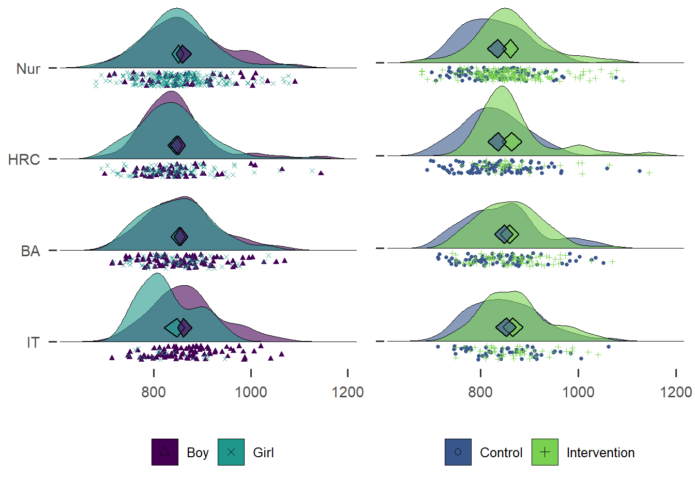


## Accelerometer-measured MVPA 


Contrary to some other findings, in our sample girls were more active than boys. 


```r

MVPAgirl_df <- df %>% group_by(girl) %>% 
  dplyr::select(girl, mvpaAccelerometer_T1) %>% 
  summarise(`mean accelerometer-measured MVPA difference between girls and boys` = mean(mvpaAccelerometer_T1, na.rm = TRUE), 
            `median accelerometer-measured MVPA difference between girls and boys` = median(mvpaAccelerometer_T1, na.rm = TRUE)) 

userfriendlyscience::meanDiff(df$girl, df$mvpaAccelerometer_T1)
## Input variables:
## 
##   girl (grouping variable)
##   mvpaAccelerometer_T1 (dependent variable)
##   Mean 1 (girl) = 1.08, sd = 0.47, n = 437
##   Mean 2 (boy)= 1.11, sd = 0.54, n = 294
## 
## Independent samples t-test (tested for equal variances, p = .006, so unequal variances)
##   (standard deviation used of largest sample, 0.47)
## 
## 95% confidence intervals:
##   Absolute mean difference: [-0.11, 0.04] (Absolute mean difference: -0.03)
##   Cohen's d for difference: [-0.22, 0.08] (Cohen's d point estimate: -0.07)
##   Hedges g for difference:  [-0.22, 0.08] (Hedges g point estimate:  -0.07)
## 
## Achieved power for d=-0.07: 0.1612 (for small: 0.7704; medium: 1; large: 1)
## 
## (secondary information (NHST): t[565.85] = -0.86, p = .389)
## 
## 
## NOTE: because the t-test is based on unequal variances, the NHST p-value may be inconsistent with the confidence interval. Although this is not a problem, if you wish to ensure consistency, you can use parameter "var.equal = 'yes'" to force equal variances.
```
$~$
$~$
<a id="smPlot"></a>

### Density plot by intervention and gender


```r

# Create data frame
densplot <- d
levels(densplot$intervention) <- c("Control", "Intervention")
levels(densplot$girl) <- recode(densplot$girl, "boy" = "Boys", "girl" = "Girls")

# This gives side-by-side plots. There's a third plot below the two, which is fake to include x-axis text.
layout(matrix(c(1, 2, 3, 3), nrow = 2, ncol = 2, byrow = TRUE),
       widths = c(0.5, 0.5), heights = c(0.45, 0.05))

# Minimise whitespace; see https://stackoverflow.com/questions/15848942/how-to-reduce-space-gap-between-multiple-graphs-in-r
par(mai = c(0.3, 0.3, 0.1, 0.0)) 

## Girls vs. boys
# Choose only the variables needed and drop NA
dens <- densplot %>% dplyr::select(mvpaAccelerometer_T1, girl) %>% 
  dplyr::filter(complete.cases(.))

# Set random number generator for reproducibility of bootstrap test of equal densities
set.seed(10)

# Make plot
sm.mvpaAccelerometer_T1_2 <- sm.density.compare2(as.numeric(dens$mvpaAccelerometer_T1), 
                                               as.factor(dens$girl), 
                                               model = "equal",
                                               xlab = "", ylab = "",
                                               col = viridis::viridis(4, end  =  0.8)[c(3, 1)], 
                                               lty = c(1,3), yaxt = "n",
                                               bandcol = 'LightGray', 
                                               lwd = (c(2,2)))
## 
## Test of equal densities:  p-value =  0.12
legend("topright", levels(dens$girl), col = viridis::viridis(4, end = 0.8)[c(1, 3)], lty = c(3,1), lwd = (c(2,2)))
mtext(side = 2, "Density", line = 0.5)

## Intervention vs. control
# Choose only the variables needed and drop NA
dens <- densplot %>% dplyr::select(mvpaAccelerometer_T1, intervention) %>% 
  dplyr::filter(complete.cases(.))

# Set random number generator for reproducibility of bootstrap test of equal densities
set.seed(10)
# Make plot
sm.mvpaAccelerometer_T1_2 <- sm.density.compare2(as.numeric(dens$mvpaAccelerometer_T1), 
                                               as.factor(dens$intervention), 
                                               model = "equal", 
                                               xlab = "", ylab = "",
                                               col = viridis::viridis(4, end = 0.8)[c(2, 4)], 
                                               lty = c(3,1), yaxt = "n",
                                               bandcol = 'LightGray', 
                                               lwd = (c(2,2)))
## 
## Test of equal densities:  p-value =  0.14
legend("topright", levels(dens$intervention), col = viridis::viridis(4, end = 0.8)[c(2, 4)], lty=c(3,1), lwd=(c(2,2)))

# Create x-axis label. See https://stackoverflow.com/questions/11198767/how-to-annotate-across-or-between-plots-in-multi-plot-panels-in-r
par(mar = c(0,0,0,0)) 
plot(1, 1, type = "n", frame.plot = FALSE, axes = FALSE) # Fake plot for x-axis label
text(x = 1.02, y = 1.3, labels = "MVPA hours", pos = 1)
```

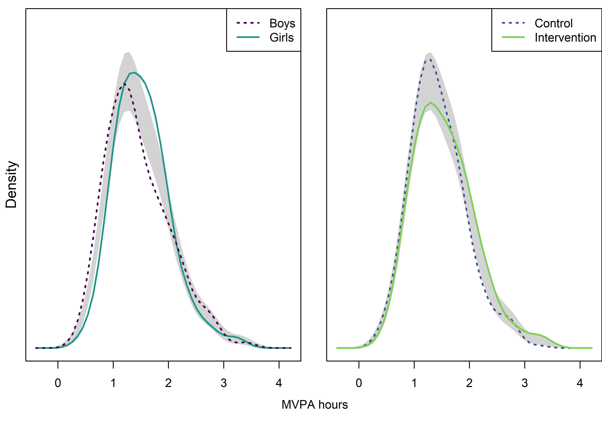<!-- -->

### Data preparation {.tabset}

#### Description

The tab "Information on data preparation" of this section present information on data preparation for the plot
$~$
$~$

#### Information on data preparation

Prepare data


```r
# m_mvpaAccelerometer_trackgirl <- brms::bf(mvpaAccelerometer_T1 ~ (1 | track:girl)) %>% 
#   brms::brm(., data = df, chains = 4, iter = 4000, control = list(adapt_delta = 0.95))
# 
# brms::prior_summary(m_mvpaAccelerometer_trackgirl, data = df)
# 
# m_mvpaAccelerometer_trackgirl
# 
# b_intercept <- brms::fixef(m_mvpaAccelerometer_trackgirl)[1]
# 
# # This gives estimates only:
# PA_trackgirl_estimates <- brms::ranef(m_mvpaAccelerometer_trackgirl)[[1]][1:10]
# 
# # The 2.5%ile:
# PA_trackgirl_CIL <- brms::ranef(m_mvpaAccelerometer_trackgirl)[[1]][21:30]
# 
# # The 97.5%ile:
# PA_trackgirl_CIH <- brms::ranef(m_mvpaAccelerometer_trackgirl)[[1]][31:40]
# 
# PA_trackgirl_ci <- data.frame(PA_trackgirl_CIL, PA_trackgirl_estimates, PA_trackgirl_CIH, Variable = labels(brms::ranef(m_mvpaAccelerometer_trackgirl))) %>% 
#   dplyr::mutate(b_intercept = rep(b_intercept, 10)) %>% 
#   dplyr::mutate(PA_trackgirl_CIL = PA_trackgirl_CIL + b_intercept,
#          PA_trackgirl_estimates = PA_trackgirl_estimates + b_intercept,
#          PA_trackgirl_CIH = PA_trackgirl_CIH + b_intercept,
#          track = c('BA_boy',
#                    'BA_girl',
#                    'HRC_boy',
#                    'HRC_girl',
#                    'IT_boy',
#                    'IT_girl',
#                    'Nur_boy',
#                    'Nur_girl',
#                    'Other_boy',
#                    'Other_girl'
# ))
# 
# PA_trackgirl_diamonds_girl <- rbind(
# PA_trackgirl_ci %>% dplyr::filter(track == "Nur_girl"),
# PA_trackgirl_ci %>% dplyr::filter(track == "HRC_girl"),
# PA_trackgirl_ci %>% dplyr::filter(track == "BA_girl"),
# PA_trackgirl_ci %>% dplyr::filter(track == "IT_girl")) %>% 
#   arrange(-row_number()) # reverse order of rows to make them right for the plot to come
# 
# PA_trackgirl_diamonds_boy <- rbind(
# PA_trackgirl_ci %>% dplyr::filter(track == "Nur_boy"),
# PA_trackgirl_ci %>% dplyr::filter(track == "HRC_boy"),
# PA_trackgirl_ci %>% dplyr::filter(track == "BA_boy"),
# PA_trackgirl_ci %>% dplyr::filter(track == "IT_boy")) %>% 
#   arrange(-row_number()) # reverse order of rows to make them right for the plot to come
# 
# 
# m_mvpaAccelerometer_trackintervention <- brms::bf(mvpaAccelerometer_T1 ~ (1 | track:intervention)) %>% 
#   brms::brm(., data = df, chains = 4, iter = 4000, control = list(adapt_delta = 0.95))
# 
# brms::prior_summary(m_mvpaAccelerometer_trackintervention, data = df)
# 
# m_mvpaAccelerometer_trackintervention
# 
# b_intercept <- brms::fixef(m_mvpaAccelerometer_trackintervention)[1]
# 
# # This gives estimates only:
# PA_trackintervention_estimates <- brms::ranef(m_mvpaAccelerometer_trackintervention)[[1]][1:10]
# 
# 
# # The 2.5%ile:
# PA_trackintervention_CIL <- brms::ranef(m_mvpaAccelerometer_trackintervention)[[1]][21:30]
# 
# # The 97.5%ile:
# PA_trackintervention_CIH <- brms::ranef(m_mvpaAccelerometer_trackintervention)[[1]][31:40]
# 
# PA_trackintervention_ci <- data.frame(PA_trackintervention_CIL, PA_trackintervention_estimates, PA_trackintervention_CIH, Variable = labels(brms::ranef(m_mvpaAccelerometer_trackintervention))) %>% 
#   dplyr::mutate(b_intercept = rep(b_intercept, 10)) %>% 
#   dplyr::mutate(PA_trackintervention_CIL = PA_trackintervention_CIL + b_intercept,
#          PA_trackintervention_estimates = PA_trackintervention_estimates + b_intercept,
#          PA_trackintervention_CIH = PA_trackintervention_CIH + b_intercept,
#          track = c('BA_control',
#                    'BA_intervention',
#                    'HRC_control',
#                    'HRC_intervention',
#                    'IT_control',
#                    'IT_intervention',
#                    'Nur_control',
#                    'Nur_intervention',
#                    'Other_control',
#                    'Other_intervention'
# ))
# 
# PA_trackintervention_diamonds_intervention <- rbind(
# PA_trackintervention_ci %>% dplyr::filter(track == "Nur_intervention"),
# PA_trackintervention_ci %>% dplyr::filter(track == "HRC_intervention"),
# PA_trackintervention_ci %>% dplyr::filter(track == "BA_intervention"),
# PA_trackintervention_ci %>% dplyr::filter(track == "IT_intervention")) %>% 
#   arrange(-row_number()) # reverse order of rows to make them right for the plot to come
# 
# PA_trackintervention_diamonds_control <- rbind(
# PA_trackintervention_ci %>% dplyr::filter(track == "Nur_control"),
# PA_trackintervention_ci %>% dplyr::filter(track == "HRC_control"),
# PA_trackintervention_ci %>% dplyr::filter(track == "BA_control"),
# PA_trackintervention_ci %>% dplyr::filter(track == "IT_control")) %>% 
#   arrange(-row_number()) # reverse order of rows to make them right for the plot to come
# 
# # readr::write_rds(PA_trackgirl_diamonds_girl, 
# #                  path = "./Rdata_files/PA_trackgirl_diamonds_girl.RDS")
# # readr::write_rds(PA_trackgirl_diamonds_boy, 
# #                  path = "./Rdata_files/PA_trackgirl_diamonds_boy.RDS")
# # readr::write_rds(PA_trackintervention_diamonds_intervention, 
# #                  path = "./Rdata_files/PA_trackintervention_diamonds_intervention.RDS")
# # readr::write_rds(PA_trackintervention_diamonds_control, 
# #                  path = "./Rdata_files/PA_trackintervention_diamonds_control.RDS")
# 
# save(PA_trackgirl_diamonds_girl, file = "./Rdata_files/PA_trackgirl_diamonds_girl.Rdata")
# save(PA_trackgirl_diamonds_boy, file = "./Rdata_files/PA_trackgirl_diamonds_boy.Rdata")
# save(PA_trackintervention_diamonds_intervention, file = "./Rdata_files/PA_trackintervention_diamonds_intervention.Rdata")
# save(PA_trackintervention_diamonds_control, file = "./Rdata_files/PA_trackintervention_diamonds_control.Rdata")

load("./Rdata_files/PA_trackgirl_diamonds_girl.Rdata")
load("./Rdata_files/PA_trackgirl_diamonds_boy.Rdata")
load("./Rdata_files/PA_trackintervention_diamonds_intervention.Rdata")
load("./Rdata_files/PA_trackintervention_diamonds_control.Rdata")

PA_trackgirl_diamonds_girl
```

<div data-pagedtable="false">
  <script data-pagedtable-source type="application/json">
{"columns":[{"label":["PA_trackgirl_CIL"],"name":[1],"type":["dbl"],"align":["right"]},{"label":["PA_trackgirl_estimates"],"name":[2],"type":["dbl"],"align":["right"]},{"label":["PA_trackgirl_CIH"],"name":[3],"type":["dbl"],"align":["right"]},{"label":["Variable"],"name":[4],"type":["fctr"],"align":["left"]},{"label":["b_intercept"],"name":[5],"type":["dbl"],"align":["right"]},{"label":["track"],"name":[6],"type":["chr"],"align":["left"]}],"data":[{"1":"25.03428","2":"40.75447","3":"54.71308","4":"track:girl","5":"63.25084","6":"IT_girl"},{"1":"49.27806","2":"60.17648","3":"70.64213","4":"track:girl","5":"63.25084","6":"BA_girl"},{"1":"45.87691","2":"56.38487","3":"66.79918","4":"track:girl","5":"63.25084","6":"HRC_girl"},{"1":"62.01724","2":"71.91422","3":"81.53961","4":"track:girl","5":"63.25084","6":"Nur_girl"}],"options":{"columns":{"min":{},"max":[10]},"rows":{"min":[10],"max":[10]},"pages":{}}}
  </script>
</div>

```r
PA_trackgirl_diamonds_boy
```

<div data-pagedtable="false">
  <script data-pagedtable-source type="application/json">
{"columns":[{"label":["PA_trackgirl_CIL"],"name":[1],"type":["dbl"],"align":["right"]},{"label":["PA_trackgirl_estimates"],"name":[2],"type":["dbl"],"align":["right"]},{"label":["PA_trackgirl_CIH"],"name":[3],"type":["dbl"],"align":["right"]},{"label":["Variable"],"name":[4],"type":["fctr"],"align":["left"]},{"label":["b_intercept"],"name":[5],"type":["dbl"],"align":["right"]},{"label":["track"],"name":[6],"type":["chr"],"align":["left"]}],"data":[{"1":"44.37040","2":"55.26392","3":"65.71207","4":"track:girl","5":"63.25084","6":"IT_boy"},{"1":"60.31624","2":"70.79286","3":"81.32775","4":"track:girl","5":"63.25084","6":"BA_boy"},{"1":"50.11284","2":"61.43343","3":"72.28024","4":"track:girl","5":"63.25084","6":"HRC_boy"},{"1":"71.63242","2":"82.93252","3":"94.78306","4":"track:girl","5":"63.25084","6":"Nur_boy"}],"options":{"columns":{"min":{},"max":[10]},"rows":{"min":[10],"max":[10]},"pages":{}}}
  </script>
</div>

```r
PA_trackintervention_diamonds_intervention
```

<div data-pagedtable="false">
  <script data-pagedtable-source type="application/json">
{"columns":[{"label":["PA_trackintervention_CIL"],"name":[1],"type":["dbl"],"align":["right"]},{"label":["PA_trackintervention_estimates"],"name":[2],"type":["dbl"],"align":["right"]},{"label":["PA_trackintervention_CIH"],"name":[3],"type":["dbl"],"align":["right"]},{"label":["Variable"],"name":[4],"type":["fctr"],"align":["left"]},{"label":["b_intercept"],"name":[5],"type":["dbl"],"align":["right"]},{"label":["track"],"name":[6],"type":["chr"],"align":["left"]}],"data":[{"1":"44.20389","2":"53.78911","3":"62.79035","4":"track:intervention","5":"63.50168","6":"IT_intervention"},{"1":"57.74807","2":"65.95689","3":"74.51647","4":"track:intervention","5":"63.50168","6":"BA_intervention"},{"1":"51.65544","2":"61.03534","3":"70.46104","4":"track:intervention","5":"63.50168","6":"HRC_intervention"},{"1":"67.14237","2":"74.40399","3":"82.12550","4":"track:intervention","5":"63.50168","6":"Nur_intervention"}],"options":{"columns":{"min":{},"max":[10]},"rows":{"min":[10],"max":[10]},"pages":{}}}
  </script>
</div>

```r
PA_trackintervention_diamonds_control
```

<div data-pagedtable="false">
  <script data-pagedtable-source type="application/json">
{"columns":[{"label":["PA_trackintervention_CIL"],"name":[1],"type":["dbl"],"align":["right"]},{"label":["PA_trackintervention_estimates"],"name":[2],"type":["dbl"],"align":["right"]},{"label":["PA_trackintervention_CIH"],"name":[3],"type":["dbl"],"align":["right"]},{"label":["Variable"],"name":[4],"type":["fctr"],"align":["left"]},{"label":["b_intercept"],"name":[5],"type":["dbl"],"align":["right"]},{"label":["track"],"name":[6],"type":["chr"],"align":["left"]}],"data":[{"1":"43.44172","2":"53.00789","3":"61.95956","4":"track:intervention","5":"63.50168","6":"IT_control"},{"1":"57.84414","2":"66.11196","3":"74.98271","4":"track:intervention","5":"63.50168","6":"BA_control"},{"1":"49.39021","2":"57.63404","3":"65.68375","4":"track:intervention","5":"63.50168","6":"HRC_control"},{"1":"63.84609","2":"71.89909","3":"80.52777","4":"track:intervention","5":"63.50168","6":"Nur_control"}],"options":{"columns":{"min":{},"max":[10]},"rows":{"min":[10],"max":[10]},"pages":{}}}
  </script>
</div>

#### Sensitivity analyses and robustness checks

Ideally, one would perform sensitivity analyses and robustness checks; e.g. comparing the estimates with frequentist multilevel models and following the [WAMBS-checklist](https://doi.org/10.1037/met0000065). Due to resource constraints, we are forced to forego this phase of analysis and instead, only show the linear model results for intercepts in each intervention-gender-track combination separately.


```r

# To test the code with a single variable:
df_for_models_nested <- df %>% 
  dplyr::select(track, mvpaAccelerometer_T1, girl, intervention) %>% 
  dplyr::mutate(track = forcats::fct_recode(track, NULL = "Other")) %>%
  na.omit() %>% 
  dplyr::group_by(girl, intervention, track) %>% 
  tidyr::nest()

# This produced a data frame with columns "girl", "intervention", "track" and "data", the last of which is a data frame in each cell. E.g. for row wit intervention group girls in IT, there's a data frame for their values in the last column.

df_fitted <- df_for_models_nested %>% 
  dplyr::mutate(fit = map(data, ~ lm(mvpaAccelerometer_T1 ~ 1, data = .x)))
# Now there's a linear model for each combination in the data frame

df_fitted <- df_fitted %>% 
  dplyr::mutate(
    mean = map_dbl(fit, ~ coef(.x)[["(Intercept)"]]),
    ci_low = map_dbl(fit, ~ confint(.x)["(Intercept)", 1]),
    ci_high = map_dbl(fit, ~ confint(.x)["(Intercept)", 2]),
    nonmissings = map_dbl(fit, ~ nobs(.x))
  ) %>% 
  dplyr::mutate(mean = round(mean, 2),
         ci_low = round(ci_low, 2),
         ci_high = round(ci_high, 2))


## (here was an earlier attempt for random effects)
# df_fitted <- df_fitted %>% 
#   dplyr::mutate(
#     mean = map_dbl(fit, ~ lme4::fixef(.x)),
#     m_p = map(fit, ~ profile(.x)),
#     ci_low = map_dbl(m_p, ~ confint(.x)["(Intercept)", 1]),
#     ci_high = map_dbl(m_p, ~ confint(.x)["(Intercept)", 2]),
#     nonmissings = map_dbl(fit, ~ length(.x@resp$y))
#   )

## (here was was an earlier attempt to use sandwich estimator 
# df_for_sandwich_nested_withClusters <- df_for_sandwich_nested %>% 
#   dplyr::mutate(sandwich_clusters = purrr::map(data, magrittr::extract, c("group", "school", "track")))
# The last line selected the cluster variables from the data frame of each intervention-gender combination)

DT::datatable(df_fitted)
```


#### Density plot of girls and boys in different educational tracks and schools


```r

df %>% dplyr::select(mvpaAccelerometer_T1, girl, trackSchool) %>% 
  group_by(girl, trackSchool) %>% 
  summarise(mean = mean(mvpaAccelerometer_T1, na.rm = TRUE),
            median = median(mvpaAccelerometer_T1, na.rm = TRUE),
            max = max(mvpaAccelerometer_T1, na.rm = TRUE),
            min = min(mvpaAccelerometer_T1, na.rm = TRUE),
            sd = sd(mvpaAccelerometer_T1, na.rm = TRUE),
            n = n()) %>% 
  DT::datatable() #papaja::apa_table()
```

<!--html_preserve--><div id="htmlwidget-4479256599571fcf596f" style="width:100%;height:auto;" class="datatables html-widget"></div>
<script type="application/json" data-for="htmlwidget-4479256599571fcf596f">{"x":{"filter":"none","data":[["1","2","3","4","5","6","7","8","9","10","11","12","13","14","15","16","17","18","19","20","21","22","23","24","25","26","27","28","29"],["girl","girl","girl","girl","girl","girl","girl","girl","girl","girl","girl","girl","girl","boy","boy","boy","boy","boy","boy","boy","boy","boy","boy","boy","boy","boy","boy","boy",null],["BA1","BA2","BA4","HRC1","HRC5","IT1","IT2","Nur3","Nur4","Other1","Other3","Other4","Other5","BA1","BA2","BA4","HRC1","HRC2","HRC5","IT1","IT2","Nur2","Nur3","Nur4","Other2","Other3","Other4","Other5","NANA"],[0.977512925170068,1.01996152998236,null,0.866894993894994,0.958161748267382,0.60219246031746,0.569868686868687,1.21671555555556,1.1960340588178,0.646904761904762,1.43937936507937,1.02004761904762,0.820416666666667,1.20093760553867,1.17410730820106,null,1.1865119047619,null,0.934446482196482,0.907535196687371,0.92020248015873,1.47071428571429,1.19238186813187,1.49291537966538,0.662142857142857,1.38809523809524,1.84119047619048,1.26547619047619,1.22690912698413],[0.857222222222222,0.978611111111111,null,0.776904761904762,0.893611111111111,0.556190476190476,0.535,1.0752380952381,1.15833333333333,0.646904761904762,1.51666666666667,0.923333333333333,0.820416666666667,1.07055555555556,1.14784722222222,null,1.10019841269841,null,0.803809523809524,0.847791666666667,0.85047619047619,1.47071428571429,1.07444444444444,1.44722222222222,0.662142857142857,1.38809523809524,1.84119047619048,1.26547619047619,1.16402777777778],[1.98111111111111,2.08904761904762,null,1.7475,2.29642857142857,1.22714285714286,0.813809523809524,2.67694444444444,2.77733333333333,0.646904761904762,2.38642857142857,1.89690476190476,0.820416666666667,2.34933333333333,2.47533333333333,null,3.11666666666667,null,2.39708333333333,2.17966666666667,2.45047619047619,1.47071428571429,2.09611111111111,3.16277777777778,0.921904761904762,1.38809523809524,1.84119047619048,1.26547619047619,2.24416666666667],[0.573809523809524,0.270333333333333,null,0.33452380952381,0.378333333333333,0.118095238095238,0.353333333333333,0.338888888888889,0.338666666666667,0.646904761904762,0.532857142857143,0.551944444444444,0.820416666666667,0.444523809523809,0.354166666666667,null,0.343333333333333,null,0.382380952380952,0.336190476190476,0.155952380952381,1.47071428571429,0.509583333333333,0.40125,0.402380952380952,1.38809523809524,1.84119047619048,1.26547619047619,0.439047619047619],[0.379245243028623,0.396448999025193,null,0.39330564059033,0.371546810442544,0.369114076593687,0.148036292279094,0.491324633506143,0.473742947228491,null,0.734545699818736,0.534090912925024,null,0.518420218214552,0.455059715012114,null,0.73218683624502,null,0.457309723306873,0.42096710722112,0.420644077062903,null,0.495433174134144,0.652328167757566,0.367358808702154,null,null,null,0.625729589177343],[56,53,1,39,90,12,14,104,227,1,7,7,2,93,78,1,28,1,55,64,73,1,20,50,3,1,2,1,82]],"container":"<table class=\"display\">\n  <thead>\n    <tr>\n      <th> <\/th>\n      <th>girl<\/th>\n      <th>trackSchool<\/th>\n      <th>mean<\/th>\n      <th>median<\/th>\n      <th>max<\/th>\n      <th>min<\/th>\n      <th>sd<\/th>\n      <th>n<\/th>\n    <\/tr>\n  <\/thead>\n<\/table>","options":{"columnDefs":[{"className":"dt-center","targets":"_all"},{"orderable":false,"targets":0}],"order":[],"autoWidth":false,"orderClasses":false}},"evals":[],"jsHooks":[]}</script><!--/html_preserve-->

```r

df %>% dplyr::select(mvpaAccelerometer_T1, girl, trackSchool) %>% 
  group_by(girl) %>% 
  summarise(mean = mean(mvpaAccelerometer_T1, na.rm = TRUE),
            median = median(mvpaAccelerometer_T1, na.rm = TRUE),
            max = max(mvpaAccelerometer_T1, na.rm = TRUE),
            min = min(mvpaAccelerometer_T1, na.rm = TRUE),
            sd = sd(mvpaAccelerometer_T1, na.rm = TRUE),
            n = n()) %>% 
  DT::datatable() #papaja::apa_table()
```

<!--html_preserve--><div id="htmlwidget-932d4f1ca238fac1fbe4" style="width:100%;height:auto;" class="datatables html-widget"></div>
<script type="application/json" data-for="htmlwidget-932d4f1ca238fac1fbe4">{"x":{"filter":"none","data":[["1","2","3"],["girl","boy",null],[1.0813686299081,1.11458942068891,1.22690912698413],[1.00333333333333,0.976291666666667,1.16402777777778],[2.77733333333333,3.16277777777778,2.24416666666667],[0.118095238095238,0.155952380952381,0.439047619047619],[0.465681934212959,0.538388374505825,0.625729589177343],[613,471,82]],"container":"<table class=\"display\">\n  <thead>\n    <tr>\n      <th> <\/th>\n      <th>girl<\/th>\n      <th>mean<\/th>\n      <th>median<\/th>\n      <th>max<\/th>\n      <th>min<\/th>\n      <th>sd<\/th>\n      <th>n<\/th>\n    <\/tr>\n  <\/thead>\n<\/table>","options":{"columnDefs":[{"className":"dt-center","targets":"_all"},{"orderable":false,"targets":0}],"order":[],"autoWidth":false,"orderClasses":false}},"evals":[],"jsHooks":[]}</script><!--/html_preserve-->


```r

plot1 <- df %>% dplyr::select(id,
                              trackSchool = trackSchool,
                              girl,
                              PA = mvpaAccelerometer_T1)  %>%
  dplyr::filter(!is.na(trackSchool), !grepl('Other|NANA|BA4|HRC2|Nur2', trackSchool)) %>% # Drop categories with just few participants
  ggplot2::ggplot(aes(y = trackSchool)) +
  ggridges::geom_density_ridges2(aes(x = PA, colour = "black", 
                                    fill = paste(trackSchool, girl)),
                                  scale = 1,
                                  alpha = 0.6, size = 0.25,
                                  # from = 0, to = 450,
                                  jittered_points=TRUE, point_shape=21,
                                  point_fill="black") +
  labs(x = "",
       y = "") +
  scale_y_discrete(expand = c(0.01, 0)) +
  scale_x_continuous(expand = c(0.01, 0)) +
  ggridges::scale_fill_cyclical(
                                labels = c('BA1 boy' = "Boy", 'BA1 girl' = "Girl"),
                                values = viridis::viridis(4, end = 0.8)[c(1, 3)],
                                name = "", guide = guide_legend(override.aes = list(alpha = 1))) +
  ggridges::scale_colour_cyclical(values = "black") +
  ggridges::theme_ridges(grid = FALSE) +
  theme(legend.position="bottom", axis.text=element_text(size=10))

plot1
```

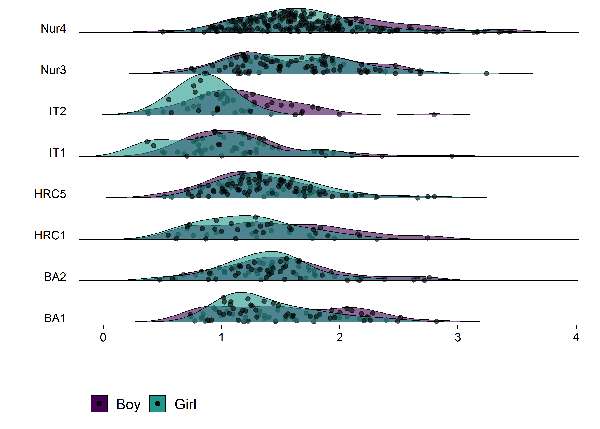<!-- -->

### Density plot by track

<a id="raincloudPlot"></a>


```r

plot1 <- df %>% dplyr::select(id,
                              track = track,
                              girl,
                              PA = mvpaAccelerometer_T1)  %>%
  dplyr::filter(!is.na(track), track != "Other") %>% # Drop category "Other"
  dplyr::mutate(track = factor(track, levels = c("IT", "BA", "HRC", "Nur")),
                track = recode_factor(track, "IT" = "IT", "BA" = "BA", 
                                      "HRC" = "HRC", "Nur" = "Nur")) %>% 
  ggplot2::ggplot(aes(y = track)) +
  ggridges::geom_density_ridges2(aes(x = PA, colour = "black", 
                                    fill = paste(track, girl),
                                    point_color = girl,
                                    point_fill = girl,
                                    point_shape = girl),
                                  scale = .75, alpha = 0.6, size = 0.25,
                                  position = position_raincloud(width = 0.05, height = 0.15),
                                  # from = 0, to = 450,
                                  jittered_points = TRUE,
                                  point_size = 1) +
  labs(x = NULL,
       y = NULL) +
  scale_y_discrete(expand = c(0.1, 0)) +
  scale_x_continuous(expand = c(0.01, 0)) +
  ggridges::scale_fill_cyclical(
                                labels = c('BA boy' = "Boy", 'BA girl' = "Girl"),
                                values = viridis::viridis(4, end = 0.8)[c(1, 3)],
                                name = "", 
                                guide = guide_legend(override.aes = list(alpha = 1, 
                                                                         point_shape = c(3, 4),
                                                                         point_size = 2))) +
  ggridges::scale_colour_cyclical(values = "black") +
  ggridges::theme_ridges(grid = FALSE) +
  # ggplot2::scale_fill_manual(values = c("#A0FFA0", "#A0A0FF")) +
  ggridges::scale_discrete_manual(aesthetics = "point_color", 
                                  values = viridis::viridis(4, end = 0.8)[c(3, 1)],
                                  guide = "none") +
  ggridges::scale_discrete_manual(aesthetics = "point_fill",
                                  values = viridis::viridis(4, end = 0.8)[c(3, 1)],
                                  guide = "none") +
  ggridges::scale_discrete_manual(aesthetics = "point_shape", 
                                  values = c(4, 3),
                                  guide = "none") +
  papaja::theme_apa() +
  theme(legend.position = "bottom")

PA_trackgirl_diamonds_girl_hours <- PA_trackgirl_diamonds_girl %>% 
  dplyr::mutate_if(is.numeric, ~./60)
PA_trackgirl_diamonds_boy_hours <- PA_trackgirl_diamonds_boy %>% 
  dplyr::mutate_if(is.numeric, ~./60)

plot1 <- plot1 + 
  userfriendlyscience::diamondPlot(PA_trackgirl_diamonds_girl_hours, 
                                   returnLayerOnly = TRUE, 
                                   lineColor = "black", 
                                   color=viridis::viridis(4, end = 0.8)[3],
                                   alpha=.6, 
                                   fixedSize = 0.1, 
                                   otherAxisCol = (1:4 + .15)) + # specify y-position; option to move the diamond 
  userfriendlyscience::diamondPlot(PA_trackgirl_diamonds_boy_hours, 
                                   returnLayerOnly = TRUE, 
                                   lineColor = "black", 
                                   linetype = "solid", 
                                   color=viridis::viridis(4, end = 0.8)[1],
                                   alpha=.6, 
                                   fixedSize = 0.1, 
                                   otherAxisCol = (1:4 + .15))

# Draw plot with intervention and control densities

plot2 <- df %>% dplyr::select(id,
                              track = track,
                              intervention,
                              PA = mvpaAccelerometer_T1)  %>%
  dplyr::filter(!is.na(track), track != "Other") %>% # Drop category "Other"
  dplyr::mutate(track = factor(track, levels = c("IT", "BA", "HRC", "Nur")),
                track = recode_factor(track, "IT" = "IT", "BA" = "BA", 
                                      "HRC" = "HRC", "Nur" = "Nur")) %>% 
  ggplot2::ggplot(aes(y = track)) +
  ggridges::geom_density_ridges2(aes(x = PA, colour = "black", 
                                    fill = paste(track, intervention),
                                    point_color = intervention,
                                    point_fill = intervention,
                                    point_shape = intervention),
                                  scale = .75, alpha = 0.6, size = 0.25,
                                  position = position_raincloud(width = 0.05, height = 0.15),
                                  # from = 0, to = 450,
                                  jittered_points = TRUE,
                                  point_size = 1) +
  labs(x = NULL,
       y = NULL) +
  scale_y_discrete(expand = c(0.1, 0), labels = NULL) +
  scale_x_continuous(expand = c(0.01, 0)) +
  ggridges::scale_fill_cyclical(
                                labels = c('BA 0' = "Control", 'BA 1' = "Intervention"),
                                values = viridis::viridis(4, end = 0.8)[c(2, 4)],
                                name = "", 
                                guide = guide_legend(override.aes = list(alpha = 1, 
                                                                         point_shape = c(4, 3),
                                                                         point_size = 2))) +
  ggridges::scale_colour_cyclical(values = "black") +
  ggridges::theme_ridges(grid = FALSE) +
  # ggplot2::scale_fill_manual(values = c("#A0FFA0", "#A0A0FF")) +
  ggridges::scale_discrete_manual(aesthetics = "point_color", 
                                  values = viridis::viridis(4, end = 0.8)[c(2, 4)],
                                  guide = "none") +
  ggridges::scale_discrete_manual(aesthetics = "point_fill",
                                  values = viridis::viridis(4, end = 0.8)[c(2, 4)],
                                  guide = "none") +
  ggridges::scale_discrete_manual(aesthetics = "point_shape", 
                                  values = c(4, 3),
                                  guide = "none") +
  papaja::theme_apa() +
  theme(legend.position = "bottom")

PA_trackintervention_diamonds_intervention_hours <- PA_trackintervention_diamonds_intervention %>% 
  dplyr::mutate_if(is.numeric, ~./60)
PA_trackintervention_diamonds_control_hours <- PA_trackintervention_diamonds_control %>% 
  dplyr::mutate_if(is.numeric, ~./60)

plot2 <- plot2 + 
  userfriendlyscience::diamondPlot(PA_trackintervention_diamonds_intervention_hours, 
                                   returnLayerOnly = TRUE, 
                                   lineColor = "black",  
                                   color=viridis::viridis(4, end = 0.8)[4],
                                   alpha=.6, 
                                   fixedSize = 0.1, 
                                   otherAxisCol = (1:4 + .15)) +
  userfriendlyscience::diamondPlot(PA_trackintervention_diamonds_control_hours, 
                                   returnLayerOnly = TRUE, 
                                   lineColor = "black",  
                                   color=viridis::viridis(4, end = 0.8)[2],
                                   alpha=.6, 
                                   fixedSize = 0.1, 
                                   otherAxisCol = (1:4 + .15))

plot1 + plot2
```

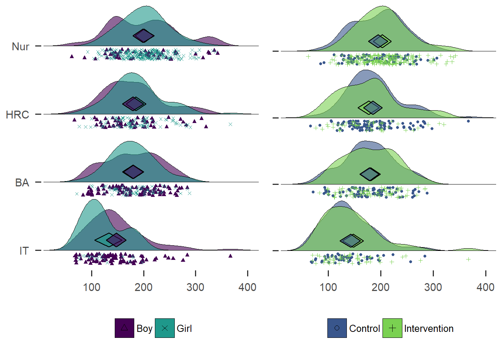

```r

MVPAplot <- (plot1 + plot2)

save(MVPAplot, file = "./Rdata_files/MVPAplot.Rdata")
```

## Self-reported MVPA days, previous week 

**Description**

This section reports the question on how many days the participants did MVPA during the previous week. Question was formulated as "During the last 7 days, on how many days were you physically active so, that the activity was at least moderately vigorous, and at least 30 minutes of activity was accumulated during the day? Choose the correct option".The scale allowed discrete values from zero to seven.

### Data preparation {.tabset}

#### Description

The tab "Information on data preparation" of this section present information on data preparation for the plot

#### Information on data preparation

Code chunk below prepares data.


```r
# m_padaysLastweek_trackgirl <- brms::bf(padaysLastweek_T1 ~ (1 | track:girl)) %>%
#   brms::brm(., data = df, chains = 4, iter = 4000, control = list(adapt_delta = 0.95))
# 
# brms::prior_summary(m_padaysLastweek_trackgirl, data = df)
# 
# m_padaysLastweek_trackgirl
# 
# b_intercept <- brms::fixef(m_padaysLastweek_trackgirl)[1]
# 
# # This gives estimates only:
# padaysLastweek_trackgirl_estimates <- brms::ranef(m_padaysLastweek_trackgirl)[[1]][1:10]
# 
# # The 2.5%ile:
# padaysLastweek_trackgirl_CIL <- brms::ranef(m_padaysLastweek_trackgirl)[[1]][21:30]
# 
# # The 97.5%ile:
# padaysLastweek_trackgirl_CIH <- brms::ranef(m_padaysLastweek_trackgirl)[[1]][31:40]
# 
# padaysLastweek_trackgirl_ci <- data.frame(padaysLastweek_trackgirl_CIL, padaysLastweek_trackgirl_estimates, padaysLastweek_trackgirl_CIH, Variable = labels(brms::ranef(m_padaysLastweek_trackgirl))) %>%
#   dplyr::mutate(b_intercept = rep(b_intercept, 10)) %>%
#   dplyr::mutate(padaysLastweek_trackgirl_CIL = padaysLastweek_trackgirl_CIL + b_intercept,
#          padaysLastweek_trackgirl_estimates = padaysLastweek_trackgirl_estimates + b_intercept,
#          padaysLastweek_trackgirl_CIH = padaysLastweek_trackgirl_CIH + b_intercept,
#          track = c('BA_boy',
#                    'BA_girl',
#                    'HRC_boy',
#                    'HRC_girl',
#                    'IT_boy',
#                    'IT_girl',
#                    'Nur_boy',
#                    'Nur_girl',
#                    'Other_boy',
#                    'Other_girl'
# ))
# 
# padaysLastweek_trackgirl_diamonds_girl <- rbind(
# padaysLastweek_trackgirl_ci %>% dplyr::filter(track == "Nur_girl"),
# padaysLastweek_trackgirl_ci %>% dplyr::filter(track == "HRC_girl"),
# padaysLastweek_trackgirl_ci %>% dplyr::filter(track == "BA_girl"),
# padaysLastweek_trackgirl_ci %>% dplyr::filter(track == "IT_girl")) %>%
#   arrange(-row_number()) # reverse order of rows to make them right for the plot to come
# 
# padaysLastweek_trackgirl_diamonds_boy <- rbind(
# padaysLastweek_trackgirl_ci %>% dplyr::filter(track == "Nur_boy"),
# padaysLastweek_trackgirl_ci %>% dplyr::filter(track == "HRC_boy"),
# padaysLastweek_trackgirl_ci %>% dplyr::filter(track == "BA_boy"),
# padaysLastweek_trackgirl_ci %>% dplyr::filter(track == "IT_boy")) %>%
#   arrange(-row_number()) # reverse order of rows to make them right for the plot to come
# 
# 
# m_padaysLastweek_trackintervention <- brms::bf(padaysLastweek_T1 ~ (1 | track:intervention)) %>%
#   brms::brm(., data = df, chains = 4, iter = 4000, control = list(adapt_delta = 0.95))
# 
# brms::prior_summary(m_padaysLastweek_trackintervention, data = df)
# 
# m_padaysLastweek_trackintervention
# 
# b_intercept <- brms::fixef(m_padaysLastweek_trackintervention)[1]
# 
# # This gives estimates only:
# padaysLastweek_trackintervention_estimates <- brms::ranef(m_padaysLastweek_trackintervention)[[1]][1:10]
# 
# # The 2.5%ile:
# padaysLastweek_trackintervention_CIL <- brms::ranef(m_padaysLastweek_trackintervention)[[1]][21:30]
# 
# # The 97.5%ile:
# padaysLastweek_trackintervention_CIH <- brms::ranef(m_padaysLastweek_trackintervention)[[1]][31:40]
# 
# padaysLastweek_trackintervention_ci <- data.frame(padaysLastweek_trackintervention_CIL, padaysLastweek_trackintervention_estimates, padaysLastweek_trackintervention_CIH, Variable = labels(brms::ranef(m_padaysLastweek_trackintervention))) %>%
#   dplyr::mutate(b_intercept = rep(b_intercept, 10)) %>%
#   dplyr::mutate(padaysLastweek_trackintervention_CIL = padaysLastweek_trackintervention_CIL + b_intercept,
#          padaysLastweek_trackintervention_estimates = padaysLastweek_trackintervention_estimates + b_intercept,
#          padaysLastweek_trackintervention_CIH = padaysLastweek_trackintervention_CIH + b_intercept,
#          track = c('BA_control',
#                    'BA_intervention',
#                    'HRC_control',
#                    'HRC_intervention',
#                    'IT_control',
#                    'IT_intervention',
#                    'Nur_control',
#                    'Nur_intervention',
#                    'Other_control',
#                    'Other_intervention'
# ))
# 
# padaysLastweek_trackintervention_diamonds_intervention <- rbind(
# padaysLastweek_trackintervention_ci %>% dplyr::filter(track == "Nur_intervention"),
# padaysLastweek_trackintervention_ci %>% dplyr::filter(track == "HRC_intervention"),
# padaysLastweek_trackintervention_ci %>% dplyr::filter(track == "BA_intervention"),
# padaysLastweek_trackintervention_ci %>% dplyr::filter(track == "IT_intervention")) %>%
#   arrange(-row_number()) # reverse order of rows to make them right for the plot to come
# 
# padaysLastweek_trackintervention_diamonds_control <- rbind(
# padaysLastweek_trackintervention_ci %>% dplyr::filter(track == "Nur_control"),
# padaysLastweek_trackintervention_ci %>% dplyr::filter(track == "HRC_control"),
# padaysLastweek_trackintervention_ci %>% dplyr::filter(track == "BA_control"),
# padaysLastweek_trackintervention_ci %>% dplyr::filter(track == "IT_control")) %>%
#   arrange(-row_number()) # reverse order of rows to make them right for the plot to come
# 
# save(padaysLastweek_trackgirl_diamonds_girl, file = "./Rdata_files/padaysLastweek_trackgirl_diamonds_girl.Rdata")
# save(padaysLastweek_trackgirl_diamonds_boy, file = "./Rdata_files/padaysLastweek_trackgirl_diamonds_boy.Rdata")
# save(padaysLastweek_trackintervention_diamonds_intervention, file = "./Rdata_files/padaysLastweek_trackintervention_diamonds_intervention.Rdata")
# save(padaysLastweek_trackintervention_diamonds_control, file = "./Rdata_files/padaysLastweek_trackintervention_diamonds_control.Rdata")

load("./Rdata_files/padaysLastweek_trackgirl_diamonds_girl.Rdata")
load("./Rdata_files/padaysLastweek_trackgirl_diamonds_boy.Rdata")
load("./Rdata_files/padaysLastweek_trackintervention_diamonds_intervention.Rdata")
load("./Rdata_files/padaysLastweek_trackintervention_diamonds_control.Rdata")
```


```r

padaysLastweek_trackgirl_diamonds_girl %>% DT::datatable() #papaja::apa_table()
```

<!--html_preserve--><div id="htmlwidget-dea6bba3789508730c1c" style="width:100%;height:auto;" class="datatables html-widget"></div>
<script type="application/json" data-for="htmlwidget-dea6bba3789508730c1c">{"x":{"filter":"none","data":[["1","2","3","4"],[1.70697652063876,2.23668190142256,1.83454506622314,2.12566342983017],[2.41979067566597,2.74459911023283,2.34569842528632,2.57357655910446],[3.08390219152271,3.26063490802728,2.82891120507221,3.03640915775727],["track:girl","track:girl","track:girl","track:girl"],[2.81427652648852,2.81427652648852,2.81427652648852,2.81427652648852],["IT_girl","BA_girl","HRC_girl","Nur_girl"]],"container":"<table class=\"display\">\n  <thead>\n    <tr>\n      <th> <\/th>\n      <th>padaysLastweek_trackgirl_CIL<\/th>\n      <th>padaysLastweek_trackgirl_estimates<\/th>\n      <th>padaysLastweek_trackgirl_CIH<\/th>\n      <th>Variable<\/th>\n      <th>b_intercept<\/th>\n      <th>track<\/th>\n    <\/tr>\n  <\/thead>\n<\/table>","options":{"columnDefs":[{"className":"dt-center","targets":"_all"},{"orderable":false,"targets":0}],"order":[],"autoWidth":false,"orderClasses":false}},"evals":[],"jsHooks":[]}</script><!--/html_preserve-->

```r
padaysLastweek_trackgirl_diamonds_boy %>% DT::datatable() #papaja::apa_table()
```

<!--html_preserve--><div id="htmlwidget-24d963a4e93e046ab39c" style="width:100%;height:auto;" class="datatables html-widget"></div>
<script type="application/json" data-for="htmlwidget-24d963a4e93e046ab39c">{"x":{"filter":"none","data":[["1","2","3","4"],[1.86568484057126,3.25031986505447,2.49179684937267,2.73661295145301],[2.36980159593858,3.71642722811964,3.00564496058967,3.25856386484898],[2.8623940696158,4.21541132152519,3.54561766753917,3.81826204396982],["track:girl","track:girl","track:girl","track:girl"],[2.81427652648852,2.81427652648852,2.81427652648852,2.81427652648852],["IT_boy","BA_boy","HRC_boy","Nur_boy"]],"container":"<table class=\"display\">\n  <thead>\n    <tr>\n      <th> <\/th>\n      <th>padaysLastweek_trackgirl_CIL<\/th>\n      <th>padaysLastweek_trackgirl_estimates<\/th>\n      <th>padaysLastweek_trackgirl_CIH<\/th>\n      <th>Variable<\/th>\n      <th>b_intercept<\/th>\n      <th>track<\/th>\n    <\/tr>\n  <\/thead>\n<\/table>","options":{"columnDefs":[{"className":"dt-center","targets":"_all"},{"orderable":false,"targets":0}],"order":[],"autoWidth":false,"orderClasses":false}},"evals":[],"jsHooks":[]}</script><!--/html_preserve-->

```r
padaysLastweek_trackintervention_diamonds_intervention %>% DT::datatable() #papaja::apa_table()
```

<!--html_preserve--><div id="htmlwidget-9bf8a92e5df146461a12" style="width:100%;height:auto;" class="datatables html-widget"></div>
<script type="application/json" data-for="htmlwidget-9bf8a92e5df146461a12">{"x":{"filter":"none","data":[["1","2","3","4"],[2.01297867698521,2.85149213504681,1.99244397962966,2.20950060498389],[2.50921677327658,3.26575369275723,2.510439753423,2.60762918106029],[2.99589404792169,3.72106958791308,2.99768948336075,2.99869401960644],["track:intervention","track:intervention","track:intervention","track:intervention"],[2.78375645666647,2.78375645666647,2.78375645666647,2.78375645666647],["IT_intervention","BA_intervention","HRC_intervention","Nur_intervention"]],"container":"<table class=\"display\">\n  <thead>\n    <tr>\n      <th> <\/th>\n      <th>padaysLastweek_trackintervention_CIL<\/th>\n      <th>padaysLastweek_trackintervention_estimates<\/th>\n      <th>padaysLastweek_trackintervention_CIH<\/th>\n      <th>Variable<\/th>\n      <th>b_intercept<\/th>\n      <th>track<\/th>\n    <\/tr>\n  <\/thead>\n<\/table>","options":{"columnDefs":[{"className":"dt-center","targets":"_all"},{"orderable":false,"targets":0}],"order":[],"autoWidth":false,"orderClasses":false}},"evals":[],"jsHooks":[]}</script><!--/html_preserve-->

```r
padaysLastweek_trackintervention_diamonds_control %>% DT::datatable() #papaja::apa_table()
```

<!--html_preserve--><div id="htmlwidget-d074deb5432bbbbb7a34" style="width:100%;height:auto;" class="datatables html-widget"></div>
<script type="application/json" data-for="htmlwidget-d074deb5432bbbbb7a34">{"x":{"filter":"none","data":[["1","2","3","4"],[1.81295697272588,2.91645499789672,2.24855464117626,2.47326345181069],[2.31460291680866,3.33456514455724,2.68166233725306,2.91152897721107],[2.77678174287709,3.79258485905669,3.10600035545874,3.35582740811892],["track:intervention","track:intervention","track:intervention","track:intervention"],[2.78375645666647,2.78375645666647,2.78375645666647,2.78375645666647],["IT_control","BA_control","HRC_control","Nur_control"]],"container":"<table class=\"display\">\n  <thead>\n    <tr>\n      <th> <\/th>\n      <th>padaysLastweek_trackintervention_CIL<\/th>\n      <th>padaysLastweek_trackintervention_estimates<\/th>\n      <th>padaysLastweek_trackintervention_CIH<\/th>\n      <th>Variable<\/th>\n      <th>b_intercept<\/th>\n      <th>track<\/th>\n    <\/tr>\n  <\/thead>\n<\/table>","options":{"columnDefs":[{"className":"dt-center","targets":"_all"},{"orderable":false,"targets":0}],"order":[],"autoWidth":false,"orderClasses":false}},"evals":[],"jsHooks":[]}</script><!--/html_preserve-->

### Density plot by intervention and gender


```r

# Create data frame
densplot <- d
levels(densplot$intervention) <- c("Control", "Intervention")
levels(densplot$girl) <- recode(densplot$girl, "boy" = "Boys", "girl" = "Girls")

# This gives side-by-side plots. There's a third plot below the two, which is fake to include x-axis text.
layout(matrix(c(1, 2, 3, 3), nrow = 2, ncol = 2, byrow = TRUE),
       widths = c(0.5, 0.5), heights = c(0.45, 0.05))

# Minimise whitespace; see https://stackoverflow.com/questions/15848942/how-to-reduce-space-gap-between-multiple-graphs-in-r
par(mai = c(0.3, 0.3, 0.1, 0.0)) 

## Girls vs. boys
# Choose only the variables needed and drop NA
dens <- densplot %>% dplyr::select(padaysLastweek_T1, girl) %>% 
  dplyr::filter(complete.cases(.))

# Set random number generator for reproducibility of bootstrap test of equal densities
set.seed(10)

# Make plot
sm.padaysLastweek_T1_2 <- sm.density.compare2(as.numeric(dens$padaysLastweek_T1), 
                                               as.factor(dens$girl), 
                                               model = "equal",
                                               xlab = "", ylab = "",
                                               col = viridis::viridis(4, end  =  0.8)[c(3, 1)], 
                                               lty = c(1, 3), yaxt = "n",
                                               bandcol = 'LightGray', 
                                               lwd = c(2, 2),
                                               xlim = c(0, 7))
## 
## Test of equal densities:  p-value =  0
legend("topright", levels(dens$girl), col = viridis::viridis(4, end = 0.8)[c(1, 3)], lty = c(3,1), lwd = (c(2,2)))
mtext(side = 2, "Density", line = 0.5)

## Intervention vs. control
# Choose only the variables needed and drop NA
dens <- densplot %>% dplyr::select(padaysLastweek_T1, intervention) %>% 
  dplyr::filter(complete.cases(.))

# Set random number generator for reproducibility of bootstrap test of equal densities
set.seed(10)
# Make plot
sm.padaysLastweek_T1_2 <- sm.density.compare2(as.numeric(dens$padaysLastweek_T1), 
                                               as.factor(dens$intervention), 
                                               model = "equal", 
                                               xlab = "", ylab = "",
                                               col = viridis::viridis(4, end = 0.8)[c(2, 4)], 
                                               lty = c(3, 1), yaxt = "n",
                                               bandcol = 'LightGray', 
                                               lwd = c(2, 2),
                                               xlim = c(0, 7))
## 
## Test of equal densities:  p-value =  0.09
legend("topright", levels(dens$intervention), col = viridis::viridis(4, end = 0.8)[c(2, 4)], lty=c(3,1), lwd=(c(2,2)))

# Create x-axis label. See https://stackoverflow.com/questions/11198767/how-to-annotate-across-or-between-plots-in-multi-plot-panels-in-r
par(mar = c(0,0,0,0)) 
plot(1, 1, type = "n", frame.plot = FALSE, axes = FALSE) # Fake plot for x-axis label
text(x = 1.02, y = 1.3, labels = "Self-reported number of days with >30 MVPA min previous week", pos = 1)
```

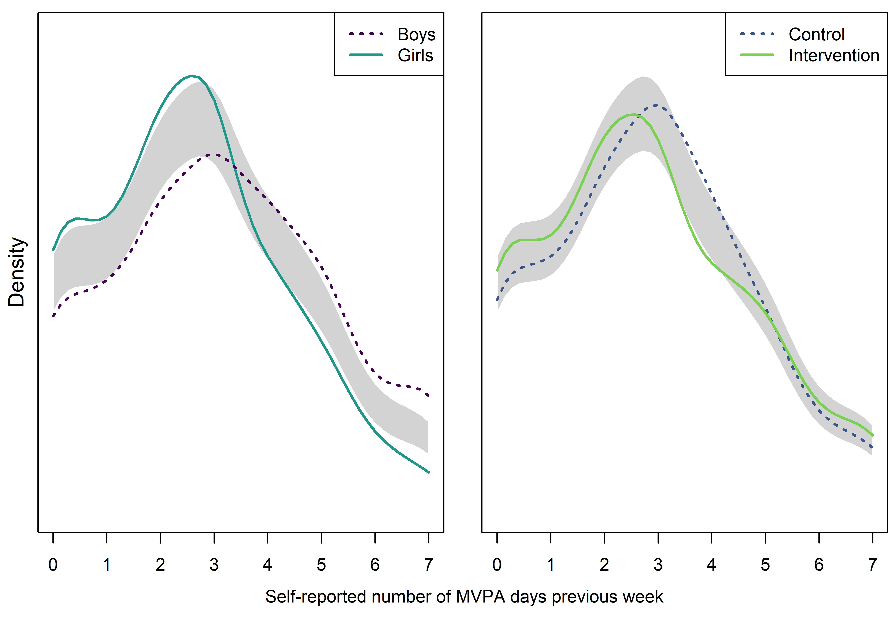<!-- -->

From the figure, we can see that there were more boys reporting a high number of MVPA days, and fewer boys reported low numbers. 
This effect was consistent among educational tracks. Boys and girls, as well as different educational tracks, differed largely in the types of PA they reported having engaged in during the previous month (see tab Tables and Estimators, at "Types of self-reported exercise").

### Density plot by track


```r

plot1 <- df %>% dplyr::select(id,
                              track = track,
                              girl,
                              PA = padaysLastweek_T1)  %>%
  dplyr::filter(!is.na(track), track != "Other") %>% # Drop category "Other"
  dplyr::mutate(track = factor(track, levels = c("IT", "BA", "HRC", "Nur")),
                track = recode_factor(track, "IT" = "IT", "BA" = "BA", 
                                      "HRC" = "HRC", "Nur" = "Nur")) %>% 
  ggplot2::ggplot(aes(y = track)) +
  ggridges::geom_density_ridges2(aes(x = PA, colour = "black", 
                                    fill = paste(track, girl),
                                    point_color = girl,
                                    point_fill = girl,
                                    point_shape = girl),
                                  scale = .6, alpha = 0.6, size = 0.25,
                                  position = position_raincloud(width = 0.2, height = 0.4),
                                  # from = 0, to = 450,
                                  jittered_points = TRUE,
                                  point_size = 1,
                                  limits = c(0, 7)) +
  labs(x = NULL,
       y = NULL) +
  scale_y_discrete(expand = c(0.1, 0)) +
  scale_x_continuous(expand = c(0.01, 0), breaks = 0:7, limits = c(0, 7)) +
  ggridges::scale_fill_cyclical(
                                labels = c('BA boy' = "Boy", 'BA girl' = "Girl"),
                                values = viridis::viridis(4, end = 0.8)[c(1, 3)],
                                name = "", 
                                guide = guide_legend(override.aes = list(alpha = 1, 
                                                                         point_shape = c(3, 4),
                                                                         point_size = 2))) +
  ggridges::scale_colour_cyclical(values = "black") +
  ggridges::theme_ridges(grid = FALSE) +
  # ggplot2::scale_fill_manual(values = c("#A0FFA0", "#A0A0FF")) +
  ggridges::scale_discrete_manual(aesthetics = "point_color", 
                                  values = viridis::viridis(4, end = 0.8)[c(3, 1)],
                                  guide = "none") +
  ggridges::scale_discrete_manual(aesthetics = "point_fill",
                                  values = viridis::viridis(4, end = 0.8)[c(3, 1)],
                                  guide = "none") +
  ggridges::scale_discrete_manual(aesthetics = "point_shape", 
                                  values = c(4, 3),
                                  guide = "none") +
  papaja::theme_apa() +
  theme(legend.position = "bottom")

plot1 <- plot1 + 
  userfriendlyscience::diamondPlot(padaysLastweek_trackgirl_diamonds_girl, 
                                   returnLayerOnly = TRUE, 
                                   lineColor = "black", 
                                   color=viridis::viridis(4, end = 0.8)[3],
                                   alpha=.6, 
                                   fixedSize = 0.1, 
                                   otherAxisCol = (1:4 + .15)) + # specify y-position; option to move the diamond 
  userfriendlyscience::diamondPlot(padaysLastweek_trackgirl_diamonds_boy, 
                                   returnLayerOnly = TRUE, 
                                   lineColor = "black", 
                                   linetype = "solid", 
                                   color=viridis::viridis(4, end = 0.8)[1],
                                   alpha=.6, 
                                   fixedSize = 0.1, 
                                   otherAxisCol = (1:4 + .15))

# Draw plot with intervention and control densities

plot2 <- df %>% dplyr::select(id,
                              track = track,
                              intervention,
                              PA = padaysLastweek_T1)  %>%
  dplyr::filter(!is.na(track), track != "Other") %>% # Drop category "Other"
  dplyr::mutate(track = factor(track, levels = c("IT", "BA", "HRC", "Nur")),
                track = recode_factor(track, "IT" = "IT", "BA" = "BA", 
                                      "HRC" = "HRC", "Nur" = "Nur")) %>% 
  ggplot2::ggplot(aes(y = track)) +
  ggridges::geom_density_ridges2(aes(x = PA, colour = "black", 
                                    fill = paste(track, intervention),
                                    point_color = intervention,
                                    point_fill = intervention,
                                    point_shape = intervention),
                                  scale = .6, alpha = 0.6, size = 0.25,
                                  position = position_raincloud(width = 0.2, height = 0.4),
                                  # from = 0, to = 450,
                                  jittered_points = TRUE,
                                  point_size = 1,
                                  limits = c(0, 7)) +
  labs(x = NULL,
       y = NULL) +
  scale_y_discrete(expand = c(0.1, 0), labels = NULL) +
  scale_x_continuous(expand = c(0.01, 0), breaks = 0:7, limits = c(0, 7)) +
  ggridges::scale_fill_cyclical(
                                labels = c('BA 0' = "Control", 'BA 1' = "Intervention"),
                                values = viridis::viridis(4, end = 0.8)[c(2, 4)],
                                name = "", 
                                guide = guide_legend(override.aes = list(alpha = 1, 
                                                                         point_shape = c(4, 3),
                                                                         point_size = 2))) +
  ggridges::scale_colour_cyclical(values = "black") +
  ggridges::theme_ridges(grid = FALSE) +
  # ggplot2::scale_fill_manual(values = c("#A0FFA0", "#A0A0FF")) +
  ggridges::scale_discrete_manual(aesthetics = "point_color", 
                                  values = viridis::viridis(4, end = 0.8)[c(2, 4)],
                                  guide = "none") +
  ggridges::scale_discrete_manual(aesthetics = "point_fill",
                                  values = viridis::viridis(4, end = 0.8)[c(2, 4)],
                                  guide = "none") +
  ggridges::scale_discrete_manual(aesthetics = "point_shape", 
                                  values = c(4, 3),
                                  guide = "none") +
  papaja::theme_apa() +
  theme(legend.position = "bottom")

plot2 <- plot2 + 
  userfriendlyscience::diamondPlot(padaysLastweek_trackintervention_diamonds_intervention, 
                                   returnLayerOnly = TRUE, 
                                   lineColor = "black",  
                                   color=viridis::viridis(4, end = 0.8)[4],
                                   alpha=.6, 
                                   fixedSize = 0.1, 
                                   otherAxisCol = (1:4 + .15)) +
  userfriendlyscience::diamondPlot(padaysLastweek_trackintervention_diamonds_control, 
                                   returnLayerOnly = TRUE, 
                                   lineColor = "black",  
                                   color=viridis::viridis(4, end = 0.8)[2],
                                   alpha=.6, 
                                   fixedSize = 0.1, 
                                   otherAxisCol = (1:4 + .15))

plot1 + plot2
```

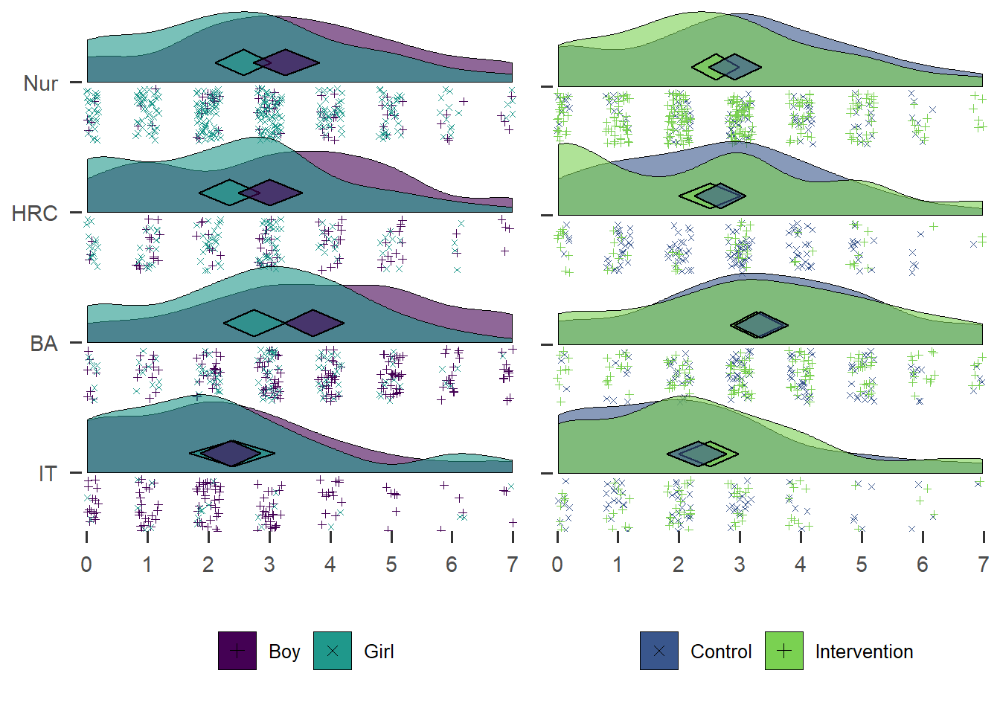

### Histogram 1


```r
plotboys <- df %>% dplyr::select(id,
                                 track = track,
                                 girl,
                                 padaysLastweek_T1)  %>%
  dplyr::filter(!is.na(track), track != "Other", girl == "boy") %>% # Drop category "Other"
  dplyr::mutate(track = factor(track, levels = c("IT", "BA", "HRC", "Nur")),
                track = recode_factor(track, "IT" = "IT", "BA" = "BA", 
                                      "HRC" = "HRC", "Nur" = "Nur")) %>% 
  ggplot2::ggplot(aes(y = track)) +
  ggridges::geom_density_ridges2(aes(x = padaysLastweek_T1, fill = girl), stat = "binline", binwidth = 1, scale = 0.95, alpha = 0.6) +
  scale_x_continuous(breaks = c(0:7), expand = c(0, 0), name = NULL) +
  scale_y_discrete(expand = c(0.01, 0), name = "") +
  ggridges::scale_fill_cyclical(values = viridis::viridis(4, end = 0.8)[1]) +
  labs(title = "Boys") +
  guides(y = "none") +
  ggridges::theme_ridges(grid = FALSE) +
  theme(axis.title.x = element_text(hjust = 0.5),
        axis.title.y = element_text(hjust = 0.5),
        plot.title = element_text(hjust = 0.5, size = 10),
        axis.text=element_text(size=10)) +
  coord_cartesian(xlim = c(-0.5, 7.5))

plotboys <- plotboys + 
  userfriendlyscience::diamondPlot(padaysLastweek_trackgirl_diamonds_girl, 
                                   returnLayerOnly = TRUE, 
                                   lineColor = "black", 
                                   color=viridis::viridis(4, end = 0.8)[3],
                                   alpha=.6, 
                                   fixedSize = 0.1, 
                                   otherAxisCol = (1:4 + .15)) + # specify y-position; option to move the diamond 
  userfriendlyscience::diamondPlot(padaysLastweek_trackgirl_diamonds_boy, 
                                   returnLayerOnly = TRUE, 
                                   lineColor = "black", 
                                   linetype = "solid", 
                                   color=viridis::viridis(4, end = 0.8)[1],
                                   alpha=.6, 
                                   fixedSize = 0.1, 
                                   otherAxisCol = (1:4 + .15))

plotgirls <- df %>% dplyr::select(id,
                                 track = track,
                                 girl,
                                 padaysLastweek_T1)  %>%
  dplyr::filter(!is.na(track), track != "Other", girl == "girl") %>% # Drop category "Other"
  dplyr::mutate(track = factor(track, levels = c("IT", "BA", "HRC", "Nur")),
                track = recode_factor(track, "IT" = "IT", "BA" = "BA", 
                                      "HRC" = "HRC", "Nur" = "Nur")) %>% 
  ggplot2::ggplot(aes(y = track)) +
  ggridges::geom_density_ridges2(aes(x = padaysLastweek_T1, fill = girl), stat = "binline", binwidth = 1, scale = 0.95) +
  scale_x_continuous(breaks = c(0:7), expand = c(0, 0), name = NULL) +
  scale_y_discrete(expand = c(0.01, 0), name = "", labels = NULL) +
  ggridges::scale_fill_cyclical(values = viridis::viridis(4, end = 0.8)[3]) +
  labs(title = "Girls") +
  guides(y = "none") +
  ggridges::theme_ridges(grid = FALSE) +
  theme(axis.title.x = element_text(hjust = 0.5),
        axis.title.y = element_text(hjust = 0.5),
        plot.title = element_text(hjust = 0.5, size = 10),
        axis.text=element_text(size=10)) +
  coord_cartesian(xlim = c(-0.5, 7.5))

plotgirls <- plotgirls + 
  userfriendlyscience::diamondPlot(padaysLastweek_trackgirl_diamonds_girl, 
                                   returnLayerOnly = TRUE, 
                                   lineColor = "black", 
                                   color=viridis::viridis(4, end = 0.8)[3],
                                   alpha=.6, 
                                   fixedSize = 0.1, 
                                   otherAxisCol = (1:4 + .15)) + # specify y-position; option to move the diamond 
  userfriendlyscience::diamondPlot(padaysLastweek_trackgirl_diamonds_boy, 
                                   returnLayerOnly = TRUE, 
                                   lineColor = "black", 
                                   linetype = "solid", 
                                   color=viridis::viridis(4, end = 0.8)[1],
                                   alpha=.6, 
                                   fixedSize = 0.1, 
                                   otherAxisCol = (1:4 + .15))


plotcontrol <- df %>% dplyr::select(id,
                                 track = track,
                                 intervention,
                                 padaysLastweek_T1)  %>%
  dplyr::filter(!is.na(track), track != "Other", intervention == "0") %>% # Drop category "Other"
  dplyr::mutate(track = factor(track, levels = c("IT", "BA", "HRC", "Nur")),
                track = recode_factor(track, "IT" = "IT", "BA" = "BA", 
                                      "HRC" = "HRC", "Nur" = "Nur")) %>% 
  ggplot2::ggplot(aes(y = track)) +
  ggridges::geom_density_ridges2(aes(x = padaysLastweek_T1, fill = intervention), stat = "binline", binwidth = 1, scale = 0.95) +
  scale_x_continuous(breaks = c(0:7), expand = c(0, 0), name = NULL) +
  scale_y_discrete(expand = c(0.01, 0), name = "", labels = NULL) +
  ggridges::scale_fill_cyclical(values = viridis::viridis(4, end = 0.8)[2]) +
  labs(title = "Control") +
  guides(y = "none") +
  ggridges::theme_ridges(grid = FALSE) +
  theme(axis.title.x = element_text(hjust = 0.5),
        axis.title.y = element_text(hjust = 0.5),
        plot.title = element_text(hjust = 0.5, size = 10),
        axis.text=element_text(size=10)) +
  coord_cartesian(xlim = c(-0.5, 7.5))

plotcontrol <- plotcontrol + 
  userfriendlyscience::diamondPlot(padaysLastweek_trackintervention_diamonds_intervention, 
                                   returnLayerOnly = TRUE, 
                                   lineColor = "black",  
                                   color=viridis::viridis(4, end = 0.8)[4],
                                   alpha=.6, 
                                   fixedSize = 0.1, 
                                   otherAxisCol = (1:4 + .15)) +
  userfriendlyscience::diamondPlot(padaysLastweek_trackintervention_diamonds_control, 
                                   returnLayerOnly = TRUE, 
                                   lineColor = "black",  
                                   color=viridis::viridis(4, end = 0.8)[2],
                                   alpha=.6, 
                                   fixedSize = 0.1, 
                                   otherAxisCol = (1:4 + .15))

plotintervention <- df %>% dplyr::select(id,
                                 track = track,
                                 intervention,
                                 padaysLastweek_T1)  %>%
  dplyr::filter(!is.na(track), track != "Other", intervention == "1") %>% # Drop category "Other"
  dplyr::mutate(track = factor(track, levels = c("IT", "BA", "HRC", "Nur")),
                track = recode_factor(track, "IT" = "IT", "BA" = "BA", 
                                      "HRC" = "HRC", "Nur" = "Nur")) %>% 
  ggplot2::ggplot(aes(y = track)) +
  ggridges::geom_density_ridges2(aes(x = padaysLastweek_T1, fill = intervention), stat = "binline", binwidth = 1, scale = 0.95) +
  scale_x_continuous(breaks = c(0:7), expand = c(0, 0), name = NULL) +
  scale_y_discrete(expand = c(0.01, 0), name = "", labels = NULL) +
  ggridges::scale_fill_cyclical(values = viridis::viridis(4, end = 0.8)[4]) +
  labs(title = "Intervention") +
  guides(y = "none") +
  ggridges::theme_ridges(grid = FALSE) +
  theme(axis.title.x = element_text(hjust = 0.5),
        axis.title.y = element_text(hjust = 0.5),
        plot.title = element_text(hjust = 0.5, size = 10),
        axis.text=element_text(size=10)) +
  coord_cartesian(xlim = c(-0.5, 7.5))

plotintervention <- plotintervention + 
  userfriendlyscience::diamondPlot(padaysLastweek_trackintervention_diamonds_intervention, 
                                   returnLayerOnly = TRUE, 
                                   lineColor = "black",  
                                   color=viridis::viridis(4, end = 0.8)[4],
                                   alpha=.6, 
                                   fixedSize = 0.1, 
                                   otherAxisCol = (1:4 + .15)) +
  userfriendlyscience::diamondPlot(padaysLastweek_trackintervention_diamonds_control, 
                                   returnLayerOnly = TRUE, 
                                   lineColor = "black",  
                                   color=viridis::viridis(4, end = 0.8)[2],
                                   alpha=.6, 
                                   fixedSize = 0.1, 
                                   otherAxisCol = (1:4 + .15))

plotboys + plotgirls + plotcontrol + plotintervention + plot_layout(ncol = 4)
```

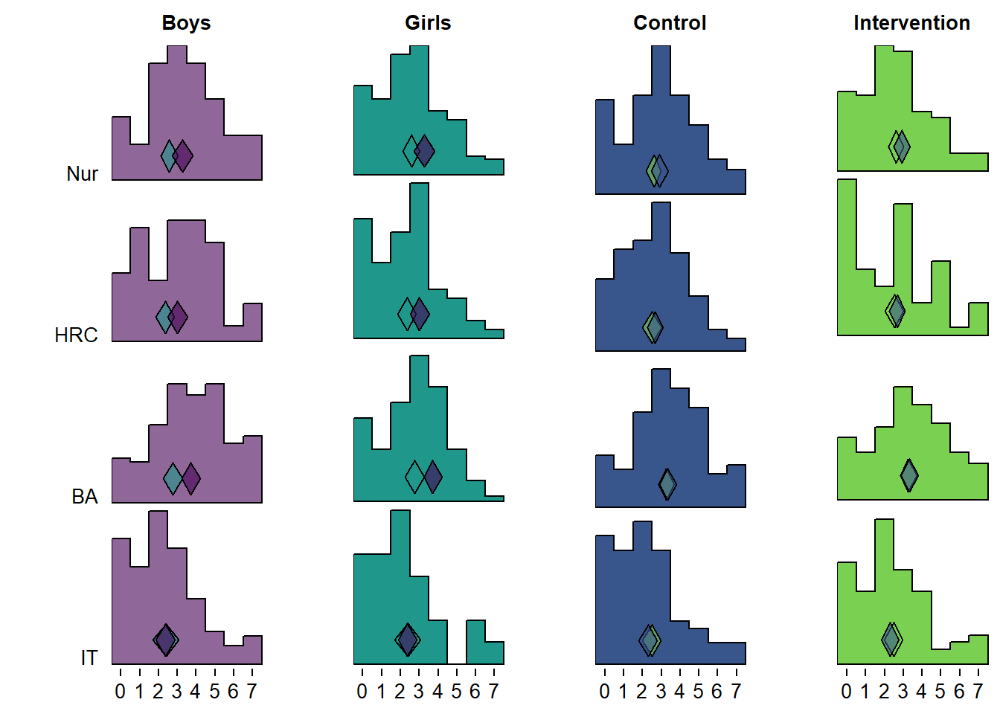<!-- -->

### Histogram 2


```r
hist_padaysLastweek_girl_count <- df %>% dplyr::select(id,
                                 track = track,
                                 girl,
                                 padaysLastweek_T1)  %>%
  dplyr::filter(!is.na(track), track != "Other") %>% # Drop category "Other"
  dplyr::mutate(track = factor(track, levels = c("IT", "BA", "HRC", "Nur")),
                track = recode_factor(track, "IT" = "IT", "BA" = "BA", 
                                      "HRC" = "HRC", "Nur" = "Nur"),
                padaysLastweek_T1 = as.integer(padaysLastweek_T1)) %>% 
  ggplot(aes(x=padaysLastweek_T1, fill=girl)) +
  geom_histogram(binwidth=1, position="dodge", color = "black") +
  scale_x_continuous(breaks = 0:7) +
  labs(x = NULL) +   
  scale_fill_manual(values = viridis::viridis(4, end = 0.8)[c(3, 1)], 
                    name = NULL) +
  facet_wrap("track") + 
  theme(legend.position = "bottom")

hist_padaysLastweek_girl_density <- df %>% dplyr::select(id,
                                 track = track,
                                 girl,
                                 padaysLastweek_T1)  %>%
  dplyr::filter(!is.na(track), track != "Other") %>% # Drop category "Other"
  dplyr::mutate(track = factor(track, levels = c("IT", "BA", "HRC", "Nur")),
                track = recode_factor(track, "IT" = "IT", "BA" = "BA", 
                                      "HRC" = "HRC", "Nur" = "Nur"),
                padaysLastweek_T1 = as.integer(padaysLastweek_T1)) %>% 
  ggplot(aes(x=padaysLastweek_T1, y = ..density.., fill=girl)) +
  geom_histogram(binwidth=1, position="dodge", color = "black") +
  scale_x_continuous(breaks = 0:7) +
  labs(x = NULL) + 
  scale_fill_manual(values = viridis::viridis(4, end = 0.8)[c(3, 1)], name = NULL,
                    guide = FALSE) +
  facet_wrap("track")

hist_padaysLastweek_girl_count + hist_padaysLastweek_girl_density
```

<!-- -->

```r

hist_padaysLastweek_intervention_count <- df %>% dplyr::select(id,
                                 track = track,
                                 intervention,
                                 padaysLastweek_T1)  %>%
  dplyr::filter(!is.na(track), track != "Other") %>% # Drop category "Other"
  dplyr::mutate(track = factor(track, levels = c("IT", "BA", "HRC", "Nur")),
                track = recode_factor(track, "IT" = "IT", "BA" = "BA", 
                                      "HRC" = "HRC", "Nur" = "Nur"),
                padaysLastweek_T1 = as.integer(padaysLastweek_T1)) %>% 
  ggplot(aes(x=padaysLastweek_T1, fill=intervention)) +
  geom_histogram(binwidth = 1, position = "dodge", color = "black") +
  scale_x_continuous(breaks = 0:7) +
  labs(x = NULL) + 
  scale_fill_manual(values = viridis::viridis(4, end = 0.8)[c(2, 4)], 
                    name = NULL, 
                    labels = c("0" = "control", "1" = "intervention")) +
  facet_wrap("track") + 
  theme(legend.position = "bottom")

hist_padaysLastweek_intervention_density <- df %>% dplyr::select(id,
                                 track = track,
                                 intervention,
                                 padaysLastweek_T1)  %>%
  dplyr::filter(!is.na(track), track != "Other") %>% # Drop category "Other"
  dplyr::mutate(track = factor(track, levels = c("IT", "BA", "HRC", "Nur")),
                track = recode_factor(track, "IT" = "IT", "BA" = "BA", 
                                      "HRC" = "HRC", "Nur" = "Nur"),
                padaysLastweek_T1 = as.integer(padaysLastweek_T1)) %>% 
  ggplot(aes(x=padaysLastweek_T1, y = ..density.., fill=intervention)) +
  geom_histogram(binwidth = 1, position = "dodge", color = "black") +
  scale_x_continuous(breaks = 0:7) +
  labs(x = NULL) + 
  scale_fill_manual(values = viridis::viridis(4, end = 0.8)[c(2, 4)], 
                    guide = FALSE) +
  facet_wrap("track")

hist_padaysLastweek_intervention_count + hist_padaysLastweek_intervention_density
```

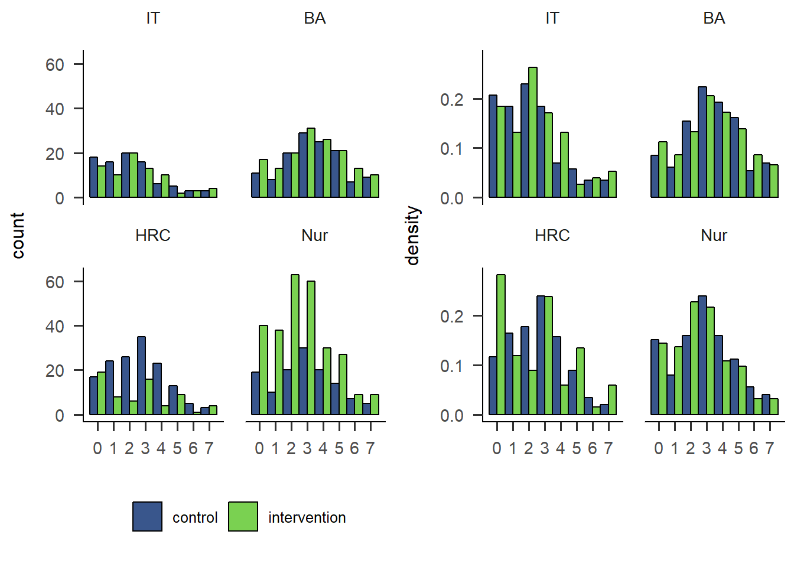<!-- -->

The number of days participants reported doing PA on, suggested a different picture of difference between genders in activity. Boys reported being more active in all but the IT track. The effect is also shown in the following variable on self-reported MVPA time.

## Self-reported MVPA time

This question was "During the last 7 days, how many hours of the previously described [i.e. moderate-to-vigorous] physical activity was accumulated during your free time? Give your answer to the nearest 30 minutes." The answer was given by inputing hours and minutes, the latter field allowing for either zero or 30 minutes to be inputed.

### Density plot by intervention and gender


```r

# Create data frame
densplot <- d
levels(densplot$intervention) <- c("Control", "Intervention")
levels(densplot$girl) <- recode(densplot$girl, "boy" = "Boys", "girl" = "Girls")

# This gives side-by-side plots. There's a third plot below the two, which is fake to include x-axis text.
layout(matrix(c(1, 2, 3, 3), nrow = 2, ncol = 2, byrow = TRUE),
       widths = c(0.5, 0.5), heights = c(0.45, 0.05))

# Minimise whitespace; see https://stackoverflow.com/questions/15848942/how-to-reduce-space-gap-between-multiple-graphs-in-r
par(mai = c(0.3, 0.3, 0.1, 0.0)) 

## Girls vs. boys
# Choose only the variables needed and drop NA
dens <- densplot %>% dplyr::select(leisuretimeMvpaHoursLastweek_T1, girl) %>% 
  dplyr::filter(complete.cases(.))

# Set random number generator for reproducibility of bootstrap test of equal densities
set.seed(10)

# Make plot
sm.leisuretimeMvpaHoursLastweek_T1_2 <- sm.density.compare2(as.numeric(dens$leisuretimeMvpaHoursLastweek_T1), 
                                               as.factor(dens$girl), 
                                               model = "equal",
                                               xlab = "", ylab = "",
                                               col = viridis::viridis(4, end  =  0.8)[c(3, 1)], 
                                               lty = c(1,3), yaxt = "n",
                                               bandcol = 'LightGray', 
                                               lwd = (c(2,2)))
## 
## Test of equal densities:  p-value =  0
legend("topright", levels(dens$girl), col = viridis::viridis(4, end = 0.8)[c(1, 3)], lty = c(3,1), lwd = (c(2,2)))
mtext(side = 2, "Density", line = 0.5)

## Intervention vs. control
# Choose only the variables needed and drop NA
dens <- densplot %>% dplyr::select(leisuretimeMvpaHoursLastweek_T1, intervention) %>% 
  dplyr::filter(complete.cases(.))

# Set random number generator for reproducibility of bootstrap test of equal densities
set.seed(10)
# Make plot
sm.leisuretimeMvpaHoursLastweek_T1_2 <- sm.density.compare2(as.numeric(dens$leisuretimeMvpaHoursLastweek_T1), 
                                               as.factor(dens$intervention), 
                                               model = "equal", 
                                               xlab = "", ylab = "",
                                               col = viridis::viridis(4, end = 0.8)[c(2, 4)], 
                                               lty = c(3,1), yaxt = "n",
                                               bandcol = 'LightGray', 
                                               lwd = (c(2,2)))
## 
## Test of equal densities:  p-value =  0.08
legend("topright", levels(dens$intervention), col = viridis::viridis(4, end = 0.8)[c(2, 4)], lty=c(3,1), lwd=(c(2,2)))

# Create x-axis label. See https://stackoverflow.com/questions/11198767/how-to-annotate-across-or-between-plots-in-multi-plot-panels-in-r
par(mar = c(0,0,0,0)) 
plot(1, 1, type = "n", frame.plot = FALSE, axes = FALSE) # Fake plot for x-axis label
text(x = 1.02, y = 1.3, labels = "nordpaq_alternative_item hours", pos = 1)
```

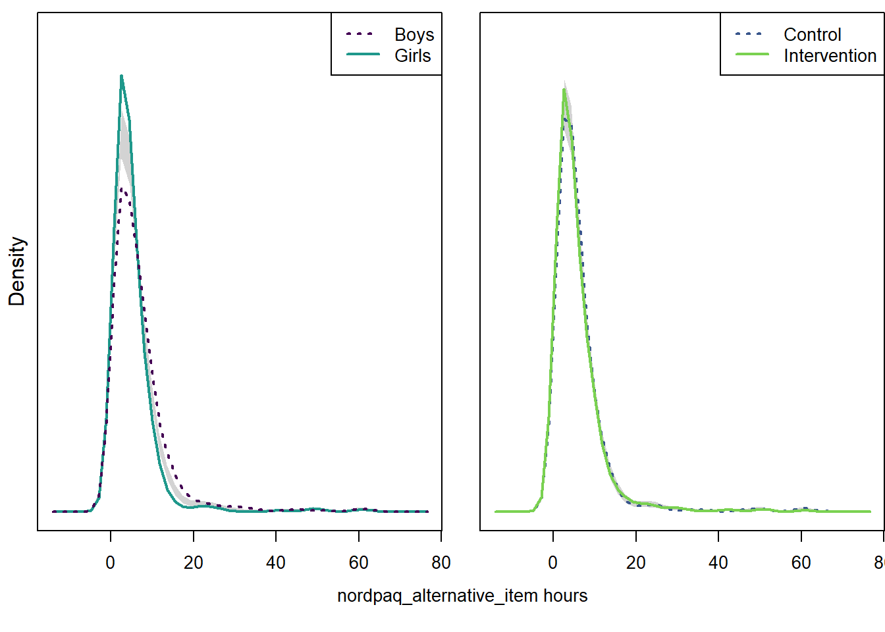<!-- -->

### Data preparation {.tabset}

#### Description

The tab "Information on data preparation" of this section present information on data preparation for the plot

#### Information on data preparation

Prepare data


```r
# m_nordpaq_alternative_itemAccelerometer_trackgirl <- brms::bf(leisuretimeMvpaHoursLastweek_T1 ~ (1 | track:girl)) %>% 
#   brms::brm(., data = df, chains = 4, iter = 4000, control = list(adapt_delta = 0.95))
# 
# brms::prior_summary(m_nordpaq_alternative_itemAccelerometer_trackgirl, data = df)
# 
# m_nordpaq_alternative_itemAccelerometer_trackgirl
# 
# b_intercept <- brms::fixef(m_nordpaq_alternative_itemAccelerometer_trackgirl)[1]
# 
# # This gives estimates only:
# nordpaq_alternative_item_trackgirl_estimates <- brms::ranef(m_nordpaq_alternative_itemAccelerometer_trackgirl)[[1]][1:10]
# 
# # The 2.5%ile:
# nordpaq_alternative_item_trackgirl_CIL <- brms::ranef(m_nordpaq_alternative_itemAccelerometer_trackgirl)[[1]][21:30]
# 
# # The 97.5%ile:
# nordpaq_alternative_item_trackgirl_CIH <- brms::ranef(m_nordpaq_alternative_itemAccelerometer_trackgirl)[[1]][31:40]
# 
# nordpaq_alternative_item_trackgirl_ci <- data.frame(nordpaq_alternative_item_trackgirl_CIL, nordpaq_alternative_item_trackgirl_estimates, nordpaq_alternative_item_trackgirl_CIH, Variable = labels(brms::ranef(m_nordpaq_alternative_itemAccelerometer_trackgirl))) %>% 
#   dplyr::mutate(b_intercept = rep(b_intercept, 10)) %>% 
#   dplyr::mutate(nordpaq_alternative_item_trackgirl_CIL = nordpaq_alternative_item_trackgirl_CIL + b_intercept,
#          nordpaq_alternative_item_trackgirl_estimates = nordpaq_alternative_item_trackgirl_estimates + b_intercept,
#          nordpaq_alternative_item_trackgirl_CIH = nordpaq_alternative_item_trackgirl_CIH + b_intercept,
#          track = c('BA_boy',
#                    'BA_girl',
#                    'HRC_boy',
#                    'HRC_girl',
#                    'IT_boy',
#                    'IT_girl',
#                    'Nur_boy',
#                    'Nur_girl',
#                    'Other_boy',
#                    'Other_girl'
# ))
# 
# nordpaq_alternative_item_trackgirl_diamonds_girl <- rbind(
# nordpaq_alternative_item_trackgirl_ci %>% dplyr::filter(track == "Nur_girl"),
# nordpaq_alternative_item_trackgirl_ci %>% dplyr::filter(track == "HRC_girl"),
# nordpaq_alternative_item_trackgirl_ci %>% dplyr::filter(track == "BA_girl"),
# nordpaq_alternative_item_trackgirl_ci %>% dplyr::filter(track == "IT_girl")) %>% 
#   arrange(-row_number()) # reverse order of rows to make them right for the plot to come
# 
# nordpaq_alternative_item_trackgirl_diamonds_boy <- rbind(
# nordpaq_alternative_item_trackgirl_ci %>% dplyr::filter(track == "Nur_boy"),
# nordpaq_alternative_item_trackgirl_ci %>% dplyr::filter(track == "HRC_boy"),
# nordpaq_alternative_item_trackgirl_ci %>% dplyr::filter(track == "BA_boy"),
# nordpaq_alternative_item_trackgirl_ci %>% dplyr::filter(track == "IT_boy")) %>% 
#   arrange(-row_number()) # reverse order of rows to make them right for the plot to come
# 
# 
# m_nordpaq_alternative_itemAccelerometer_trackintervention <- brms::bf(leisuretimeMvpaHoursLastweek_T1 ~ (1 | track:intervention)) %>% 
#   brms::brm(., data = df, chains = 4, iter = 4000, control = list(adapt_delta = 0.95))
# 
# brms::prior_summary(m_nordpaq_alternative_itemAccelerometer_trackintervention, data = df)
# 
# m_nordpaq_alternative_itemAccelerometer_trackintervention
# 
# b_intercept <- brms::fixef(m_nordpaq_alternative_itemAccelerometer_trackintervention)[1]
# 
# # This gives estimates only:
# nordpaq_alternative_item_trackintervention_estimates <- brms::ranef(m_nordpaq_alternative_itemAccelerometer_trackintervention)[[1]][1:10]
# 
# 
# # The 2.5%ile:
# nordpaq_alternative_item_trackintervention_CIL <- brms::ranef(m_nordpaq_alternative_itemAccelerometer_trackintervention)[[1]][21:30]
# 
# # The 97.5%ile:
# nordpaq_alternative_item_trackintervention_CIH <- brms::ranef(m_nordpaq_alternative_itemAccelerometer_trackintervention)[[1]][31:40]
# 
# nordpaq_alternative_item_trackintervention_ci <- data.frame(nordpaq_alternative_item_trackintervention_CIL, nordpaq_alternative_item_trackintervention_estimates, nordpaq_alternative_item_trackintervention_CIH, Variable = labels(brms::ranef(m_nordpaq_alternative_itemAccelerometer_trackintervention))) %>% 
#   dplyr::mutate(b_intercept = rep(b_intercept, 10)) %>% 
#   dplyr::mutate(nordpaq_alternative_item_trackintervention_CIL = nordpaq_alternative_item_trackintervention_CIL + b_intercept,
#          nordpaq_alternative_item_trackintervention_estimates = nordpaq_alternative_item_trackintervention_estimates + b_intercept,
#          nordpaq_alternative_item_trackintervention_CIH = nordpaq_alternative_item_trackintervention_CIH + b_intercept,
#          track = c('BA_control',
#                    'BA_intervention',
#                    'HRC_control',
#                    'HRC_intervention',
#                    'IT_control',
#                    'IT_intervention',
#                    'Nur_control',
#                    'Nur_intervention',
#                    'Other_control',
#                    'Other_intervention'
# ))
# 
# nordpaq_alternative_item_trackintervention_diamonds_intervention <- rbind(
# nordpaq_alternative_item_trackintervention_ci %>% dplyr::filter(track == "Nur_intervention"),
# nordpaq_alternative_item_trackintervention_ci %>% dplyr::filter(track == "HRC_intervention"),
# nordpaq_alternative_item_trackintervention_ci %>% dplyr::filter(track == "BA_intervention"),
# nordpaq_alternative_item_trackintervention_ci %>% dplyr::filter(track == "IT_intervention")) %>% 
#   arrange(-row_number()) # reverse order of rows to make them right for the plot to come
# 
# nordpaq_alternative_item_trackintervention_diamonds_control <- rbind(
# nordpaq_alternative_item_trackintervention_ci %>% dplyr::filter(track == "Nur_control"),
# nordpaq_alternative_item_trackintervention_ci %>% dplyr::filter(track == "HRC_control"),
# nordpaq_alternative_item_trackintervention_ci %>% dplyr::filter(track == "BA_control"),
# nordpaq_alternative_item_trackintervention_ci %>% dplyr::filter(track == "IT_control")) %>% 
#   arrange(-row_number()) # reverse order of rows to make them right for the plot to come
# 
# save(nordpaq_alternative_item_trackgirl_diamonds_girl, file = "./Rdata_files/nordpaq_alternative_item_trackgirl_diamonds_girl.Rdata")
# save(nordpaq_alternative_item_trackgirl_diamonds_boy, file = "./Rdata_files/nordpaq_alternative_item_trackgirl_diamonds_boy.Rdata")
# save(nordpaq_alternative_item_trackintervention_diamonds_intervention, file = "./Rdata_files/nordpaq_alternative_item_trackintervention_diamonds_intervention.Rdata")
# save(nordpaq_alternative_item_trackintervention_diamonds_control, file = "./Rdata_files/nordpaq_alternative_item_trackintervention_diamonds_control.Rdata")

load("./Rdata_files/nordpaq_alternative_item_trackgirl_diamonds_girl.Rdata")
load("./Rdata_files/nordpaq_alternative_item_trackgirl_diamonds_boy.Rdata")
load("./Rdata_files/nordpaq_alternative_item_trackintervention_diamonds_intervention.Rdata")
load("./Rdata_files/nordpaq_alternative_item_trackintervention_diamonds_control.Rdata")

nordpaq_alternative_item_trackgirl_diamonds_girl
```

<div data-pagedtable="false">
  <script data-pagedtable-source type="application/json">
{"columns":[{"label":["nordpaq_alternative_item_trackgirl_CIL"],"name":[1],"type":["dbl"],"align":["right"]},{"label":["nordpaq_alternative_item_trackgirl_estimates"],"name":[2],"type":["dbl"],"align":["right"]},{"label":["nordpaq_alternative_item_trackgirl_CIH"],"name":[3],"type":["dbl"],"align":["right"]},{"label":["Variable"],"name":[4],"type":["fctr"],"align":["left"]},{"label":["b_intercept"],"name":[5],"type":["dbl"],"align":["right"]},{"label":["track"],"name":[6],"type":["chr"],"align":["left"]}],"data":[{"1":"2.812437","2":"4.972434","3":"6.990757","4":"track:girl","5":"5.90236","6":"IT_girl"},{"1":"4.996940","2":"6.494997","3":"8.085133","4":"track:girl","5":"5.90236","6":"BA_girl"},{"1":"3.041307","2":"4.575581","3":"6.038233","4":"track:girl","5":"5.90236","6":"HRC_girl"},{"1":"3.217653","2":"4.576538","3":"5.875535","4":"track:girl","5":"5.90236","6":"Nur_girl"}],"options":{"columns":{"min":{},"max":[10]},"rows":{"min":[10],"max":[10]},"pages":{}}}
  </script>
</div>

```r
nordpaq_alternative_item_trackgirl_diamonds_boy
```

<div data-pagedtable="false">
  <script data-pagedtable-source type="application/json">
{"columns":[{"label":["nordpaq_alternative_item_trackgirl_CIL"],"name":[1],"type":["dbl"],"align":["right"]},{"label":["nordpaq_alternative_item_trackgirl_estimates"],"name":[2],"type":["dbl"],"align":["right"]},{"label":["nordpaq_alternative_item_trackgirl_CIH"],"name":[3],"type":["dbl"],"align":["right"]},{"label":["Variable"],"name":[4],"type":["fctr"],"align":["left"]},{"label":["b_intercept"],"name":[5],"type":["dbl"],"align":["right"]},{"label":["track"],"name":[6],"type":["chr"],"align":["left"]}],"data":[{"1":"3.335428","2":"4.877991","3":"6.313256","4":"track:girl","5":"5.90236","6":"IT_boy"},{"1":"6.675935","2":"8.055481","3":"9.545470","4":"track:girl","5":"5.90236","6":"BA_boy"},{"1":"4.534267","2":"6.134237","3":"7.719468","4":"track:girl","5":"5.90236","6":"HRC_boy"},{"1":"5.227223","2":"6.852922","3":"8.595686","4":"track:girl","5":"5.90236","6":"Nur_boy"}],"options":{"columns":{"min":{},"max":[10]},"rows":{"min":[10],"max":[10]},"pages":{}}}
  </script>
</div>

```r
nordpaq_alternative_item_trackintervention_diamonds_intervention
```

<div data-pagedtable="false">
  <script data-pagedtable-source type="application/json">
{"columns":[{"label":["nordpaq_alternative_item_trackintervention_CIL"],"name":[1],"type":["dbl"],"align":["right"]},{"label":["nordpaq_alternative_item_trackintervention_estimates"],"name":[2],"type":["dbl"],"align":["right"]},{"label":["nordpaq_alternative_item_trackintervention_CIH"],"name":[3],"type":["dbl"],"align":["right"]},{"label":["Variable"],"name":[4],"type":["fctr"],"align":["left"]},{"label":["b_intercept"],"name":[5],"type":["dbl"],"align":["right"]},{"label":["track"],"name":[6],"type":["chr"],"align":["left"]}],"data":[{"1":"2.875000","2":"4.622822","3":"6.188212","4":"track:intervention","5":"5.786582","6":"IT_intervention"},{"1":"5.714167","2":"7.116391","3":"8.580438","4":"track:intervention","5":"5.786582","6":"BA_intervention"},{"1":"3.457583","2":"5.182928","3":"6.795727","4":"track:intervention","5":"5.786582","6":"HRC_intervention"},{"1":"3.459906","2":"4.848327","3":"6.101093","4":"track:intervention","5":"5.786582","6":"Nur_intervention"}],"options":{"columns":{"min":{},"max":[10]},"rows":{"min":[10],"max":[10]},"pages":{}}}
  </script>
</div>

```r
nordpaq_alternative_item_trackintervention_diamonds_control
```

<div data-pagedtable="false">
  <script data-pagedtable-source type="application/json">
{"columns":[{"label":["nordpaq_alternative_item_trackintervention_CIL"],"name":[1],"type":["dbl"],"align":["right"]},{"label":["nordpaq_alternative_item_trackintervention_estimates"],"name":[2],"type":["dbl"],"align":["right"]},{"label":["nordpaq_alternative_item_trackintervention_CIH"],"name":[3],"type":["dbl"],"align":["right"]},{"label":["Variable"],"name":[4],"type":["fctr"],"align":["left"]},{"label":["b_intercept"],"name":[5],"type":["dbl"],"align":["right"]},{"label":["track"],"name":[6],"type":["chr"],"align":["left"]}],"data":[{"1":"3.564779","2":"5.153098","3":"6.642961","4":"track:intervention","5":"5.786582","6":"IT_control"},{"1":"6.231577","2":"7.659021","3":"9.205418","4":"track:intervention","5":"5.786582","6":"BA_control"},{"1":"3.740988","2":"5.228334","3":"6.614176","4":"track:intervention","5":"5.786582","6":"HRC_control"},{"1":"3.991352","2":"5.444502","3":"6.823144","4":"track:intervention","5":"5.786582","6":"Nur_control"}],"options":{"columns":{"min":{},"max":[10]},"rows":{"min":[10],"max":[10]},"pages":{}}}
  </script>
</div>

#### Sensitivity analyses and robustness checks

Ideally, one would perform sensitivity analyses and robustness checks; e.g. comparing the estimates with frequentist multilevel models and following the [WAMBS-checklist](https://doi.org/10.1037/met0000065). Due to resource constraints, we are forced to forego this phase of analysis and instead, only show the linear model results for intercepts in each intervention-gender-track combination separately.


```r

# To test the code with a single variable:
df_for_models_nested <- df %>% 
  dplyr::select(track, leisuretimeMvpaHoursLastweek_T1, girl, intervention) %>% 
  dplyr::mutate(track = forcats::fct_recode(track, NULL = "Other")) %>%
  na.omit() %>% 
  dplyr::group_by(girl, intervention, track) %>% 
  tidyr::nest()

# This produced a data frame with columns "girl", "intervention", "track" and "data", the last of which is a data frame in each cell. E.g. for row wit intervention group girls in IT, there's a data frame for their values in the last column.

df_fitted <- df_for_models_nested %>% 
  dplyr::mutate(fit = map(data, ~ lm(leisuretimeMvpaHoursLastweek_T1 ~ 1, data = .x)))
# Now there's a linear model for each combination in the data frame

df_fitted <- df_fitted %>% 
  dplyr::mutate(
    mean = map_dbl(fit, ~ coef(.x)[["(Intercept)"]]),
    ci_low = map_dbl(fit, ~ confint(.x)["(Intercept)", 1]),
    ci_high = map_dbl(fit, ~ confint(.x)["(Intercept)", 2]),
    nonmissings = map_dbl(fit, ~ nobs(.x))
  ) %>% 
  dplyr::mutate(mean = round(mean, 2),
         ci_low = round(ci_low, 2),
         ci_high = round(ci_high, 2))

## (here was an earlier attempt for random effects)
# df_fitted <- df_fitted %>% 
#   dplyr::mutate(
#     mean = map_dbl(fit, ~ lme4::fixef(.x)),
#     m_p = map(fit, ~ profile(.x)),
#     ci_low = map_dbl(m_p, ~ confint(.x)["(Intercept)", 1]),
#     ci_high = map_dbl(m_p, ~ confint(.x)["(Intercept)", 2]),
#     nonmissings = map_dbl(fit, ~ length(.x@resp$y))
#   )

## (here was was an earlier attempt to use sandwich estimator 
# df_for_sandwich_nested_withClusters <- df_for_sandwich_nested %>% 
#   dplyr::mutate(sandwich_clusters = purrr::map(data, magrittr::extract, c("group", "school", "track")))
# The last line selected the cluster variables from the data frame of each intervention-gender combination)

DT::datatable(df_fitted)
```


#### Density plot of girls and boys in different educational tracks and schools


```r

df %>% dplyr::select(leisuretimeMvpaHoursLastweek_T1, girl, trackSchool) %>% 
  group_by(girl, trackSchool) %>% 
  summarise(mean = mean(leisuretimeMvpaHoursLastweek_T1, na.rm = TRUE),
            median = median(leisuretimeMvpaHoursLastweek_T1, na.rm = TRUE),
            max = max(leisuretimeMvpaHoursLastweek_T1, na.rm = TRUE),
            min = min(leisuretimeMvpaHoursLastweek_T1, na.rm = TRUE),
            sd = sd(leisuretimeMvpaHoursLastweek_T1, na.rm = TRUE),
            n = n()) %>% 
  DT::datatable() #papaja::apa_table()
```

<!--html_preserve--><div id="htmlwidget-3e3d4e9d6a212de7a2a8" style="width:100%;height:auto;" class="datatables html-widget"></div>
<script type="application/json" data-for="htmlwidget-3e3d4e9d6a212de7a2a8">{"x":{"filter":"none","data":[["1","2","3","4","5","6","7","8","9","10","11","12","13","14","15","16","17","18","19","20","21","22","23","24","25","26","27","28","29"],["girl","girl","girl","girl","girl","girl","girl","girl","girl","girl","girl","girl","girl","boy","boy","boy","boy","boy","boy","boy","boy","boy","boy","boy","boy","boy","boy","boy",null],["BA1","BA2","BA4","HRC1","HRC5","IT1","IT2","Nur3","Nur4","Other1","Other3","Other4","Other5","BA1","BA2","BA4","HRC1","HRC2","HRC5","IT1","IT2","Nur2","Nur3","Nur4","Other2","Other3","Other4","Other5","NANA"],[6.66071428571429,6.50943396226415,7.5,3.78205128205128,4.63333333333333,5.58333333333333,3.25,5.05769230769231,4.23230088495575,3.5,4.71428571428571,11.9285714285714,5.5,7.68279569892473,9.02597402597403,11.5,6.66071428571429,3,6.00909090909091,4.03125,5.32876712328767,7.5,6.925,7.18,2.66666666666667,3.5,7.5,9.5,null],[4.5,4,7.5,3,3.5,3.75,2.25,4,3.25,3.5,4.5,2.5,5.5,6,7,11.5,3.25,3,5.5,2.75,3.5,7.5,5.25,4.5,3,3.5,7.5,9.5,null],[61.5,49.5,7.5,11,25,22,6.5,61.5,24,3.5,11.5,50,7.5,31.5,61.5,11.5,51.5,3,46,15.5,59.5,7.5,23,43.5,4,3.5,9.5,9.5,null],[1,1,7.5,1,1,1,1,1,1,3.5,1,1.5,3.5,1,1,11.5,1,3,1,1,1,7.5,1,1,1,3.5,5.5,9.5,null],[9.66253643665111,9.10435787772798,null,2.70183873012745,4.09905442645145,5.72011337035351,2.16395293564632,6.54013289713392,3.35662145189,null,3.64985322601178,17.6550950422925,2.82842712474619,6.4271777506338,8.90516412268455,null,9.76108446030818,null,6.41720121084507,3.52527720400529,7.45319617218857,null,5.35152462289708,7.56654829240021,1.52752523165195,null,2.82842712474619,null,null],[56,53,1,39,90,12,14,104,227,1,7,7,2,93,78,1,28,1,55,64,73,1,20,50,3,1,2,1,82]],"container":"<table class=\"display\">\n  <thead>\n    <tr>\n      <th> <\/th>\n      <th>girl<\/th>\n      <th>trackSchool<\/th>\n      <th>mean<\/th>\n      <th>median<\/th>\n      <th>max<\/th>\n      <th>min<\/th>\n      <th>sd<\/th>\n      <th>n<\/th>\n    <\/tr>\n  <\/thead>\n<\/table>","options":{"columnDefs":[{"className":"dt-center","targets":"_all"},{"orderable":false,"targets":0}],"order":[],"autoWidth":false,"orderClasses":false}},"evals":[],"jsHooks":[]}</script><!--/html_preserve-->

```r

df %>% dplyr::select(leisuretimeMvpaHoursLastweek_T1, girl, trackSchool) %>% 
  group_by(girl) %>% 
  summarise(mean = mean(leisuretimeMvpaHoursLastweek_T1, na.rm = TRUE),
            median = median(leisuretimeMvpaHoursLastweek_T1, na.rm = TRUE),
            max = max(leisuretimeMvpaHoursLastweek_T1, na.rm = TRUE),
            min = min(leisuretimeMvpaHoursLastweek_T1, na.rm = TRUE),
            sd = sd(leisuretimeMvpaHoursLastweek_T1, na.rm = TRUE),
            n = n()) %>% 
  DT::datatable() #papaja::apa_table()
```

<!--html_preserve--><div id="htmlwidget-c6189eedfa0712c7c014" style="width:100%;height:auto;" class="datatables html-widget"></div>
<script type="application/json" data-for="htmlwidget-c6189eedfa0712c7c014">{"x":{"filter":"none","data":[["1","2","3"],["girl","boy",null],[4.9281045751634,6.65744680851064,null],[3.5,5,null],[61.5,61.5,null],[1,1,null],[5.91896126504738,7.15520132821371,null],[613,471,82]],"container":"<table class=\"display\">\n  <thead>\n    <tr>\n      <th> <\/th>\n      <th>girl<\/th>\n      <th>mean<\/th>\n      <th>median<\/th>\n      <th>max<\/th>\n      <th>min<\/th>\n      <th>sd<\/th>\n      <th>n<\/th>\n    <\/tr>\n  <\/thead>\n<\/table>","options":{"columnDefs":[{"className":"dt-center","targets":"_all"},{"orderable":false,"targets":0}],"order":[],"autoWidth":false,"orderClasses":false}},"evals":[],"jsHooks":[]}</script><!--/html_preserve-->


```r

plot1 <- df %>% dplyr::select(id,
                              trackSchool = trackSchool,
                              girl,
                              nordpaq_alternative_item = leisuretimeMvpaHoursLastweek_T1)  %>%
  dplyr::filter(!is.na(trackSchool), !grepl('Other|NANA|BA4|HRC2|Nur2', trackSchool)) %>% # Drop categories with just few participants
  ggplot2::ggplot(aes(y = trackSchool)) +
  ggridges::geom_density_ridges2(aes(x = nordpaq_alternative_item, colour = "black", 
                                    fill = paste(trackSchool, girl)),
                                  scale = 1,
                                  alpha = 0.6, size = 0.25,
                                  from = 0, # to = 450,
                                  jittered_points=TRUE, point_shape=21,
                                  point_fill="black") +
  labs(x = "",
       y = "") +
  scale_y_discrete(expand = c(0.01, 0)) +
  scale_x_continuous(expand = c(0.01, 0)) +
  ggridges::scale_fill_cyclical(
                                labels = c('BA1 boy' = "Boy", 'BA1 girl' = "Girl"),
                                values = viridis::viridis(4, end = 0.8)[c(1, 3)],
                                name = "", guide = guide_legend(override.aes = list(alpha = 1))) +
  ggridges::scale_colour_cyclical(values = "black") +
  ggridges::theme_ridges(grid = FALSE) +
  theme(legend.position="bottom", axis.text=element_text(size=10))

plot1
```

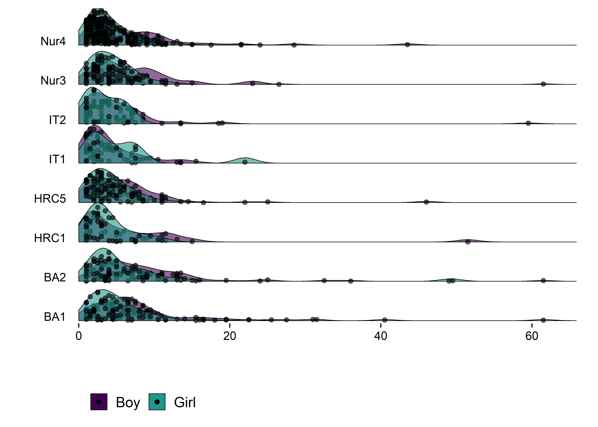<!-- -->

```r

# save(plot1, file = "C:/LocalData/hema/git-projects/baseline-visu/docs/baseline-supplement_files/figure-html/nordpaq_dysfunctional_item-accelerometer-plot-1.png")
```

### Density plot by track


```r

plot1 <- df %>% dplyr::select(id,
                              track = track,
                              girl,
                              nordpaq_alternative_item = leisuretimeMvpaHoursLastweek_T1)  %>%
  dplyr::filter(!is.na(track), track != "Other") %>% # Drop category "Other"
  dplyr::mutate(track = factor(track, levels = c("IT", "BA", "HRC", "Nur")),
                track = recode_factor(track, "IT" = "IT", "BA" = "BA", 
                                      "HRC" = "HRC", "Nur" = "Nur")) %>% 
  ggplot2::ggplot(aes(y = track)) +
  ggridges::geom_density_ridges2(aes(x = nordpaq_alternative_item, colour = "black", 
                                    fill = paste(track, girl),
                                    point_color = girl,
                                    point_fill = girl,
                                    point_shape = girl),
                                  scale = .75, alpha = 0.6, size = 0.25,
                                  position = position_raincloud(width = 0.05, height = 0.15),
                                  # from = 0, to = 450,
                                  jittered_points = TRUE,
                                  point_size = 1) +
  labs(x = NULL,
       y = NULL) +
  scale_y_discrete(expand = c(0.1, 0)) +
  scale_x_continuous(expand = c(0.01, 0)) +
  ggridges::scale_fill_cyclical(
                                labels = c('BA boy' = "Boy", 'BA girl' = "Girl"),
                                values = viridis::viridis(4, end = 0.8)[c(1, 3)],
                                name = "", 
                                guide = guide_legend(override.aes = list(alpha = 1, 
                                                                         point_shape = c(3, 4),
                                                                         point_size = 2))) +
  ggridges::scale_colour_cyclical(values = "black") +
  ggridges::theme_ridges(grid = FALSE) +
  # ggplot2::scale_fill_manual(values = c("#A0FFA0", "#A0A0FF")) +
  ggridges::scale_discrete_manual(aesthetics = "point_color", 
                                  values = viridis::viridis(4, end = 0.8)[c(3, 1)],
                                  guide = "none") +
  ggridges::scale_discrete_manual(aesthetics = "point_fill",
                                  values = viridis::viridis(4, end = 0.8)[c(3, 1)],
                                  guide = "none") +
  ggridges::scale_discrete_manual(aesthetics = "point_shape", 
                                  values = c(4, 3),
                                  guide = "none") +
  papaja::theme_apa() +
  theme(legend.position = "bottom")

plot1 <- plot1 + 
  userfriendlyscience::diamondPlot(nordpaq_alternative_item_trackgirl_diamonds_girl, 
                                   returnLayerOnly = TRUE, 
                                   lineColor = "black", 
                                   color=viridis::viridis(4, end = 0.8)[3],
                                   alpha=.6, 
                                   fixedSize = 0.1, 
                                   otherAxisCol = (1:4 + .15)) + # specify y-position; option to move the diamond 
  userfriendlyscience::diamondPlot(nordpaq_alternative_item_trackgirl_diamonds_boy, 
                                   returnLayerOnly = TRUE, 
                                   lineColor = "black", 
                                   linetype = "solid", 
                                   color=viridis::viridis(4, end = 0.8)[1],
                                   alpha=.6, 
                                   fixedSize = 0.1, 
                                   otherAxisCol = (1:4 + .15))

# Draw plot with intervention and control densities

plot2 <- df %>% dplyr::select(id,
                              track = track,
                              intervention,
                              nordpaq_alternative_item = leisuretimeMvpaHoursLastweek_T1)  %>%
  dplyr::filter(!is.na(track), track != "Other") %>% # Drop category "Other"
  dplyr::mutate(track = factor(track, levels = c("IT", "BA", "HRC", "Nur")),
                track = recode_factor(track, "IT" = "IT", "BA" = "BA", 
                                      "HRC" = "HRC", "Nur" = "Nur")) %>% 
  ggplot2::ggplot(aes(y = track)) +
  ggridges::geom_density_ridges2(aes(x = nordpaq_alternative_item, colour = "black", 
                                    fill = paste(track, intervention),
                                    point_color = intervention,
                                    point_fill = intervention,
                                    point_shape = intervention),
                                  scale = .75, alpha = 0.6, size = 0.25,
                                  position = position_raincloud(width = 0.05, height = 0.15),
                                  # from = 0, to = 450,
                                  jittered_points = TRUE,
                                  point_size = 1) +
  labs(x = NULL,
       y = NULL) +
  scale_y_discrete(expand = c(0.1, 0), labels = NULL) +
  scale_x_continuous(expand = c(0.01, 0)) +
  ggridges::scale_fill_cyclical(
                                labels = c('BA 0' = "Control", 'BA 1' = "Intervention"),
                                values = viridis::viridis(4, end = 0.8)[c(2, 4)],
                                name = "", 
                                guide = guide_legend(override.aes = list(alpha = 1, 
                                                                         point_shape = c(4, 3),
                                                                         point_size = 2))) +
  ggridges::scale_colour_cyclical(values = "black") +
  ggridges::theme_ridges(grid = FALSE) +
  # ggplot2::scale_fill_manual(values = c("#A0FFA0", "#A0A0FF")) +
  ggridges::scale_discrete_manual(aesthetics = "point_color", 
                                  values = viridis::viridis(4, end = 0.8)[c(2, 4)],
                                  guide = "none") +
  ggridges::scale_discrete_manual(aesthetics = "point_fill",
                                  values = viridis::viridis(4, end = 0.8)[c(2, 4)],
                                  guide = "none") +
  ggridges::scale_discrete_manual(aesthetics = "point_shape", 
                                  values = c(4, 3),
                                  guide = "none") +
  papaja::theme_apa() +
  theme(legend.position = "bottom")

plot2 <- plot2 + 
  userfriendlyscience::diamondPlot(nordpaq_alternative_item_trackintervention_diamonds_intervention, 
                                   returnLayerOnly = TRUE, 
                                   lineColor = "black",  
                                   color=viridis::viridis(4, end = 0.8)[4],
                                   alpha=.6, 
                                   fixedSize = 0.1, 
                                   otherAxisCol = (1:4 + .15)) +
  userfriendlyscience::diamondPlot(nordpaq_alternative_item_trackintervention_diamonds_control, 
                                   returnLayerOnly = TRUE, 
                                   lineColor = "black",  
                                   color=viridis::viridis(4, end = 0.8)[2],
                                   alpha=.6, 
                                   fixedSize = 0.1, 
                                   otherAxisCol = (1:4 + .15))

plot1 + plot2
```

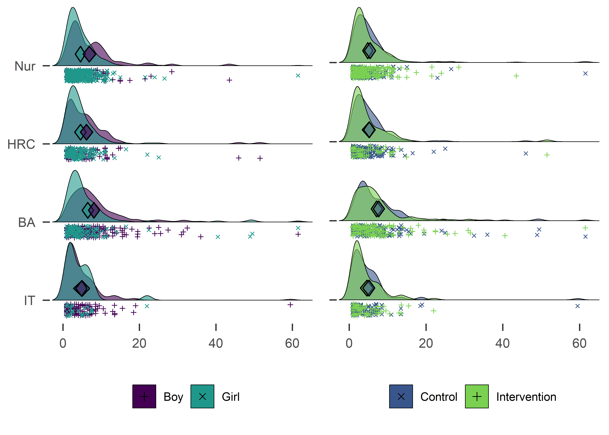

<a id="sitBreaks"></a>

## Breaks in sedentary time

This section reports the accelerometer-measured number of breaks to sitting time.

### Data preparation {.tabset}

#### Description

The tab "Information on data preparation" of this section present information on data preparation for the plot

#### Information on data preparation

Code chunk below prepares data.


```r
# m_sitBreaksAccelerometer_trackgirl <- brms::bf(sitBreaksAccelerometer_T1 ~ (1 | track:girl)) %>% 
#   brms::brm(., data = df, chains = 4, iter = 4000, control = list(adapt_delta = 0.95))
# 
# brms::prior_summary(m_sitBreaksAccelerometer_trackgirl, data = df)
# 
# m_sitBreaksAccelerometer_trackgirl
# 
# b_intercept <- brms::fixef(m_sitBreaksAccelerometer_trackgirl)[1]
# 
# # This gives estimates only:
# sitBreaksAccelerometer_trackgirl_estimates <- brms::ranef(m_sitBreaksAccelerometer_trackgirl)[[1]][1:10]
# 
# # The 2.5%ile:
# sitBreaksAccelerometer_trackgirl_CIL <- brms::ranef(m_sitBreaksAccelerometer_trackgirl)[[1]][21:30]
# 
# # The 97.5%ile:
# sitBreaksAccelerometer_trackgirl_CIH <- brms::ranef(m_sitBreaksAccelerometer_trackgirl)[[1]][31:40]
# 
# sitBreaksAccelerometer_trackgirl_ci <- data.frame(sitBreaksAccelerometer_trackgirl_CIL, sitBreaksAccelerometer_trackgirl_estimates, sitBreaksAccelerometer_trackgirl_CIH, Variable = labels(brms::ranef(m_sitBreaksAccelerometer_trackgirl))) %>% 
#   dplyr::mutate(b_intercept = rep(b_intercept, 10)) %>% 
#   dplyr::mutate(sitBreaksAccelerometer_trackgirl_CIL = sitBreaksAccelerometer_trackgirl_CIL + b_intercept,
#          sitBreaksAccelerometer_trackgirl_estimates = sitBreaksAccelerometer_trackgirl_estimates + b_intercept,
#          sitBreaksAccelerometer_trackgirl_CIH = sitBreaksAccelerometer_trackgirl_CIH + b_intercept,
#          track = c('BA_boy',
#                    'BA_girl',
#                    'HRC_boy',
#                    'HRC_girl',
#                    'IT_boy',
#                    'IT_girl',
#                    'Nur_boy',
#                    'Nur_girl',
#                    'Other_boy',
#                    'Other_girl'
# ))
# 
# sitBreaksAccelerometer_trackgirl_diamonds_girl <- rbind(
# sitBreaksAccelerometer_trackgirl_ci %>% dplyr::filter(track == "Nur_girl"),
# sitBreaksAccelerometer_trackgirl_ci %>% dplyr::filter(track == "HRC_girl"),
# sitBreaksAccelerometer_trackgirl_ci %>% dplyr::filter(track == "BA_girl"),
# sitBreaksAccelerometer_trackgirl_ci %>% dplyr::filter(track == "IT_girl")) %>% 
#   arrange(-row_number()) # reverse order of rows to make them right for the plot to come
# 
# sitBreaksAccelerometer_trackgirl_diamonds_boy <- rbind(
# sitBreaksAccelerometer_trackgirl_ci %>% dplyr::filter(track == "Nur_boy"),
# sitBreaksAccelerometer_trackgirl_ci %>% dplyr::filter(track == "HRC_boy"),
# sitBreaksAccelerometer_trackgirl_ci %>% dplyr::filter(track == "BA_boy"),
# sitBreaksAccelerometer_trackgirl_ci %>% dplyr::filter(track == "IT_boy")) %>% 
#   arrange(-row_number()) # reverse order of rows to make them right for the plot to come
# 
# 
# m_sitBreaksAccelerometer_trackintervention <- brms::bf(sitBreaksAccelerometer_T1 ~ (1 | track:intervention)) %>% 
#   brms::brm(., data = df, chains = 4, iter = 4000, control = list(adapt_delta = 0.95))
# 
# brms::prior_summary(m_sitBreaksAccelerometer_trackintervention, data = df)
# 
# m_sitBreaksAccelerometer_trackintervention
# 
# b_intercept <- brms::fixef(m_sitBreaksAccelerometer_trackintervention)[1]
# 
# # This gives estimates only:
# sitBreaksAccelerometer_trackintervention_estimates <- brms::ranef(m_sitBreaksAccelerometer_trackintervention)[[1]][1:10]
# 
# # The 2.5%ile:
# sitBreaksAccelerometer_trackintervention_CIL <- brms::ranef(m_sitBreaksAccelerometer_trackintervention)[[1]][21:30]
# 
# # The 97.5%ile:
# sitBreaksAccelerometer_trackintervention_CIH <- brms::ranef(m_sitBreaksAccelerometer_trackintervention)[[1]][31:40]
# 
# sitBreaksAccelerometer_trackintervention_ci <- data.frame(sitBreaksAccelerometer_trackintervention_CIL, sitBreaksAccelerometer_trackintervention_estimates, sitBreaksAccelerometer_trackintervention_CIH, Variable = labels(brms::ranef(m_sitBreaksAccelerometer_trackintervention))) %>% 
#   dplyr::mutate(b_intercept = rep(b_intercept, 10)) %>% 
#   dplyr::mutate(sitBreaksAccelerometer_trackintervention_CIL = sitBreaksAccelerometer_trackintervention_CIL + b_intercept,
#          sitBreaksAccelerometer_trackintervention_estimates = sitBreaksAccelerometer_trackintervention_estimates + b_intercept,
#          sitBreaksAccelerometer_trackintervention_CIH = sitBreaksAccelerometer_trackintervention_CIH + b_intercept,
#          track = c('BA_control',
#                    'BA_intervention',
#                    'HRC_control',
#                    'HRC_intervention',
#                    'IT_control',
#                    'IT_intervention',
#                    'Nur_control',
#                    'Nur_intervention',
#                    'Other_control',
#                    'Other_intervention'
# ))
# 
# sitBreaksAccelerometer_trackintervention_diamonds_intervention <- rbind(
# sitBreaksAccelerometer_trackintervention_ci %>% dplyr::filter(track == "Nur_intervention"),
# sitBreaksAccelerometer_trackintervention_ci %>% dplyr::filter(track == "HRC_intervention"),
# sitBreaksAccelerometer_trackintervention_ci %>% dplyr::filter(track == "BA_intervention"),
# sitBreaksAccelerometer_trackintervention_ci %>% dplyr::filter(track == "IT_intervention")) %>% 
#   arrange(-row_number()) # reverse order of rows to make them right for the plot to come
# 
# sitBreaksAccelerometer_trackintervention_diamonds_control <- rbind(
# sitBreaksAccelerometer_trackintervention_ci %>% dplyr::filter(track == "Nur_control"),
# sitBreaksAccelerometer_trackintervention_ci %>% dplyr::filter(track == "HRC_control"),
# sitBreaksAccelerometer_trackintervention_ci %>% dplyr::filter(track == "BA_control"),
# sitBreaksAccelerometer_trackintervention_ci %>% dplyr::filter(track == "IT_control")) %>% 
#   arrange(-row_number()) # reverse order of rows to make them right for the plot to come
# 
# save(sitBreaksAccelerometer_trackgirl_diamonds_girl, file = "./Rdata_files/sitBreaksAccelerometer_trackgirl_diamonds_girl.Rdata")
# save(sitBreaksAccelerometer_trackgirl_diamonds_boy, file = "./Rdata_files/sitBreaksAccelerometer_trackgirl_diamonds_boy.Rdata")
# save(sitBreaksAccelerometer_trackintervention_diamonds_intervention, file = "./Rdata_files/sitBreaksAccelerometer_trackintervention_diamonds_intervention.Rdata")
# save(sitBreaksAccelerometer_trackintervention_diamonds_control, file = "./Rdata_files/sitBreaksAccelerometer_trackintervention_diamonds_control.Rdata")

load("./Rdata_files/sitBreaksAccelerometer_trackgirl_diamonds_girl.Rdata")
load("./Rdata_files/sitBreaksAccelerometer_trackgirl_diamonds_boy.Rdata")
load("./Rdata_files/sitBreaksAccelerometer_trackintervention_diamonds_intervention.Rdata")
load("./Rdata_files/sitBreaksAccelerometer_trackintervention_diamonds_control.Rdata")
```


```r

sitBreaksAccelerometer_trackgirl_diamonds_girl %>% DT::datatable() #papaja::apa_table()
```

<!--html_preserve--><div id="htmlwidget-2060ffdadcb1f5d1ca38" style="width:100%;height:auto;" class="datatables html-widget"></div>
<script type="application/json" data-for="htmlwidget-2060ffdadcb1f5d1ca38">{"x":{"filter":"none","data":[["1","2","3","4"],[19.1041652938214,25.3675187702173,23.2159205863871,27.0414030624791],[22.6191741616125,27.8376757056615,25.610591292483,29.2301028986248],[25.7778977115382,30.4442144094979,28.0462057129534,31.5214971847131],["track:girl","track:girl","track:girl","track:girl"],[24.8619771074308,24.8619771074308,24.8619771074308,24.8619771074308],["IT_girl","BA_girl","HRC_girl","Nur_girl"]],"container":"<table class=\"display\">\n  <thead>\n    <tr>\n      <th> <\/th>\n      <th>sitBreaksAccelerometer_trackgirl_CIL<\/th>\n      <th>sitBreaksAccelerometer_trackgirl_estimates<\/th>\n      <th>sitBreaksAccelerometer_trackgirl_CIH<\/th>\n      <th>Variable<\/th>\n      <th>b_intercept<\/th>\n      <th>track<\/th>\n    <\/tr>\n  <\/thead>\n<\/table>","options":{"columnDefs":[{"className":"dt-center","targets":"_all"},{"orderable":false,"targets":0}],"order":[],"autoWidth":false,"orderClasses":false}},"evals":[],"jsHooks":[]}</script><!--/html_preserve-->

```r
sitBreaksAccelerometer_trackgirl_diamonds_boy %>% DT::datatable() #papaja::apa_table()
```

<!--html_preserve--><div id="htmlwidget-c3e47df223ee8046ceb2" style="width:100%;height:auto;" class="datatables html-widget"></div>
<script type="application/json" data-for="htmlwidget-c3e47df223ee8046ceb2">{"x":{"filter":"none","data":[["1","2","3","4"],[18.9014358182662,21.869320043087,20.4850405458608,22.2181400064245],[21.3852434383998,24.2370094890897,23.1700980624429,24.838079058689],[23.7712218435475,26.6679999581965,25.7113642148315,27.5186123274173],["track:girl","track:girl","track:girl","track:girl"],[24.8619771074308,24.8619771074308,24.8619771074308,24.8619771074308],["IT_boy","BA_boy","HRC_boy","Nur_boy"]],"container":"<table class=\"display\">\n  <thead>\n    <tr>\n      <th> <\/th>\n      <th>sitBreaksAccelerometer_trackgirl_CIL<\/th>\n      <th>sitBreaksAccelerometer_trackgirl_estimates<\/th>\n      <th>sitBreaksAccelerometer_trackgirl_CIH<\/th>\n      <th>Variable<\/th>\n      <th>b_intercept<\/th>\n      <th>track<\/th>\n    <\/tr>\n  <\/thead>\n<\/table>","options":{"columnDefs":[{"className":"dt-center","targets":"_all"},{"orderable":false,"targets":0}],"order":[],"autoWidth":false,"orderClasses":false}},"evals":[],"jsHooks":[]}</script><!--/html_preserve-->

```r
sitBreaksAccelerometer_trackintervention_diamonds_intervention %>% DT::datatable() #papaja::apa_table()
```

<!--html_preserve--><div id="htmlwidget-e35cef483a610f9dd01f" style="width:100%;height:auto;" class="datatables html-widget"></div>
<script type="application/json" data-for="htmlwidget-e35cef483a610f9dd01f">{"x":{"filter":"none","data":[["1","2","3","4"],[20.0363033012932,23.3542318275023,23.0465701832918,26.8457522408414],[22.7895021205299,25.8484499932725,25.7764835079258,29.073038521109],[25.4578950541193,28.4374240772193,28.5648971965071,31.4463512085426],["track:intervention","track:intervention","track:intervention","track:intervention"],[25.040664956728,25.040664956728,25.040664956728,25.040664956728],["IT_intervention","BA_intervention","HRC_intervention","Nur_intervention"]],"container":"<table class=\"display\">\n  <thead>\n    <tr>\n      <th> <\/th>\n      <th>sitBreaksAccelerometer_trackintervention_CIL<\/th>\n      <th>sitBreaksAccelerometer_trackintervention_estimates<\/th>\n      <th>sitBreaksAccelerometer_trackintervention_CIH<\/th>\n      <th>Variable<\/th>\n      <th>b_intercept<\/th>\n      <th>track<\/th>\n    <\/tr>\n  <\/thead>\n<\/table>","options":{"columnDefs":[{"className":"dt-center","targets":"_all"},{"orderable":false,"targets":0}],"order":[],"autoWidth":false,"orderClasses":false}},"evals":[],"jsHooks":[]}</script><!--/html_preserve-->

```r
sitBreaksAccelerometer_trackintervention_diamonds_control %>% DT::datatable() #papaja::apa_table()
```

<!--html_preserve--><div id="htmlwidget-365e40af7b2f87f5125a" style="width:100%;height:auto;" class="datatables html-widget"></div>
<script type="application/json" data-for="htmlwidget-365e40af7b2f87f5125a">{"x":{"filter":"none","data":[["1","2","3","4"],[17.7035247971238,23.3019373802188,21.7918237150799,24.5041871483031],[20.5729365731368,25.7978619277485,24.2006087750916,26.9261288562852],[23.2668924094835,28.3356121785901,26.6314173556358,29.4623527475049],["track:intervention","track:intervention","track:intervention","track:intervention"],[25.040664956728,25.040664956728,25.040664956728,25.040664956728],["IT_control","BA_control","HRC_control","Nur_control"]],"container":"<table class=\"display\">\n  <thead>\n    <tr>\n      <th> <\/th>\n      <th>sitBreaksAccelerometer_trackintervention_CIL<\/th>\n      <th>sitBreaksAccelerometer_trackintervention_estimates<\/th>\n      <th>sitBreaksAccelerometer_trackintervention_CIH<\/th>\n      <th>Variable<\/th>\n      <th>b_intercept<\/th>\n      <th>track<\/th>\n    <\/tr>\n  <\/thead>\n<\/table>","options":{"columnDefs":[{"className":"dt-center","targets":"_all"},{"orderable":false,"targets":0}],"order":[],"autoWidth":false,"orderClasses":false}},"evals":[],"jsHooks":[]}</script><!--/html_preserve-->

### Density plot by intervention and gender


```r

# Create data frame
densplot <- d
levels(densplot$intervention) <- c("Control", "Intervention")
levels(densplot$girl) <- recode(densplot$girl, "boy" = "Boys", "girl" = "Girls")

# This gives side-by-side plots. There's a third plot below the two, which is fake to include x-axis text.
layout(matrix(c(1, 2, 3, 3), nrow = 2, ncol = 2, byrow = TRUE),
       widths = c(0.5, 0.5), heights = c(0.45, 0.05))

# Minimise whitespace; see https://stackoverflow.com/questions/15848942/how-to-reduce-space-gap-between-multiple-graphs-in-r
par(mai = c(0.3, 0.3, 0.1, 0.0)) 

## Girls vs. boys
# Choose only the variables needed and drop NA
dens <- densplot %>% dplyr::select(sitBreaksAccelerometer_T1, girl) %>% 
  dplyr::filter(complete.cases(.))

# Set random number generator for reproducibility of bootstrap test of equal densities
set.seed(10)

# Make plot
sm.sitBreaksAccelerometer_T1_2 <- sm.density.compare2(as.numeric(dens$sitBreaksAccelerometer_T1), 
                                               as.factor(dens$girl), 
                                               model = "equal",
                                               xlab = "", ylab = "",
                                               col = viridis::viridis(4, end  =  0.8)[c(3, 1)], 
                                               lty = c(1, 3), yaxt = "n",
                                               bandcol = 'LightGray', 
                                               lwd = c(2, 2))
## 
## Test of equal densities:  p-value =  0
legend("topright", levels(dens$girl), col = viridis::viridis(4, end = 0.8)[c(1, 3)], lty = c(3,1), lwd = (c(2,2)))
mtext(side = 2, "Density", line = 0.5)

## Intervention vs. control
# Choose only the variables needed and drop NA
dens <- densplot %>% dplyr::select(sitBreaksAccelerometer_T1, intervention) %>% 
  dplyr::filter(complete.cases(.))

# Set random number generator for reproducibility of bootstrap test of equal densities
set.seed(10)
# Make plot
sm.sitBreaksAccelerometer_T1_2 <- sm.density.compare2(as.numeric(dens$sitBreaksAccelerometer_T1), 
                                               as.factor(dens$intervention), 
                                               model = "equal", 
                                               xlab = "", ylab = "",
                                               col = viridis::viridis(4, end = 0.8)[c(2, 4)], 
                                               lty = c(3, 1), yaxt = "n",
                                               bandcol = 'LightGray', 
                                               lwd = c(2, 2))
## 
## Test of equal densities:  p-value =  0.01
legend("topright", levels(dens$intervention), col = viridis::viridis(4, end = 0.8)[c(2, 4)], lty=c(3,1), lwd=(c(2,2)))

# Create x-axis label. See https://stackoverflow.com/questions/11198767/how-to-annotate-across-or-between-plots-in-multi-plot-panels-in-r
par(mar = c(0,0,0,0)) 
plot(1, 1, type = "n", frame.plot = FALSE, axes = FALSE) # Fake plot for x-axis label
text(x = 1.02, y = 1.3, labels = "Average number of breaks in daily sitting", pos = 1)
```

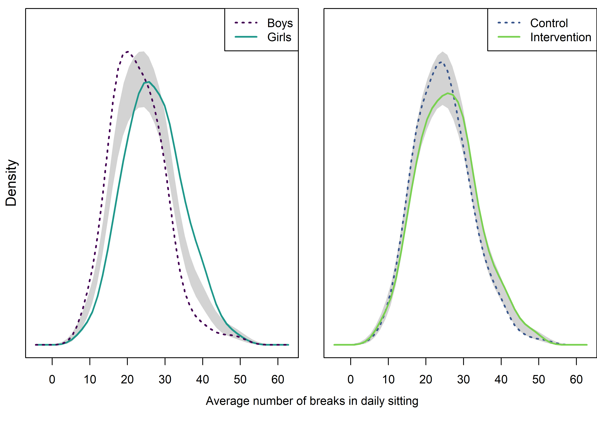<!-- -->

### Density plot by track


```r

plot1 <- df %>% dplyr::select(id,
                              track = track,
                              girl,
                              PA = sitBreaksAccelerometer_T1)  %>%
  dplyr::filter(!is.na(track), track != "Other") %>% # Drop category "Other"
  dplyr::mutate(track = factor(track, levels = c("IT", "BA", "HRC", "Nur")),
                track = recode_factor(track, "IT" = "IT", "BA" = "BA", 
                                      "HRC" = "HRC", "Nur" = "Nur")) %>% 
  ggplot2::ggplot(aes(y = track)) +
  ggridges::geom_density_ridges2(aes(x = PA, colour = "black", 
                                    fill = paste(track, girl),
                                    point_color = girl,
                                    point_fill = girl,
                                    point_shape = girl),
                                  scale = .6, alpha = 0.6, size = 0.25,
                                  position = position_raincloud(width = 0.2, height = 0.15),
                                  # from = 0, to = 450,
                                  jittered_points = TRUE,
                                  point_size = 1) +
  labs(x = NULL,
       y = NULL) +
  scale_y_discrete(expand = c(0.1, 0)) +
  scale_x_continuous(expand = c(0.01, 0)) +
  ggridges::scale_fill_cyclical(
                                labels = c('BA boy' = "Boy", 'BA girl' = "Girl"),
                                values = viridis::viridis(4, end = 0.8)[c(1, 3)],
                                name = "", 
                                guide = guide_legend(override.aes = list(alpha = 1, 
                                                                         point_shape = c(3, 4),
                                                                         point_size = 2))) +
  ggridges::scale_colour_cyclical(values = "black") +
  ggridges::theme_ridges(grid = FALSE) +
  # ggplot2::scale_fill_manual(values = c("#A0FFA0", "#A0A0FF")) +
  ggridges::scale_discrete_manual(aesthetics = "point_color", 
                                  values = viridis::viridis(4, end = 0.8)[c(3, 1)],
                                  guide = "none") +
  ggridges::scale_discrete_manual(aesthetics = "point_fill",
                                  values = viridis::viridis(4, end = 0.8)[c(3, 1)],
                                  guide = "none") +
  ggridges::scale_discrete_manual(aesthetics = "point_shape", 
                                  values = c(4, 3),
                                  guide = "none") +
  papaja::theme_apa() +
  theme(legend.position = "bottom")

plot1 <- plot1 + 
  userfriendlyscience::diamondPlot(sitBreaksAccelerometer_trackgirl_diamonds_girl, 
                                   returnLayerOnly = TRUE, 
                                   lineColor = "black", 
                                   color=viridis::viridis(4, end = 0.8)[3],
                                   alpha=.6, 
                                   fixedSize = 0.1, 
                                   otherAxisCol = (1:4 + .15)) + # specify y-position; option to move the diamond 
  userfriendlyscience::diamondPlot(sitBreaksAccelerometer_trackgirl_diamonds_boy, 
                                   returnLayerOnly = TRUE, 
                                   lineColor = "black", 
                                   linetype = "solid", 
                                   color=viridis::viridis(4, end = 0.8)[1],
                                   alpha=.6, 
                                   fixedSize = 0.1, 
                                   otherAxisCol = (1:4 + .15))

# Draw plot with intervention and control densities

plot2 <- df %>% dplyr::select(id,
                              track = track,
                              intervention,
                              PA = sitBreaksAccelerometer_T1)  %>%
  dplyr::filter(!is.na(track), track != "Other") %>% # Drop category "Other"
  dplyr::mutate(track = factor(track, levels = c("IT", "BA", "HRC", "Nur")),
                track = recode_factor(track, "IT" = "IT", "BA" = "BA", 
                                      "HRC" = "HRC", "Nur" = "Nur")) %>% 
  ggplot2::ggplot(aes(y = track)) +
  ggridges::geom_density_ridges2(aes(x = PA, colour = "black", 
                                    fill = paste(track, intervention),
                                    point_color = intervention,
                                    point_fill = intervention,
                                    point_shape = intervention),
                                  scale = .6, alpha = 0.6, size = 0.25,
                                  position = position_raincloud(width = 0.2, height = 0.15),
                                  # from = 0, to = 450,
                                  jittered_points = TRUE,
                                  point_size = 1) +
  labs(x = NULL,
       y = NULL) +
  scale_y_discrete(expand = c(0.1, 0), labels = NULL) +
  scale_x_continuous(expand = c(0.01, 0)) +
  ggridges::scale_fill_cyclical(
                                labels = c('BA 0' = "Control", 'BA 1' = "Intervention"),
                                values = viridis::viridis(4, end = 0.8)[c(2, 4)],
                                name = "", 
                                guide = guide_legend(override.aes = list(alpha = 1, 
                                                                         point_shape = c(4, 3),
                                                                         point_size = 2))) +
  ggridges::scale_colour_cyclical(values = "black") +
  ggridges::theme_ridges(grid = FALSE) +
  # ggplot2::scale_fill_manual(values = c("#A0FFA0", "#A0A0FF")) +
  ggridges::scale_discrete_manual(aesthetics = "point_color", 
                                  values = viridis::viridis(4, end = 0.8)[c(2, 4)],
                                  guide = "none") +
  ggridges::scale_discrete_manual(aesthetics = "point_fill",
                                  values = viridis::viridis(4, end = 0.8)[c(2, 4)],
                                  guide = "none") +
  ggridges::scale_discrete_manual(aesthetics = "point_shape", 
                                  values = c(4, 3),
                                  guide = "none") +
  papaja::theme_apa() +
  theme(legend.position = "bottom")

plot2 <- plot2 + 
  userfriendlyscience::diamondPlot(sitBreaksAccelerometer_trackintervention_diamonds_intervention, 
                                   returnLayerOnly = TRUE, 
                                   lineColor = "black",  
                                   color=viridis::viridis(4, end = 0.8)[4],
                                   alpha=.6, 
                                   fixedSize = 0.1, 
                                   otherAxisCol = (1:4 + .15)) +
  userfriendlyscience::diamondPlot(sitBreaksAccelerometer_trackintervention_diamonds_control, 
                                   returnLayerOnly = TRUE, 
                                   lineColor = "black",  
                                   color=viridis::viridis(4, end = 0.8)[2],
                                   alpha=.6, 
                                   fixedSize = 0.1, 
                                   otherAxisCol = (1:4 + .15))

plot1 + plot2
```


Girls in all educational tracks interrupted sitting more than boys.

<a id="sitLieAccelerometer"></a>

## SB, Accelerometer-measured

### Density plot by intervention and gender


```r

# Create data frame
densplot <- d
levels(densplot$intervention) <- c("Control", "Intervention")
levels(densplot$girl) <- recode(densplot$girl, "boy" = "Boys", "girl" = "Girls")

# This gives side-by-side plots. There's a third plot below the two, which is fake to include x-axis text.
layout(matrix(c(1, 2, 3, 3), nrow = 2, ncol = 2, byrow = TRUE),
       widths = c(0.5, 0.5), heights = c(0.45, 0.05))

# Minimise whitespace; see https://stackoverflow.com/questions/15848942/how-to-reduce-space-gap-between-multiple-graphs-in-r
par(mai = c(0.3, 0.3, 0.1, 0.0)) 

## Girls vs. boys
# Choose only the variables needed and drop NA
dens <- densplot %>% dplyr::select(sitLieAccelerometer_T1, girl) %>% 
  dplyr::filter(complete.cases(.))

# Set random number generator for reproducibility of bootstrap test of equal densities
set.seed(10)

# Make plot
sm.sitLieAccelerometer_T1_2 <- sm.density.compare2(as.numeric(dens$sitLieAccelerometer_T1), 
                                               as.factor(dens$girl), 
                                               model = "equal",
                                               xlab = "", ylab = "",
                                               col = viridis::viridis(4, end  =  0.8)[c(3, 1)], 
                                               lty = c(1, 3), yaxt = "n",
                                               bandcol = 'LightGray', 
                                               lwd = c(2, 2))
## 
## Test of equal densities:  p-value =  0
legend("topright", levels(dens$girl), col = viridis::viridis(4, end = 0.8)[c(1, 3)], lty = c(3,1), lwd = (c(2,2)))
mtext(side = 2, "Density", line = 0.5)

## Intervention vs. control
# Choose only the variables needed and drop NA
dens <- densplot %>% dplyr::select(sitLieAccelerometer_T1, intervention) %>% 
  dplyr::filter(complete.cases(.))

# Set random number generator for reproducibility of bootstrap test of equal densities
set.seed(10)
# Make plot
sm.sitLieAccelerometer_T1_2 <- sm.density.compare2(as.numeric(dens$sitLieAccelerometer_T1), 
                                               as.factor(dens$intervention), 
                                               model = "equal", 
                                               xlab = "", ylab = "",
                                               col = viridis::viridis(4, end = 0.8)[c(2, 4)], 
                                               lty = c(3, 1), yaxt = "n",
                                               bandcol = 'LightGray', 
                                               lwd = c(2, 2))
## 
## Test of equal densities:  p-value =  0.07
legend("topright", levels(dens$intervention), col = viridis::viridis(4, end = 0.8)[c(2, 4)], lty=c(3,1), lwd=(c(2,2)))

# Create x-axis label. See https://stackoverflow.com/questions/11198767/how-to-annotate-across-or-between-plots-in-multi-plot-panels-in-r
par(mar = c(0,0,0,0)) 
plot(1, 1, type = "n", frame.plot = FALSE, axes = FALSE) # Fake plot for x-axis label
text(x = 1.02, y = 1.3, labels = "Average daily hours spent sitting or lying down", pos = 1)
```

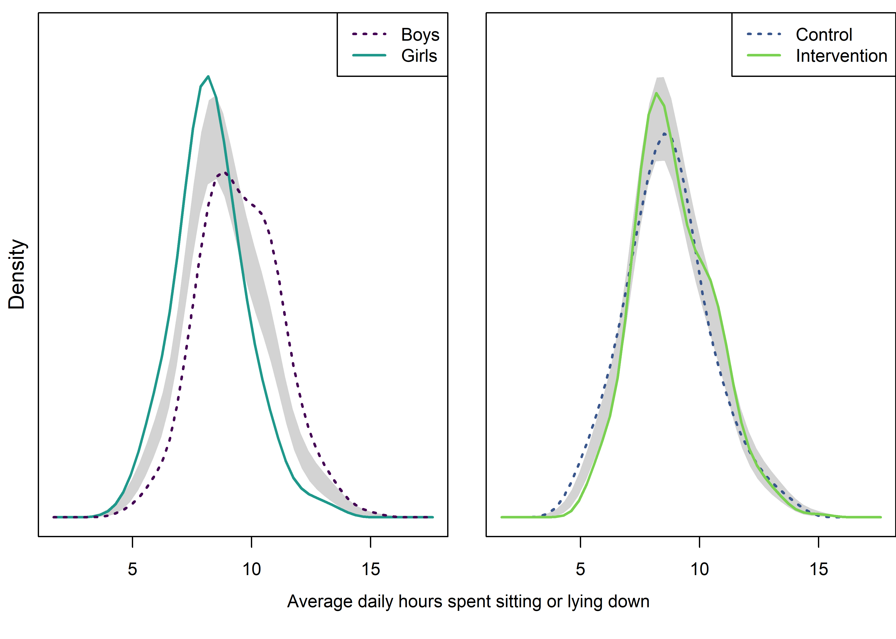<!-- -->

Differences in time spent sitting and lying down emerged between boys and girls, the former spending more time being sedentary. Even though there was some heterogeneity among schools, again the aggregated intervention and control schools showed no differences.
 
### Data preparation {.tabset}

#### Description

The tab "Information on data preparation" of this section present information on data preparation for the plot

#### Information on data preparation

Prepare data: time spent sitting & lying down

Get credibility intervals track:school


```r
# m_sitLieAccelerometer_trackgirl <- brms::bf(sitLieAccelerometer_T1 ~ (1 | track:girl)) %>% 
#   brms::brm(., data = df, chains = 4, iter = 4000, control = list(adapt_delta = 0.95))
# 
# brms::prior_summary(m_sitLieAccelerometer_trackgirl, data = df)
# 
# m_sitLieAccelerometer_trackgirl
# 
# b_intercept <- brms::fixef(m_sitLieAccelerometer_trackgirl)[1]
# 
# # This gives estimates only:
# sitLie_trackgirl_estimates <- brms::ranef(m_sitLieAccelerometer_trackgirl)[[1]][1:10]
# 
# # The 2.5%ile:
# sitLie_trackgirl_CIL <- brms::ranef(m_sitLieAccelerometer_trackgirl)[[1]][21:30]
# 
# # The 97.5%ile:
# sitLie_trackgirl_CIH <- brms::ranef(m_sitLieAccelerometer_trackgirl)[[1]][31:40]
# 
# sitLie_trackgirl_ci <- data.frame(sitLie_trackgirl_CIL, sitLie_trackgirl_estimates, sitLie_trackgirl_CIH, Variable = labels(brms::ranef(m_sitLieAccelerometer_trackgirl))) %>% 
#   dplyr::mutate(b_intercept = rep(b_intercept, 10)) %>% 
#   dplyr::mutate(sitLie_trackgirl_CIL = sitLie_trackgirl_CIL + b_intercept,
#          sitLie_trackgirl_estimates = sitLie_trackgirl_estimates + b_intercept,
#          sitLie_trackgirl_CIH = sitLie_trackgirl_CIH + b_intercept,
#          track = c('BA_boy',
#                    'BA_girl',
#                    'HRC_boy',
#                    'HRC_girl',
#                    'IT_boy',
#                    'IT_girl',
#                    'Nur_boy',
#                    'Nur_girl',
#                    'Other_boy',
#                    'Other_girl'
# ))
# 
# sitLie_trackgirl_diamonds_girl <- rbind(
# sitLie_trackgirl_ci %>% dplyr::filter(track == "Nur_girl"),
# sitLie_trackgirl_ci %>% dplyr::filter(track == "HRC_girl"),
# sitLie_trackgirl_ci %>% dplyr::filter(track == "BA_girl"),
# sitLie_trackgirl_ci %>% dplyr::filter(track == "IT_girl")) %>% 
#   arrange(-row_number()) # reverse order of rows to make them right for the plot to come
# 
# sitLie_trackgirl_diamonds_boy <- rbind(
# sitLie_trackgirl_ci %>% dplyr::filter(track == "Nur_boy"),
# sitLie_trackgirl_ci %>% dplyr::filter(track == "HRC_boy"),
# sitLie_trackgirl_ci %>% dplyr::filter(track == "BA_boy"),
# sitLie_trackgirl_ci %>% dplyr::filter(track == "IT_boy")) %>% 
#   arrange(-row_number()) # reverse order of rows to make them right for the plot to come
# 
# 
# m_sitLieAccelerometer_trackintervention <- brms::bf(sitLieAccelerometer_T1 ~ (1 | track:intervention)) %>% 
#   brms::brm(., data = df, chains = 4, iter = 4000, control = list(adapt_delta = 0.95))
# 
# brms::prior_summary(m_sitLieAccelerometer_trackintervention, data = df)
# 
# m_sitLieAccelerometer_trackintervention
# 
# b_intercept <- brms::fixef(m_sitLieAccelerometer_trackintervention)[1]
# 
# # This gives estimates only:
# sitLie_trackintervention_estimates <- brms::ranef(m_sitLieAccelerometer_trackintervention)[[1]][1:10]
# 
# 
# # The 2.5%ile:
# sitLie_trackintervention_CIL <- brms::ranef(m_sitLieAccelerometer_trackintervention)[[1]][21:30]
# 
# # The 97.5%ile:
# sitLie_trackintervention_CIH <- brms::ranef(m_sitLieAccelerometer_trackintervention)[[1]][31:40]
# 
# sitLie_trackintervention_ci <- data.frame(sitLie_trackintervention_CIL, sitLie_trackintervention_estimates, sitLie_trackintervention_CIH, Variable = labels(brms::ranef(m_sitLieAccelerometer_trackintervention))) %>% 
#   dplyr::mutate(b_intercept = rep(b_intercept, 10)) %>% 
#   dplyr::mutate(sitLie_trackintervention_CIL = sitLie_trackintervention_CIL + b_intercept,
#          sitLie_trackintervention_estimates = sitLie_trackintervention_estimates + b_intercept,
#          sitLie_trackintervention_CIH = sitLie_trackintervention_CIH + b_intercept,
#          track = c('BA_control',
#                    'BA_intervention',
#                    'HRC_control',
#                    'HRC_intervention',
#                    'IT_control',
#                    'IT_intervention',
#                    'Nur_control',
#                    'Nur_intervention',
#                    'Other_control',
#                    'Other_intervention'
# ))
# 
# sitLie_trackintervention_diamonds_intervention <- rbind(
# sitLie_trackintervention_ci %>% dplyr::filter(track == "Nur_intervention"),
# sitLie_trackintervention_ci %>% dplyr::filter(track == "HRC_intervention"),
# sitLie_trackintervention_ci %>% dplyr::filter(track == "BA_intervention"),
# sitLie_trackintervention_ci %>% dplyr::filter(track == "IT_intervention")) %>% 
#   arrange(-row_number()) # reverse order of rows to make them right for the plot to come
# 
# sitLie_trackintervention_diamonds_control <- rbind(
# sitLie_trackintervention_ci %>% dplyr::filter(track == "Nur_control"),
# sitLie_trackintervention_ci %>% dplyr::filter(track == "HRC_control"),
# sitLie_trackintervention_ci %>% dplyr::filter(track == "BA_control"),
# sitLie_trackintervention_ci %>% dplyr::filter(track == "IT_control")) %>% 
#   arrange(-row_number()) # reverse order of rows to make them right for the plot to come
# 
# save(sitLie_trackgirl_diamonds_girl, file = "./Rdata_files/sitLie_trackgirl_diamonds_girl.Rdata")
# save(sitLie_trackgirl_diamonds_boy, file = "./Rdata_files/sitLie_trackgirl_diamonds_boy.Rdata")
# save(sitLie_trackintervention_diamonds_intervention, file = "./Rdata_files/sitLie_trackintervention_diamonds_intervention.Rdata")
# save(sitLie_trackintervention_diamonds_control, file = "./Rdata_files/sitLie_trackintervention_diamonds_control.Rdata")

load("./Rdata_files/sitLie_trackgirl_diamonds_girl.Rdata")
load("./Rdata_files/sitLie_trackgirl_diamonds_boy.Rdata")
load("./Rdata_files/sitLie_trackintervention_diamonds_intervention.Rdata")
load("./Rdata_files/sitLie_trackintervention_diamonds_control.Rdata")
```


```r

sitLie_trackgirl_diamonds_girl %>% DT::datatable() #papaja::apa_table()
```

<!--html_preserve--><div id="htmlwidget-bb5ad932824896725596" style="width:100%;height:auto;" class="datatables html-widget"></div>
<script type="application/json" data-for="htmlwidget-bb5ad932824896725596">{"x":{"filter":"none","data":[["1","2","3","4"],[530.588671247609,464.739106454294,453.171637514869,453.860836234447],[579.026462706883,506.779274107748,495.498540258479,492.955659224765],[630.053118447697,546.317444735557,534.463598460679,530.362004565429],["track:girl","track:girl","track:girl","track:girl"],[545.02231740746,545.02231740746,545.02231740746,545.02231740746],["IT_girl","BA_girl","HRC_girl","Nur_girl"]],"container":"<table class=\"display\">\n  <thead>\n    <tr>\n      <th> <\/th>\n      <th>sitLie_trackgirl_CIL<\/th>\n      <th>sitLie_trackgirl_estimates<\/th>\n      <th>sitLie_trackgirl_CIH<\/th>\n      <th>Variable<\/th>\n      <th>b_intercept<\/th>\n      <th>track<\/th>\n    <\/tr>\n  <\/thead>\n<\/table>","options":{"columnDefs":[{"className":"dt-center","targets":"_all"},{"orderable":false,"targets":0}],"order":[],"autoWidth":false,"orderClasses":false}},"evals":[],"jsHooks":[]}</script><!--/html_preserve-->

```r
sitLie_trackgirl_diamonds_boy %>% DT::datatable() #papaja::apa_table()
```

<!--html_preserve--><div id="htmlwidget-3bb7b984f7f43643d7ab" style="width:100%;height:auto;" class="datatables html-widget"></div>
<script type="application/json" data-for="htmlwidget-3bb7b984f7f43643d7ab">{"x":{"filter":"none","data":[["1","2","3","4"],[580.958207860989,514.097230889648,498.835749152693,489.472221984868],[621.678705274363,554.699047440845,540.738094535296,533.2664692392],[660.890187462135,594.19068803207,581.570807777193,575.057227988179],["track:girl","track:girl","track:girl","track:girl"],[545.02231740746,545.02231740746,545.02231740746,545.02231740746],["IT_boy","BA_boy","HRC_boy","Nur_boy"]],"container":"<table class=\"display\">\n  <thead>\n    <tr>\n      <th> <\/th>\n      <th>sitLie_trackgirl_CIL<\/th>\n      <th>sitLie_trackgirl_estimates<\/th>\n      <th>sitLie_trackgirl_CIH<\/th>\n      <th>Variable<\/th>\n      <th>b_intercept<\/th>\n      <th>track<\/th>\n    <\/tr>\n  <\/thead>\n<\/table>","options":{"columnDefs":[{"className":"dt-center","targets":"_all"},{"orderable":false,"targets":0}],"order":[],"autoWidth":false,"orderClasses":false}},"evals":[],"jsHooks":[]}</script><!--/html_preserve-->

```r
sitLie_trackintervention_diamonds_intervention %>% DT::datatable() #papaja::apa_table()
```

<!--html_preserve--><div id="htmlwidget-7d30003e9bc32f7becaf" style="width:100%;height:auto;" class="datatables html-widget"></div>
<script type="application/json" data-for="htmlwidget-7d30003e9bc32f7becaf">{"x":{"filter":"none","data":[["1","2","3","4"],[563.832656090166,499.221442581787,512.990107779531,471.461010452921],[604.41937832305,538.903265736219,554.877901803522,507.126428866949],[645.245286103413,577.299317746727,596.232651811598,543.937806174186],["track:intervention","track:intervention","track:intervention","track:intervention"],[542.944017376329,542.944017376329,542.944017376329,542.944017376329],["IT_intervention","BA_intervention","HRC_intervention","Nur_intervention"]],"container":"<table class=\"display\">\n  <thead>\n    <tr>\n      <th> <\/th>\n      <th>sitLie_trackintervention_CIL<\/th>\n      <th>sitLie_trackintervention_estimates<\/th>\n      <th>sitLie_trackintervention_CIH<\/th>\n      <th>Variable<\/th>\n      <th>b_intercept<\/th>\n      <th>track<\/th>\n    <\/tr>\n  <\/thead>\n<\/table>","options":{"columnDefs":[{"className":"dt-center","targets":"_all"},{"orderable":false,"targets":0}],"order":[],"autoWidth":false,"orderClasses":false}},"evals":[],"jsHooks":[]}</script><!--/html_preserve-->

```r
sitLie_trackintervention_diamonds_control %>% DT::datatable() #papaja::apa_table()
```

<!--html_preserve--><div id="htmlwidget-764f86c6ae02e9f9ec50" style="width:100%;height:auto;" class="datatables html-widget"></div>
<script type="application/json" data-for="htmlwidget-764f86c6ae02e9f9ec50">{"x":{"filter":"none","data":[["1","2","3","4"],[581.385994610934,490.683972987395,454.87458216163,446.150544404409],[620.540755275655,529.485285811626,493.504528669367,485.679971726659],[662.961202643939,568.089708348711,530.409609156532,524.215454984425],["track:intervention","track:intervention","track:intervention","track:intervention"],[542.944017376329,542.944017376329,542.944017376329,542.944017376329],["IT_control","BA_control","HRC_control","Nur_control"]],"container":"<table class=\"display\">\n  <thead>\n    <tr>\n      <th> <\/th>\n      <th>sitLie_trackintervention_CIL<\/th>\n      <th>sitLie_trackintervention_estimates<\/th>\n      <th>sitLie_trackintervention_CIH<\/th>\n      <th>Variable<\/th>\n      <th>b_intercept<\/th>\n      <th>track<\/th>\n    <\/tr>\n  <\/thead>\n<\/table>","options":{"columnDefs":[{"className":"dt-center","targets":"_all"},{"orderable":false,"targets":0}],"order":[],"autoWidth":false,"orderClasses":false}},"evals":[],"jsHooks":[]}</script><!--/html_preserve-->

#### Basic observed characteristics

NOTE: These values do not account for clustering.


```r

df %>% dplyr::select(sitLieAccelerometer_T1, girl, track) %>% 
  group_by(girl, track) %>% 
  summarise(mean = mean(sitLieAccelerometer_T1, na.rm = TRUE),
            median = median(sitLieAccelerometer_T1, na.rm = TRUE),
            max = max(sitLieAccelerometer_T1, na.rm = TRUE),
            min = min(sitLieAccelerometer_T1, na.rm = TRUE),
            sd = sd(sitLieAccelerometer_T1, na.rm = TRUE),
            n = n()) %>% 
  DT::datatable() #papaja::apa_table()
```

<!--html_preserve--><div id="htmlwidget-d12a63eab06970901237" style="width:100%;height:auto;" class="datatables html-widget"></div>
<script type="application/json" data-for="htmlwidget-d12a63eab06970901237">{"x":{"filter":"none","data":[["1","2","3","4","5","6","7","8","9","10","11"],["girl","girl","girl","girl","girl","boy","boy","boy","boy","boy",null],["Other","IT","BA","HRC","Nur","Other","IT","BA","HRC","Nur",null],[8.466833994709,9.75537510442774,8.41644120277219,8.22894636720668,8.20185197412298,11.0905238095238,10.4066083425618,9.25292669172932,9.00583674463938,8.8749127762216,8.63252857142857],[7.63631944444444,9.60861111111111,8.37133333333333,8.18,8.10958333333333,11.4311904761905,10.4810317460317,9.08125,8.76766666666667,8.58928571428572,8.86036111111111],[13.6695238095238,11.6695238095238,13.0304761904762,13.5019444444444,12.6378571428571,12.9314285714286,14.0671428571429,12.7916666666667,13.9638095238095,14.9554166666667,12.5420833333333],[5.53972222222222,7.4875,4.53642857142857,4.33190476190476,4.99111111111111,9.12857142857143,5.84533333333333,5.56190476190476,4.75611111111111,6.02380952380952,5.4925],[2.28923028628519,1.19435745407311,1.69877401039544,1.67286586696159,1.35643111456795,1.47767664628465,1.58215523455228,1.56310176405083,1.72045454181353,1.55522318446944,2.2022861687326],[17,26,110,129,331,7,137,172,84,71,82]],"container":"<table class=\"display\">\n  <thead>\n    <tr>\n      <th> <\/th>\n      <th>girl<\/th>\n      <th>track<\/th>\n      <th>mean<\/th>\n      <th>median<\/th>\n      <th>max<\/th>\n      <th>min<\/th>\n      <th>sd<\/th>\n      <th>n<\/th>\n    <\/tr>\n  <\/thead>\n<\/table>","options":{"columnDefs":[{"className":"dt-center","targets":"_all"},{"orderable":false,"targets":0}],"order":[],"autoWidth":false,"orderClasses":false}},"evals":[],"jsHooks":[]}</script><!--/html_preserve-->

```r
  

df %>% dplyr::select(sitLieAccelerometer_T1, girl, track) %>% 
  group_by(girl) %>% 
  summarise(mean = mean(sitLieAccelerometer_T1, na.rm = TRUE),
            median = median(sitLieAccelerometer_T1, na.rm = TRUE),
            max = max(sitLieAccelerometer_T1, na.rm = TRUE),
            min = min(sitLieAccelerometer_T1, na.rm = TRUE),
            sd = sd(sitLieAccelerometer_T1, na.rm = TRUE),
            n = n()) %>% 
  DT::datatable() #papaja::apa_table()
```

<!--html_preserve--><div id="htmlwidget-95d714ddb932d24c0815" style="width:100%;height:auto;" class="datatables html-widget"></div>
<script type="application/json" data-for="htmlwidget-95d714ddb932d24c0815">{"x":{"filter":"none","data":[["1","2","3"],["girl","boy",null],[8.3175515509789,9.50817081038765,8.63252857142857],[8.20638888888889,9.42583333333333,8.86036111111111],[13.6695238095238,14.9554166666667,12.5420833333333],[4.33190476190476,4.75611111111111,5.4925],[1.54015947768653,1.71405775062964,2.2022861687326],[613,471,82]],"container":"<table class=\"display\">\n  <thead>\n    <tr>\n      <th> <\/th>\n      <th>girl<\/th>\n      <th>mean<\/th>\n      <th>median<\/th>\n      <th>max<\/th>\n      <th>min<\/th>\n      <th>sd<\/th>\n      <th>n<\/th>\n    <\/tr>\n  <\/thead>\n<\/table>","options":{"columnDefs":[{"className":"dt-center","targets":"_all"},{"orderable":false,"targets":0}],"order":[],"autoWidth":false,"orderClasses":false}},"evals":[],"jsHooks":[]}</script><!--/html_preserve-->

```r

df %>% dplyr::select(sitLieAccelerometer_T1, intervention, track) %>% 
  group_by(intervention, track) %>% 
  summarise(mean = mean(sitLieAccelerometer_T1, na.rm = TRUE),
            median = median(sitLieAccelerometer_T1, na.rm = TRUE),
            max = max(sitLieAccelerometer_T1, na.rm = TRUE),
            min = min(sitLieAccelerometer_T1, na.rm = TRUE),
            sd = sd(sitLieAccelerometer_T1, na.rm = TRUE),
            n = n()) %>% 
  DT::datatable() #papaja::apa_table()
```

<!--html_preserve--><div id="htmlwidget-3a21708cea0065417439" style="width:100%;height:auto;" class="datatables html-widget"></div>
<script type="application/json" data-for="htmlwidget-3a21708cea0065417439">{"x":{"filter":"none","data":[["1","2","3","4","5","6","7","8","9","10","11","12"],["0","0","0","0","0","0","1","1","1","1","1","1"],["Other","IT","BA","HRC","Nur",null,"Other","IT","BA","HRC","Nur",null],[9.06770674603175,10.4412300809213,8.81467120181406,8.19655096266902,8.05278317281969,8.03451521164021,9.48250850340136,10.1447724132863,8.9775973190089,9.26767365424431,8.4398180952381,9.52954861111111],[8.40699404761905,10.4892857142857,8.87345238095238,8.18819444444444,8.01166666666667,8.86036111111111,10.04125,10.2722619047619,8.83925,8.90368055555555,8.25256944444445,9.05638888888889],[12.9314285714286,14.0671428571429,13.0304761904762,13.9638095238095,12.4057142857143,9.98142857142857,13.6695238095238,13.421,12.7916666666667,13.1561904761905,14.9554166666667,12.5420833333333],[6.57428571428572,7.39066666666667,4.53642857142857,4.33190476190476,4.99111111111111,5.4925,5.53972222222222,5.84533333333333,5.56190476190476,6.30738095238095,5.31166666666667,7.46333333333333],[2.23197162735633,1.4815525318041,1.66752123060334,1.73215600854047,1.43701999142292,1.98981385418105,2.74263446804429,1.58408913043063,1.67853079103783,1.4759605533553,1.39105445308938,2.48257150096317],[14,87,131,146,125,25,10,76,151,67,277,57]],"container":"<table class=\"display\">\n  <thead>\n    <tr>\n      <th> <\/th>\n      <th>intervention<\/th>\n      <th>track<\/th>\n      <th>mean<\/th>\n      <th>median<\/th>\n      <th>max<\/th>\n      <th>min<\/th>\n      <th>sd<\/th>\n      <th>n<\/th>\n    <\/tr>\n  <\/thead>\n<\/table>","options":{"columnDefs":[{"className":"dt-center","targets":"_all"},{"orderable":false,"targets":0}],"order":[],"autoWidth":false,"orderClasses":false}},"evals":[],"jsHooks":[]}</script><!--/html_preserve-->

```r

df %>% dplyr::select(sitLieAccelerometer_T1, intervention, track) %>% 
  group_by(intervention) %>% 
  summarise(mean = mean(sitLieAccelerometer_T1, na.rm = TRUE),
            median = median(sitLieAccelerometer_T1, na.rm = TRUE),
            max = max(sitLieAccelerometer_T1, na.rm = TRUE),
            min = min(sitLieAccelerometer_T1, na.rm = TRUE),
            sd = sd(sitLieAccelerometer_T1, na.rm = TRUE),
            n = n()) %>% 
  DT::datatable() #papaja::apa_table()
```

<!--html_preserve--><div id="htmlwidget-85adf208d604a3db7ef7" style="width:100%;height:auto;" class="datatables html-widget"></div>
<script type="application/json" data-for="htmlwidget-85adf208d604a3db7ef7">{"x":{"filter":"none","data":[["1","2"],["0","1"],[8.66018528781244,8.91285763762672],[8.60402777777778,8.63266666666667],[14.0671428571429,14.9554166666667],[4.33190476190476,5.31166666666667],[1.80599265846859,1.63239334490566],[528,638]],"container":"<table class=\"display\">\n  <thead>\n    <tr>\n      <th> <\/th>\n      <th>intervention<\/th>\n      <th>mean<\/th>\n      <th>median<\/th>\n      <th>max<\/th>\n      <th>min<\/th>\n      <th>sd<\/th>\n      <th>n<\/th>\n    <\/tr>\n  <\/thead>\n<\/table>","options":{"columnDefs":[{"className":"dt-center","targets":"_all"},{"orderable":false,"targets":0}],"order":[],"autoWidth":false,"orderClasses":false}},"evals":[],"jsHooks":[]}</script><!--/html_preserve-->


### Density plot by track 

Time spent sitting or lying down


```r

plot1 <- df %>% dplyr::select(id,
                              track = track,
                              girl,
                              PA = sitLieAccelerometer_T1)  %>%
  dplyr::filter(!is.na(track), track != "Other") %>% # Drop category "Other"
  dplyr::mutate(track = factor(track, levels = c("IT", "BA", "HRC", "Nur")),
                track = recode_factor(track, "IT" = "IT", "BA" = "BA", 
                                      "HRC" = "HRC", "Nur" = "Nur")) %>% 
  ggplot2::ggplot(aes(y = track)) +
  ggridges::geom_density_ridges2(aes(x = PA, colour = "black", 
                                    fill = paste(track, girl),
                                    point_color = girl,
                                    point_fill = girl,
                                    point_shape = girl),
                                  scale = .75, alpha = 0.6, size = 0.25,
                                  position = position_raincloud(width = 0.05, height = 0.15),
                                  # from = 0, to = 450,
                                  jittered_points = TRUE,
                                  point_size = 1) +
  labs(x = NULL,
       y = NULL) +
  scale_y_discrete(expand = c(0.1, 0)) +
  scale_x_continuous(expand = c(0.01, 0)) +
  ggridges::scale_fill_cyclical(
                                labels = c('BA boy' = "Boy", 'BA girl' = "Girl"),
                                values = viridis::viridis(4, end = 0.8)[c(1, 3)],
                                name = "", 
                                guide = guide_legend(override.aes = list(alpha = 1, 
                                                                         point_shape = c(3, 4),
                                                                         point_size = 2))) +
  ggridges::scale_colour_cyclical(values = "black") +
  ggridges::theme_ridges(grid = FALSE) +
  # ggplot2::scale_fill_manual(values = c("#A0FFA0", "#A0A0FF")) +
  ggridges::scale_discrete_manual(aesthetics = "point_color", 
                                  values = viridis::viridis(4, end = 0.8)[c(3, 1)],
                                  guide = "none") +
  ggridges::scale_discrete_manual(aesthetics = "point_fill",
                                  values = viridis::viridis(4, end = 0.8)[c(3, 1)],
                                  guide = "none") +
  ggridges::scale_discrete_manual(aesthetics = "point_shape", 
                                  values = c(4, 3),
                                  guide = "none") +
  papaja::theme_apa() +
  theme(legend.position = "bottom")

sitLie_trackgirl_diamonds_girl_hours <- sitLie_trackgirl_diamonds_girl %>% 
  dplyr::mutate_if(is.numeric, ~./60)
sitLie_trackgirl_diamonds_boy_hours <- sitLie_trackgirl_diamonds_boy %>% 
  dplyr::mutate_if(is.numeric, ~./60)

plot1 <- plot1 + 
  userfriendlyscience::diamondPlot(sitLie_trackgirl_diamonds_girl_hours, 
                                   returnLayerOnly = TRUE, 
                                   lineColor = "black", 
                                   color=viridis::viridis(4, end = 0.8)[3],
                                   alpha=.6, 
                                   fixedSize = 0.1, 
                                   otherAxisCol = (1:4 + .15)) + # specify y-position; option to move the diamond 
  userfriendlyscience::diamondPlot(sitLie_trackgirl_diamonds_boy_hours, 
                                   returnLayerOnly = TRUE, 
                                   lineColor = "black", 
                                   linetype = "solid", 
                                   color=viridis::viridis(4, end = 0.8)[1],
                                   alpha=.6, 
                                   fixedSize = 0.1, 
                                   otherAxisCol = (1:4 + .15))

# Draw plot with intervention and control densities

plot2 <- df %>% dplyr::select(id,
                              track = track,
                              intervention,
                              PA = sitLieAccelerometer_T1)  %>%
  dplyr::filter(!is.na(track), track != "Other") %>% # Drop category "Other"
  dplyr::mutate(track = factor(track, levels = c("IT", "BA", "HRC", "Nur")),
                track = recode_factor(track, "IT" = "IT", "BA" = "BA", 
                                      "HRC" = "HRC", "Nur" = "Nur")) %>% 
  ggplot2::ggplot(aes(y = track)) +
  ggridges::geom_density_ridges2(aes(x = PA, colour = "black", 
                                    fill = paste(track, intervention),
                                    point_color = intervention,
                                    point_fill = intervention,
                                    point_shape = intervention),
                                  scale = .75, alpha = 0.6, size = 0.25,
                                  position = position_raincloud(width = 0.05, height = 0.15),
                                  # from = 0, to = 450,
                                  jittered_points = TRUE,
                                  point_size = 1) +
  labs(x = NULL,
       y = NULL) +
  scale_y_discrete(expand = c(0.1, 0), labels = NULL) +
  scale_x_continuous(expand = c(0.01, 0)) +
  ggridges::scale_fill_cyclical(
                                labels = c('BA 0' = "Control", 'BA 1' = "Intervention"),
                                values = viridis::viridis(4, end = 0.8)[c(2, 4)],
                                name = "", 
                                guide = guide_legend(override.aes = list(alpha = 1, 
                                                                         point_shape = c(4, 3),
                                                                         point_size = 2))) +
  ggridges::scale_colour_cyclical(values = "black") +
  ggridges::theme_ridges(grid = FALSE) +
  # ggplot2::scale_fill_manual(values = c("#A0FFA0", "#A0A0FF")) +
  ggridges::scale_discrete_manual(aesthetics = "point_color", 
                                  values = viridis::viridis(4, end = 0.8)[c(2, 4)],
                                  guide = "none") +
  ggridges::scale_discrete_manual(aesthetics = "point_fill",
                                  values = viridis::viridis(4, end = 0.8)[c(2, 4)],
                                  guide = "none") +
  ggridges::scale_discrete_manual(aesthetics = "point_shape", 
                                  values = c(4, 3),
                                  guide = "none") +
  papaja::theme_apa() +
  theme(legend.position = "bottom")

sitLie_trackintervention_diamonds_intervention_hours <- sitLie_trackintervention_diamonds_intervention %>% 
  dplyr::mutate_if(is.numeric, ~./60)
sitLie_trackintervention_diamonds_control_hours <- sitLie_trackintervention_diamonds_control %>% 
  dplyr::mutate_if(is.numeric, ~./60)

plot2 <- plot2 + 
  userfriendlyscience::diamondPlot(sitLie_trackintervention_diamonds_intervention, 
                                   returnLayerOnly = TRUE, 
                                   lineColor = "black",  
                                   color=viridis::viridis(4, end = 0.8)[4],
                                   alpha=.6, 
                                   fixedSize = 0.1, 
                                   otherAxisCol = (1:4 + .15)) +
  userfriendlyscience::diamondPlot(sitLie_trackintervention_diamonds_control, 
                                   returnLayerOnly = TRUE, 
                                   lineColor = "black",  
                                   color=viridis::viridis(4, end = 0.8)[2],
                                   alpha=.6, 
                                   fixedSize = 0.1, 
                                   otherAxisCol = (1:4 + .15))

plot1 + plot2
```

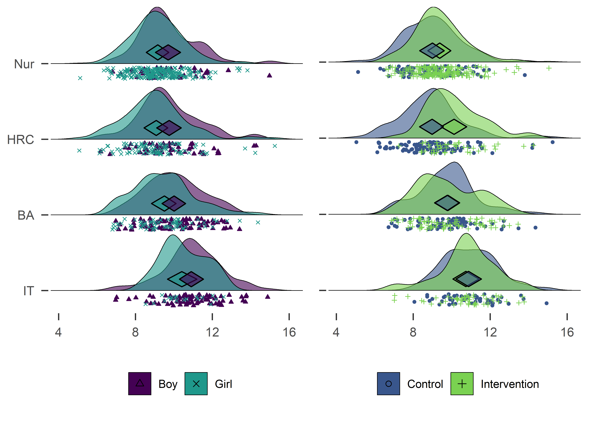

Breaking the distributions down by tracks, this is what we see: boys are more sedentary in all groups, but the IT group--which consists of mostly boys--is also most sedentary regardless of gender. Distributions between intervention and control groups exhibit some differences, but the most pronounced one can be seen in the HRC track.

<!-- Check for plot correctness -->

<!-- Show gender and group allocation of maximum and minimum values for each track. -->


# PA Determinants and BCT use

This section reports various hypothesised determinants of physical activity.

Code chunk below loads data written in the section named Tables and Estimators.


```r
load("./Rdata_files/ci_control.Rdata")
load("./Rdata_files/ci_intervention.Rdata")
load("./Rdata_files/ci_girls.Rdata")
load("./Rdata_files/ci_boys.Rdata")
load("./Rdata_files/vardatatable.Rdata")
load("./Rdata_files/ci_total.Rdata")
load("./Rdata_files/vardatatable_containing_edutrack.Rdata")
load("./Rdata_files/ci_edutrack.Rdata")
load("./Rdata_files/vardatatable_edutrack_only.Rdata")
load("./Rdata_files/ci_edutrack_only.Rdata")
load("./Rdata_files/vardatatable_sandwich.Rdata")
load("./Rdata_files/ci_sandwich.Rdata")
```

## Simple diamond plot

Diamonds depict 95% confidence intervals for means.


```r
PA_ci_girls <- ci_girls %>% dplyr::filter(diamondlabels %in% names(scales_T1) & grepl("PA_", diamondlabels) & !grepl("bct", diamondlabels))

PA_ci_boys <- ci_boys %>% dplyr::filter(diamondlabels %in% names(scales_T1) & grepl("PA_", diamondlabels) & !grepl("bct", diamondlabels))

PA_ci_intervention <- ci_intervention %>% dplyr::filter(diamondlabels %in% names(scales_T1) & grepl("PA_", diamondlabels) & !grepl("bct", diamondlabels))

PA_ci_control <- ci_control %>% dplyr::filter(diamondlabels %in% names(scales_T1) & grepl("PA_", diamondlabels) & !grepl("bct", diamondlabels))

ICClabels <- vardatatable_containing_edutrack %>% dplyr::filter(Variable %in% PA_ci_control$diamondlabels)

plot1 <- userfriendlyscience::diamondPlot(PA_ci_girls, color = viridis::viridis(4, end  =  0.8)[3], alpha=.3, yLabels = PA_ci_girls$diamondlabels, fixedSize = 0.3, xlab = NULL) +
  userfriendlyscience::diamondPlot(PA_ci_boys, returnLayerOnly = TRUE, color=viridis::viridis(4, end  =  0.8)[1], alpha=.3, fixedSize = 0.3) +
  scale_x_continuous(limits = c(1, 7), breaks = 1:7)

plot2 <- userfriendlyscience::diamondPlot(PA_ci_intervention, color = viridis::viridis(4, end  =  0.8)[4], alpha=.3, yLabels = c(rep("", length(PA_ci_girls$diamondlabels))), fixedSize = 0.3, xlab = NULL, ylab = NULL) +
  userfriendlyscience::diamondPlot(PA_ci_control, returnLayerOnly = TRUE, color = viridis::viridis(4, end  =  0.8)[2], alpha=.3, fixedSize = 0.3) +
  scale_x_continuous(limits = c(1, 7), breaks = 1:7)

grid::grid.newpage()
grid::grid.draw(cbind(ggplot2::ggplotGrob(plot1), ggplot2::ggplotGrob(plot2), size = "first"))
```

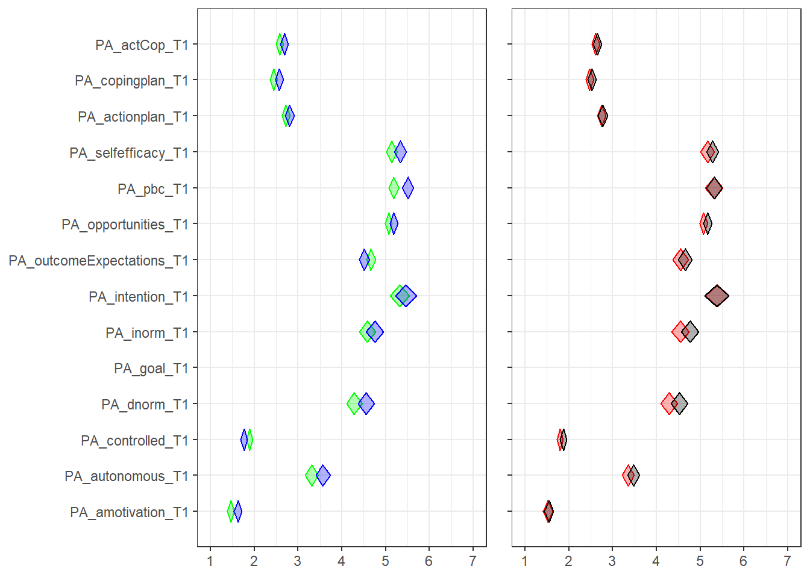<!-- -->

```r

# dat2 <- data.frame(ciLo = c(3, 2), mean = c(4, 2.5), ciHi = c(6, 3));
# userfriendlyscience::diamondPlot(dat1, color = 'blue', alpha=.3, yLabels = dat1$diamondlabels) +
# userfriendlyscience::diamondPlot(dat2, returnLayerOnly = TRUE, color='red', alpha=.3)
 
```

### Boys vs. girls {.tabset}

Diamonds depict 99% confidence intervals for means.

Note: action and coping planning on a scale from 1 to 4.


```r
load("./Rdata_files/ci_total.Rdata")

ci_total_diamond <- ci_total

item_names <- ci_total_diamond %>%
  dplyr::filter(grepl('PA_actionplan_T1|PA_copingplan_T1|PA_agreementDependentBCT_T1|PA_frequencyDependentBCT_T1|PA_amotivation_T1|PA_autonomous_T1|PA_controlled_T1|PA_goal_T1|PA_injunctiveNorm_T1|PA_descriptiveNorm_T1|PA_intention_T1|PA_outcomeExpectations_T1|PA_opportunities_T1|PA_perceivedBehaviouralControl_T1|PA_selfefficacy_T1|SB_descriptiveNorm_T1|SB_injunctiveNorm_T1|SB_intention_T1|SB_outcomeExpectations_T1', ci_total$diamondlabels)) %>% 
  dplyr::filter(diamondlabels != "PA_goal_T1") %>% 
  dplyr::select(diamondlabels) %>% 
  dplyr::pull() %>% 
  as.character()

plot_df <- df %>% 
  dplyr::select(intervention, girl, track, item_names)

colnames(plot_df) <- gsub('PA_actionplan_T1', 'PA action planning', colnames(plot_df))
colnames(plot_df) <- gsub('PA_copingplan_T1', 'PA coping planning', colnames(plot_df))
colnames(plot_df) <- gsub('PA_agreementDependentBCT_T1', 'PA agreement-BCTs', colnames(plot_df))
colnames(plot_df) <- gsub('PA_frequencyDependentBCT_T1', 'PA frequency-BCTs', colnames(plot_df))
colnames(plot_df) <- gsub('PA_amotivation_T1', 'PA amotivation', colnames(plot_df))
colnames(plot_df) <- gsub('PA_autonomous_T1', 'PA autonomous regulation', colnames(plot_df))
colnames(plot_df) <- gsub('PA_controlled_T1', 'PA controlled regulation', colnames(plot_df))
colnames(plot_df) <- gsub('PA_injunctiveNorm_T1', 'PA injunctive norm', colnames(plot_df))
colnames(plot_df) <- gsub('PA_descriptiveNorm_T1', 'PA descriptive norm', colnames(plot_df))
colnames(plot_df) <- gsub('PA_intention_T1', 'PA intention', colnames(plot_df))
colnames(plot_df) <- gsub('PA_outcomeExpectations_T1', 'PA outcome expectations', colnames(plot_df))
colnames(plot_df) <- gsub('PA_opportunities_T1', 'PA opportunities', colnames(plot_df))
colnames(plot_df) <- gsub('PA_perceivedBehaviouralControl_T1', 'PA perceived behavioural control', colnames(plot_df))
colnames(plot_df) <- gsub('PA_selfefficacy_T1', 'PA self-efficacy', colnames(plot_df))
colnames(plot_df) <- gsub('SB_descriptiveNorm_T1', 'SB descriptive norm', colnames(plot_df))
colnames(plot_df) <- gsub('SB_injunctiveNorm_T1', 'SB injunctive norm', colnames(plot_df))
colnames(plot_df) <- gsub('SB_intention_T1', 'SB intention', colnames(plot_df))
colnames(plot_df) <- gsub('SB_outcomeExpectations_T1', 'SB outcome expectations', colnames(plot_df))

plotlist <- list()

plot_df <- plot_df %>% dplyr::select(intervention, girl, track,
                                     "PA intention", 
                                     "PA perceived behavioural control",
                                     "PA self-efficacy", 
                                     "PA opportunities",
                                     "PA descriptive norm",
                                     "PA injunctive norm",
                                     "PA outcome expectations",
                                     "PA action planning",
                                     "PA coping planning",
                                     "PA autonomous regulation",
                                     "PA controlled regulation",
                                     "PA amotivation",
                                     "PA agreement-BCTs",
                                     "PA frequency-BCTs",
                                     "SB intention",
                                     "SB descriptive norm",
                                     "SB injunctive norm",
                                     "SB outcome expectations")

plot_df %>%
  dplyr::filter(!is.na(girl)) %>% 
  dplyr::mutate(girl = factor(girl)) %>%
  ufs::duoComparisonDiamondPlot(items = colnames(plot_df)[21:4], 
                                labels = colnames(plot_df)[21:4], 
                                compareBy = "girl",
                                comparisonColors = viridis::viridis(4, end  =  0.8)[c(3, 1)],
                                lineSize = 0.35,
                                alpha = 0.7,
                                dataAlpha = .05,
                                dataSize = .5,
                                fixedSize = .25,
                                showData = TRUE,
                                xbreaks = 1:7,
                                jitterWidth = .15,
                                jitterHeight = .3,
                                conf.level = c(0.99, 0.99))
```

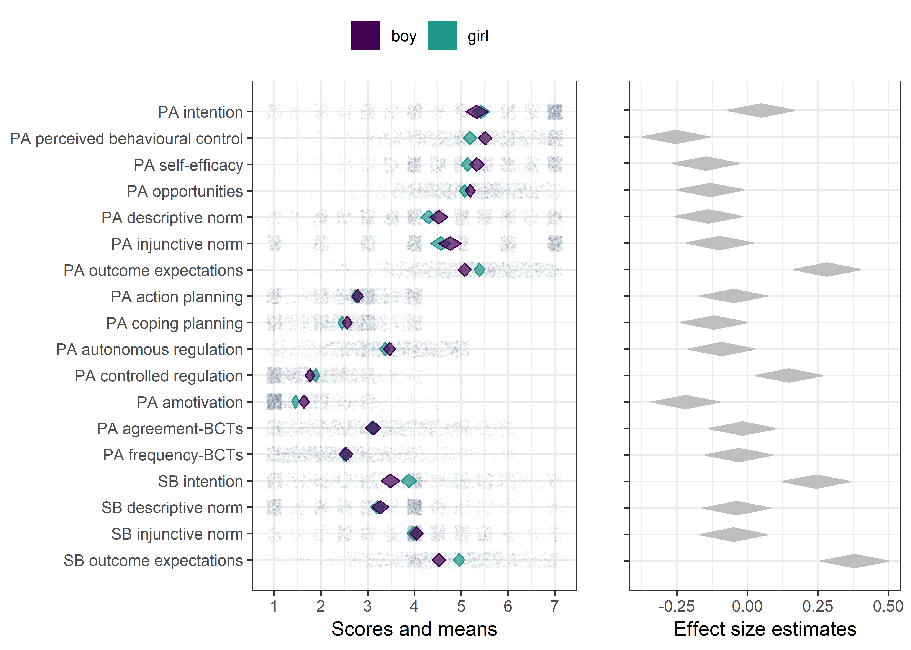<!-- -->


```r

for (i in c("Nur", "HRC", "BA", "IT")){
    
cat('\n\n####', i, '\n\n  ')
  
plotlist[[i]] <- plot_df %>%
  dplyr::mutate(girl = factor(girl)) %>% 
  dplyr::filter(track == i) %>%
  ufs::duoComparisonDiamondPlot(items = colnames(plot_df)[21:4], 
                                labels = colnames(plot_df)[21:4], 
                                compareBy = "girl",
                                comparisonColors = viridis::viridis(4, end  =  0.8)[c(3, 1)],
                                lineSize = 0.25,
                                dataAlpha = .1,
                                dataSize = 1,
                                fixedSize = .25,
                                showData = TRUE,
                                xbreaks = 1:7,
                                jitterWidth = .15,
                                jitterHeight = .3,
                                conf.level = c(0.99, 0.99))  
}
```


#### Nur 

  <!-- -->

#### HRC 

  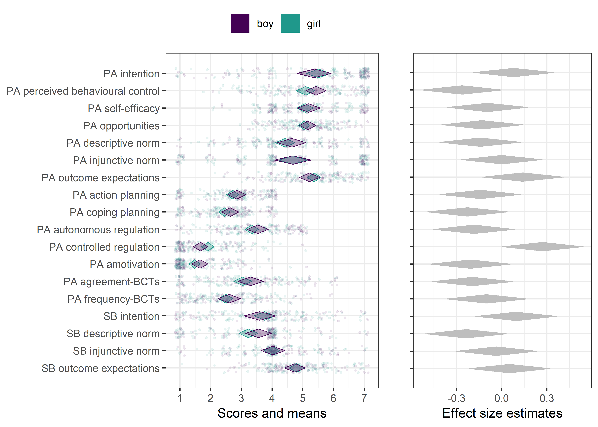<!-- -->

#### BA 

  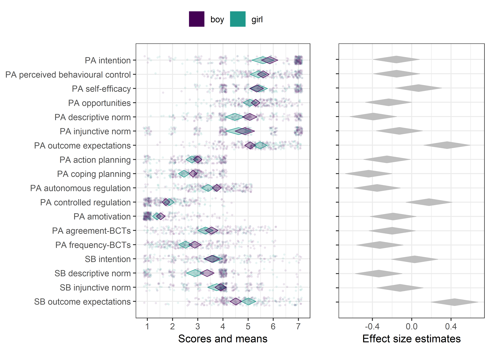<!-- -->

#### IT 

  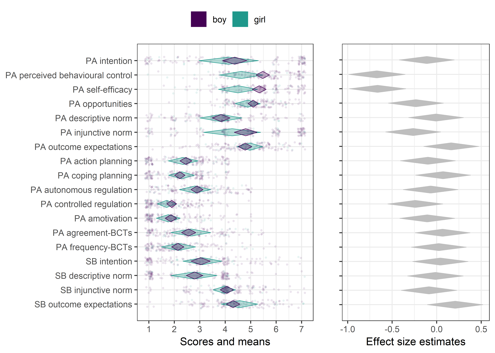<!-- -->

### Intervention vs. control {.tabset}

Diamonds depict 99% confidence intervals for means.


```r
plot_df %>% 
  dplyr::mutate(intervention = forcats::fct_recode(plot_df$intervention, "Control" = "0", "Intervention" = "1")) %>% 
  ufs::duoComparisonDiamondPlot(items = colnames(plot_df)[21:4], 
                                labels = colnames(plot_df)[21:4], 
                                compareBy = "intervention",
                                comparisonColors = viridis::viridis(4, end  =  0.8)[c(2, 4)],
                                lineSize = 0.35,
                                alpha = 0.7,
                                dataAlpha = .05,
                                dataSize = .5,
                                fixedSize = .25,
                                showData = TRUE,
                                xbreaks = 1:7,
                                jitterWidth = .15,
                                jitterHeight = .3,
                                conf.level = c(0.99, 0.99))
```

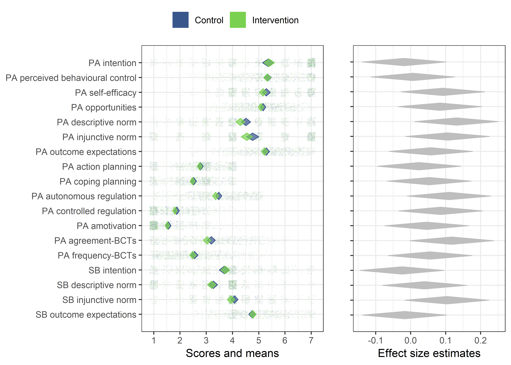<!-- -->


```r

for (i in c("Nur", "HRC", "BA", "IT")){
  
cat('\n\n####', i, '\n\n  ')
  
plotlist[[i]] <- plot_df %>% 
  dplyr::mutate(intervention = forcats::fct_recode(plot_df$intervention, "Control" = "0", "Intervention" = "1")) %>% 
  dplyr::filter(track == i) %>%
  ufs::duoComparisonDiamondPlot(items = colnames(plot_df)[21:4], 
                                                labels = colnames(plot_df)[21:4], 
                                                compareBy = "intervention",
                                                comparisonColors = viridis::viridis(4, end  =  0.8)[c(2, 4)],
                                                lineSize = 0.25,
                                                dataAlpha = .1,
                                                dataSize = 1,
                                                fixedSize = .25,
                                                showData = TRUE,
                                                xbreaks = 1:7,
                                                jitterWidth = .15,
                                                jitterHeight = .3)  

}
```


#### Nur 

  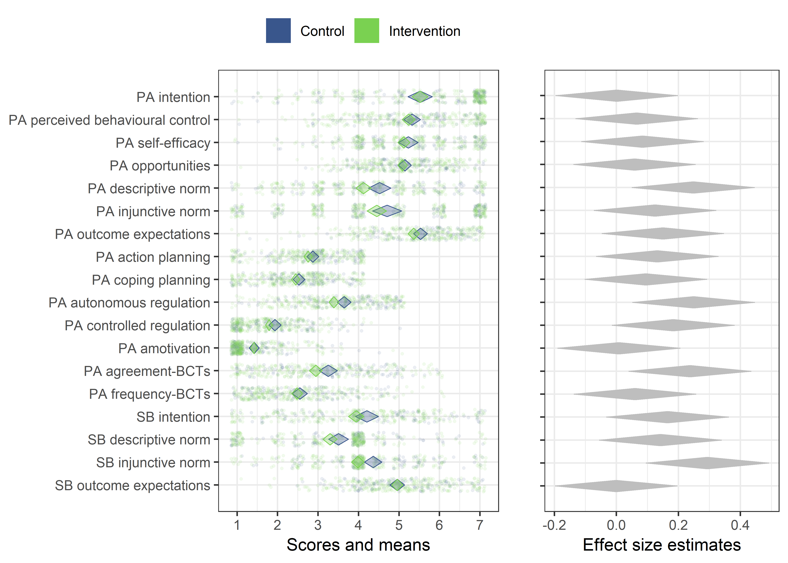<!-- -->

#### HRC 

  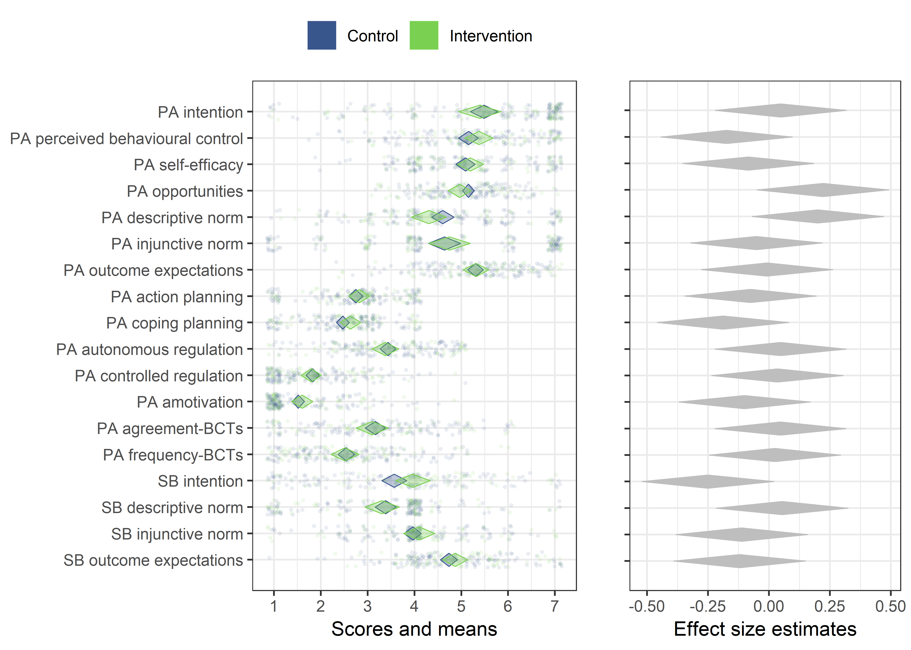<!-- -->

#### BA 

  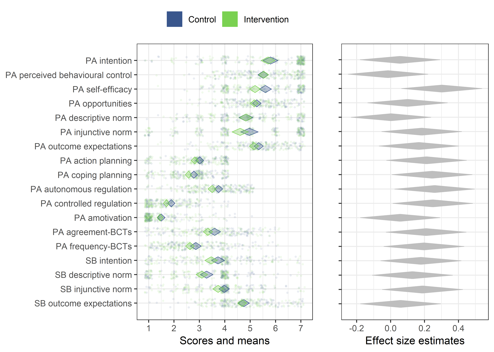<!-- -->

#### IT 

  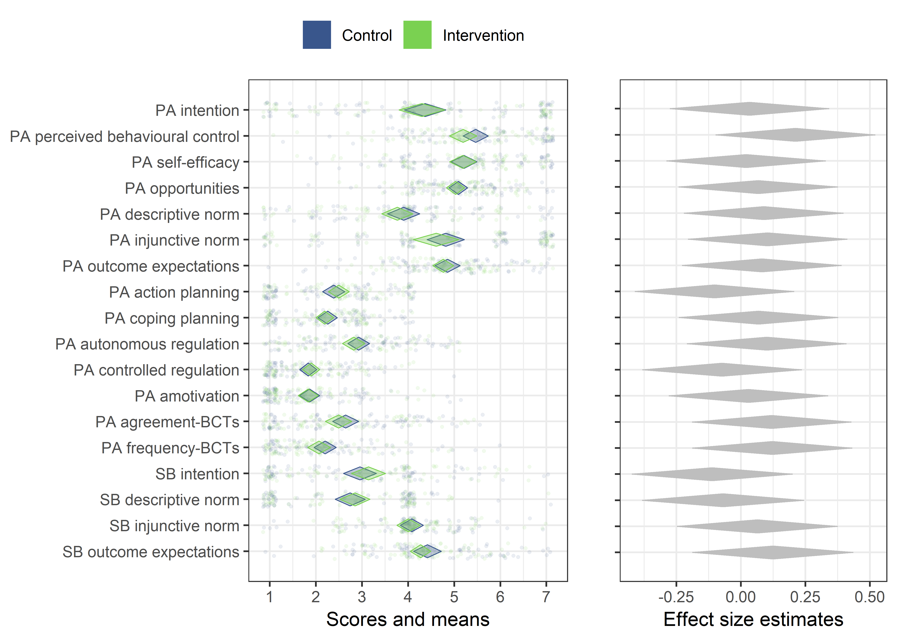<!-- -->


<a id="determinant-diamondplot"></a>

## Determinant plot featured in manuscript


```r

genderComparisonDiamonds <- plot_df %>%
  dplyr::filter(!is.na(girl)) %>% 
  dplyr::mutate(girl = factor(girl)) %>%
  ufs::duoComparisonDiamondPlot(items = colnames(plot_df)[21:4], 
                                labels = colnames(plot_df)[21:4], 
                                compareBy = "girl",
                                comparisonColors = viridis::viridis(4, end  =  0.8)[c(3, 1)],
                                lineSize = 0.35,
                                alpha = 0.7,
                                dataAlpha = .05,
                                dataSize = .5,
                                fixedSize = .25,
                                showData = TRUE,
                                drawPlot = FALSE,
                                xbreaks = 1:7,
                                jitterWidth = .15,
                                jitterHeight = .3,
                                conf.level = c(0.99, 0.99))

interventionComparisonDiamonds <- plot_df %>% 
  dplyr::mutate(intervention = forcats::fct_recode(plot_df$intervention, "Control" = "0", "Intervention" = "1")) %>% 
  ufs::duoComparisonDiamondPlot(items = colnames(plot_df)[21:4], 
                                labels = colnames(plot_df)[21:4], 
                                compareBy = "intervention",
                                comparisonColors = viridis::viridis(4, end  =  0.8)[c(2, 4)],
                                lineSize = 0.35,
                                alpha = 0.7,
                                dataAlpha = .05,
                                dataSize = .5,
                                fixedSize = .25,
                                showData = TRUE,
                                drawPlot = FALSE,
                                xbreaks = 1:7,
                                jitterWidth = .15,
                                jitterHeight = .3,
                                conf.level = c(0.99, 0.99))

gridExtra::grid.arrange(genderComparisonDiamonds, interventionComparisonDiamonds)
```

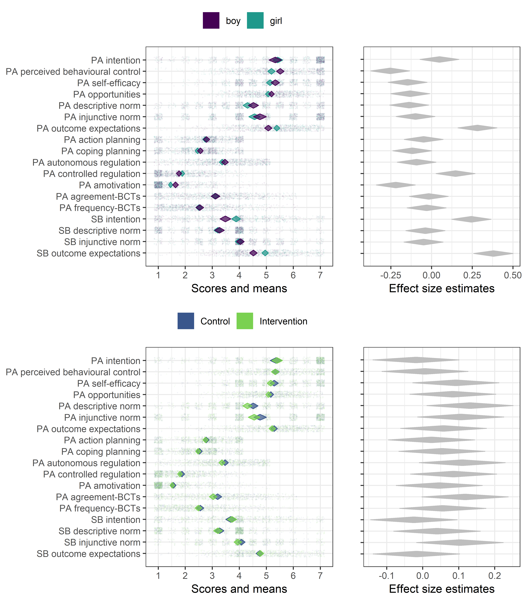<!-- -->

## Distributions of PA determinants

The sample had generally a high intention for physical activity, as well as positive outcome expectations, perceived behavioural control, self-efficacy and opportunities. Norms were distributed more flatly. Differences between girls and boys were most pronounced in perceived behavioral control, where girls indicated lower values than boys. As visual inspection indicates, this effect is not very large.


```r

plot1 <- df %>% dplyr::select(id,
                              intervention,
                              group,
                              school,
                              girl,
                              'PA intention' = PA_intention_T1,
                              'PA outcome\nexpectations' = PA_outcomeExpectations_T1,
                              'PA perceived\nbehavioural control' = PA_perceivedBehaviouralControl_T1,
                              'PA self efficacy' = PA_selfefficacy_T1,
                              'PA perceived\nopportunities' = PA_opportunities_T1,
                              'PA descriptive\nnorm' = PA_descriptiveNorm_T1)  %>%
  # dplyr::select(noquote(order(colnames(.)))) %>% # Orders columns alphabetically
  tidyr::gather(key = Variable, value = Value, 6:ncol(.), factor_key = TRUE) %>%
  ggplot2::ggplot(aes(y = Variable)) +
  ggridges::geom_density_ridges(aes(x = Value, colour = "black", 
                                    fill = paste(Variable, girl)), 
                                    alpha = 0.6, size = 0.25, 
                                    from = 1, to = 7, scale = 1) +
  labs(x = "",
       y = "") +
  scale_y_discrete(expand = c(0.01, 0)) +
  scale_x_continuous(expand = c(0.01, 0)) +
  ggridges::scale_fill_cyclical(breaks = c("PA descriptive\nnorm boy", "PA descriptive\nnorm girl"),
                                labels = c( 'PA descriptive\nnorm boy' = "Boy", 'PA descriptive\nnorm girl' = "Girl"),
                                values = viridis::viridis(4, end = 0.8)[c(1, 3)],
                                name = "", guide = guide_legend(override.aes = list(alpha = 1))) +
  ggridges::scale_colour_cyclical(values = "black") +
  ggridges::theme_ridges(grid = FALSE) +
  theme(legend.position="bottom", axis.text=element_text(size=10))

target = c(
"PA_intention_T1",
"PA_outcomeExpectations_T1",
"PA_perceivedBehaviouralControl_T1",
"PA_selfefficacy_T1",
"PA_opportunities_T1",
"PA_descriptiveNorm_T1")

PA_ci_girls <- ci_girls %>% dplyr::filter(diamondlabels %in% names(scales_T1) & 
                                     grepl("PA_intention_T1", diamondlabels) | 
                                     grepl("PA_outcomeExpectations_T1", diamondlabels) | 
                                     grepl("PA_perceivedBehaviouralControl_T1", diamondlabels) | 
                                     grepl("PA_selfefficacy_T1", diamondlabels) | 
                                     grepl("PA_opportunities_T1", diamondlabels) | 
                                     grepl("PA_descriptiveNorm_T1", diamondlabels))

PA_ci_girls <- PA_ci_girls[match(target, PA_ci_girls$diamondlabels), ]

PA_ci_boys <- ci_boys %>% dplyr::filter(diamondlabels %in% names(scales_T1) & 
                                     grepl("PA_intention_T1", diamondlabels) | 
                                     grepl("PA_outcomeExpectations_T1", diamondlabels) | 
                                     grepl("PA_perceivedBehaviouralControl_T1", diamondlabels) | 
                                     grepl("PA_selfefficacy_T1", diamondlabels) | 
                                     grepl("PA_opportunities_T1", diamondlabels) | 
                                     grepl("PA_descriptiveNorm_T1", diamondlabels))

PA_ci_boys <- PA_ci_boys[match(target, PA_ci_boys$diamondlabels), ]

plot1 <- plot1 + userfriendlyscience::diamondPlot(PA_ci_girls, returnLayerOnly = TRUE, lineColor = "black", color=viridis::viridis(4, end = 0.8)[3], 
                alpha=.6, fixedSize = 0.15, otherAxisCol = (1:length(target) + .2)) +
  userfriendlyscience::diamondPlot(PA_ci_boys, returnLayerOnly = TRUE, lineColor = "black", linetype = "solid", color=viridis::viridis(4, end = 0.8)[1],  
                alpha=.6, fixedSize = 0.15, otherAxisCol = (1:length(target) + .2))

plot2 <- df %>% dplyr::select(id,
                              intervention,
                              group,
                              school,
                              girl,
                              'PA intention' = PA_intention_T1,
                              'PA outcome\nexpectations' = PA_outcomeExpectations_T1,
                              'PA perceived\nbehavioural control' = PA_perceivedBehaviouralControl_T1,
                              'PA self efficacy' = PA_selfefficacy_T1,
                              'PA perceived\nopportunities' = PA_opportunities_T1,
                              'PA descriptive\nnorm' = PA_descriptiveNorm_T1)  %>%
  # dplyr::select(noquote(order(colnames(.)))) %>% # Orders columns alphabetically
  tidyr::gather(key = Variable, value = Value, 6:ncol(.), factor_key = TRUE) %>%
  ggplot2::ggplot(aes(y = Variable)) +
  ggridges::geom_density_ridges(aes(x = Value, colour = "black", 
                                    fill = paste(Variable, intervention)), 
                                    alpha = 0.75, size = 0.25, from = 1, to = 7, scale = 1) +
  labs(x = "",
       y = "") +
  scale_y_discrete(expand = c(0.01, 0), labels = NULL) +
  scale_x_continuous(expand = c(0.01, 0)) +
  ggridges::scale_fill_cyclical(breaks = c("PA descriptive\nnorm 0", "PA descriptive\nnorm 1"),
                                labels = c( 'PA descriptive\nnorm 0' = "Control", 'PA descriptive\nnorm 1' = "Intervention"),
                                values = viridis::viridis(4, end = 0.8)[c(2, 4)],
                                name = "", guide = guide_legend(override.aes = list(alpha = 1))) +
  ggridges::scale_colour_cyclical(values = "black") +
  ggridges::theme_ridges(grid = FALSE) +
  theme(legend.position="bottom", axis.text=element_text(size=10))

PA_ci_intervention <- ci_intervention %>% dplyr::filter(diamondlabels %in% names(scales_T1) & 
                                     grepl("PA_intention_T1", diamondlabels) | 
                                     grepl("PA_outcomeExpectations_T1", diamondlabels) | 
                                     grepl("PA_perceivedBehaviouralControl_T1", diamondlabels) | 
                                     grepl("PA_selfefficacy_T1", diamondlabels) | 
                                     grepl("PA_opportunities_T1", diamondlabels) | 
                                     grepl("PA_descriptiveNorm_T1", diamondlabels))

PA_ci_intervention <- PA_ci_intervention[match(target, PA_ci_intervention$diamondlabels), ]

PA_ci_control <- ci_control %>% dplyr::filter(diamondlabels %in% names(scales_T1) & 
                                     grepl("PA_intention_T1", diamondlabels) | 
                                     grepl("PA_outcomeExpectations_T1", diamondlabels) | 
                                     grepl("PA_perceivedBehaviouralControl_T1", diamondlabels) | 
                                     grepl("PA_selfefficacy_T1", diamondlabels) | 
                                     grepl("PA_opportunities_T1", diamondlabels) | 
                                     grepl("PA_descriptiveNorm_T1", diamondlabels))

PA_ci_control <- PA_ci_control[match(target, PA_ci_control$diamondlabels), ]

plot2 <- plot2 + 
  userfriendlyscience::diamondPlot(PA_ci_intervention, returnLayerOnly = TRUE, lineColor = "black", color=viridis::viridis(4, end = 0.8)[4],
              alpha=.6, fixedSize = 0.15, otherAxisCol = (1:length(target) + .2)) +
  userfriendlyscience::diamondPlot(PA_ci_control, returnLayerOnly = TRUE, lineColor = "black", color=viridis::viridis(4, end = 0.8)[2], 
              alpha=.6, fixedSize = 0.15, otherAxisCol = (1:length(target) + .2))

plot1 + plot2 
```

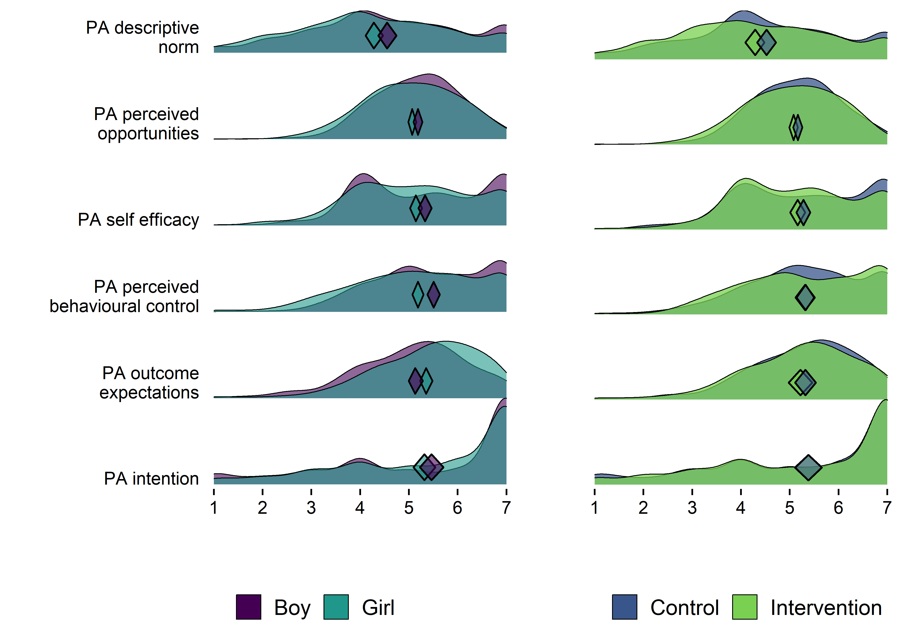

```r

# Test that the legend is right; descriptive norms are smaller for girls
df %>% group_by(girl) %>% summarise(mean = mean(PA_descriptiveNorm_T1, na.rm = TRUE)) %>% dplyr::filter(girl == "girl") %>% dplyr::select(mean) < df %>% group_by(girl) %>% summarise(mean = mean(PA_descriptiveNorm_T1, na.rm = TRUE)) %>% dplyr::filter(girl == "boy") %>% dplyr::select(mean)
##      mean
## [1,] TRUE

df %>% group_by(intervention) %>% summarise(mean = mean(PA_descriptiveNorm_T1, na.rm = TRUE)) %>% dplyr::filter(intervention == "1") %>% dplyr::select(mean) < df %>% group_by(intervention) %>% summarise(mean = mean(PA_descriptiveNorm_T1, na.rm = TRUE)) %>% dplyr::filter(intervention == "0") %>% dplyr::select(mean)
##      mean
## [1,] TRUE
```


```r

plot1 <- df %>% dplyr::select(id,
  intervention,
  group,
  school,
  girl,
'PA action and\ncoping planning' = PA_actCop_T1,
'PA intention' = PA_intention_T1,
'PA outcome\nexpectations' = PA_outcomeExpectations_T1,
'PA perceived\nbehavioural control' = PA_perceivedBehaviouralControl_T1,
'PA self efficacy' = PA_selfefficacy_T1,
'PA perceived\nopportunities' = PA_opportunities_T1,
'PA descriptive\nnorm' = PA_descriptiveNorm_T1,
'PA injunctive\nnorm' = PA_injunctiveNorm_T1)  %>%
  # dplyr::select(noquote(order(colnames(.)))) %>% # Orders columns alphabetically
  tidyr::gather(key = Variable, value = Value, 6:ncol(.), factor_key = TRUE) %>% 
  ggplot2::ggplot(aes(y = Variable)) +
  ggridges::geom_density_ridges(aes(x = Value,
                                    colour = "black",
                                    fill = paste(Variable, girl),
                                    point_color = girl,
                                    point_fill = girl,
                                    point_shape = girl,
                                    point_size = girl,
                                    point_alpha = girl),
                                scale = .5, alpha = .6, size = 0.25,
                                from = 1, to = 7,
                                position = position_raincloud(width = 0.03, height = 0.5),
                                jittered_points = TRUE,
                                point_size = 1) + 
    labs(x = NULL,
       y = NULL) +
  scale_y_discrete(expand = c(0.01, 0)) +
  scale_x_continuous(expand = c(0.01, 0)) +
  ggridges::scale_fill_cyclical(
                      labels = c('PA action and\ncoping planning boy' = "Boy", 'PA action and\ncoping planning girl' = "Girl"),
                      values = viridis::viridis(4, end = 0.8)[c(1, 3)],
                      name = "", 
                      guide = guide_legend(override.aes = list(alpha = 1, 
                                                               point_shape = c(24, 25),
                                                               point_size = 2))) +
  ggridges::scale_colour_cyclical(values = "black") +
  ggridges::theme_ridges(grid = FALSE) +
  ggridges::scale_discrete_manual(aesthetics = "point_color", 
                                  values = viridis::viridis(4, end = 0.8)[c(1, 3)],
                                  guide = "none") +
  ggridges::scale_discrete_manual(aesthetics = "point_fill",
                                  values = viridis::viridis(4, end = 0.8)[c(1, 3)],
                                  guide = "none") +
  ggridges::scale_discrete_manual(aesthetics = "point_shape", 
                                  values = c(24, 25),
                                  guide = "none") +
  ggridges::scale_discrete_manual(aesthetics = "point_size", 
                                  values = c(.75, .75),
                                  guide = "none") +
  ggridges::scale_discrete_manual(aesthetics = "point_alpha", 
                                  values = c(0.1, 0.1),
                                  guide = "none") +
  papaja::theme_apa() +
  theme(legend.position = "bottom")

plot2 <- df %>% dplyr::select(id,
  intervention,
  group,
  school,
  girl,
'PA action and\ncoping planning' = PA_actCop_T1,
'PA intention' = PA_intention_T1,
'PA outcome\nexpectations' = PA_outcomeExpectations_T1,
'PA perceived\nbehavioural control' = PA_perceivedBehaviouralControl_T1,
'PA self efficacy' = PA_selfefficacy_T1,
'PA perceived\nopportunities' = PA_opportunities_T1,
'PA descriptive\nnorm' = PA_descriptiveNorm_T1,
'PA injunctive\nnorm' = PA_injunctiveNorm_T1) %>%
  # dplyr::select(noquote(order(colnames(.)))) %>% # Orders columns alphabetically
  tidyr::gather(key = Variable, value = Value, 6:ncol(.), factor_key = TRUE) %>% 
  ggplot2::ggplot(aes(y = Variable)) +
  ggridges::geom_density_ridges(aes(x = Value,
                                    colour = "black",
                                    fill = paste(Variable, intervention),
                                    point_color = intervention,
                                    point_fill = intervention,
                                    point_shape = intervention,
                                    point_size = intervention,
                                    point_alpha = intervention),
                                scale = .5, alpha = .6, size = 0.25,
                                from = 1, to = 7,
                                position = position_raincloud(width = 0.03, height = 0.5),
                                jittered_points = TRUE,
                                point_size = 1) + 
    labs(x = NULL,
       y = NULL) +
  scale_y_discrete(expand = c(0.01, 0), labels = NULL) +
  scale_x_continuous(expand = c(0.01, 0)) +
  ggridges::scale_fill_cyclical(
                      labels = c('PA action and\ncoping planning 0' = "Control", 'PA action and\ncoping planning 1' = "intervention"),
                      values = viridis::viridis(4, end = 0.8)[c(2, 4)],
                      name = "", 
                      guide = guide_legend(override.aes = list(alpha = 1, 
                                                               point_shape = c(21, 22),
                                                               point_size = 2))) +
  ggridges::scale_colour_cyclical(values = "black") +
  ggridges::theme_ridges(grid = FALSE) +
  ggridges::scale_discrete_manual(aesthetics = "point_color", 
                                  values = viridis::viridis(4, end = 0.8)[c(2, 4)],
                                  guide = "none") +
  ggridges::scale_discrete_manual(aesthetics = "point_fill",
                                  values = viridis::viridis(4, end = 0.8)[c(2, 4)],
                                  guide = "none") +
  ggridges::scale_discrete_manual(aesthetics = "point_shape", 
                                  values = c(21, 22),
                                  guide = "none") +
  ggridges::scale_discrete_manual(aesthetics = "point_size", 
                                  values = c(.75, .75),
                                  guide = "none") +
  ggridges::scale_discrete_manual(aesthetics = "point_alpha", 
                                  values = c(0.1, 0.1),
                                  guide = "none") +
  papaja::theme_apa() +
  theme(legend.position = "bottom")

target = c("PA_actCop_T1",
"PA_intention_T1",
"PA_outcomeExpectations_T1",
"PA_perceivedBehaviouralControl_T1",
"PA_selfefficacy_T1",
"PA_opportunities_T1",
"PA_descriptiveNorm_T1",
"PA_injunctiveNorm_T1")

PA_ci_girls <- ci_girls %>% dplyr::filter(diamondlabels %in% names(scales_T1) & 
                                     grepl("PA_actCop_T1", diamondlabels) | 
                                     grepl("PA_intention_T1", diamondlabels) | 
                                     grepl("PA_outcomeExpectations_T1", diamondlabels) | 
                                     grepl("PA_perceivedBehaviouralControl_T1", diamondlabels) | 
                                     grepl("PA_selfefficacy_T1", diamondlabels) | 
                                     grepl("PA_opportunities_T1", diamondlabels) | 
                                     grepl("PA_descriptiveNorm_T1", diamondlabels) | 
                                     grepl("PA_injunctiveNorm_T1", diamondlabels))

PA_ci_girls <- PA_ci_girls[match(target, PA_ci_girls$diamondlabels), ]

PA_ci_boys <- ci_boys %>% dplyr::filter(diamondlabels %in% names(scales_T1) & 
                                     grepl("PA_actCop_T1", diamondlabels) | 
                                     grepl("PA_intention_T1", diamondlabels) | 
                                     grepl("PA_outcomeExpectations_T1", diamondlabels) | 
                                     grepl("PA_perceivedBehaviouralControl_T1", diamondlabels) | 
                                     grepl("PA_selfefficacy_T1", diamondlabels) | 
                                     grepl("PA_opportunities_T1", diamondlabels) | 
                                     grepl("PA_descriptiveNorm_T1", diamondlabels) | 
                                     grepl("PA_injunctiveNorm_T1", diamondlabels))

PA_ci_boys <- PA_ci_boys[match(target, PA_ci_boys$diamondlabels), ]

plot1 <- plot1 + 
  userfriendlyscience::diamondPlot(PA_ci_girls, returnLayerOnly = TRUE, linecolor = "black", color=viridis::viridis(4, end = 0.8)[1],# 'blue', 
                alpha=.95, fixedSize = 0.15, otherAxisCol = (1:length(target) + .2)) +
  userfriendlyscience::diamondPlot(PA_ci_boys, returnLayerOnly = TRUE, lineColor = "black", color=viridis::viridis(4, end = 0.8)[3], #'green', 
                alpha=.95, fixedSize = 0.15, otherAxisCol = (1:length(target) + .2))

PA_ci_intervention <- ci_intervention %>% dplyr::filter(diamondlabels %in% names(scales_T1) & 
                                     grepl("PA_actCop_T1", diamondlabels) | 
                                     grepl("PA_intention_T1", diamondlabels) | 
                                     grepl("PA_outcomeExpectations_T1", diamondlabels) | 
                                     grepl("PA_perceivedBehaviouralControl_T1", diamondlabels) | 
                                     grepl("PA_selfefficacy_T1", diamondlabels) | 
                                     grepl("PA_opportunities_T1", diamondlabels) | 
                                     grepl("PA_descriptiveNorm_T1", diamondlabels) | 
                                     grepl("PA_injunctiveNorm_T1", diamondlabels))

PA_ci_intervention <- PA_ci_intervention[match(target, PA_ci_intervention$diamondlabels), ]

PA_ci_control <- ci_control %>% dplyr::filter(diamondlabels %in% names(scales_T1) & 
                                     grepl("PA_actCop_T1", diamondlabels) | 
                                     grepl("PA_intention_T1", diamondlabels) | 
                                     grepl("PA_outcomeExpectations_T1", diamondlabels) | 
                                     grepl("PA_perceivedBehaviouralControl_T1", diamondlabels) | 
                                     grepl("PA_selfefficacy_T1", diamondlabels) | 
                                     grepl("PA_opportunities_T1", diamondlabels) | 
                                     grepl("PA_descriptiveNorm_T1", diamondlabels) | 
                                     grepl("PA_injunctiveNorm_T1", diamondlabels))

PA_ci_control <- PA_ci_control[match(target, PA_ci_control$diamondlabels), ]

plot2 <- plot2 + 
  userfriendlyscience::diamondPlot(PA_ci_intervention, returnLayerOnly = TRUE, lineColor = "black", color=viridis::viridis(4, end = 0.8)[4],# 'blue',
              alpha=.95, fixedSize = 0.15, otherAxisCol = (1:length(target) + .2)) +
  userfriendlyscience::diamondPlot(PA_ci_control, returnLayerOnly = TRUE, lineColor = "black", color=viridis::viridis(4, end = 0.8)[2], #'red', 
              alpha=.95, fixedSize = 0.15, otherAxisCol = (1:length(target) + .2))

plot1 + plot2
```

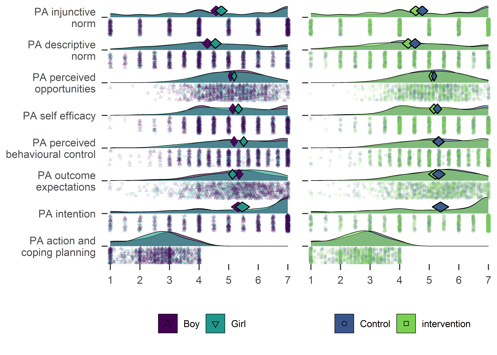<!-- -->

## Distributions of PA opportunity items

(Nb. these single likert-scale items would be better represented with a histogram)


```r

plot1 <- df %>% dplyr::select(id,
  intervention,
  group,
  school,
  girl,
  "enough money" = PA_opportunities_01_T1,
  "biking and hiking tracks" = PA_opportunities_02_T1,
  "has PA gear" = PA_opportunitiesReverseCoded_03_T1,
  "facilities (e.g. gyms)" = PA_opportunities_04_T1,
  "PA gear no obstacle" = PA_opportunities_05_T1,
  "life not too busy" = PA_opportunitiesReverseCoded_06_T1,
  "opportunities at home" = PA_opportunities_07_T1,  
  "religion or family" = PA_opportunitiesReverseCoded_08_T1) %>%
  # dplyr::select(noquote(order(colnames(.)))) %>% # Orders columns alphabetically
  tidyr::gather(key = Variable, value = Value, 6:ncol(.), factor_key = TRUE) %>% 
  ggplot2::ggplot(aes(y = Variable)) +
  ggridges::geom_density_ridges(aes(x = Value,
                                    colour = "black",
                                    fill = paste(Variable, girl),
                                    point_color = girl,
                                    point_fill = girl,
                                    point_shape = girl,
                                    point_size = girl,
                                    point_alpha = girl),
                                scale = 1.25, alpha = .6, size = 0.25,
                                from = 1, to = 7,
                                position = position_raincloud(width = 0.03, height = 0.15),
                                jittered_points = TRUE,
                                point_size = .5) + 
    labs(x = NULL,
       y = NULL) +
  scale_y_discrete(expand = c(0.01, 0)) +
  scale_x_continuous(expand = c(0.01, 0)) +
  ggridges::scale_fill_cyclical(
                      labels = c('biking and hiking tracks boy' = "Boy", 'biking and hiking tracks girl' = "Girl"),
                      values = viridis::viridis(4, end = 0.8)[c(1, 3)],
                      name = "", 
                      guide = guide_legend(override.aes = list(alpha = 1, 
                                                               point_shape = c(24, 25),
                                                               point_size = 2))) +
  ggridges::scale_colour_cyclical(values = "black") +
  ggridges::theme_ridges(grid = FALSE) +
  ggridges::scale_discrete_manual(aesthetics = "point_color", 
                                  values = viridis::viridis(4, end = 0.8)[c(1, 3)],
                                  guide = "none") +
  ggridges::scale_discrete_manual(aesthetics = "point_fill",
                                  values = viridis::viridis(4, end = 0.8)[c(1, 3)],
                                  guide = "none") +
  ggridges::scale_discrete_manual(aesthetics = "point_shape", 
                                  values = c(24, 25),
                                  guide = "none") +
  ggridges::scale_discrete_manual(aesthetics = "point_size", 
                                  values = c(.75, .75),
                                  guide = "none") +
  ggridges::scale_discrete_manual(aesthetics = "point_alpha", 
                                  values = c(0.1, 0.1),
                                  guide = "none") +
  papaja::theme_apa() +
  theme(legend.position = "bottom", 
        axis.ticks = element_blank())

plot2 <- df %>% dplyr::select(id,
  intervention,
  group,
  school,
  girl,
  "enough money" = PA_opportunities_01_T1,
  "biking and hiking tracks" = PA_opportunities_02_T1,
  "has PA gear" = PA_opportunitiesReverseCoded_03_T1,
  "facilities (e.g. gyms)" = PA_opportunities_04_T1,
  "PA gear no obstacle" = PA_opportunities_05_T1,
  "life not too busy" = PA_opportunitiesReverseCoded_06_T1,
  "opportunities at home" = PA_opportunities_07_T1,  
  "religion or family" = PA_opportunitiesReverseCoded_08_T1) %>%
  # dplyr::select(noquote(order(colnames(.)))) %>% # Orders columns alphabetically
  tidyr::gather(key = Variable, value = Value, 6:ncol(.), factor_key = TRUE) %>% 
  ggplot2::ggplot(aes(y = Variable)) +
  ggridges::geom_density_ridges(aes(x = Value,
                                    colour = "black",
                                    fill = paste(Variable, intervention),
                                    point_color = intervention,
                                    point_fill = intervention,
                                    point_shape = intervention,
                                    point_size = intervention,
                                    point_alpha = intervention),
                                scale = 1.25, alpha = .6, size = 0.25,
                                from = 1, to = 7,
                                position = position_raincloud(width = 0.03, height = 0.15),
                                jittered_points = TRUE,
                                point_size = .5) + 
    labs(x = NULL,
       y = NULL) +
  scale_y_discrete(expand = c(0.01, 0), labels = NULL) +
  scale_x_continuous(expand = c(0.01, 0)) +
  ggridges::scale_fill_cyclical(
                      labels = c('biking and hiking tracks 0' = "Control", 'biking and hiking tracks 1' = "Intervention"),
                      values = viridis::viridis(4, end = 0.8)[c(2, 4)],
                      name = "", 
                      guide = guide_legend(override.aes = list(alpha = 1, 
                                                               point_shape = c(21, 22),
                                                               point_size = 2))) +
  ggridges::scale_colour_cyclical(values = "black") +
  ggridges::theme_ridges(grid = FALSE) +
  ggridges::scale_discrete_manual(aesthetics = "point_color", 
                                  values = viridis::viridis(4, end = 0.8)[c(2, 4)],
                                  guide = "none") +
  ggridges::scale_discrete_manual(aesthetics = "point_fill",
                                  values = viridis::viridis(4, end = 0.8)[c(2, 4)],
                                  guide = "none") +
  ggridges::scale_discrete_manual(aesthetics = "point_shape", 
                                  values = c(21, 22),
                                  guide = "none") +
  ggridges::scale_discrete_manual(aesthetics = "point_size", 
                                  values = c(.75, .75),
                                  guide = "none") +
  ggridges::scale_discrete_manual(aesthetics = "point_alpha", 
                                  values = c(0.1, 0.1),
                                  guide = "none") +
  papaja::theme_apa() +
  theme(legend.position = "bottom", 
        axis.ticks = element_blank())

plot1 + plot2
```

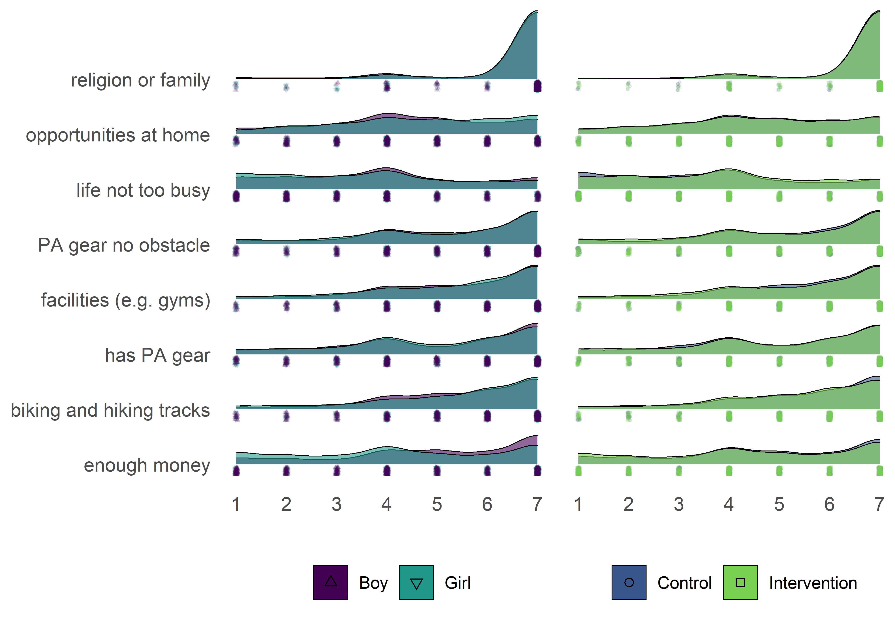<!-- -->


## Distributions of SB determinants


```r

# Draw plot with gender densities

plot1 <- df %>% dplyr::select(id,
  intervention,
  group,
  school,
  girl,
'SB intention' = SB_intention_T1,
'SB outcome\nexpectations' = SB_outcomeExpectations_T1,
'SB self-efficacy\nand perceived\nbehavioural control' = SB_selfEfficacyperceivedBehaviouralControl_T1,
'SB descriptive\nnorm' = SB_descriptiveNorm_T1,
'SB injunctive\nnorm' = SB_injunctiveNorm_T1)  %>%
  # dplyr::select(noquote(order(colnames(.)))) %>% # Orders columns alphabetically
  tidyr::gather(key = Variable, value = Value, 6:ncol(.)) %>% 
  ggplot2::ggplot(aes(y = Variable)) +
  ggridges::geom_density_ridges(aes(x = Value,
                                    colour = "black",
                                    fill = paste(Variable, girl),
                                    point_color = girl,
                                    point_fill = girl,
                                    point_shape = girl,
                                    point_size = girl,
                                    point_alpha = girl),
                                scale = .5, alpha = .6, size = 0.25,
                                from = 1, to = 7,
                                position = position_raincloud(width = 0.03, height = 0.5),
                                jittered_points = TRUE,
                                point_size = 1) + 
    labs(x = NULL,
       y = NULL) +
  scale_y_discrete(expand = c(0.01, 0)) +
  scale_x_continuous(expand = c(0.01, 0)) +
  ggridges::scale_fill_cyclical(
                      labels = c('SB descriptive\nnorm boy' = "Boy", 'SB descriptive\nnorm girl' = "Girl"),
                      values = viridis::viridis(4, end = 0.8)[c(1, 3)],
                      name = "", 
                      guide = guide_legend(override.aes = list(alpha = 1, 
                                                               point_shape = c(24, 25),
                                                               point_size = 2))) +
  ggridges::scale_colour_cyclical(values = "black") +
  ggridges::theme_ridges(grid = FALSE) +
  ggridges::scale_discrete_manual(aesthetics = "point_color", 
                                  values = viridis::viridis(4, end = 0.8)[c(1, 3)],
                                  guide = "none") +
  ggridges::scale_discrete_manual(aesthetics = "point_fill",
                                  values = viridis::viridis(4, end = 0.8)[c(1, 3)],
                                  guide = "none") +
  ggridges::scale_discrete_manual(aesthetics = "point_shape", 
                                  values = c(24, 25),
                                  guide = "none") +
  ggridges::scale_discrete_manual(aesthetics = "point_size", 
                                  values = c(.75, .75),
                                  guide = "none") +
  ggridges::scale_discrete_manual(aesthetics = "point_alpha", 
                                  values = c(0.1, 0.1),
                                  guide = "none") +
  papaja::theme_apa() +
  theme(legend.position = "bottom")

plot2 <- df %>% dplyr::select(id,
  intervention,
  group,
  school,
  girl,
'SB intention' = SB_intention_T1,
'SB outcome\nexpectations' = SB_outcomeExpectations_T1,
'SB self-efficacy\nand perceived\nbehavioural control' = SB_selfEfficacyperceivedBehaviouralControl_T1,
'SB descriptive\nnorm' = SB_descriptiveNorm_T1,
'SB injunctive\nnorm' = SB_injunctiveNorm_T1)  %>%
  # dplyr::select(noquote(order(colnames(.)))) %>% # Orders columns alphabetically
  tidyr::gather(key = Variable, value = Value, 6:ncol(.)) %>% 
  ggplot2::ggplot(aes(y = Variable)) +
  ggridges::geom_density_ridges(aes(x = Value,
                                    colour = "black",
                                    fill = paste(Variable, intervention),
                                    point_color = intervention,
                                    point_fill = intervention,
                                    point_shape = intervention,
                                    point_size = intervention,
                                    point_alpha = intervention),
                                scale = .5, alpha = .6, size = 0.25,
                                from = 1, to = 7,
                                position = position_raincloud(width = 0.03, height = 0.5),
                                jittered_points = TRUE,
                                point_size = 1) + 
    labs(x = NULL,
       y = NULL) +
  scale_y_discrete(expand = c(0.01, 0), labels = NULL) +
  scale_x_continuous(expand = c(0.01, 0)) +
  ggridges::scale_fill_cyclical(
                      labels = c('SB descriptive\nnorm 0' = "Control", 'SB descriptive\nnorm 1' = "intervention"),
                      values = viridis::viridis(4, end = 0.8)[c(2, 4)],
                      name = "", 
                      guide = guide_legend(override.aes = list(alpha = 1, 
                                                               point_shape = c(21, 22),
                                                               point_size = 2))) +
  ggridges::scale_colour_cyclical(values = "black") +
  ggridges::theme_ridges(grid = FALSE) +
  ggridges::scale_discrete_manual(aesthetics = "point_color", 
                                  values = viridis::viridis(4, end = 0.8)[c(2, 4)],
                                  guide = "none") +
  ggridges::scale_discrete_manual(aesthetics = "point_fill",
                                  values = viridis::viridis(4, end = 0.8)[c(2, 4)],
                                  guide = "none") +
  ggridges::scale_discrete_manual(aesthetics = "point_shape", 
                                  values = c(21, 22),
                                  guide = "none") +
  ggridges::scale_discrete_manual(aesthetics = "point_size", 
                                  values = c(.75, .75),
                                  guide = "none") +
  ggridges::scale_discrete_manual(aesthetics = "point_alpha", 
                                  values = c(0.1, 0.1),
                                  guide = "none") +
  papaja::theme_apa() +
  theme(legend.position = "bottom")

plot1 + plot2
```

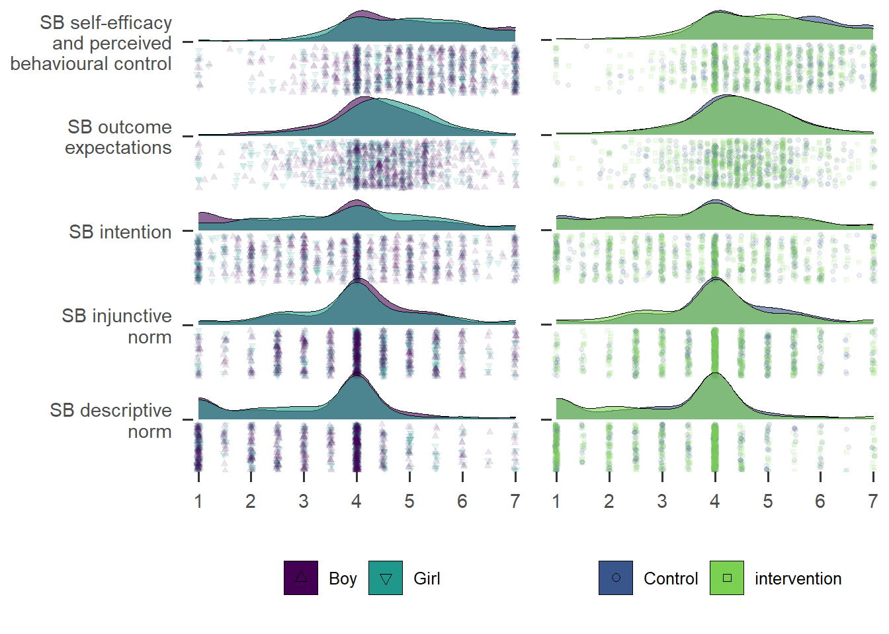<!-- -->

## PA motivation

The participants in control and intervention groups, as well as boys and girls, reported on PA motivation similarly. Averages describe the variables poorly, as autonomous motivation (consisting of intrinsic, integrated and identified regulation) is relatively flat, whereas controlled motivation (consisting of introjected and extrinsic regulation), as well as amotivation are highly skewed. 


```r
regulations.df <- df %>% dplyr::select(
  id,
  intervention,
  group,
  school,
  girl,
  PA_amotivation_02_T1,
  PA_amotivation_01_T1,
  PA_amotivation_03_T1,
  PA_amotivation_04_T1,
  PA_extrinsic_01_T1,
  PA_extrinsic_02_T1,
  PA_extrinsic_03_T1,
  PA_introjected_01_T1,
  PA_introjected_02_T1,
  PA_identified_01_T1,
  PA_identified_02_T1,
  PA_identified_03_T1,
  PA_integrated_01_T1, 
  PA_integrated_02_T1,
  PA_integrated_03_T1, 
  PA_intrinsic_01_T1,
  PA_intrinsic_02_T1,
  PA_intrinsic_03_T1)


motiGirls <- regulations.df %>%
 tidyr::gather(key = Variable, value = Value, PA_amotivation_02_T1:ncol(.)) %>%
  filter(girl == "girl") %>% 
 ggplot(aes(x = Value, y = Variable, group = Variable)) +
  ggridges::geom_density_ridges2(aes(fill = Variable), stat = "binline", binwidth = 1, scale = 0.95) +
  scale_x_continuous(breaks = c(1:6), expand = c(0, 0),
                     name = "") +
  scale_y_discrete(expand = c(0.01, 0), name = "", labels = NULL) +
  ggridges::scale_fill_cyclical(values = c("darkolivegreen2", "darkolivegreen4")) +
  labs(title = "Girls") +
  guides(y = "none") +
  ggridges::theme_ridges(grid = FALSE) +
  theme(axis.title.x = element_text(hjust = 0.5),
        axis.title.y = element_text(hjust = 0.5),
        plot.title = element_text(hjust = 0.5),
        axis.text=element_text(size=10)) +
coord_cartesian(xlim = c(0.5, 5.5))

motiBoys <- regulations.df %>%
 tidyr::gather(key = Variable, value = Value, PA_amotivation_02_T1:ncol(.)) %>%
  filter(girl == "boy") %>% 
 ggplot(aes(x = Value, y = Variable, group = Variable)) +
  ggridges::geom_density_ridges2(aes(fill = Variable), stat = "binline", binwidth = 1, scale = 0.95) +
  scale_x_continuous(breaks = c(1:6), expand = c(0, 0),
                     name = "") +
  scale_y_discrete(expand = c(0.01, 0), name = "", labels = NULL) +
  ggridges::scale_fill_cyclical(values = c("darkolivegreen2", "darkolivegreen4")) +
  labs(title = "Boys") +
  guides(y = "none") +
  ggridges::theme_ridges(grid = FALSE) +
  theme(axis.title.x = element_text(hjust = 0.5),
        axis.title.y = element_text(hjust = 0.5),
        plot.title = element_text(hjust = 0.5),
        axis.text=element_text(size=10)) +
coord_cartesian(xlim = c(0.5, 5.5))

motiInt <- regulations.df %>% 
 tidyr::gather(key = Variable, value = Value, PA_amotivation_02_T1:ncol(.)) %>%
  filter(intervention == "1") %>% 
 ggplot(aes(x = Value, y = Variable, group = Variable)) +
  ggridges::geom_density_ridges2(aes(fill = Variable), stat = "binline", binwidth = 1, scale = 0.95) +
  scale_x_continuous(breaks = c(1:6), expand = c(0, 0),
                     name = "") +
  scale_y_discrete(expand = c(0.01, 0), name = "") +
  ggridges::scale_fill_cyclical(values = c("deepskyblue", "deepskyblue4")) +
  labs(title = "Intervention") +
  guides(y = "none") +
  ggridges::theme_ridges(grid = FALSE) +
  theme(axis.title.x = element_text(hjust = 0.5),
        axis.title.y = element_text(hjust = 0.5),
        plot.title = element_text(hjust = 0.5),
        axis.text=element_text(size=10)) +
coord_cartesian(xlim = c(0.5, 5.5))

motiCont <- regulations.df %>% 
 tidyr::gather(key = Variable, value = Value, PA_amotivation_02_T1:ncol(.)) %>%
  filter(intervention == "0") %>% 
 ggplot(aes(x = Value, y = Variable, group = Variable)) +
  ggridges::geom_density_ridges2(aes(fill = Variable), stat = "binline", binwidth = 1, scale = 0.95) +
  scale_x_continuous(breaks = c(1:6), expand = c(0, 0),
                     name = "") +
  scale_y_discrete(expand = c(0.01, 0), name = "", labels = NULL) +
  ggridges::scale_fill_cyclical(values = c("deepskyblue", "deepskyblue4")) +
  labs(title = "Control") +
  guides(y = "none") +
  ggridges::theme_ridges(grid = FALSE) +
  theme(axis.title.x = element_text(hjust = 0.5),
        axis.title.y = element_text(hjust = 0.5),
        plot.title = element_text(hjust = 0.5),
        axis.text=element_text(size=10)) +
coord_cartesian(xlim = c(0.5, 5.5))

# ("Seldom or never", "About once a month", "About once a week", "Almost daily")

# This draws all histograms next to each other:
motiInt + motiCont + motiGirls + motiBoys + plot_layout(nrow = 1)
```

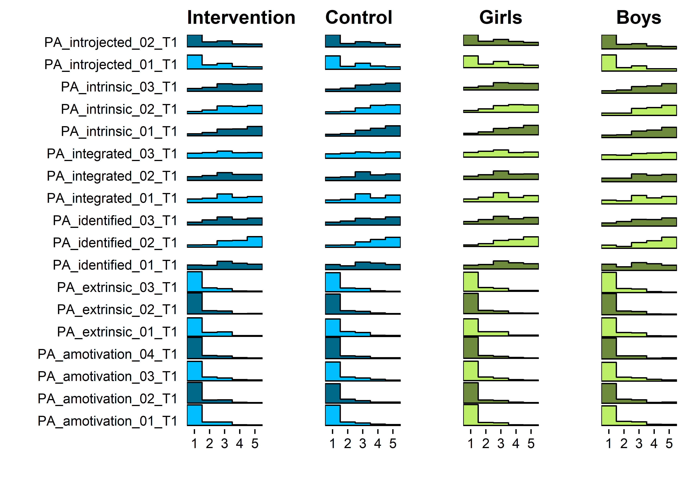<!-- -->


```r
regulations.df_tracks <- df %>% dplyr::select(
  id,
  track,
  PA_amotivation_02_T1,
  PA_amotivation_01_T1,
  PA_amotivation_03_T1,
  PA_amotivation_04_T1,
  PA_extrinsic_01_T1,
  PA_extrinsic_02_T1,
  PA_extrinsic_03_T1,
  PA_introjected_01_T1,
  PA_introjected_02_T1,
  PA_identified_01_T1,
  PA_identified_02_T1,
  PA_identified_03_T1,
  PA_integrated_01_T1, 
  PA_integrated_02_T1,
  PA_integrated_03_T1, 
  PA_intrinsic_01_T1,
  PA_intrinsic_02_T1,
  PA_intrinsic_03_T1)


motiNUR <- regulations.df_tracks %>%
 tidyr::gather(key = Variable, value = Value, PA_amotivation_02_T1:ncol(.)) %>%
  filter(track == "Nur") %>% 
 ggplot(aes(x = Value, y = Variable, group = Variable)) +
  ggridges::geom_density_ridges2(aes(fill = Variable), stat = "binline", binwidth = 1, scale = 0.95) +
  scale_x_continuous(breaks = c(1:6), expand = c(0, 0),
                     name = "") +
  scale_y_discrete(expand = c(0.01, 0), name = "") +
  ggridges::scale_fill_cyclical(values = c("darkolivegreen2", "darkolivegreen4")) +
  labs(title = "Nur") +
  guides(y = "none") +
  ggridges::theme_ridges(grid = FALSE) +
  theme(axis.title.x = element_text(hjust = 0.5),
        axis.title.y = element_text(hjust = 0.5),
        plot.title = element_text(hjust = 0.5),
        axis.text=element_text(size=10)) +
coord_cartesian(xlim = c(0.5, 5.5))

motiHRC <- regulations.df_tracks %>%
 tidyr::gather(key = Variable, value = Value, PA_amotivation_02_T1:ncol(.)) %>%
  filter(track == "HRC") %>% 
 ggplot(aes(x = Value, y = Variable, group = Variable)) +
  ggridges::geom_density_ridges2(aes(fill = Variable), stat = "binline", binwidth = 1, scale = 0.95) +
  scale_x_continuous(breaks = c(1:6), expand = c(0, 0),
                     name = "") +
  scale_y_discrete(expand = c(0.01, 0), name = "", labels = NULL) +
  ggridges::scale_fill_cyclical(values = c("darkolivegreen2", "darkolivegreen4")) +
  labs(title = "HRC") +
  guides(y = "none") +
  ggridges::theme_ridges(grid = FALSE) +
  theme(axis.title.x = element_text(hjust = 0.5),
        axis.title.y = element_text(hjust = 0.5),
        plot.title = element_text(hjust = 0.5),
        axis.text=element_text(size=10)) +
coord_cartesian(xlim = c(0.5, 5.5))

motiBA <- regulations.df_tracks %>% 
 tidyr::gather(key = Variable, value = Value, PA_amotivation_02_T1:ncol(.)) %>%
  filter(track == "BA") %>% 
 ggplot(aes(x = Value, y = Variable, group = Variable)) +
  ggridges::geom_density_ridges2(aes(fill = Variable), stat = "binline", binwidth = 1, scale = 0.95) +
  scale_x_continuous(breaks = c(1:6), expand = c(0, 0),
                     name = "") +
  scale_y_discrete(expand = c(0.01, 0), name = "", labels = NULL) +
  ggridges::scale_fill_cyclical(values = c("deepskyblue", "deepskyblue4")) +
  labs(title = "BA") +
  guides(y = "none") +
  ggridges::theme_ridges(grid = FALSE) +
  theme(axis.title.x = element_text(hjust = 0.5),
        axis.title.y = element_text(hjust = 0.5),
        plot.title = element_text(hjust = 0.5),
        axis.text=element_text(size=10)) +
coord_cartesian(xlim = c(0.5, 5.5))

motiIT <- regulations.df_tracks %>% 
 tidyr::gather(key = Variable, value = Value, PA_amotivation_02_T1:ncol(.)) %>%
  filter(track == "IT") %>% 
 ggplot(aes(x = Value, y = Variable, group = Variable)) +
  ggridges::geom_density_ridges2(aes(fill = Variable), stat = "binline", binwidth = 1, scale = 0.95) +
  scale_x_continuous(breaks = c(1:6), expand = c(0, 0),
                     name = "") +
  scale_y_discrete(expand = c(0.01, 0), name = "", labels = NULL) +
  ggridges::scale_fill_cyclical(values = c("deepskyblue", "deepskyblue4")) +
  labs(title = "IT") +
  guides(y = "none") +
  ggridges::theme_ridges(grid = FALSE) +
  theme(axis.title.x = element_text(hjust = 0.5),
        axis.title.y = element_text(hjust = 0.5),
        plot.title = element_text(hjust = 0.5),
        axis.text=element_text(size=10)) +
coord_cartesian(xlim = c(0.5, 5.5))

# ("Seldom or never", "About once a month", "About once a week", "Almost daily")

# This draws all histograms next to each other:
motiNUR + motiHRC + motiBA + motiIT + plot_layout(nrow = 1)
```

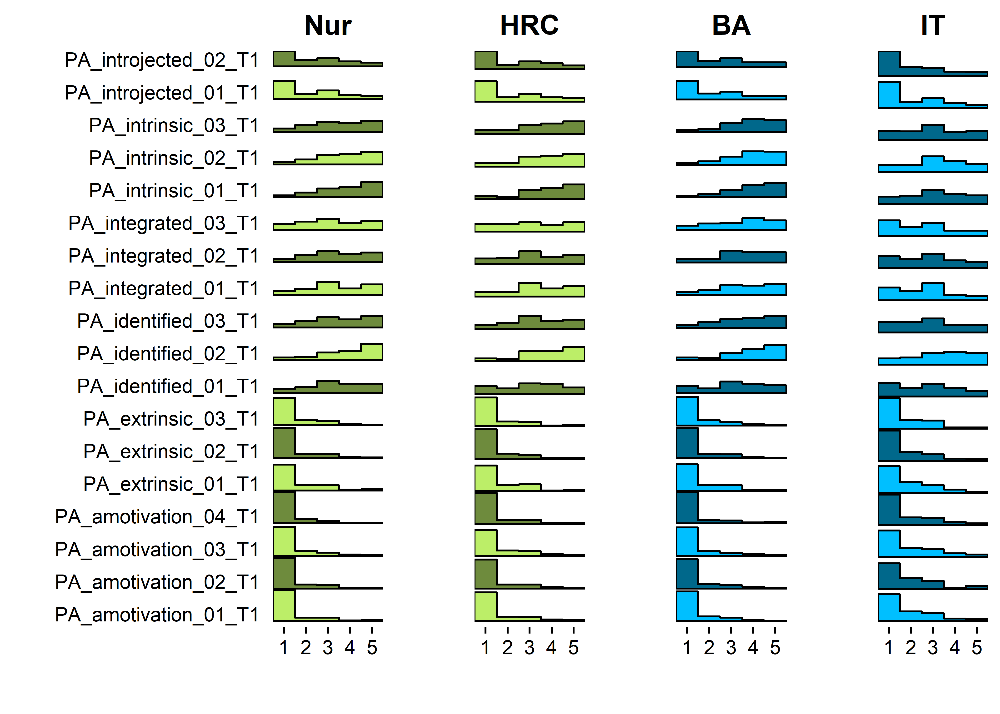<!-- -->


```r

plot1 <- df %>% dplyr::select(id,
  intervention,
  group,
  school,
  girl,
  'PA autonomous\nmotivation' = PA_autonomous_T1,
'PA controlled\nmotivation' = PA_controlled_T1,
'PA amotivation' = PA_amotivation_T1)  %>%
  tidyr::gather(key = Variable, value = Value, 6:ncol(.), factor_key = TRUE) %>%
  ggplot2::ggplot(aes(y = Variable)) +
  ggridges::geom_density_ridges(aes(x = Value,
                                    colour = "black",
                                    fill = paste(Variable, girl),
                                    point_color = girl,
                                    point_fill = girl,
                                    point_shape = girl,
                                    point_size = girl,
                                    point_alpha = girl),
                                scale = 1.16, alpha = .6, size = 0.25,
                                from = 1, to = 5,
                                position = position_raincloud(width = 0.03, height = 0.2),
                                jittered_points = TRUE,
                                point_size = 1) + 
    labs(x = NULL,
       y = NULL) +
  scale_y_discrete(expand = c(0.01, 0)) +
  scale_x_continuous(expand = c(0.01, 0)) +
  ggridges::scale_fill_cyclical(
                      labels = c('PA amotivation boy' = "Boy", 'PA amotivation girl' = "Girl"),
                      values = viridis::viridis(4, end = 0.8)[c(1, 3)],
                      name = "", 
                      guide = guide_legend(override.aes = list(alpha = 1, 
                                                               point_shape = c(24, 25),
                                                               point_size = 2))) +
  ggridges::scale_colour_cyclical(values = "black") +
  ggridges::theme_ridges(grid = FALSE) +
  ggridges::scale_discrete_manual(aesthetics = "point_color", 
                                  values = viridis::viridis(4, end = 0.8)[c(1, 3)],
                                  guide = "none") +
  ggridges::scale_discrete_manual(aesthetics = "point_fill",
                                  values = viridis::viridis(4, end = 0.8)[c(1, 3)],
                                  guide = "none") +
  ggridges::scale_discrete_manual(aesthetics = "point_shape", 
                                  values = c(24, 25),
                                  guide = "none") +
  ggridges::scale_discrete_manual(aesthetics = "point_size", 
                                  values = c(.75, .75),
                                  guide = "none") +
  ggridges::scale_discrete_manual(aesthetics = "point_alpha", 
                                  values = c(0.3, 0.3),
                                  guide = "none") +
  papaja::theme_apa() +
  theme(legend.position = "bottom")

target = c(
"PA_autonomous_T1",
"PA_controlled_T1",
"PA_amotivation_T1")

PA_ci_girls <- ci_girls %>% dplyr::filter(diamondlabels %in% names(scales_T1) & 
                                     grepl("PA_autonomous_T1", diamondlabels) | 
                                     grepl("PA_controlled_T1", diamondlabels) | 
                                     grepl("PA_amotivation_T1", diamondlabels))

PA_ci_girls <- PA_ci_girls[match(target, PA_ci_girls$diamondlabels), ]

PA_ci_boys <- ci_boys %>% dplyr::filter(diamondlabels %in% names(scales_T1) & 
                                     grepl("PA_autonomous_T1", diamondlabels) | 
                                     grepl("PA_controlled_T1", diamondlabels) | 
                                     grepl("PA_amotivation_T1", diamondlabels))

PA_ci_boys <- PA_ci_boys[match(target, PA_ci_boys$diamondlabels), ]

plot1 <- plot1 + userfriendlyscience::diamondPlot(PA_ci_girls, returnLayerOnly = TRUE, lineColor = "black", color=viridis::viridis(4, end = 0.8)[3], 
                alpha=.6, fixedSize = 0.05, otherAxisCol = (1:length(target) + .07)) +
  userfriendlyscience::diamondPlot(PA_ci_boys, returnLayerOnly = TRUE, lineColor = "black", linetype = "solid", color=viridis::viridis(4, end = 0.8)[1],  
                alpha=.6, fixedSize = 0.05, otherAxisCol = (1:length(target) + .07))

plot2 <- df %>% dplyr::select(id,
                              intervention,
                              group,
                              school,
                              girl,
                              'PA autonomous\nmotivation' = PA_autonomous_T1,
                              'PA controlled\nmotivation' = PA_controlled_T1,
                              'PA amotivation' = PA_amotivation_T1)  %>%
  tidyr::gather(key = Variable, value = Value, 6:ncol(.), factor_key = TRUE) %>%
  ggplot2::ggplot(aes(y = Variable)) +
  ggridges::geom_density_ridges(aes(x = Value,
                                    colour = "black",
                                    fill = paste(Variable, intervention),
                                    point_color = intervention,
                                    point_fill = intervention,
                                    point_shape = intervention,
                                    point_size = intervention,
                                    point_alpha = intervention),
                                scale = 1.16, alpha = .6, size = 0.25,
                                from = 1, to = 5,
                                position = position_raincloud(width = 0.03, height = 0.2),
                                jittered_points = TRUE,
                                point_size = 1) + 
    labs(x = NULL,
       y = NULL) +
  scale_y_discrete(expand = c(0.01, 0)) +
  scale_x_continuous(expand = c(0.01, 0)) +
  ggridges::scale_fill_cyclical(
                      labels = c('PA amotivation 0' = "Control", 'PA amotivation 1' = "Intervention"),
                      values = viridis::viridis(4, end = 0.8)[c(2, 4)],
                      name = "", 
                      guide = guide_legend(override.aes = list(alpha = 1, 
                                                               point_shape = c(22, 23),
                                                               point_size = 2))) +
  ggridges::scale_colour_cyclical(values = "black") +
  ggridges::theme_ridges(grid = FALSE) +
  ggridges::scale_discrete_manual(aesthetics = "point_color", 
                                  values = viridis::viridis(4, end = 0.8)[c(2, 4)],
                                  guide = "none") +
  ggridges::scale_discrete_manual(aesthetics = "point_fill",
                                  values = viridis::viridis(4, end = 0.8)[c(2, 4)],
                                  guide = "none") +
  ggridges::scale_discrete_manual(aesthetics = "point_shape", 
                                  values = c(22, 23),
                                  guide = "none") +
  ggridges::scale_discrete_manual(aesthetics = "point_size", 
                                  values = c(.75, .75),
                                  guide = "none") +
  ggridges::scale_discrete_manual(aesthetics = "point_alpha", 
                                  values = c(0.3, 0.3),
                                  guide = "none") +
  papaja::theme_apa() +
  theme(legend.position = "bottom")

PA_ci_intervention <- ci_intervention %>% dplyr::filter(diamondlabels %in% names(scales_T1) & 
                                     grepl("PA_autonomous_T1", diamondlabels) | 
                                     grepl("PA_controlled_T1", diamondlabels) | 
                                     grepl("PA_amotivation_T1", diamondlabels))

PA_ci_intervention <- PA_ci_intervention[match(target, PA_ci_intervention$diamondlabels), ]

PA_ci_control <- ci_control %>% dplyr::filter(diamondlabels %in% names(scales_T1) & 
                                     grepl("PA_autonomous_T1", diamondlabels) | 
                                     grepl("PA_controlled_T1", diamondlabels) | 
                                     grepl("PA_amotivation_T1", diamondlabels))

PA_ci_control <- PA_ci_control[match(target, PA_ci_control$diamondlabels), ]

plot2 <- plot2 + 
  userfriendlyscience::diamondPlot(PA_ci_intervention, returnLayerOnly = TRUE, lineColor = "black", color=viridis::viridis(4, end = 0.8)[4],
              alpha=.6, fixedSize = 0.05, otherAxisCol = (1:length(target) + .07)) +
  userfriendlyscience::diamondPlot(PA_ci_control, returnLayerOnly = TRUE, lineColor = "black", color=viridis::viridis(4, end = 0.8)[2], 
              alpha=.6, fixedSize = 0.05, otherAxisCol = (1:length(target) + .07))

plot1 + plot2 
```

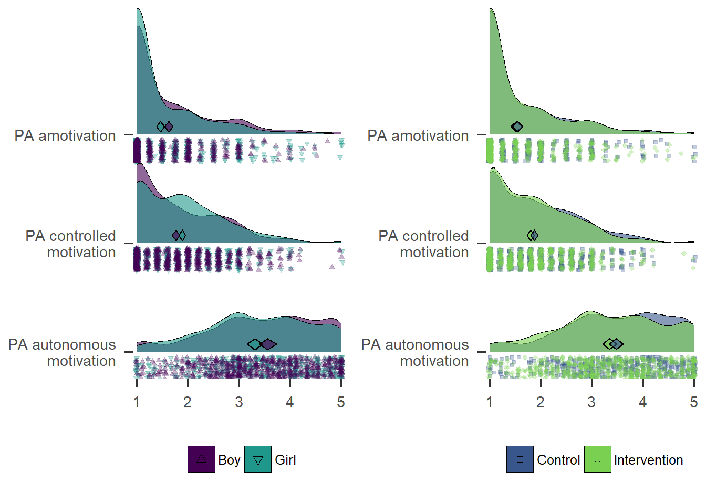

To check that the labels/colors in diamonds are right, here are means of the variables:


```r

df %>% dplyr::select(
  intervention,
  girl,
  'PA autonomous \nmotivation' = PA_autonomous_T1,
'PA controlled \nmotivation' = PA_controlled_T1,
'PA amotivation' = PA_amotivation_T1) %>% 
  group_by(girl) %>% 
  summarise_at(vars(contains("PA")), funs(mean(., na.rm = TRUE))) %>% 
  DT::datatable() #papaja::apa_table()
```

<!--html_preserve--><div id="htmlwidget-d42fc055c4a0ba2d611c" style="width:100%;height:auto;" class="datatables html-widget"></div>
<script type="application/json" data-for="htmlwidget-d42fc055c4a0ba2d611c">{"x":{"filter":"none","data":[["1","2","3"],["girl","boy",null],[3.36778440235887,3.46523316678563,null],[1.88830313014827,1.76716738197425,null],[1.45716253443526,1.63829407566024,null]],"container":"<table class=\"display\">\n  <thead>\n    <tr>\n      <th> <\/th>\n      <th>girl<\/th>\n      <th>PA autonomous \nmotivation<\/th>\n      <th>PA controlled \nmotivation<\/th>\n      <th>PA amotivation<\/th>\n    <\/tr>\n  <\/thead>\n<\/table>","options":{"columnDefs":[{"className":"dt-center","targets":"_all"},{"orderable":false,"targets":0}],"order":[],"autoWidth":false,"orderClasses":false}},"evals":[],"jsHooks":[]}</script><!--/html_preserve-->

```r

df %>% dplyr::select(
  intervention,
  girl,
  'PA autonomous \nmotivation' = PA_autonomous_T1,
'PA controlled \nmotivation' = PA_controlled_T1,
'PA amotivation' = PA_amotivation_T1) %>% 
  group_by(intervention) %>%
  summarise_at(vars(contains("PA")), funs(mean(., na.rm = TRUE))) %>% 
  DT::datatable() #papaja::apa_table()
```

<!--html_preserve--><div id="htmlwidget-e038afbb5fb97d04035c" style="width:100%;height:auto;" class="datatables html-widget"></div>
<script type="application/json" data-for="htmlwidget-e038afbb5fb97d04035c">{"x":{"filter":"none","data":[["1","2"],["0","1"],[3.47441708814454,3.35448364722976],[1.87494969818913,1.80182291666667],[1.55717639168343,1.51782608695652]],"container":"<table class=\"display\">\n  <thead>\n    <tr>\n      <th> <\/th>\n      <th>intervention<\/th>\n      <th>PA autonomous \nmotivation<\/th>\n      <th>PA controlled \nmotivation<\/th>\n      <th>PA amotivation<\/th>\n    <\/tr>\n  <\/thead>\n<\/table>","options":{"columnDefs":[{"className":"dt-center","targets":"_all"},{"orderable":false,"targets":0}],"order":[],"autoWidth":false,"orderClasses":false}},"evals":[],"jsHooks":[]}</script><!--/html_preserve-->


## Big 5 personality traits


```r

plot1 <- df %>% dplyr::select(id,
  intervention,
  group,
  school,
  girl,
'Agreeableness' = big5agreeableness_T1,
'Conscientiousness' = big5conscientiousness_T1,
'Extraversion' = big5extraversion_T1,
'Neuroticism' = big5neuroticism_T1,
'Openness' = big5openness_T1)  %>%
  # dplyr::select(noquote(order(colnames(.)))) %>% # Orders columns alphabetically
  tidyr::gather(key = Variable, value = Value, 6:ncol(.)) %>% 
  ggplot2::ggplot(aes(y = Variable)) +
  ggridges::geom_density_ridges(aes(x = Value, fill = paste(Variable, girl)), 
           alpha = .6, color = "black", from = 1, to = 7) +
  labs(x = "",
       y = "") +
  scale_y_discrete(expand = c(0.01, 0)) +
  scale_x_continuous(expand = c(0.01, 0)) +
  ggridges::scale_fill_cyclical(breaks = c("Agreeableness boy", "Agreeableness girl"),
                      labels = c( 'Agreeableness boy' = "Boy", 'Agreeableness girl' = "Girl"),
                      values = c("#3bc600", "#0000ff", "#9cc68b", "#8080ff"),
                      name = "", guide = "legend") +
  ggridges::theme_ridges(grid = FALSE) +
  theme(legend.position="bottom")

plot2 <- df %>% dplyr::select(id,
  intervention,
  group,
  school,
  girl,
'Agreeableness' = big5agreeableness_T1,
'Conscientiousness' = big5conscientiousness_T1,
'Extraversion' = big5extraversion_T1,
'Neuroticism' = big5neuroticism_T1,
'Openness' = big5openness_T1) %>%
  # dplyr::select(noquote(order(colnames(.)))) %>% # Orders columns alphabetically
  tidyr::gather(key = Variable, value = Value, 6:ncol(.)) %>% 
  ggplot2::ggplot(aes(y = Variable)) +
  ggridges::geom_density_ridges(aes(x = Value, fill = paste(Variable, intervention)), 
           alpha = .6, color = "black", from = 1, to = 7) +
  labs(x = "",
       y = "") +
  scale_y_discrete(expand = c(0.01, 0), labels = NULL) +
  scale_x_continuous(expand = c(0.01, 0)) +
  ggridges::scale_fill_cyclical(breaks = c("Agreeableness 1", "Agreeableness 0"),
                      labels = c('Agreeableness 1' = "Intervention", 'Agreeableness 0' = "Control"),
                      values = c("#ff0000", "#0000ff", "#ff8080", "#8080ff"),
                      name = "", guide = "legend") +
  ggridges::theme_ridges(grid = FALSE) +
  theme(legend.position="bottom")

plot1 + plot2
```

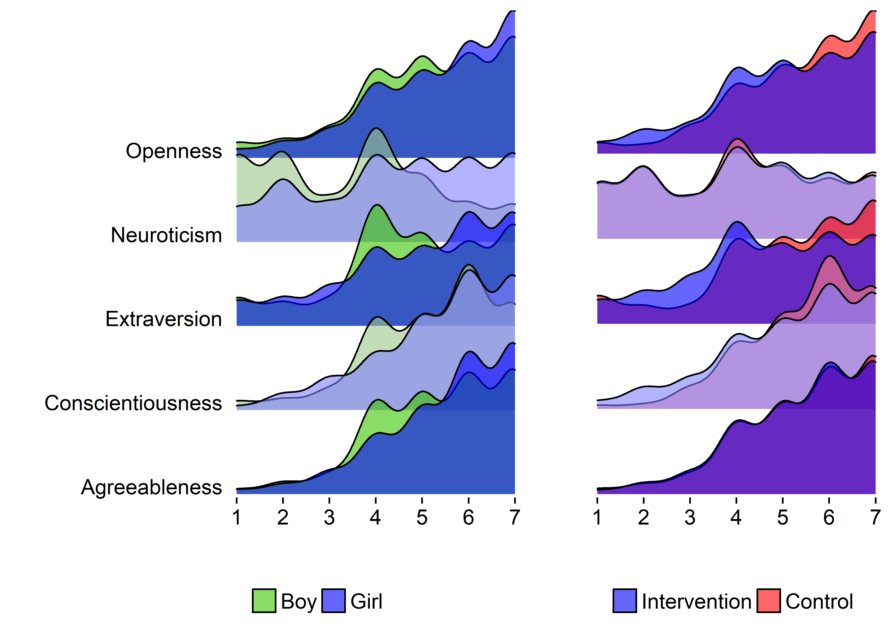<!-- -->

## BCT use

### Ridge plots for means


```r

plot1 <- df %>% dplyr::select(id,
  intervention,
  group,
  school,
  girl,
'Frequency-\nrelated BCTs' = PA_frequencyDependentBCT_T1,
'Agreement-\nrelated BCTs' = PA_agreementDependentBCT_T1)  %>%
  # dplyr::select(noquote(order(colnames(.)))) %>% # Orders columns alphabetically
  tidyr::gather(key = Variable, value = Value, 6:ncol(.)) %>% 
  ggplot2::ggplot(aes(y = Variable)) +
  ggridges::geom_density_ridges(aes(x = Value, fill = paste(Variable, girl)), 
           alpha = .6, color = "black", from = 1, to = 7) +
  labs(x = "",
       y = "") +
  scale_y_discrete(expand = c(0.01, 0)) +
  scale_x_continuous(expand = c(0.01, 0)) +
  ggridges::scale_fill_cyclical(breaks = c("Agreement-\nrelated BCTs boy", "Agreement-\nrelated BCTs girl"),
                      labels = c( 'Agreement-\nrelated BCTs boy' = "Boy", 'Agreement-\nrelated BCTs girl' = "Girl"),
                      values = c("#3bc600", "#0000ff", "#9cc68b", "#8080ff"),
                      name = "", guide = "legend") +
  ggridges::theme_ridges(grid = FALSE) +
  theme(legend.position="bottom")

plot2 <- df %>% dplyr::select(id,
  intervention,
  group,
  school,
  girl,
'Frequency-\nrelated BCTs' = PA_frequencyDependentBCT_T1,
'Agreement-\nrelated BCTs' = PA_agreementDependentBCT_T1) %>%
  # dplyr::select(noquote(order(colnames(.)))) %>% # Orders columns alphabetically
  tidyr::gather(key = Variable, value = Value, 6:ncol(.)) %>% 
  ggplot2::ggplot(aes(y = Variable)) +
  ggridges::geom_density_ridges(aes(x = Value, fill = paste(Variable, intervention)), 
           alpha = .6, color = "black", from = 1, to = 7) +
  labs(x = "",
       y = "") +
  scale_y_discrete(expand = c(0.01, 0), labels = NULL) +
  scale_x_continuous(expand = c(0.01, 0)) +
  ggridges::scale_fill_cyclical(breaks = c("Agreement-\nrelated BCTs 1", "Agreement-\nrelated BCTs 0"),
                      labels = c('Agreement-\nrelated BCTs 1' = "Intervention", 'Agreement-\nrelated BCTs 0' = "Control"),
                      values = c("#ff0000", "#0000ff", "#ff8080", "#8080ff"),
                      name = "", guide = "legend") +
  ggridges::theme_ridges(grid = FALSE) +
  theme(legend.position="bottom")

plot1 + plot2
```

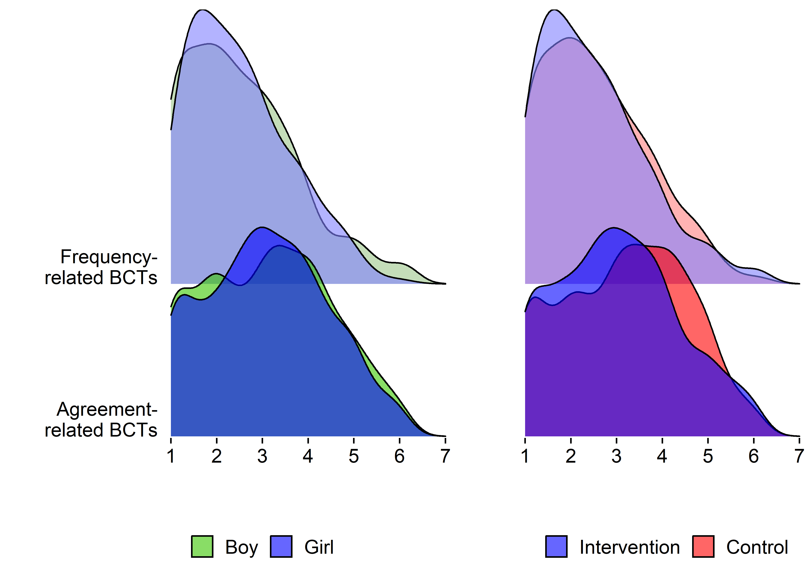<!-- -->


### sm kernel density plots for means

#### Frequency-measured BCTs


```r

# Create data frame
densplot <- df
levels(densplot$intervention) <- c("Control", "Intervention")
levels(densplot$girl) <- recode(densplot$girl, "boy" = "Boys", "girl" = "Girls")

# This gives side-by-side plots. There's a third plot below the two, which is fake to include x-axis text.
layout(matrix(c(1, 2, 3, 3), nrow = 2, ncol = 2, byrow = TRUE),
       widths = c(0.5, 0.5), heights = c(0.45, 0.05))

# Minimise whitespace; see https://stackoverflow.com/questions/15848942/how-to-reduce-space-gap-between-multiple-graphs-in-r
par(mai = c(0.3, 0.3, 0.1, 0.0)) 

## Girls vs. boys
# Choose only the variables needed and drop NA
dens <- densplot %>% dplyr::select(PA_frequencyDependentBCT_T1, girl) %>% 
  dplyr::filter(complete.cases(.))

# Set random number generator for reproducibility of bootstrap test of equal densities
set.seed(10)

# Make plot
sm.PA_frequencyDependentBCT_T1_2 <- sm.density.compare2(as.numeric(dens$PA_frequencyDependentBCT_T1), 
                                               as.factor(dens$girl), 
                                               model = "equal",
                                               xlab = "", ylab = "",
                                               col = viridis::viridis(4, end  =  0.8)[c(3, 1)], 
                                               lty = c(1, 3), yaxt = "n",
                                               bandcol = 'LightGray', 
                                               lwd = c(2, 2),
                                               xlim = c(1, 6))
## 
## Test of equal densities:  p-value =  0.37
legend("topright", levels(dens$girl), col = viridis::viridis(4, end = 0.8)[c(1, 3)], lty = c(3,1), lwd = (c(2,2)))
mtext(side = 2, "Density", line = 0.5)

## Intervention vs. control
# Choose only the variables needed and drop NA
dens <- densplot %>% dplyr::select(PA_frequencyDependentBCT_T1, intervention) %>% 
  dplyr::filter(complete.cases(.))

# Set random number generator for reproducibility of bootstrap test of equal densities
set.seed(10)
# Make plot
sm.PA_frequencyDependentBCT_T1_2 <- sm.density.compare2(as.numeric(dens$PA_frequencyDependentBCT_T1), 
                                               as.factor(dens$intervention), 
                                               model = "equal", 
                                               xlab = "", ylab = "",
                                               col = viridis::viridis(4, end = 0.8)[c(2, 4)], 
                                               lty = c(3, 1), yaxt = "n",
                                               bandcol = 'LightGray', 
                                               lwd = c(2, 2),
                                               xlim = c(1, 6))
## 
## Test of equal densities:  p-value =  0.32
legend("topright", levels(dens$intervention), col = viridis::viridis(4, end = 0.8)[c(2, 4)], lty=c(3,1), lwd=(c(2,2)))

# Create x-axis label. See https://stackoverflow.com/questions/11198767/how-to-annotate-across-or-between-plots-in-multi-plot-panels-in-r
par(mar = c(0,0,0,0)) 
plot(1, 1, type = "n", frame.plot = FALSE, axes = FALSE) # Fake plot for x-axis label
text(x = 1.02, y = 1.3, labels = "Frequency-based BCT sumscore mean", pos = 1)
```

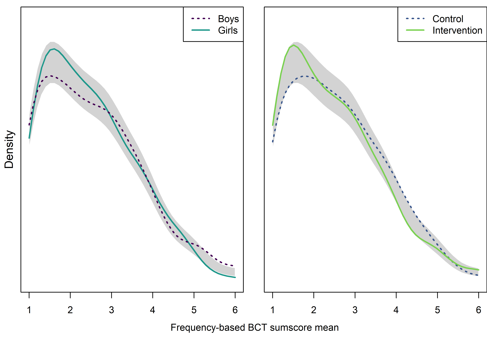<!-- -->

#### Agreement-measured BCTs


```r

# Create data frame
densplot <- df
levels(densplot$intervention) <- c("Control", "Intervention")
levels(densplot$girl) <- recode(densplot$girl, "boy" = "Boys", "girl" = "Girls")

# This gives side-by-side plots. There's a third plot below the two, which is fake to include x-axis text.
layout(matrix(c(1, 2, 3, 3), nrow = 2, ncol = 2, byrow = TRUE),
       widths = c(0.5, 0.5), heights = c(0.45, 0.05))

# Minimise whitespace; see https://stackoverflow.com/questions/15848942/how-to-reduce-space-gap-between-multiple-graphs-in-r
par(mai = c(0.3, 0.3, 0.1, 0.0)) 

## Girls vs. boys
# Choose only the variables needed and drop NA
dens <- densplot %>% dplyr::select(PA_agreementDependentBCT_T1, girl) %>% 
  dplyr::filter(complete.cases(.))

# Set random number generator for reproducibility of bootstrap test of equal densities
set.seed(10)

# Make plot
sm.PA_agreementDependentBCT_T1_2 <- sm.density.compare2(as.numeric(dens$PA_agreementDependentBCT_T1), 
                                               as.factor(dens$girl), 
                                               model = "equal",
                                               xlab = "", ylab = "",
                                               col = viridis::viridis(4, end  =  0.8)[c(3, 1)], 
                                               lty = c(1, 3), yaxt = "n",
                                               bandcol = 'LightGray', 
                                               lwd = c(2, 2),
                                               xlim = c(1, 6))
## 
## Test of equal densities:  p-value =  0.23
legend("topright", levels(dens$girl), col = viridis::viridis(4, end = 0.8)[c(1, 3)], lty = c(3,1), lwd = (c(2,2)))
mtext(side = 2, "Density", line = 0.5)

## Intervention vs. control
# Choose only the variables needed and drop NA
dens <- densplot %>% dplyr::select(PA_agreementDependentBCT_T1, intervention) %>% 
  dplyr::filter(complete.cases(.))

# Set random number generator for reproducibility of bootstrap test of equal densities
set.seed(10)
# Make plot
sm.PA_agreementDependentBCT_T1_2 <- sm.density.compare2(as.numeric(dens$PA_agreementDependentBCT_T1), 
                                               as.factor(dens$intervention), 
                                               model = "equal", 
                                               xlab = "", ylab = "",
                                               col = viridis::viridis(4, end = 0.8)[c(2, 4)], 
                                               lty = c(3, 1), yaxt = "n",
                                               bandcol = 'LightGray', 
                                               lwd = c(2, 2),
                                               xlim = c(1, 6))
## 
## Test of equal densities:  p-value =  0
legend("topright", levels(dens$intervention), col = viridis::viridis(4, end = 0.8)[c(2, 4)], lty=c(3,1), lwd=(c(2,2)))
par(mar = c(0,0,0,0)) 
plot(1, 1, type = "n", frame.plot = FALSE, axes = FALSE) # Fake plot for x-axis label
text(x = 1.02, y = 1.3, labels = "Agreement-based BCT sumscore mean", pos = 1) # Create x-axis label. See https://stackoverflow.com/questions/11198767/how-to-annotate-across-or-between-plots-in-multi-plot-panels-in-r
```

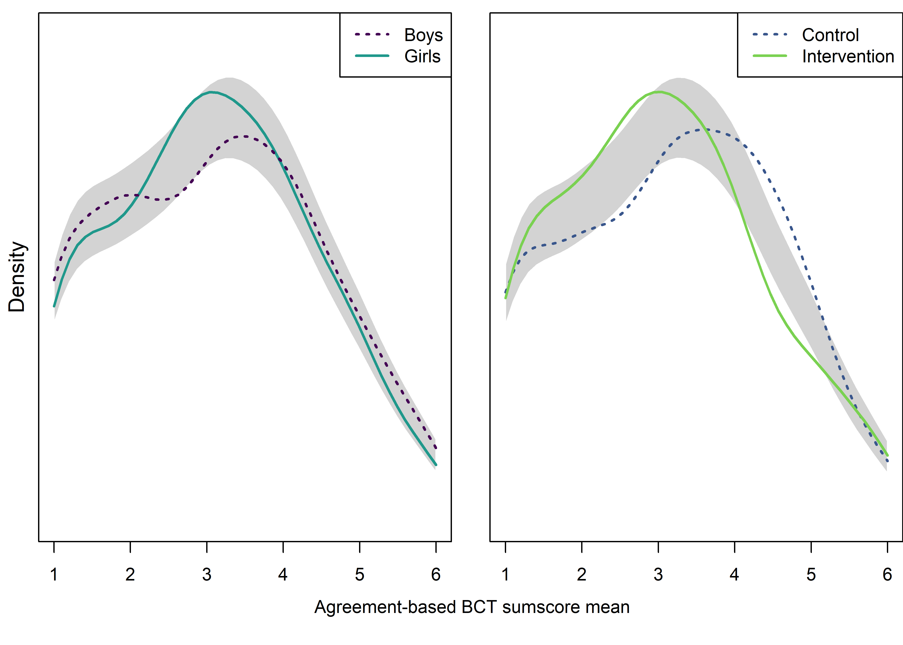<!-- -->

<a id="freqHistogram"></a>

$~$
$~$

### Histograms for individual items

#### Frequency-measured BCTs

These questions were asked with the lead "Have you done the following during the last three weeks?". 

The answer scale was as follows:

0 = not once
1 = once
2 = twice
3 = weekly
4 = about every second day
5 = daily

Items are as follows: 

1. I have reminded myself even in my spare time, what kind of positive consequences frequent PA would have in my life.
2. I have monitored my PA by marking the PA occasions on an exercise log on paper.
3. I have monitored my PA by using a smart phone, e.g. the Moves-app.
4. I use memory cues with which I remember to implement my PA intention.
5. I have compared my actualized PA with the PA goal I have set.
6. I have thought about which reasons to do PA are important to me personally.
7. I have made changes in my home (e.g. my room or my computer), so that starting PA would be easier.
8. I have asked my friends or family for support to reach my PA goals.
9. If I haven't reached my PA goal, I have evaluated, what went wrong.


```r
genderInterventionColors <- viridis::viridis(11, end = 0.8)

bctGirls <- df %>% dplyr::select(id,
  intervention,
  group,
  school,
  girl,
'Reminded self of positive consequences' = PA_frequencyDependentBCT_01_T1,
'Has logged PA on paper' = PA_frequencyDependentBCT_02_T1,
'Has monitored PA on smartphone' = PA_frequencyDependentBCT_03_T1,
'Uses memory cues' = PA_frequencyDependentBCT_04_T1,
'Has compared actual with goal' = PA_frequencyDependentBCT_05_T1,
'Has thought of relevance of PA' = PA_frequencyDependentBCT_06_T1,
'Has made environmental changes (home)' = PA_frequencyDependentBCT_07_T1,
'Has sought social support' = PA_frequencyDependentBCT_08_T1,
'Has evaluated why goal not reached' = PA_frequencyDependentBCT_09_T1) %>%
  tidyr::gather(key = Variable, value = Value, 6:ncol(.)) %>%
  dplyr::mutate(Variable = forcats::fct_reorder(Variable, .x = Value, .desc = FALSE, 
                                                fun = mean, na.rm = TRUE)) %>% 
  dplyr::filter(girl == "girl") %>% 
 ggplot2::ggplot(aes(x = Value, y = Variable, group = Variable)) +
  ggridges::geom_density_ridges2(aes(fill = Variable), stat = "binline", binwidth = 1, scale = 0.95) +
  scale_x_continuous(breaks = c(1:6), expand = c(0, 0),
                     name = "") +
  scale_y_discrete(expand = c(0.01, 0), name = "", labels = NULL) +
  ggridges::scale_fill_cyclical(values = viridis::viridis(11, end = 0.8)[7:8]) +
  labs(title = "Girls") +
  guides(y = "none") +
  ggridges::theme_ridges(grid = FALSE) +
  theme(axis.title.x = element_text(hjust = 0.5),
        axis.title.y = element_text(hjust = 0.5),
        plot.title = element_text(hjust = 0.5),
        axis.text=element_text(size=10)) +
  coord_cartesian(xlim = c(0.5, 6.5)) +
  theme(plot.title = element_text(size=12))

bctBoys <- df %>% dplyr::select(id,
  intervention,
  group,
  school,
  girl,
'Reminded self of positive consequences' = PA_frequencyDependentBCT_01_T1,
'Has logged PA on paper' = PA_frequencyDependentBCT_02_T1,
'Has monitored PA on smartphone' = PA_frequencyDependentBCT_03_T1,
'Uses memory cues' = PA_frequencyDependentBCT_04_T1,
'Has compared actual with goal' = PA_frequencyDependentBCT_05_T1,
'Has thought of relevance of PA' = PA_frequencyDependentBCT_06_T1,
'Has made environmental changes (home)' = PA_frequencyDependentBCT_07_T1,
'Has sought social support' = PA_frequencyDependentBCT_08_T1,
'Has evaluated why goal not reached' = PA_frequencyDependentBCT_09_T1) %>%
  tidyr::gather(key = Variable, value = Value, 6:ncol(.)) %>%
  dplyr::mutate(Variable = forcats::fct_reorder(Variable, .x = Value, .desc = FALSE, 
                                                fun = mean, na.rm = TRUE)) %>% 
  dplyr::filter(girl == "boy") %>% 
 ggplot2::ggplot(aes(x = Value, y = Variable, group = Variable)) +
  ggridges::geom_density_ridges2(aes(fill = Variable), stat = "binline", binwidth = 1, scale = 0.95) +
  scale_x_continuous(breaks = c(1:6), expand = c(0, 0),
                     name = "") +
  scale_y_discrete(expand = c(0.01, 0), name = "") +
  ggridges::scale_fill_cyclical(values = viridis::viridis(11, end = 0.8)[1:2]) +
  labs(title = "Boys") +
  guides(y = "none") +
  ggridges::theme_ridges(grid = FALSE) +
  theme(axis.title.x = element_text(hjust = 0.5),
        axis.title.y = element_text(hjust = 0.5),
        plot.title = element_text(hjust = 0.5),
        axis.text=element_text(size=10)) +
  coord_cartesian(xlim = c(0.5, 6.5)) +
  theme(plot.title = element_text(size=12))

bctInt <- df %>% dplyr::select(id,
  intervention,
  group,
  school,
  girl,
'Reminded self of positive consequences' = PA_frequencyDependentBCT_01_T1,
'Has logged PA on paper' = PA_frequencyDependentBCT_02_T1,
'Has monitored PA on smartphone' = PA_frequencyDependentBCT_03_T1,
'Uses memory cues' = PA_frequencyDependentBCT_04_T1,
'Has compared actual with goal' = PA_frequencyDependentBCT_05_T1,
'Has thought of relevance of PA' = PA_frequencyDependentBCT_06_T1,
'Has made environmental changes (home)' = PA_frequencyDependentBCT_07_T1,
'Has sought social support' = PA_frequencyDependentBCT_08_T1,
'Has evaluated why goal not reached' = PA_frequencyDependentBCT_09_T1) %>%
  tidyr::gather(key = Variable, value = Value, 6:ncol(.)) %>%
  dplyr::mutate(Variable = forcats::fct_reorder(Variable, .x = Value, .desc = FALSE, 
                                                fun = mean, na.rm = TRUE)) %>% 
  dplyr::filter(intervention == "1") %>% 
 ggplot2::ggplot(aes(x = Value, y = Variable, group = Variable)) +
  ggridges::geom_density_ridges2(aes(fill = Variable), stat = "binline", binwidth = 1, scale = 0.95) +
  scale_x_continuous(breaks = c(1:6), expand = c(0, 0),
                     name = "") +
  scale_y_discrete(expand = c(0.01, 0), name = "", labels = NULL) +
  ggridges::scale_fill_cyclical(values = viridis::viridis(11, end = 0.8)[10:11]) +
  labs(title = "Intervention") +
  guides(y = "none") +
  ggridges::theme_ridges(grid = FALSE) +
  theme(axis.title.x = element_text(hjust = 0.5),
        axis.title.y = element_text(hjust = 0.5),
        axis.text=element_text(size=10)) +
  coord_cartesian(xlim = c(0.5, 6.5)) +
  theme(plot.title = element_text(size=12))

bctCont <- df %>% dplyr::select(id,
  intervention,
  group,
  school,
  girl,
'Reminded self of positive consequences' = PA_frequencyDependentBCT_01_T1,
'Has logged PA on paper' = PA_frequencyDependentBCT_02_T1,
'Has monitored PA on smartphone' = PA_frequencyDependentBCT_03_T1,
'Uses memory cues' = PA_frequencyDependentBCT_04_T1,
'Has compared actual with goal' = PA_frequencyDependentBCT_05_T1,
'Has thought of relevance of PA' = PA_frequencyDependentBCT_06_T1,
'Has made environmental changes (home)' = PA_frequencyDependentBCT_07_T1,
'Has sought social support' = PA_frequencyDependentBCT_08_T1,
'Has evaluated why goal not reached' = PA_frequencyDependentBCT_09_T1) %>%
  tidyr::gather(key = Variable, value = Value, 6:ncol(.)) %>%
  dplyr::mutate(Variable = forcats::fct_reorder(Variable, .x = Value, .desc = FALSE, 
                                                fun = mean, na.rm = TRUE)) %>% 
  dplyr::filter(intervention == "0") %>% 
 ggplot2::ggplot(aes(x = Value, y = Variable, group = Variable)) +
  ggridges::geom_density_ridges2(aes(fill = Variable), stat = "binline", binwidth = 1, scale = 0.95) +
  scale_x_continuous(breaks = c(1:6), expand = c(0, 0),
                     name = "") +
  scale_y_discrete(expand = c(0.01, 0), name = "", labels = NULL) +
  ggridges::scale_fill_cyclical(values = viridis::viridis(11, end = 0.8)[4:5]) +
  labs(title = "Control") +
  guides(y = "none") +
  ggridges::theme_ridges(grid = FALSE) +
  theme(axis.title.x = element_text(hjust = 0.5),
        axis.title.y = element_text(hjust = 0.5),
        axis.text=element_text(size=10)) +
  coord_cartesian(xlim = c(0.5, 6.5)) +
  theme(plot.title = element_text(size=12))

bctBoys + bctGirls + bctInt + bctCont + plot_layout(nrow = 1) 
```

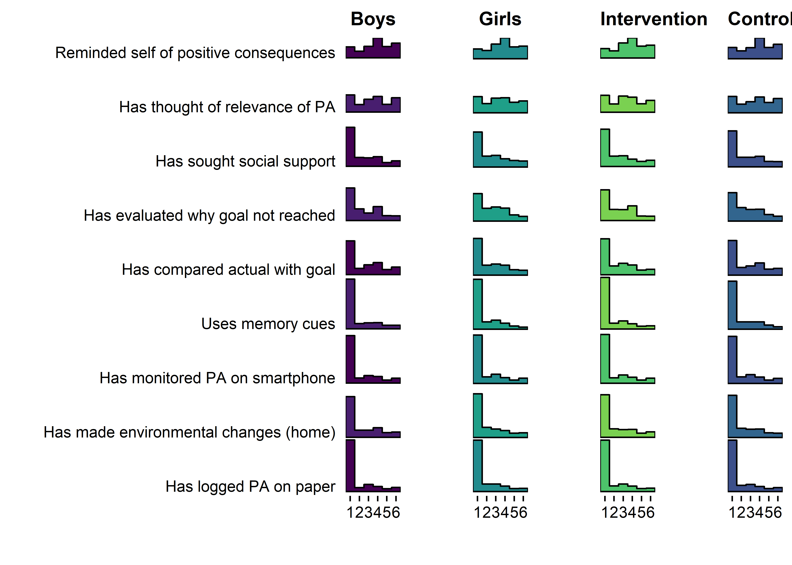<!-- -->

<a id="agrHistogram"></a>

$~$
$~$

#### Agreement-measured BCTs

These questions were asked with the lead "Have you done the following during the last three weeks?". 

The answer scale was as follows:

0 = not at all true
1 ... 4 [unlabeled]
5 = completely true

Items are as follows: 

1. I have set PA goals for myself.
2. I have personally made a specific plan ("what, where, how") to implement my PA.
3. I have a PA plan, which has been made by someone else, e.g. my sports club (e.g. a workout schedule).
4. I have a way by which I remind myself of my PA plan, e.g. I write it down in the calendar.
5. I have cut larger PA goals to smaller subgoals.
6. I have tried out new ways for me to be physically active.
7. I have pondered, what kind of difficult situations or barriers prevent me from implementing my PA plan.
8. I have planned for ways to overcome barriers to doing PA.
9. I have thought about how PA fits my identity (self concept).
10. I have attempted to find ways to exercise so, that it won't obstruct but instead helps actualise my other life values.


```r

bctGirls <- df %>% dplyr::select(id,
  intervention,
  group,
  school,
  girl,
  'Has set goals' = PA_agreementDependentBCT_01_T1,
  'Has made plan' = PA_agreementDependentBCT_02_T1,
  'Plan made by other' = PA_agreementDependentBCT_03_T1,
  'Has reminder of plan' = PA_agreementDependentBCT_04_T1,
  'Has cut goals to subgoals' = PA_agreementDependentBCT_05_T1,
  'Has tried new PA options' = PA_agreementDependentBCT_06_T1,
  'Has thought of barriers' = PA_agreementDependentBCT_07_T1,
  'Has planned for barriers' = PA_agreementDependentBCT_08_T1,
  'Has thought of PA identity' = PA_agreementDependentBCT_09_T1,
  'Has fitted PA to life values' = PA_agreementDependentBCT_10_T1) %>%
  tidyr::gather(key = Variable, value = Value, 6:ncol(.)) %>%
  dplyr::mutate(Variable = forcats::fct_reorder(Variable, .x = Value, .desc = FALSE, 
                                                fun = mean, na.rm = TRUE)) %>% 
  dplyr::filter(girl == "girl") %>% 
 ggplot2::ggplot(aes(x = Value, y = Variable, group = Variable)) +
  ggridges::geom_density_ridges2(aes(fill = Variable), stat = "binline", binwidth = 1, scale = 0.95) +
  scale_x_continuous(breaks = c(1:6), expand = c(0, 0),
                     name = "") +
  scale_y_discrete(expand = c(0.01, 0), name = "", labels = NULL) +
  ggridges::scale_fill_cyclical(values = viridis::viridis(11, end = 0.8)[7:8]) +
  labs(title = "Girls") +
  guides(y = "none") +
  ggridges::theme_ridges(grid = FALSE) +
  theme(axis.title.x = element_text(hjust = 0.5),
        axis.title.y = element_text(hjust = 0.5),
        plot.title = element_text(hjust = 0.5),
        axis.text=element_text(size=10)) +
  coord_cartesian(xlim = c(0.5, 6.5)) +
  theme(plot.title = element_text(size=12))

bctBoys <- df %>% dplyr::select(id,
  intervention,
  group,
  school,
  girl,
  'Has set goals' = PA_agreementDependentBCT_01_T1,
  'Has made plan' = PA_agreementDependentBCT_02_T1,
  'Plan made by other' = PA_agreementDependentBCT_03_T1,
  'Has reminder of plan' = PA_agreementDependentBCT_04_T1,
  'Has cut goals to subgoals' = PA_agreementDependentBCT_05_T1,
  'Has tried new PA options' = PA_agreementDependentBCT_06_T1,
  'Has thought of barriers' = PA_agreementDependentBCT_07_T1,
  'Has planned for barriers' = PA_agreementDependentBCT_08_T1,
  'Has thought of PA identity' = PA_agreementDependentBCT_09_T1,
  'Has fitted PA to life values' = PA_agreementDependentBCT_10_T1) %>%
  tidyr::gather(key = Variable, value = Value, 6:ncol(.)) %>%
  dplyr::mutate(Variable = forcats::fct_reorder(Variable, .x = Value, .desc = FALSE, 
                                                fun = mean, na.rm = TRUE)) %>% 
  dplyr::filter(girl == "boy") %>% 
 ggplot2::ggplot(aes(x = Value, y = Variable, group = Variable)) +
  ggridges::geom_density_ridges2(aes(fill = Variable), stat = "binline", binwidth = 1, scale = 0.95) +
  scale_x_continuous(breaks = c(1:6), expand = c(0, 0),
                     name = "") +
  scale_y_discrete(expand = c(0.01, 0), name = "") +
  ggridges::scale_fill_cyclical(values = viridis::viridis(11, end = 0.8)[1:2]) +
  labs(title = "Boys") +
  guides(y = "none") +
  ggridges::theme_ridges(grid = FALSE) +
  theme(axis.title.x = element_text(hjust = 0.5),
        axis.title.y = element_text(hjust = 0.5),
        plot.title = element_text(hjust = 0.5),
        axis.text=element_text(size=10)) +
  coord_cartesian(xlim = c(0.5, 6.5)) +
  theme(plot.title = element_text(size=12))

bctInt <- df %>% dplyr::select(id,
  intervention,
  group,
  school,
  girl,
  'Has set goals' = PA_agreementDependentBCT_01_T1,
  'Has made plan' = PA_agreementDependentBCT_02_T1,
  'Plan made by other' = PA_agreementDependentBCT_03_T1,
  'Has reminder of plan' = PA_agreementDependentBCT_04_T1,
  'Has cut goals to subgoals' = PA_agreementDependentBCT_05_T1,
  'Has tried new PA options' = PA_agreementDependentBCT_06_T1,
  'Has thought of barriers' = PA_agreementDependentBCT_07_T1,
  'Has planned for barriers' = PA_agreementDependentBCT_08_T1,
  'Has thought of PA identity' = PA_agreementDependentBCT_09_T1,
  'Has fitted PA to life values' = PA_agreementDependentBCT_10_T1) %>%
  tidyr::gather(key = Variable, value = Value, 6:ncol(.)) %>%
  dplyr::mutate(Variable = forcats::fct_reorder(Variable, .x = Value, .desc = FALSE, 
                                                fun = mean, na.rm = TRUE)) %>% 
  dplyr::filter(intervention == "1") %>% 
 ggplot2::ggplot(aes(x = Value, y = Variable, group = Variable)) +
  ggridges::geom_density_ridges2(aes(fill = Variable), stat = "binline", binwidth = 1, scale = 0.95) +
  scale_x_continuous(breaks = c(1:6), expand = c(0, 0),
                     name = "") +
  scale_y_discrete(expand = c(0.01, 0), name = "", labels = NULL) +
  ggridges::scale_fill_cyclical(values = viridis::viridis(11, end = 0.8)[10:11]) +
  labs(title = "Intervention") +
  guides(y = "none") +
  ggridges::theme_ridges(grid = FALSE) +
  theme(axis.title.x = element_text(hjust = 0.5),
        axis.title.y = element_text(hjust = 0.5),
        axis.text=element_text(size=10)) +
  coord_cartesian(xlim = c(0.5, 6.5)) +
  theme(plot.title = element_text(size=12))

bctCont <- df %>% dplyr::select(id,
  intervention,
  group,
  school,
  girl,
  'Has set goals' = PA_agreementDependentBCT_01_T1,
  'Has made plan' = PA_agreementDependentBCT_02_T1,
  'Plan made by other' = PA_agreementDependentBCT_03_T1,
  'Has reminder of plan' = PA_agreementDependentBCT_04_T1,
  'Has cut goals to subgoals' = PA_agreementDependentBCT_05_T1,
  'Has tried new PA options' = PA_agreementDependentBCT_06_T1,
  'Has thought of barriers' = PA_agreementDependentBCT_07_T1,
  'Has planned for barriers' = PA_agreementDependentBCT_08_T1,
  'Has thought of PA identity' = PA_agreementDependentBCT_09_T1,
  'Has fitted PA to life values' = PA_agreementDependentBCT_10_T1) %>%
  tidyr::gather(key = Variable, value = Value, 6:ncol(.)) %>%
  dplyr::mutate(Variable = forcats::fct_reorder(Variable, .x = Value, .desc = FALSE, 
                                                fun = mean, na.rm = TRUE)) %>% 
  dplyr::filter(intervention == "0") %>% 
 ggplot2::ggplot(aes(x = Value, y = Variable, group = Variable)) +
  ggridges::geom_density_ridges2(aes(fill = Variable), stat = "binline", binwidth = 1, scale = 0.95) +
  scale_x_continuous(breaks = c(1:6), expand = c(0, 0),
                     name = "") +
  scale_y_discrete(expand = c(0.01, 0), name = "", labels = NULL) +
  ggridges::scale_fill_cyclical(values = viridis::viridis(11, end = 0.8)[4:5]) +
  labs(title = "Control") +
  guides(y = "none") +
  ggridges::theme_ridges(grid = FALSE) +
  theme(axis.title.x = element_text(hjust = 0.5),
        axis.title.y = element_text(hjust = 0.5),
        axis.text=element_text(size=10)) +
  coord_cartesian(xlim = c(0.5, 6.5)) +
  theme(plot.title = element_text(size=12))

bctBoys + bctGirls + bctInt + bctCont + plot_layout(nrow = 1) 
```

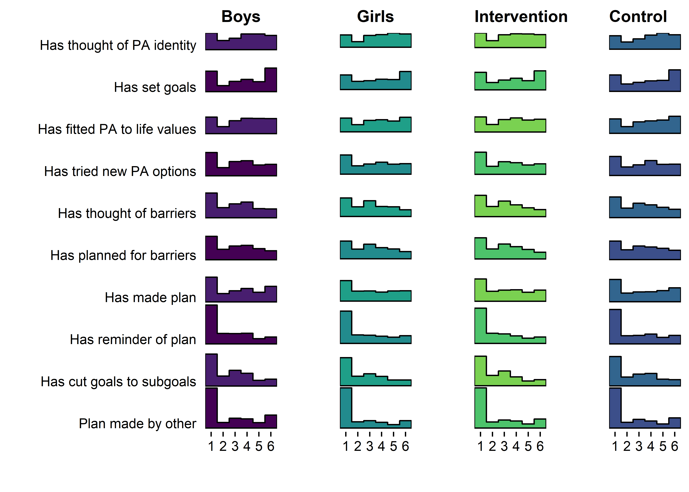<!-- -->


<!-- ## (A determinant Plot without fill) -->


# Informativeness of averages

If we consider all four primary outcomes, how representative are the point estimates of the average values? It is perhaps no surprise, that no single individual can be exactly average on all the four variables, but creating a band of permissiveness around that average can help answer the aforementioned question.

Plot below shows how large a band around the median (x-axis) is needed to be able to describe the proportion of participant on the y-axis.


```r

# total_n <- df %>% select(mvpaAccelerometer_T1, sitLieAccelerometer_T1, padaysLastweek_T1, sitBreaksAccelerometer_T1) %>% 
#   na.omit(.) %>% 
#   summarise(n = n())
                     
middle_x_percentile <- function(middle_percentile) {
  df %>%
  dplyr::filter(
    (df$mvpaAccelerometer_T1 > quantile(df$mvpaAccelerometer_T1, probs = c(0.5 - middle_percentile/2, 0.5 + middle_percentile/2), na.rm = TRUE)[[1]]) &
    (df$mvpaAccelerometer_T1 < quantile(df$mvpaAccelerometer_T1, probs = c(0.5 - middle_percentile/2, 0.5 + middle_percentile/2), na.rm = TRUE)[[2]]) &
    (df$sitLieAccelerometer_T1 > quantile(df$sitLieAccelerometer_T1, probs = c(0.5 - middle_percentile/2, 0.5 + middle_percentile/2), na.rm = TRUE)[[1]]) &
    (df$sitLieAccelerometer_T1 < quantile(df$sitLieAccelerometer_T1, probs = c(0.5 - middle_percentile/2, 0.5 + middle_percentile/2), na.rm = TRUE)[[2]]) & 
    (df$padaysLastweek_T1 > quantile(df$padaysLastweek_T1, probs = c(0.5 - middle_percentile/2, 0.5 + middle_percentile/2), na.rm = TRUE)[[1]]) &
    (df$padaysLastweek_T1 < quantile(df$padaysLastweek_T1, probs = c(0.5 - middle_percentile/2, 0.5 + middle_percentile/2), na.rm = TRUE)[[2]]) &
    (df$sitBreaksAccelerometer_T1 > quantile(df$sitBreaksAccelerometer_T1, probs = c(0.5 - middle_percentile/2, 0.5 + middle_percentile/2), na.rm = TRUE)[[1]]) &
    (df$sitBreaksAccelerometer_T1 < quantile(df$sitBreaksAccelerometer_T1, probs = c(0.5 - middle_percentile/2, 0.5 + middle_percentile/2), na.rm = TRUE)[[2]])) %>% 
    nrow(.)
}
  

getmiddle <- function(middlePerc) {                                       
df %>% dplyr::select(mvpaAccelerometer_T1, padaysLastweek_T1, sitLieAccelerometer_T1, sitBreaksAccelerometer_T1) %>% 
  na.omit(.) %>% 
  dplyr::summarise(
    n = n(), 
    middle = sum((mvpaAccelerometer_T1 > 
                 (quantile(mvpaAccelerometer_T1, probs = c(0.5 - middlePerc/2, 0.5 + middlePerc/2))[[1]])) & 
                (mvpaAccelerometer_T1 < 
                 (quantile(mvpaAccelerometer_T1, probs = c(0.5 - middlePerc/2, 0.5 + middlePerc/2))[[2]])) &
                (padaysLastweek_T1 > 
                 (quantile(padaysLastweek_T1, probs = c(0.5 - middlePerc/2, 0.5 + middlePerc/2))[[1]])) & 
                (padaysLastweek_T1 < 
                 (quantile(padaysLastweek_T1, probs = c(0.5 - middlePerc/2, 0.5 + middlePerc/2))[[2]])) &
                (sitLieAccelerometer_T1 > 
                 (quantile(sitLieAccelerometer_T1, probs = c(0.5 - middlePerc/2, 0.5 + middlePerc/2))[[1]])) & 
                (sitLieAccelerometer_T1 < 
                 (quantile(sitLieAccelerometer_T1, probs = c(0.5 - middlePerc/2, 0.5 + middlePerc/2))[[2]])) &
                (sitBreaksAccelerometer_T1 > 
                 (quantile(sitBreaksAccelerometer_T1, probs = c(0.5 - middlePerc/2, 0.5 + middlePerc/2))[[1]])) & 
                (sitBreaksAccelerometer_T1 < 
                 (quantile(sitBreaksAccelerometer_T1, probs = c(0.5 - middlePerc/2, 0.5 + middlePerc/2))[[2]]))
               )) %>% 
mutate(perc = middle/n)
}


middleprobs <- function(prob1, prob2) {
sum(df$mvpaAccelerometer_T1 >= quantile(df$mvpaAccelerometer_T1, probs = c(prob1, prob2), na.rm = TRUE)[[1]] &
      df$mvpaAccelerometer_T1 <= quantile(df$mvpaAccelerometer_T1, probs = c(prob1, prob2), na.rm = TRUE)[[2]] &
    df$padaysLastweek_T1 >= quantile(df$padaysLastweek_T1, probs = c(prob1, prob2), na.rm = TRUE)[[1]] &
      df$padaysLastweek_T1 <= quantile(df$padaysLastweek_T1, probs = c(prob1, prob2), na.rm = TRUE)[[2]] &
    df$sitLieAccelerometer_T1 >= quantile(df$sitLieAccelerometer_T1, probs = c(prob1, prob2), na.rm = TRUE)[[1]] &
      df$sitLieAccelerometer_T1 <= quantile(df$sitLieAccelerometer_T1, probs = c(prob1, prob2), na.rm = TRUE)[[2]] &
    df$sitBreaksAccelerometer_T1 >= quantile(df$sitBreaksAccelerometer_T1, probs = c(prob1, prob2), na.rm = TRUE)[[1]] &
      df$sitBreaksAccelerometer_T1 <= quantile(df$sitBreaksAccelerometer_T1, probs = c(prob1, prob2), na.rm = TRUE)[[2]],
    na.rm= TRUE) 
}    

# # How to use these functions:
# middleprobs(1/3, 2/3) 
# middle_x_percentile(1/3)
# getmiddle(1/3)

# # the gettmiddle function doesn't work like the others. Because it omits na from the start?

# # middle_x_percentile(1) gives a number != total, because it's exclusive of the ends. See difference between

# sum(df$mvpaAccelerometer_T1 >= min(df$mvpaAccelerometer_T1, na.rm = TRUE) &
#       df$mvpaAccelerometer_T1 <= max(df$mvpaAccelerometer_T1, na.rm = TRUE) &
#     df$padaysLastweek_T1 >= min(df$padaysLastweek_T1, na.rm = TRUE) &
#       df$padaysLastweek_T1 <= max(df$padaysLastweek_T1, na.rm = TRUE) &
#     df$sitLieAccelerometer_T1 >= min(df$sitLieAccelerometer_T1, na.rm = TRUE) &
#       df$sitLieAccelerometer_T1 <= max(df$sitLieAccelerometer_T1, na.rm = TRUE) &
#     df$sitBreaksAccelerometer_T1 >= min(df$sitBreaksAccelerometer_T1, na.rm = TRUE) &
#       df$sitBreaksAccelerometer_T1 <= max(df$sitBreaksAccelerometer_T1, na.rm = TRUE),
#     na.rm= TRUE) 

# # and

# sum(df$mvpaAccelerometer_T1 > min(df$mvpaAccelerometer_T1, na.rm = TRUE) &
#       df$mvpaAccelerometer_T1 < max(df$mvpaAccelerometer_T1, na.rm = TRUE) &
#     df$padaysLastweek_T1 > min(df$padaysLastweek_T1, na.rm = TRUE) &
#       df$padaysLastweek_T1 < max(df$padaysLastweek_T1, na.rm = TRUE) &
#     df$sitLieAccelerometer_T1 > min(df$sitLieAccelerometer_T1, na.rm = TRUE) &
#       df$sitLieAccelerometer_T1 < max(df$sitLieAccelerometer_T1, na.rm = TRUE) &
#     df$sitBreaksAccelerometer_T1 > min(df$sitBreaksAccelerometer_T1, na.rm = TRUE) &
#       df$sitBreaksAccelerometer_T1 < max(df$sitBreaksAccelerometer_T1, na.rm = TRUE),
#     na.rm= TRUE) 

middle_df <- NA
  
for(i in 1:100) {
middle_df[i] <- middleprobs(0.5 - i/2/100, 0.5 + i/2/100) / 895  
}

meansplot_df <- data.frame(middle_band_width_perc = 1:100, perc_of_participants_included = middle_df)

meansplot_df %>% 
  ggplot(aes(y = 100 * perc_of_participants_included, x = middle_band_width_perc)) +
  geom_line() +
  labs(title = "The Stereotypical Participant?", 
       y = "% of participants included", 
       x = "Middle x percent (width of band around the median on all primary outcome variables)") +
  scale_y_continuous(breaks = seq(0, 100, by = 10)) +
  scale_x_continuous(breaks = seq(0, 100, by = 10)) +
  geom_ribbon(aes(ymin = 0, ymax = 100 * perc_of_participants_included), fill="blue", alpha="0.5") +
  theme_light()
```

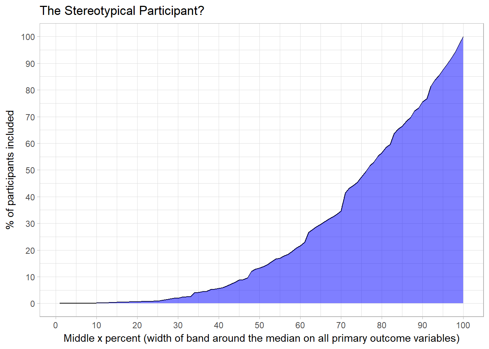<!-- -->

```r

# # This makes an inferior plot:
#
# middle_df2 <- NA
# 
# for(i in 1:100) {
# middle_df2[i] <- middleprobs(0.5 - i/2/100, 0.5 + i/2/100) / 706   
# }
# 
# meansplot_df2 <- data.frame(middle_band_width_perc = c(1:100), hi = 0.5 + middle_df2/2, lo = 0.5 - middle_df2/2)
# 
# meansplot_df <- data.frame(middle_band_width_perc = 1:100, perc_of_participants_included = middle_df)
#
# meansplot_df2 %>% 
#   ggplot(aes(y = 100 * hi, x = middle_band_width_perc)) +
#   geom_line() +
#   # geom_line(aes(y = 100 * lo, x = middle_band_width_perc)) +
#   labs(title = "The Stereotypical Participant?", 
#        y = "% of participants covered", 
#        x = "Definition of average (\"middle x percent\", or \"width of band around the median on all the variables\")") +
#   # geom_ribbon(aes(ymin = 0, ymax = 100 * hi), fill="blue", alpha="0.5") +
#   scale_y_continuous(breaks = seq(0, 100, by = 10)) +
#   scale_x_continuous(breaks = seq(0, 100, by = 10)) +
#   theme_light()

text_total_n <- sum(!is.na(df$mvpaAccelerometer_T1) & !is.na(df$padaysLastweek_T1))
```

We see that, for example, 1.5 percent of participants fell in the middle 30% of all four outcome variables. 

<!-- CIBER (not included for now) -->


```r
#p_install("userfriendlyscience")

# cat(names(df), sep = "\",\n\"")

# Make variables numeric, and d as data frame
d_num <- df %>% dplyr::mutate_all(as.numeric) 
d_num <- as.data.frame(d_num)

userfriendlyscience::CIBER(data = d_num,
      determinants = c(
        "actCop_T1",
        "agreementDependentBCT_T1",
        "amotivation_T1",
        "autonomous_T1",
        "big5_agreeableness_T1.1",
        "big5_conscientiousness_T1.1",
        "big5_extraversion_T1.1",
        "big5_neuroticism_T1.1",
        "big5_openness_T1.1",
        "controlled_T1",
        "descriptiveNorm_T1",
        "frequencyDependentBCT_T1",
        "goal_T1",
        "injunctiveNorm_T1",
        "intention_T1",
        "outcomeExpectations_T1",
        "opportunities_T1",
        "perceivedBehaviouralControl_T1",
        "selfefficacy_T1"),
      targets = c("paT1", "fatpct_T1"),
      conf.level = list(means = 0.9999,
                        associations = 0.99)
      )

userfriendlyscience::CIBER(data = d_num,
      determinants = c(
        "actCop_T1",
        "agreementDependentBCT_T1",
        "frequencyDependentBCT_T1",
        "amotivation_T1",
        "autonomous_T1",
        "controlled_T1",
        "descriptiveNorm_T1",
        "intention_T1",
        "outcomeExpectations_T1",
        "opportunities_T1",
        "seperceivedBehaviouralControl_T1"),
      targets = c("paT1", "fatpct_T1"),
      conf.level = list(means = 0.9999,
                        associations = 0.99)
      )

# to create variable list for CIBER:
# cat(names(d), sep = "\",\n\"")

userfriendlyscience::CIBER(data = d_num,
  determinants = c(
  "agreementDependentBCT_01_T1",
  "agreementDependentBCT_02_T1",
  "agreementDependentBCT_03_T1",
  "agreementDependentBCT_04_T1",
  "agreementDependentBCT_05_T1",
  "agreementDependentBCT_06_T1",
  "agreementDependentBCT_07_T1",
  "agreementDependentBCT_08_T1",
  "agreementDependentBCT_09_T1",
  "agreementDependentBCT_10_T1",
  "frequencyDependentBCT_01_T1",
  "frequencyDependentBCT_02_T1",
  "frequencyDependentBCT_03_T1",
  "frequencyDependentBCT_04_T1",
  "frequencyDependentBCT_05_T1",
  "frequencyDependentBCT_06_T1",
  "frequencyDependentBCT_07_T1",
  "frequencyDependentBCT_08_T1",
  "frequencyDependentBCT_09_T1"),
   targets = c("MVPA", "SB"),
  leftAnchors = rep("", 19),
  rightAnchors = rep("", 19))

userfriendlyscience::CIBER(data = d_num,
  determinants = c(
  "autonomous_01_T1",
  "autonomous_02_T1",
  "autonomous_03_T1",
  "autonomous_04_T1",
  "autonomous_05_T1",
  "autonomous_06_T1",
  "autonomous_07_T1",
  "autonomous_08_T1",
  "autonomous_09_T1"),
   targets = c("MVPA", "SB"),
  leftAnchors = rep("", 9),
  rightAnchors = rep("", 9))

userfriendlyscience::CIBER(data = d_num,
  determinants = c(
  "intention_01_T1",
  "intention_02_T1",
  "selfefficacy_01_T1",
  "selfefficacy_02_T1",
  "perceivedBehaviouralControl_01_T1",
  "perceivedBehaviouralControl_02_T1",
  "perceivedBehaviouralControl_03_T1",
  "norm_01_T1",
  "norm_02_T1",
  "outcomeExpectations_01_T1",
  "outcomeExpectations_02_T1",
  "outcomeExpectations_03_T1",
  "outcomeExpectations_04_T1",
  "outcomeExpectations_05_T1",
  "outcomeExpectations_06_T1",
  "outcomeExpectations_07_T1",
  "outcomeExpectations_08_T1",
  "outcomeExpectations_09_T1",
  "outcomeExpectations_10_T1",
  "outcomeExpectations_11_T1",
  "outcomeExpectations_12_T1"),
   targets = c("MVPA", "SB"),
  leftAnchors = rep("", 21),
  rightAnchors = rep("", 21))
```


# Symptoms


```r


# Create data frame
densplot <- df
levels(densplot$intervention) <- c("Control", "Intervention")
levels(densplot$girl) <- recode(densplot$girl, "boy" = "Boys", "girl" = "Girls")

# This gives side-by-side plots. There's a third plot below the two, which is fake to include x-axis text.
layout(matrix(c(1, 2, 3, 3), nrow = 2, ncol = 2, byrow = TRUE),
       widths = c(0.5, 0.5), heights = c(0.45, 0.05))

# Minimise whitespace; see https://stackoverflow.com/questions/15848942/how-to-reduce-space-gap-between-multiple-graphs-in-r
par(mai = c(0.3, 0.3, 0.1, 0.0)) 

## Girls vs. boys
# Choose only the variables needed and drop NA
dens <- densplot %>% dplyr::select(symptom_T1, girl) %>% 
  dplyr::filter(complete.cases(.))

# Set random number generator for reproducibility of bootstrap test of equal densities
set.seed(10)

# Make plot
sm.symptom_T1_2 <- sm.density.compare2(as.numeric(dens$symptom_T1), 
                                               as.factor(dens$girl), 
                                               model = "equal",
                                               xlab = "", ylab = "",
                                               col = viridis::viridis(4, end  =  0.8)[c(3, 1)], 
                                               lty = c(1, 3), yaxt = "n",
                                               bandcol = 'LightGray', 
                                               lwd = c(2, 2),
                                               xlim = c(1, 4))
## 
## Test of equal densities:  p-value =  0
legend("topright", levels(dens$girl), col = viridis::viridis(4, end = 0.8)[c(1, 3)], lty = c(3,1), lwd = (c(2,2)))
mtext(side = 2, "Density", line = 0.5)

## Intervention vs. control
# Choose only the variables needed and drop NA
dens <- densplot %>% dplyr::select(symptom_T1, intervention) %>% 
  dplyr::filter(complete.cases(.))

# Set random number generator for reproducibility of bootstrap test of equal densities
set.seed(10)
# Make plot
sm.symptom_T1_2 <- sm.density.compare2(as.numeric(dens$symptom_T1), 
                                               as.factor(dens$intervention), 
                                               model = "equal", 
                                               xlab = "", ylab = "",
                                               col = viridis::viridis(4, end = 0.8)[c(2, 4)], 
                                               lty = c(3, 1), yaxt = "n",
                                               bandcol = 'LightGray', 
                                               lwd = c(2, 2),
                                               xlim = c(1, 4))
## 
## Test of equal densities:  p-value =  0.64
legend("topright", levels(dens$intervention), col = viridis::viridis(4, end = 0.8)[c(2, 4)], lty=c(3,1), lwd=(c(2,2)))

# Create x-axis label. See https://stackoverflow.com/questions/11198767/how-to-annotate-across-or-between-plots-in-multi-plot-panels-in-r
par(mar = c(0,0,0,0)) 
plot(1, 1, type = "n", frame.plot = FALSE, axes = FALSE) # Fake plot for x-axis label
text(x = 1.02, y = 1.3, labels = "Symptom sumscore mean", pos = 1)
```

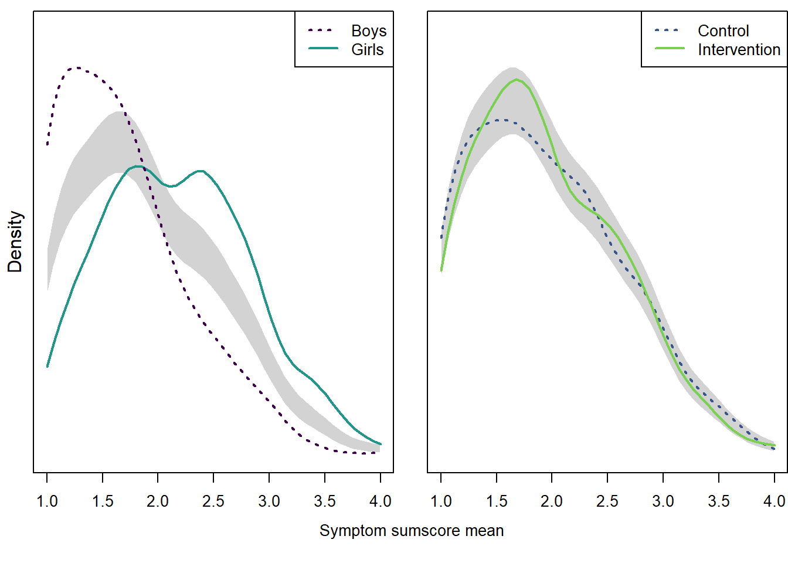<!-- -->

## Symptom histograms

### intervention / gender


```r

sympGirls <- df %>% dplyr::select(id,
  intervention,
  group,
  school,
  girl,
  "Neck and shoulder pain" = symptom_neckShoulderPain_T1,
  "Lower back pain" = symptom_lowerBackPain_T1,
  "Stomach ache" = symptom_stomachAche_T1,
  "Tension or nervousness" = symptom_tensionNervousness_T1,
  "Irritability or anger bursts" = symptom_irritabilityAngerbursts_T1,
  "Difficulty with sleep" = symptom_sleepDifficulty_T1,
  "Headache" = symptom_headAche_T1,
  "Tiredness or faintness" = symptom_tirednessFaintness_T1) %>%
 tidyr::gather(key = Variable, value = Value, 6:ncol(.)) %>%
  dplyr::filter(girl == "girl") %>% 
 ggplot2::ggplot(aes(x = Value, y = Variable, group = Variable)) +
  ggridges::geom_density_ridges2(aes(fill = Variable), stat = "binline", binwidth = 1, scale = 0.95) +
  scale_x_continuous(breaks = c(1:4), expand = c(0, 0),
                     name = "") +
  scale_y_discrete(expand = c(0.01, 0), name = "", labels = NULL) +
  ggridges::scale_fill_cyclical(values = c("darkolivegreen2", "darkolivegreen4")) +
  labs(title = "Girls") +
  guides(y = "none") +
  ggridges::theme_ridges(grid = FALSE) +
  theme(axis.title.x = element_text(hjust = 0.5),
        axis.title.y = element_text(hjust = 0.5),
        plot.title = element_text(hjust = 0.5, size = 10),
        axis.text=element_text(size=10, face="bold")) +
coord_cartesian(xlim = c(0.5, 4.5))

sympBoys <- df %>% dplyr::select(id,
  intervention,
  group,
  school,
  girl,
  "Neck and shoulder pain" = symptom_neckShoulderPain_T1,
  "Lower back pain" = symptom_lowerBackPain_T1,
  "Stomach ache" = symptom_stomachAche_T1,
  "Tension or nervousness" = symptom_tensionNervousness_T1,
  "Irritability or anger bursts" = symptom_irritabilityAngerbursts_T1,
  "Difficulty with sleep" = symptom_sleepDifficulty_T1,
  "Headache" = symptom_headAche_T1,
  "Tiredness or faintness" = symptom_tirednessFaintness_T1) %>%
 tidyr::gather(key = Variable, value = Value, 6:ncol(.)) %>%
  dplyr::filter(girl == "boy") %>% 
 ggplot2::ggplot(aes(x = Value, y = Variable, group = Variable)) +
  ggridges::geom_density_ridges2(aes(fill = Variable), stat = "binline", binwidth = 1, scale = 0.95) +
  scale_x_continuous(breaks = c(1:4), expand = c(0, 0),
                     name = "") +
  scale_y_discrete(expand = c(0.01, 0), name = "", labels = NULL) +
  ggridges::scale_fill_cyclical(values = c("darkolivegreen2", "darkolivegreen4")) +
  labs(title = "Boys") +
  guides(y = "none") +
  ggridges::theme_ridges(grid = FALSE) +
  theme(axis.title.x = element_text(hjust = 0.5),
        axis.title.y = element_text(hjust = 0.5),
        plot.title = element_text(hjust = 0.5, size = 10),
        axis.text=element_text(size=10, face="bold")) +
coord_cartesian(xlim = c(0.5, 4.5))

sympInt <- df %>% dplyr::select(id,
  intervention,
  group,
  school,
  girl,
  "Neck and shoulder pain" = symptom_neckShoulderPain_T1,
  "Lower back pain" = symptom_lowerBackPain_T1,
  "Stomach ache" = symptom_stomachAche_T1,
  "Tension or nervousness" = symptom_tensionNervousness_T1,
  "Irritability or anger bursts" = symptom_irritabilityAngerbursts_T1,
  "Difficulty with sleep" = symptom_sleepDifficulty_T1,
  "Headache" = symptom_headAche_T1,
  "Tiredness or faintness" = symptom_tirednessFaintness_T1) %>%
 tidyr::gather(key = Variable, value = Value, 6:ncol(.)) %>%
  dplyr::filter(intervention == "1") %>% 
 ggplot2::ggplot(aes(x = Value, y = Variable, group = Variable)) +
  ggridges::geom_density_ridges2(aes(fill = Variable), stat = "binline", binwidth = 1, scale = 0.95) +
  scale_x_continuous(breaks = c(1:4), expand = c(0, 0),
                     name = "") +
  scale_y_discrete(expand = c(0.01, 0), name = "") +
  ggridges::scale_fill_cyclical(values = c("deepskyblue", "deepskyblue4")) +
  labs(title = "Intervention") +
  guides(y = "none") +
  ggridges::theme_ridges(grid = FALSE) +
  theme(axis.title.x = element_text(hjust = 0.5),
        axis.title.y = element_text(hjust = 0.5),
        plot.title = element_text(hjust = 0.5, size = 10),
        axis.text=element_text(size=10)) +
coord_cartesian(xlim = c(0.5, 4.5))

sympCont <- df %>% dplyr::select(id,
  intervention,
  group,
  school,
  girl,
  "Neck and shoulder pain" = symptom_neckShoulderPain_T1,
  "Lower back pain" = symptom_lowerBackPain_T1,
  "Stomach ache" = symptom_stomachAche_T1,
  "Tension or nervousness" = symptom_tensionNervousness_T1,
  "Irritability or anger bursts" = symptom_irritabilityAngerbursts_T1,
  "Difficulty with sleep" = symptom_sleepDifficulty_T1,
  "Headache" = symptom_headAche_T1,
  "Tiredness or faintness" = symptom_tirednessFaintness_T1) %>%
 tidyr::gather(key = Variable, value = Value, 6:ncol(.)) %>%
  dplyr::filter(intervention == "0") %>% 
 ggplot2::ggplot(aes(x = Value, y = Variable, group = Variable)) +
  ggridges::geom_density_ridges2(aes(fill = Variable), stat = "binline", binwidth = 1, scale = 0.95) +
  scale_x_continuous(breaks = c(1:4), expand = c(0, 0),
                     name = "") +
  scale_y_discrete(expand = c(0.01, 0), name = "", labels = NULL) +
  ggridges::scale_fill_cyclical(values = c("deepskyblue", "deepskyblue4")) +
  labs(title = "Control") +
  guides(y = "none") +
  ggridges::theme_ridges(grid = FALSE) +
  theme(axis.title.x = element_text(hjust = 0.5),
        axis.title.y = element_text(hjust = 0.5),
        plot.title = element_text(hjust = 0.5, size = 10),
        axis.text=element_text(size=10, face="bold")) +
coord_cartesian(xlim = c(0.5, 4.5))

#grid.arrange(sympInt, sympGirls, sympCont, sympBoys, ncol = 2)

# ("Seldom or never", "About once a month", "About once a week", "Almost daily")

# This draws all histograms next to each other:
grid::grid.newpage()
grid::grid.draw(cbind(ggplot2::ggplotGrob(sympInt), ggplot2::ggplotGrob(sympCont), ggplot2::ggplotGrob(sympGirls), ggplot2::ggplotGrob(sympBoys), size = "last"))
```

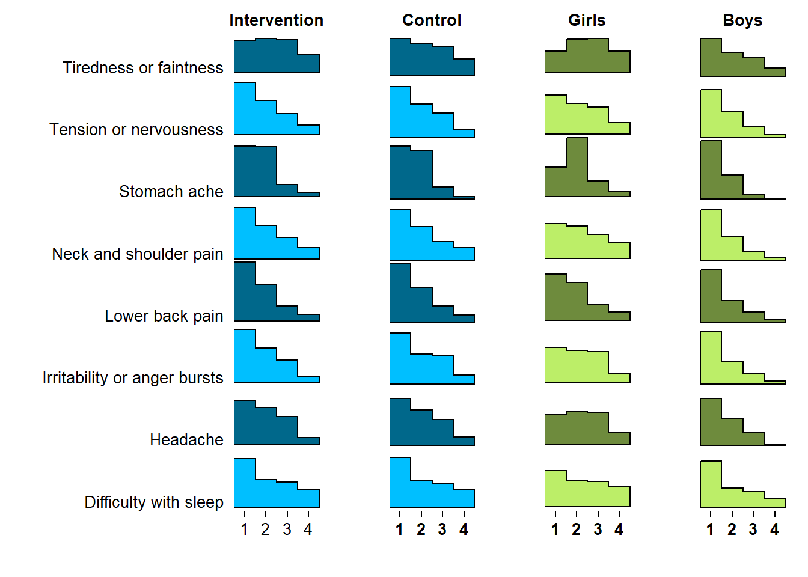<!-- -->

```r

# This draws 2 histograms per row:
#grid.newpage()
#grid.draw(rbind(cbind(ggplot2::ggplotGrob(sympInt), ggplot2::ggplotGrob(sympCont), size = "last"), cbind(ggplot2::ggplotGrob(sympGirls), ggplot2::ggplotGrob(sympBoys), size = "last")))

```

### educational track


```r
trackColors <- viridis::viridis(13)

sympHRC <- df %>% dplyr::select(id,
  intervention,
  track,
  school,
  girl,
  "Neck and shoulder pain" = symptom_neckShoulderPain_T1,
  "Lower back pain" = symptom_lowerBackPain_T1,
  "Stomach ache" = symptom_stomachAche_T1,
  "Tension or nervousness" = symptom_tensionNervousness_T1,
  "Irritability or anger bursts" = symptom_irritabilityAngerbursts_T1,
  "Difficulty with sleep" = symptom_sleepDifficulty_T1,
  "Headache" = symptom_headAche_T1,
  "Tiredness or faintness" = symptom_tirednessFaintness_T1) %>%
 tidyr::gather(key = Variable, value = Value, 6:ncol(.)) %>%
  dplyr::filter(track == "HRC") %>% 
 ggplot2::ggplot(aes(x = Value, y = Variable, group = Variable)) +
  ggridges::geom_density_ridges2(aes(fill = Variable), stat = "binline", binwidth = 1, scale = 0.95) +
  scale_x_continuous(breaks = c(1:4), expand = c(0, 0),
                     name = "") +
  scale_y_discrete(expand = c(0.01, 0), name = "", labels = NULL) +
  ggridges::scale_fill_cyclical(values = trackColors[4:5]) +
  labs(title = "HRC") +
  guides(y = "none") +
  ggridges::theme_ridges(grid = FALSE) +
  theme(axis.title.x = element_text(hjust = 0.5),
        axis.title.y = element_text(hjust = 0.5),
        plot.title = element_text(hjust = 0.5, size = 10),
        axis.text=element_text(size=10)) +
  coord_cartesian(xlim = c(0.5, 4.5))

sympNur <- df %>% dplyr::select(id,
  intervention,
  track,
  school,
  girl,
  "Neck and shoulder pain" = symptom_neckShoulderPain_T1,
  "Lower back pain" = symptom_lowerBackPain_T1,
  "Stomach ache" = symptom_stomachAche_T1,
  "Tension or nervousness" = symptom_tensionNervousness_T1,
  "Irritability or anger bursts" = symptom_irritabilityAngerbursts_T1,
  "Difficulty with sleep" = symptom_sleepDifficulty_T1,
  "Headache" = symptom_headAche_T1,
  "Tiredness or faintness" = symptom_tirednessFaintness_T1) %>%
 tidyr::gather(key = Variable, value = Value, 6:ncol(.)) %>%
  dplyr::filter(track == "Nur") %>% 
 ggplot2::ggplot(aes(x = Value, y = Variable, group = Variable)) +
  ggridges::geom_density_ridges2(aes(fill = Variable), stat = "binline", binwidth = 1, scale = 0.95) +
  scale_x_continuous(breaks = c(1:4), expand = c(0, 0),
                     name = "") +
  scale_y_discrete(expand = c(0.01, 0), name = "") +
  ggridges::scale_fill_cyclical(values = c(values = trackColors[1:2])) +
  labs(title = "Nur") +
  guides(y = "none") +
  ggridges::theme_ridges(grid = FALSE) +
  theme(axis.title.x = element_text(hjust = 0.5),
        axis.title.y = element_text(hjust = 0.5),
        plot.title = element_text(hjust = 0.5, size = 10),
        axis.text=element_text(size=10)) +
  coord_cartesian(xlim = c(0.5, 4.5))

sympIT <- df %>% dplyr::select(id,
  intervention,
  track,
  school,
  girl,
  "Neck and shoulder pain" = symptom_neckShoulderPain_T1,
  "Lower back pain" = symptom_lowerBackPain_T1,
  "Stomach ache" = symptom_stomachAche_T1,
  "Tension or nervousness" = symptom_tensionNervousness_T1,
  "Irritability or anger bursts" = symptom_irritabilityAngerbursts_T1,
  "Difficulty with sleep" = symptom_sleepDifficulty_T1,
  "Headache" = symptom_headAche_T1,
  "Tiredness or faintness" = symptom_tirednessFaintness_T1) %>%
 tidyr::gather(key = Variable, value = Value, 6:ncol(.)) %>%
  dplyr::filter(track == "IT") %>% 
 ggplot2::ggplot(aes(x = Value, y = Variable, group = Variable)) +
  ggridges::geom_density_ridges2(aes(fill = Variable), stat = "binline", binwidth = 1, scale = 0.95) +
  scale_x_continuous(breaks = c(1:4), expand = c(0, 0),
                     name = "") +
  scale_y_discrete(expand = c(0.01, 0), name = "", labels = NULL) +
  ggridges::scale_fill_cyclical(values = c(values = trackColors[12:13])) +
  labs(title = "IT") +
  guides(y = "none") +
  ggridges::theme_ridges(grid = FALSE) +
  theme(axis.title.x = element_text(hjust = 0.5),
        axis.title.y = element_text(hjust = 0.5),
        plot.title = element_text(hjust = 0.5, size = 10),
        axis.text=element_text(size=10)) +
  coord_cartesian(xlim = c(0.5, 4.5))

sympBA <- df %>% dplyr::select(id,
  intervention,
  track,
  school,
  girl,
  "Neck and shoulder pain" = symptom_neckShoulderPain_T1,
  "Lower back pain" = symptom_lowerBackPain_T1,
  "Stomach ache" = symptom_stomachAche_T1,
  "Tension or nervousness" = symptom_tensionNervousness_T1,
  "Irritability or anger bursts" = symptom_irritabilityAngerbursts_T1,
  "Difficulty with sleep" = symptom_sleepDifficulty_T1,
  "Headache" = symptom_headAche_T1,
  "Tiredness or faintness" = symptom_tirednessFaintness_T1) %>%
 tidyr::gather(key = Variable, value = Value, 6:ncol(.)) %>%
  dplyr::filter(track == "BA") %>% 
 ggplot2::ggplot(aes(x = Value, y = Variable, group = Variable)) +
  ggridges::geom_density_ridges2(aes(fill = Variable), stat = "binline", binwidth = 1, scale = 0.95) +
  scale_x_continuous(breaks = c(1:4), expand = c(0, 0),
                     name = "") +
  scale_y_discrete(expand = c(0.01, 0), name = "", labels = NULL) +
  ggridges::scale_fill_cyclical(values = c(values = trackColors[8:9])) +
  labs(title = "BA") +
  guides(y = "none") +
  ggridges::theme_ridges(grid = FALSE) +
  theme(axis.title.x = element_text(hjust = 0.5),
        axis.title.y = element_text(hjust = 0.5),
        plot.title = element_text(hjust = 0.5, size = 10),
        axis.text=element_text(size=10)) +
  coord_cartesian(xlim = c(0.5, 4.5))

#grid.arrange(sympIT, sympHRC, sympBA, sympNur, ncol = 2)

# ("Seldom or never", "About once a month", "About once a week", "Almost daily")

# This draws all histograms next to each other:
# grid::grid.newpage()
# grid::grid.draw(cbind(ggplot2::ggplotGrob(sympIT), ggplot2::ggplotGrob(sympBA), ggplot2::ggplotGrob(sympHRC), ggplot2::ggplotGrob(sympNur), size = "last"))

# This draws 2 histograms per row:
#grid.newpage()
#grid.draw(rbind(cbind(ggplot2::ggplotGrob(sympIT), ggplot2::ggplotGrob(sympBA), size = "last"), cbind(ggplot2::ggplotGrob(sympHRC), ggplot2::ggplotGrob(sympNur), size = "last")))

(sympNur | sympHRC | sympBA | sympIT)
```

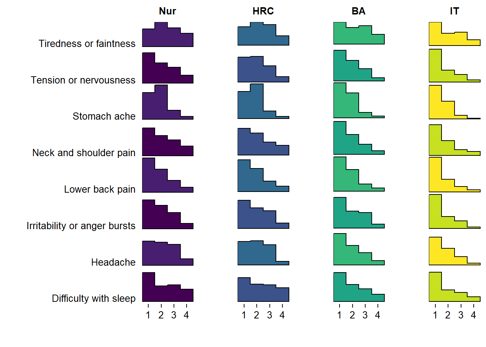<!-- -->

# Perception of one's classroom

The following questions started with the item stem:

**In this group of students, I feel like...**

## ... I'm supported


```r

plot1 <- df %>% dplyr::select(id,
                              track = track,
                              girl,
                              GroupQuestion = groupSupportsMe_T1)  %>%
  dplyr::filter(!is.na(track), track != "Other") %>% # Drop category "Other"
  dplyr::mutate(track = factor(track, levels = c("IT", "BA", "HRC", "Nur")),
                track = recode_factor(track, "IT" = "IT", "BA" = "BA", 
                                      "HRC" = "HRC", "Nur" = "Nur")) %>% 
  ggplot2::ggplot(aes(y = track)) +
  ggridges::geom_density_ridges2(aes(x = GroupQuestion, colour = "black", 
                                    fill = paste(track, girl),
                                    point_color = girl,
                                    point_fill = girl,
                                    point_shape = girl),
                                  scale = .75, alpha = 0.6, size = 0.25,
                                  position = position_raincloud(width = 0.05, height = 0.15),
                                  from = 1, to = 5,
                                  jittered_points = TRUE,
                                  point_size = 1) +
  labs(x = NULL,
       y = NULL) +
  scale_y_discrete(expand = c(0.1, 0)) +
  scale_x_continuous(expand = c(0.01, 0)) +
  ggridges::scale_fill_cyclical(
                                labels = c('BA boy' = "Boy", 'BA girl' = "Girl"),
                                values = viridis::viridis(4, end = 0.8)[c(1, 3)],
                                name = "", 
                                guide = guide_legend(override.aes = list(alpha = 1, 
                                                                         point_shape = c(3, 4),
                                                                         point_size = 2))) +
  ggridges::scale_colour_cyclical(values = "black") +
  ggridges::theme_ridges(grid = FALSE) +
  # ggplot2::scale_fill_manual(values = c("#A0FFA0", "#A0A0FF")) +
  ggridges::scale_discrete_manual(aesthetics = "point_color", 
                                  values = viridis::viridis(4, end = 0.8)[c(3, 1)],
                                  guide = "none") +
  ggridges::scale_discrete_manual(aesthetics = "point_fill",
                                  values = viridis::viridis(4, end = 0.8)[c(3, 1)],
                                  guide = "none") +
  ggridges::scale_discrete_manual(aesthetics = "point_shape", 
                                  values = c(4, 3),
                                  guide = "none") +
  papaja::theme_apa() +
  theme(legend.position = "bottom")

# Draw plot with intervention and control densities

plot2 <- df %>% dplyr::select(id,
                              track = track,
                              intervention,
                              GroupQuestion = groupSupportsMe_T1)  %>%
  dplyr::filter(!is.na(track), track != "Other") %>% # Drop category "Other"
  dplyr::mutate(track = factor(track, levels = c("IT", "BA", "HRC", "Nur")),
                track = recode_factor(track, "IT" = "IT", "BA" = "BA", 
                                      "HRC" = "HRC", "Nur" = "Nur")) %>% 
  ggplot2::ggplot(aes(y = track)) +
  ggridges::geom_density_ridges2(aes(x = GroupQuestion, colour = "black", 
                                    fill = paste(track, intervention),
                                    point_color = intervention,
                                    point_fill = intervention,
                                    point_shape = intervention),
                                  scale = .75, alpha = 0.6, size = 0.25,
                                  position = position_raincloud(width = 0.05, height = 0.15),
                                  from = 1, to = 5,
                                  jittered_points = TRUE,
                                  point_size = 1) +
  labs(x = NULL,
       y = NULL) +
  scale_y_discrete(expand = c(0.1, 0), labels = NULL) +
  scale_x_continuous(expand = c(0.01, 0)) +
  ggridges::scale_fill_cyclical(
                                labels = c('BA 0' = "Control", 'BA 1' = "Intervention"),
                                values = viridis::viridis(4, end = 0.8)[c(2, 4)],
                                name = "", 
                                guide = guide_legend(override.aes = list(alpha = 1, 
                                                                         point_shape = c(4, 3),
                                                                         point_size = 2))) +
  ggridges::scale_colour_cyclical(values = "black") +
  ggridges::theme_ridges(grid = FALSE) +
  # ggplot2::scale_fill_manual(values = c("#A0FFA0", "#A0A0FF")) +
  ggridges::scale_discrete_manual(aesthetics = "point_color", 
                                  values = viridis::viridis(4, end = 0.8)[c(2, 4)],
                                  guide = "none") +
  ggridges::scale_discrete_manual(aesthetics = "point_fill",
                                  values = viridis::viridis(4, end = 0.8)[c(2, 4)],
                                  guide = "none") +
  ggridges::scale_discrete_manual(aesthetics = "point_shape", 
                                  values = c(4, 3),
                                  guide = "none") +
  ggridges::scale_discrete_manual(aesthetics = "point_alpha", 
                                  values = 0.06,
                                  guide = "none") +
  papaja::theme_apa() +
  theme(legend.position = "bottom")

plot1 + plot2
```

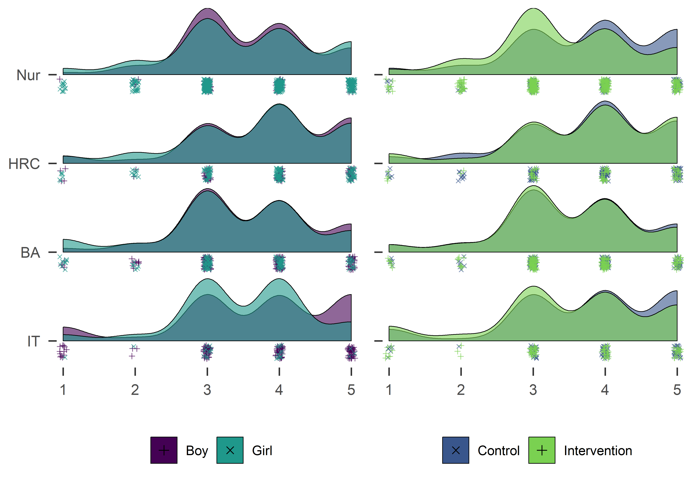

## ... I'm listened to


```r

plot1 <- df %>% dplyr::select(id,
                              track = track,
                              girl,
                              GroupQuestion = groupListensToMe_T1)  %>%
  dplyr::filter(!is.na(track), track != "Other") %>% # Drop category "Other"
  dplyr::mutate(track = factor(track, levels = c("IT", "BA", "HRC", "Nur")),
                track = recode_factor(track, "IT" = "IT", "BA" = "BA", 
                                      "HRC" = "HRC", "Nur" = "Nur")) %>% 
  ggplot2::ggplot(aes(y = track)) +
  ggridges::geom_density_ridges2(aes(x = GroupQuestion, colour = "black", 
                                    fill = paste(track, girl),
                                    point_color = girl,
                                    point_fill = girl,
                                    point_shape = girl),
                                  scale = .75, alpha = 0.6, size = 0.25,
                                  position = position_raincloud(width = 0.05, height = 0.15),
                                  from = 1, to = 5,
                                  jittered_points = TRUE,
                                  point_size = 1) +
  labs(x = NULL,
       y = NULL) +
  scale_y_discrete(expand = c(0.1, 0)) +
  scale_x_continuous(expand = c(0.01, 0)) +
  ggridges::scale_fill_cyclical(
                                labels = c('BA boy' = "Boy", 'BA girl' = "Girl"),
                                values = viridis::viridis(4, end = 0.8)[c(1, 3)],
                                name = "", 
                                guide = guide_legend(override.aes = list(alpha = 1, 
                                                                         point_shape = c(3, 4),
                                                                         point_size = 2))) +
  ggridges::scale_colour_cyclical(values = "black") +
  ggridges::theme_ridges(grid = FALSE) +
  # ggplot2::scale_fill_manual(values = c("#A0FFA0", "#A0A0FF")) +
  ggridges::scale_discrete_manual(aesthetics = "point_color", 
                                  values = viridis::viridis(4, end = 0.8)[c(3, 1)],
                                  guide = "none") +
  ggridges::scale_discrete_manual(aesthetics = "point_fill",
                                  values = viridis::viridis(4, end = 0.8)[c(3, 1)],
                                  guide = "none") +
  ggridges::scale_discrete_manual(aesthetics = "point_shape", 
                                  values = c(4, 3),
                                  guide = "none") +
  papaja::theme_apa() +
  theme(legend.position = "bottom")

# Draw plot with intervention and control densities

plot2 <- df %>% dplyr::select(id,
                              track = track,
                              intervention,
                              GroupQuestion = groupListensToMe_T1)  %>%
  dplyr::filter(!is.na(track), track != "Other") %>% # Drop category "Other"
  dplyr::mutate(track = factor(track, levels = c("IT", "BA", "HRC", "Nur")),
                track = recode_factor(track, "IT" = "IT", "BA" = "BA", 
                                      "HRC" = "HRC", "Nur" = "Nur")) %>% 
  ggplot2::ggplot(aes(y = track)) +
  ggridges::geom_density_ridges2(aes(x = GroupQuestion, colour = "black", 
                                    fill = paste(track, intervention),
                                    point_color = intervention,
                                    point_fill = intervention,
                                    point_shape = intervention),
                                  scale = .75, alpha = 0.6, size = 0.25,
                                  position = position_raincloud(width = 0.05, height = 0.15),
                                  from = 1, to = 5,
                                  jittered_points = TRUE,
                                  point_size = 1) +
  labs(x = NULL,
       y = NULL) +
  scale_y_discrete(expand = c(0.1, 0), labels = NULL) +
  scale_x_continuous(expand = c(0.01, 0)) +
  ggridges::scale_fill_cyclical(
                                labels = c('BA 0' = "Control", 'BA 1' = "Intervention"),
                                values = viridis::viridis(4, end = 0.8)[c(2, 4)],
                                name = "", 
                                guide = guide_legend(override.aes = list(alpha = 1, 
                                                                         point_shape = c(4, 3),
                                                                         point_size = 2))) +
  ggridges::scale_colour_cyclical(values = "black") +
  ggridges::theme_ridges(grid = FALSE) +
  # ggplot2::scale_fill_manual(values = c("#A0FFA0", "#A0A0FF")) +
  ggridges::scale_discrete_manual(aesthetics = "point_color", 
                                  values = viridis::viridis(4, end = 0.8)[c(2, 4)],
                                  guide = "none") +
  ggridges::scale_discrete_manual(aesthetics = "point_fill",
                                  values = viridis::viridis(4, end = 0.8)[c(2, 4)],
                                  guide = "none") +
  ggridges::scale_discrete_manual(aesthetics = "point_shape", 
                                  values = c(4, 3),
                                  guide = "none") +
  ggridges::scale_discrete_manual(aesthetics = "point_alpha", 
                                  values = 0.06,
                                  guide = "none") +
  papaja::theme_apa() +
  theme(legend.position = "bottom")

plot1 + plot2
```

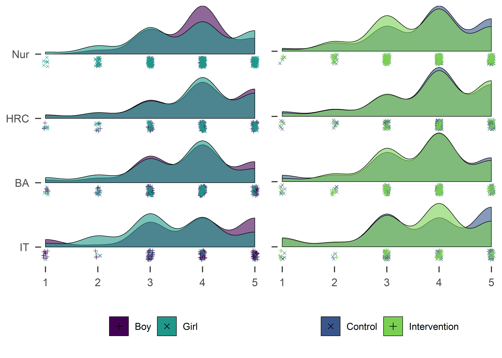

## ... I'm understood


```r

plot1 <- df %>% dplyr::select(id,
                              track = track,
                              girl,
                              GroupQuestion = groupUnderstandsMe_T1)  %>%
  dplyr::filter(!is.na(track), track != "Other") %>% # Drop category "Other"
  dplyr::mutate(track = factor(track, levels = c("IT", "BA", "HRC", "Nur")),
                track = recode_factor(track, "IT" = "IT", "BA" = "BA", 
                                      "HRC" = "HRC", "Nur" = "Nur")) %>% 
  ggplot2::ggplot(aes(y = track)) +
  ggridges::geom_density_ridges2(aes(x = GroupQuestion, colour = "black", 
                                    fill = paste(track, girl),
                                    point_color = girl,
                                    point_fill = girl,
                                    point_shape = girl),
                                  scale = .75, alpha = 0.6, size = 0.25,
                                  position = position_raincloud(width = 0.05, height = 0.15),
                                  from = 1, to = 5,
                                  jittered_points = TRUE,
                                  point_size = 1) +
  labs(x = NULL,
       y = NULL) +
  scale_y_discrete(expand = c(0.1, 0)) +
  scale_x_continuous(expand = c(0.01, 0)) +
  ggridges::scale_fill_cyclical(
                                labels = c('BA boy' = "Boy", 'BA girl' = "Girl"),
                                values = viridis::viridis(4, end = 0.8)[c(1, 3)],
                                name = "", 
                                guide = guide_legend(override.aes = list(alpha = 1, 
                                                                         point_shape = c(3, 4),
                                                                         point_size = 2))) +
  ggridges::scale_colour_cyclical(values = "black") +
  ggridges::theme_ridges(grid = FALSE) +
  # ggplot2::scale_fill_manual(values = c("#A0FFA0", "#A0A0FF")) +
  ggridges::scale_discrete_manual(aesthetics = "point_color", 
                                  values = viridis::viridis(4, end = 0.8)[c(3, 1)],
                                  guide = "none") +
  ggridges::scale_discrete_manual(aesthetics = "point_fill",
                                  values = viridis::viridis(4, end = 0.8)[c(3, 1)],
                                  guide = "none") +
  ggridges::scale_discrete_manual(aesthetics = "point_shape", 
                                  values = c(4, 3),
                                  guide = "none") +
  papaja::theme_apa() +
  theme(legend.position = "bottom")

# Draw plot with intervention and control densities

plot2 <- df %>% dplyr::select(id,
                              track = track,
                              intervention,
                              GroupQuestion = groupUnderstandsMe_T1)  %>%
  dplyr::filter(!is.na(track), track != "Other") %>% # Drop category "Other"
  dplyr::mutate(track = factor(track, levels = c("IT", "BA", "HRC", "Nur")),
                track = recode_factor(track, "IT" = "IT", "BA" = "BA", 
                                      "HRC" = "HRC", "Nur" = "Nur")) %>% 
  ggplot2::ggplot(aes(y = track)) +
  ggridges::geom_density_ridges2(aes(x = GroupQuestion, colour = "black", 
                                    fill = paste(track, intervention),
                                    point_color = intervention,
                                    point_fill = intervention,
                                    point_shape = intervention),
                                  scale = .75, alpha = 0.6, size = 0.25,
                                  position = position_raincloud(width = 0.05, height = 0.15),
                                  from = 1, to = 5,
                                  jittered_points = TRUE,
                                  point_size = 1) +
  labs(x = NULL,
       y = NULL) +
  scale_y_discrete(expand = c(0.1, 0), labels = NULL) +
  scale_x_continuous(expand = c(0.01, 0)) +
  ggridges::scale_fill_cyclical(
                                labels = c('BA 0' = "Control", 'BA 1' = "Intervention"),
                                values = viridis::viridis(4, end = 0.8)[c(2, 4)],
                                name = "", 
                                guide = guide_legend(override.aes = list(alpha = 1, 
                                                                         point_shape = c(4, 3),
                                                                         point_size = 2))) +
  ggridges::scale_colour_cyclical(values = "black") +
  ggridges::theme_ridges(grid = FALSE) +
  # ggplot2::scale_fill_manual(values = c("#A0FFA0", "#A0A0FF")) +
  ggridges::scale_discrete_manual(aesthetics = "point_color", 
                                  values = viridis::viridis(4, end = 0.8)[c(2, 4)],
                                  guide = "none") +
  ggridges::scale_discrete_manual(aesthetics = "point_fill",
                                  values = viridis::viridis(4, end = 0.8)[c(2, 4)],
                                  guide = "none") +
  ggridges::scale_discrete_manual(aesthetics = "point_shape", 
                                  values = c(4, 3),
                                  guide = "none") +
  ggridges::scale_discrete_manual(aesthetics = "point_alpha", 
                                  values = 0.06,
                                  guide = "none") +
  papaja::theme_apa() +
  theme(legend.position = "bottom")

plot1 + plot2
```

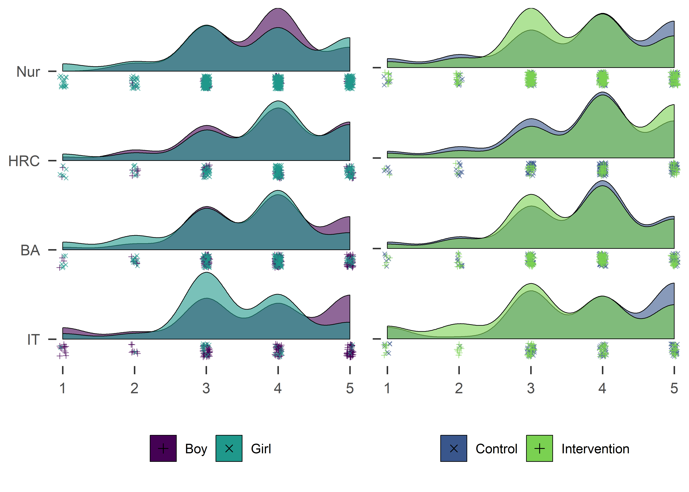

## ... I'm valued


```r

plot1 <- df %>% dplyr::select(id,
                              track = track,
                              girl,
                              GroupQuestion = groupValuesMe_T1)  %>%
  dplyr::filter(!is.na(track), track != "Other") %>% # Drop category "Other"
  dplyr::mutate(track = factor(track, levels = c("IT", "BA", "HRC", "Nur")),
                track = recode_factor(track, "IT" = "IT", "BA" = "BA", 
                                      "HRC" = "HRC", "Nur" = "Nur")) %>% 
  ggplot2::ggplot(aes(y = track)) +
  ggridges::geom_density_ridges2(aes(x = GroupQuestion, colour = "black", 
                                    fill = paste(track, girl),
                                    point_color = girl,
                                    point_fill = girl,
                                    point_shape = girl),
                                  scale = .75, alpha = 0.6, size = 0.25,
                                  position = position_raincloud(width = 0.05, height = 0.15),
                                  from = 1, to = 5,
                                  jittered_points = TRUE,
                                  point_size = 1) +
  labs(x = NULL,
       y = NULL) +
  scale_y_discrete(expand = c(0.1, 0)) +
  scale_x_continuous(expand = c(0.01, 0)) +
  ggridges::scale_fill_cyclical(
                                labels = c('BA boy' = "Boy", 'BA girl' = "Girl"),
                                values = viridis::viridis(4, end = 0.8)[c(1, 3)],
                                name = "", 
                                guide = guide_legend(override.aes = list(alpha = 1, 
                                                                         point_shape = c(3, 4),
                                                                         point_size = 2))) +
  ggridges::scale_colour_cyclical(values = "black") +
  ggridges::theme_ridges(grid = FALSE) +
  # ggplot2::scale_fill_manual(values = c("#A0FFA0", "#A0A0FF")) +
  ggridges::scale_discrete_manual(aesthetics = "point_color", 
                                  values = viridis::viridis(4, end = 0.8)[c(3, 1)],
                                  guide = "none") +
  ggridges::scale_discrete_manual(aesthetics = "point_fill",
                                  values = viridis::viridis(4, end = 0.8)[c(3, 1)],
                                  guide = "none") +
  ggridges::scale_discrete_manual(aesthetics = "point_shape", 
                                  values = c(4, 3),
                                  guide = "none") +
  papaja::theme_apa() +
  theme(legend.position = "bottom")

# Draw plot with intervention and control densities

plot2 <- df %>% dplyr::select(id,
                              track = track,
                              intervention,
                              GroupQuestion = groupValuesMe_T1)  %>%
  dplyr::filter(!is.na(track), track != "Other") %>% # Drop category "Other"
  dplyr::mutate(track = factor(track, levels = c("IT", "BA", "HRC", "Nur")),
                track = recode_factor(track, "IT" = "IT", "BA" = "BA", 
                                      "HRC" = "HRC", "Nur" = "Nur")) %>% 
  ggplot2::ggplot(aes(y = track)) +
  ggridges::geom_density_ridges2(aes(x = GroupQuestion, colour = "black", 
                                    fill = paste(track, intervention),
                                    point_color = intervention,
                                    point_fill = intervention,
                                    point_shape = intervention),
                                  scale = .75, alpha = 0.6, size = 0.25,
                                  position = position_raincloud(width = 0.05, height = 0.15),
                                  from = 1, to = 5,
                                  jittered_points = TRUE,
                                  point_size = 1) +
  labs(x = NULL,
       y = NULL) +
  scale_y_discrete(expand = c(0.1, 0), labels = NULL) +
  scale_x_continuous(expand = c(0.01, 0)) +
  ggridges::scale_fill_cyclical(
                                labels = c('BA 0' = "Control", 'BA 1' = "Intervention"),
                                values = viridis::viridis(4, end = 0.8)[c(2, 4)],
                                name = "", 
                                guide = guide_legend(override.aes = list(alpha = 1, 
                                                                         point_shape = c(4, 3),
                                                                         point_size = 2))) +
  ggridges::scale_colour_cyclical(values = "black") +
  ggridges::theme_ridges(grid = FALSE) +
  # ggplot2::scale_fill_manual(values = c("#A0FFA0", "#A0A0FF")) +
  ggridges::scale_discrete_manual(aesthetics = "point_color", 
                                  values = viridis::viridis(4, end = 0.8)[c(2, 4)],
                                  guide = "none") +
  ggridges::scale_discrete_manual(aesthetics = "point_fill",
                                  values = viridis::viridis(4, end = 0.8)[c(2, 4)],
                                  guide = "none") +
  ggridges::scale_discrete_manual(aesthetics = "point_shape", 
                                  values = c(4, 3),
                                  guide = "none") +
  ggridges::scale_discrete_manual(aesthetics = "point_alpha", 
                                  values = 0.06,
                                  guide = "none") +
  papaja::theme_apa() +
  theme(legend.position = "bottom")

plot1 + plot2
```

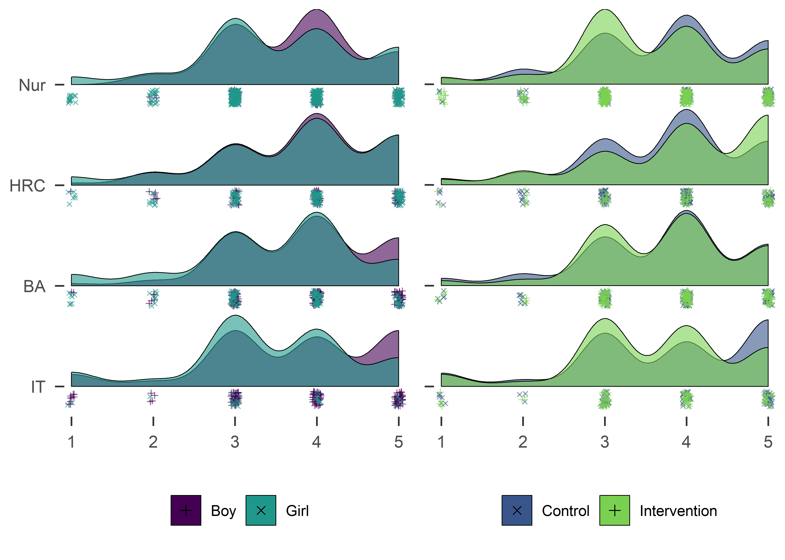

## ... I'm safe


```r

plot1 <- df %>% dplyr::select(id,
                              track = track,
                              girl,
                              GroupQuestion = groupFeelsSafe_T1)  %>%
  dplyr::filter(!is.na(track), track != "Other") %>% # Drop category "Other"
  dplyr::mutate(track = factor(track, levels = c("IT", "BA", "HRC", "Nur")),
                track = recode_factor(track, "IT" = "IT", "BA" = "BA", 
                                      "HRC" = "HRC", "Nur" = "Nur")) %>% 
  ggplot2::ggplot(aes(y = track)) +
  ggridges::geom_density_ridges2(aes(x = GroupQuestion, colour = "black", 
                                    fill = paste(track, girl),
                                    point_color = girl,
                                    point_fill = girl,
                                    point_shape = girl),
                                  scale = .75, alpha = 0.6, size = 0.25,
                                  position = position_raincloud(width = 0.05, height = 0.15),
                                  from = 1, to = 5,
                                  jittered_points = TRUE,
                                  point_size = 1) +
  labs(x = NULL,
       y = NULL) +
  scale_y_discrete(expand = c(0.1, 0)) +
  scale_x_continuous(expand = c(0.01, 0)) +
  ggridges::scale_fill_cyclical(
                                labels = c('BA boy' = "Boy", 'BA girl' = "Girl"),
                                values = viridis::viridis(4, end = 0.8)[c(1, 3)],
                                name = "", 
                                guide = guide_legend(override.aes = list(alpha = 1, 
                                                                         point_shape = c(3, 4),
                                                                         point_size = 2))) +
  ggridges::scale_colour_cyclical(values = "black") +
  ggridges::theme_ridges(grid = FALSE) +
  # ggplot2::scale_fill_manual(values = c("#A0FFA0", "#A0A0FF")) +
  ggridges::scale_discrete_manual(aesthetics = "point_color", 
                                  values = viridis::viridis(4, end = 0.8)[c(3, 1)],
                                  guide = "none") +
  ggridges::scale_discrete_manual(aesthetics = "point_fill",
                                  values = viridis::viridis(4, end = 0.8)[c(3, 1)],
                                  guide = "none") +
  ggridges::scale_discrete_manual(aesthetics = "point_shape", 
                                  values = c(4, 3),
                                  guide = "none") +
  papaja::theme_apa() +
  theme(legend.position = "bottom")

# Draw plot with intervention and control densities

plot2 <- df %>% dplyr::select(id,
                              track = track,
                              intervention,
                              GroupQuestion = groupFeelsSafe_T1)  %>%
  dplyr::filter(!is.na(track), track != "Other") %>% # Drop category "Other"
  dplyr::mutate(track = factor(track, levels = c("IT", "BA", "HRC", "Nur")),
                track = recode_factor(track, "IT" = "IT", "BA" = "BA", 
                                      "HRC" = "HRC", "Nur" = "Nur")) %>% 
  ggplot2::ggplot(aes(y = track)) +
  ggridges::geom_density_ridges2(aes(x = GroupQuestion, colour = "black", 
                                    fill = paste(track, intervention),
                                    point_color = intervention,
                                    point_fill = intervention,
                                    point_shape = intervention),
                                  scale = .75, alpha = 0.6, size = 0.25,
                                  position = position_raincloud(width = 0.05, height = 0.15),
                                  from = 1, to = 5,
                                  jittered_points = TRUE,
                                  point_size = 1) +
  labs(x = NULL,
       y = NULL) +
  scale_y_discrete(expand = c(0.1, 0), labels = NULL) +
  scale_x_continuous(expand = c(0.01, 0)) +
  ggridges::scale_fill_cyclical(
                                labels = c('BA 0' = "Control", 'BA 1' = "Intervention"),
                                values = viridis::viridis(4, end = 0.8)[c(2, 4)],
                                name = "", 
                                guide = guide_legend(override.aes = list(alpha = 1, 
                                                                         point_shape = c(4, 3),
                                                                         point_size = 2))) +
  ggridges::scale_colour_cyclical(values = "black") +
  ggridges::theme_ridges(grid = FALSE) +
  # ggplot2::scale_fill_manual(values = c("#A0FFA0", "#A0A0FF")) +
  ggridges::scale_discrete_manual(aesthetics = "point_color", 
                                  values = viridis::viridis(4, end = 0.8)[c(2, 4)],
                                  guide = "none") +
  ggridges::scale_discrete_manual(aesthetics = "point_fill",
                                  values = viridis::viridis(4, end = 0.8)[c(2, 4)],
                                  guide = "none") +
  ggridges::scale_discrete_manual(aesthetics = "point_shape", 
                                  values = c(4, 3),
                                  guide = "none") +
  ggridges::scale_discrete_manual(aesthetics = "point_alpha", 
                                  values = 0.06,
                                  guide = "none") +
  papaja::theme_apa() +
  theme(legend.position = "bottom")

plot1 + plot2
```

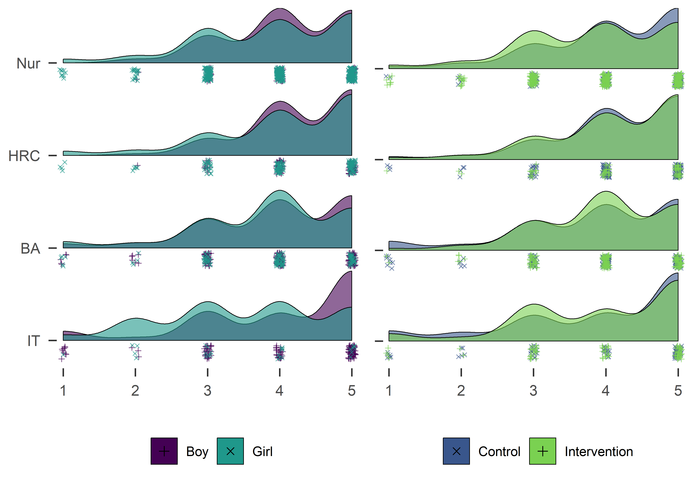

# Session information

Description of the R environment can be found below.


```r
devtools::session_info()
## - Session info ----------------------------------------------------------
##  setting  value                       
##  version  R version 3.5.3 (2019-03-11)
##  os       Windows 10 x64              
##  system   x86_64, mingw32             
##  ui       RTerm                       
##  language (EN)                        
##  collate  Finnish_Finland.1252        
##  ctype    Finnish_Finland.1252        
##  tz       Europe/Helsinki             
##  date     2019-04-05                  
## 
## - Packages --------------------------------------------------------------
##  package               * version    date       lib
##  abind                   1.4-5      2016-07-21 [1]
##  acepack                 1.4.1      2016-10-29 [1]
##  assertthat              0.2.1      2019-03-21 [1]
##  backports               1.1.3      2018-12-14 [1]
##  base64enc               0.1-3      2015-07-28 [1]
##  BayesFactor             0.9.12-4.2 2018-05-19 [1]
##  bayesplot               1.6.0      2018-08-02 [1]
##  BDgraph                 2.56       2019-03-19 [1]
##  BiasedUrn               1.07       2015-12-28 [1]
##  bitops                  1.0-6      2013-08-17 [1]
##  boot                    1.3-20     2017-08-06 [2]
##  brew                    1.0-6      2011-04-13 [1]
##  bridgesampling          0.6-0      2018-10-21 [1]
##  brms                  * 2.8.0      2019-03-15 [1]
##  brmstools             * 0.5.3      2018-11-16 [1]
##  Brobdingnag             1.2-6      2018-08-13 [1]
##  broom                   0.5.1      2018-12-05 [1]
##  broom.mixed             0.2.4      2019-02-21 [1]
##  broomExtra              0.0.1      2019-03-13 [1]
##  callr                   3.2.0      2019-03-15 [1]
##  car                     3.0-2      2018-08-23 [1]
##  carData                 3.0-2      2018-09-30 [1]
##  caTools                 1.17.1.2   2019-03-06 [1]
##  cellranger              1.1.0      2016-07-27 [1]
##  checkmate               1.9.1      2019-01-15 [1]
##  class                   7.3-15     2019-01-01 [2]
##  cli                     1.1.0      2019-03-19 [1]
##  cluster                 2.0.7-1    2018-04-13 [1]
##  coda                    0.19-2     2018-10-08 [1]
##  codetools               0.2-16     2018-12-24 [2]
##  coin                    1.3-0      2019-03-08 [1]
##  colorspace              1.4-1      2019-03-18 [1]
##  colourpicker            1.0        2017-09-27 [1]
##  corpcor                 1.6.9      2017-04-01 [1]
##  corrgram                1.13       2018-07-09 [1]
##  cowplot                 0.9.4      2019-01-08 [1]
##  crayon                  1.3.4      2017-09-16 [1]
##  crosstalk               1.0.0      2016-12-21 [1]
##  curl                    3.3        2019-01-10 [1]
##  d3Network               0.5.2.1    2015-01-31 [1]
##  data.table              1.12.0     2019-01-13 [1]
##  data.tree               0.7.8      2018-09-24 [1]
##  dendextend              1.10.0     2019-03-15 [1]
##  DEoptimR                1.0-8      2016-11-19 [1]
##  desc                    1.2.0      2018-05-01 [1]
##  DescTools               0.99.28    2019-03-17 [1]
##  devtools                2.0.1      2018-10-26 [1]
##  DiagrammeR              1.0.0      2018-03-01 [1]
##  digest                  0.6.18     2018-10-10 [1]
##  diptest                 0.75-7     2016-12-05 [1]
##  downloader              0.4        2015-07-09 [1]
##  dplyr                 * 0.8.0.1    2019-02-15 [1]
##  DT                      0.5        2018-11-05 [1]
##  dygraphs                1.1.1.6    2018-07-11 [1]
##  ellipsis                0.1.0      2019-02-19 [1]
##  emmeans                 1.3.3      2019-03-02 [1]
##  EMT                     1.1        2013-01-29 [1]
##  estimability            1.3        2018-02-11 [1]
##  evaluate                0.13       2019-02-12 [1]
##  expm                    0.999-4    2019-03-21 [1]
##  ez                      4.4-0      2016-11-02 [1]
##  fdrtool                 1.2.15     2015-07-08 [1]
##  fit.models              0.5-14     2017-04-06 [1]
##  flexmix                 2.3-15     2019-02-18 [1]
##  forcats               * 0.4.0      2019-02-17 [1]
##  foreach                 1.4.4      2017-12-12 [1]
##  foreign                 0.8-71     2018-07-20 [1]
##  Formula                 1.2-3      2018-05-03 [1]
##  fpc                     2.1-11.1   2018-07-20 [1]
##  fs                      1.2.7      2019-03-19 [1]
##  gclus                   1.3.2      2019-01-07 [1]
##  gdata                   2.18.0     2017-06-06 [1]
##  generics                0.0.2      2018-11-29 [1]
##  GGally                  1.4.0      2018-05-17 [1]
##  ggcorrplot              0.1.2      2018-09-11 [1]
##  ggExtra                 0.8        2018-04-04 [1]
##  ggm                     2.3        2015-01-21 [1]
##  ggplot2               * 3.1.0      2018-10-25 [1]
##  ggrepel                 0.8.0      2018-05-09 [1]
##  ggridges              * 0.5.1      2018-09-27 [1]
##  ggsignif                0.5.0      2019-02-20 [1]
##  ggstatsplot           * 0.0.10     2019-03-17 [1]
##  glasso                  1.10       2018-07-13 [1]
##  glmnet                  2.0-16     2018-04-02 [1]
##  glue                    1.3.1      2019-03-12 [1]
##  GPArotation             2014.11-1  2014-11-25 [1]
##  gplots                  3.0.1.1    2019-01-27 [1]
##  gridExtra               2.3        2017-09-09 [1]
##  groupedstats            0.0.6      2019-03-20 [1]
##  gtable                  0.3.0      2019-03-25 [1]
##  gtools                  3.8.1      2018-06-26 [1]
##  haven                   2.1.0      2019-02-19 [1]
##  highr                   0.8        2019-03-20 [1]
##  Hmisc                   4.2-0      2019-01-26 [1]
##  hms                     0.4.2      2018-03-10 [1]
##  htmlTable               1.13.1     2019-01-07 [1]
##  htmltools               0.3.6      2017-04-28 [1]
##  htmlwidgets             1.3        2018-09-30 [1]
##  httpuv                  1.5.0      2019-03-15 [1]
##  httr                    1.4.0      2018-12-11 [1]
##  huge                    1.3.1      2019-03-11 [1]
##  igraph                  1.2.4      2019-02-13 [1]
##  influenceR              0.1.0      2015-09-03 [1]
##  inline                  0.3.15     2018-05-18 [1]
##  insight                 0.1.2      2019-03-05 [1]
##  IsingFit                0.3.1      2016-09-07 [1]
##  IsingSampler            0.2        2015-03-02 [1]
##  iterators               1.0.10     2018-07-13 [1]
##  jmv                     0.9.6      2018-12-11 [1]
##  jmvcore                 0.9.5.2    2018-12-10 [1]
##  jpeg                    0.1-8      2014-01-23 [1]
##  jsonlite                1.6        2018-12-07 [1]
##  kernlab                 0.9-27     2018-08-10 [1]
##  KernSmooth              2.23-15    2015-06-29 [2]
##  knitr                 * 1.22       2019-03-08 [1]
##  labeling                0.3        2014-08-23 [1]
##  later                   0.8.0      2019-02-11 [1]
##  lattice                 0.20-38    2018-11-04 [2]
##  latticeExtra            0.6-28     2016-02-09 [1]
##  lavaan                  0.6-3      2018-09-22 [1]
##  lazyeval                0.2.2      2019-03-15 [1]
##  libcoin                 1.0-4      2019-02-28 [1]
##  lme4                    1.1-21     2019-03-05 [1]
##  lmtest                  0.9-36     2018-04-04 [1]
##  loo                     2.1.0      2019-03-13 [1]
##  lubridate               1.7.4      2018-04-11 [1]
##  magrittr                1.5        2014-11-22 [1]
##  manipulate              1.0.1      2014-12-24 [1]
##  markdown                0.9        2018-12-07 [1]
##  MASS                    7.3-51.1   2018-11-01 [1]
##  Matrix                  1.2-17     2019-03-22 [1]
##  matrixcalc              1.0-3      2012-09-15 [1]
##  MatrixModels            0.4-1      2015-08-22 [1]
##  matrixStats             0.54.0     2018-07-23 [1]
##  MBESS                   4.4.3      2018-01-10 [1]
##  mc2d                    0.1-18     2017-03-06 [1]
##  mclust                  5.4.3      2019-03-14 [1]
##  memoise                 1.1.0      2017-04-21 [1]
##  metafor                 2.0-0      2017-06-22 [1]
##  mgcv                    1.8-28     2019-03-21 [1]
##  mgm                   * 1.2-7      2019-04-01 [1]
##  mime                    0.6        2018-10-05 [1]
##  miniUI                  0.1.1.1    2018-05-18 [1]
##  minpack.lm              1.2-1      2016-11-20 [1]
##  minqa                   1.2.4      2014-10-09 [1]
##  mnormt                  1.5-5      2016-10-15 [1]
##  modelr                  0.1.4      2019-02-18 [1]
##  modeltools              0.2-22     2018-07-16 [1]
##  multcomp                1.4-10     2019-03-05 [1]
##  multcompView            0.1-7      2015-07-31 [1]
##  munsell                 0.5.0      2018-06-12 [1]
##  mvtnorm                 1.0-10     2019-03-05 [1]
##  NetworkComparisonTest * 2.0.1      2016-10-29 [1]
##  nlme                    3.1-137    2018-04-07 [1]
##  nloptr                  1.2.1      2018-10-03 [1]
##  nnet                    7.3-12     2016-02-02 [2]
##  nortest                 1.0-4      2015-07-30 [1]
##  openxlsx                4.1.0      2018-05-26 [1]
##  pacman                * 0.5.1      2019-03-11 [1]
##  paletteer               0.2.1      2019-02-13 [1]
##  pander                  0.6.3      2018-11-06 [1]
##  papaja                * 0.1.0.9842 2018-11-18 [1]
##  patchwork             * 0.0.1      2018-11-21 [1]
##  pbapply                 1.4-0      2019-02-05 [1]
##  pbivnorm                0.6.0      2015-01-23 [1]
##  pcaPP                   1.9-73     2018-01-14 [1]
##  pillar                  1.3.1      2018-12-15 [1]
##  pkgbuild                1.0.3      2019-03-20 [1]
##  pkgconfig               2.0.2      2018-08-16 [1]
##  pkgload                 1.0.2      2018-10-29 [1]
##  plyr                    1.8.4      2016-06-08 [1]
##  png                     0.1-7      2013-12-03 [1]
##  prabclus                2.2-7      2019-01-17 [1]
##  prettyunits             1.0.2      2015-07-13 [1]
##  processx                3.3.0      2019-03-10 [1]
##  promises                1.0.1      2018-04-13 [1]
##  ps                      1.3.0      2018-12-21 [1]
##  psych                   1.8.12     2019-01-12 [1]
##  purrr                 * 0.3.2      2019-03-15 [1]
##  purrrlyr                0.0.5      2019-03-15 [1]
##  pwr                     1.2-2      2018-03-03 [1]
##  qgraph                  1.6.1      2019-02-13 [1]
##  R6                      2.4.0      2019-02-14 [1]
##  RColorBrewer            1.1-2      2014-12-07 [1]
##  rcompanion              2.1.1      2019-03-02 [1]
##  Rcpp                  * 1.0.1      2019-03-17 [1]
##  readr                 * 1.3.1      2018-12-21 [1]
##  readxl                  1.3.1      2019-03-13 [1]
##  registry                0.5-1      2019-03-05 [1]
##  remotes                 2.0.2      2018-10-30 [1]
##  reshape                 0.8.8      2018-10-23 [1]
##  reshape2                1.4.3      2017-12-11 [1]
##  rgexf                   0.15.3     2015-03-24 [1]
##  rio                     0.5.16     2018-11-26 [1]
##  rjson                   0.2.20     2018-06-08 [1]
##  rlang                   0.3.3      2019-03-29 [1]
##  rmarkdown               1.12       2019-03-14 [1]
##  robust                  0.4-18     2017-04-27 [1]
##  robustbase              0.93-4     2019-03-19 [1]
##  Rook                    1.1-1      2014-10-20 [1]
##  rpart                   4.1-13     2018-02-23 [1]
##  rprojroot               1.3-2      2018-01-03 [1]
##  rrcov                   1.4-7      2018-11-15 [1]
##  rsconnect               0.8.13     2019-01-10 [1]
##  rstan                   2.18.2     2018-11-07 [1]
##  rstantools              1.5.1      2018-08-22 [1]
##  rstudioapi              0.10       2019-03-19 [1]
##  rvest                   0.3.2      2016-06-17 [1]
##  sandwich                2.5-0      2018-08-17 [1]
##  scales                  1.0.0      2018-08-09 [1]
##  SCRT                    1.2.2      2018-03-07 [1]
##  seriation               1.2-3      2018-02-05 [1]
##  sessioninfo             1.1.1      2018-11-05 [1]
##  shiny                   1.2.0      2018-11-02 [1]
##  shinyjs                 1.0        2018-01-08 [1]
##  shinystan               2.5.0      2018-05-01 [1]
##  shinythemes             1.1.2      2018-11-06 [1]
##  sjlabelled              1.0.17     2019-03-10 [1]
##  sjmisc                  2.7.9      2019-03-16 [1]
##  sjstats                 0.17.4     2019-03-15 [1]
##  skimr                   1.0.5      2019-02-25 [1]
##  sm                      2.2-5.6    2018-09-27 [1]
##  StanHeaders             2.18.1     2019-01-28 [1]
##  stringi                 1.4.3      2019-03-12 [1]
##  stringr               * 1.4.0      2019-02-10 [1]
##  SuppDists               1.1-9.4    2016-09-23 [1]
##  survival                2.43-3     2018-11-26 [1]
##  testthat                2.0.1      2018-10-13 [1]
##  TH.data                 1.0-10     2019-01-21 [1]
##  threejs                 0.3.1      2017-08-13 [1]
##  tibble                * 2.1.1      2019-03-16 [1]
##  tidyr                 * 0.8.3      2019-03-01 [1]
##  tidyselect              0.2.5      2018-10-11 [1]
##  tidyverse             * 1.2.1      2017-11-14 [1]
##  TMB                     1.7.15     2018-11-09 [1]
##  trimcluster             0.1-2.1    2018-07-20 [1]
##  TSP                     1.1-6      2018-04-30 [1]
##  ufs                     0.2.0      2019-02-28 [1]
##  userfriendlyscience     0.7.2      2018-09-24 [1]
##  usethis                 1.4.0      2018-08-14 [1]
##  viridis                 0.5.1      2018-03-29 [1]
##  viridisLite             0.3.0      2018-02-01 [1]
##  visNetwork              2.0.6      2019-03-26 [1]
##  whisker                 0.3-2      2013-04-28 [1]
##  withr                   2.1.2      2018-03-15 [1]
##  WRS2                    0.10-0     2018-06-15 [1]
##  xfun                    0.5        2019-02-20 [1]
##  XML                     3.98-1.19  2019-03-06 [1]
##  xml2                    1.2.0      2018-01-24 [1]
##  xtable                  1.8-3      2018-08-29 [1]
##  xts                     0.11-2     2018-11-05 [1]
##  yaml                    2.2.0      2018-07-25 [1]
##  zip                     2.0.1      2019-03-11 [1]
##  zoo                     1.8-5      2019-03-21 [1]
##  source                              
##  CRAN (R 3.5.0)                      
##  CRAN (R 3.5.0)                      
##  CRAN (R 3.5.3)                      
##  CRAN (R 3.5.1)                      
##  CRAN (R 3.5.0)                      
##  CRAN (R 3.5.0)                      
##  CRAN (R 3.5.1)                      
##  CRAN (R 3.5.3)                      
##  CRAN (R 3.5.0)                      
##  CRAN (R 3.5.0)                      
##  CRAN (R 3.5.3)                      
##  CRAN (R 3.5.0)                      
##  CRAN (R 3.5.1)                      
##  CRAN (R 3.5.3)                      
##  Github (mvuorre/brmstools@dc9c1dd)  
##  CRAN (R 3.5.1)                      
##  CRAN (R 3.5.1)                      
##  CRAN (R 3.5.1)                      
##  CRAN (R 3.5.3)                      
##  CRAN (R 3.5.3)                      
##  CRAN (R 3.5.1)                      
##  CRAN (R 3.5.1)                      
##  CRAN (R 3.5.3)                      
##  CRAN (R 3.5.0)                      
##  CRAN (R 3.5.2)                      
##  CRAN (R 3.5.3)                      
##  CRAN (R 3.5.3)                      
##  CRAN (R 3.5.0)                      
##  CRAN (R 3.5.1)                      
##  CRAN (R 3.5.3)                      
##  CRAN (R 3.5.3)                      
##  CRAN (R 3.5.3)                      
##  CRAN (R 3.5.0)                      
##  CRAN (R 3.5.0)                      
##  CRAN (R 3.5.1)                      
##  CRAN (R 3.5.2)                      
##  CRAN (R 3.5.0)                      
##  CRAN (R 3.5.0)                      
##  CRAN (R 3.5.2)                      
##  CRAN (R 3.5.0)                      
##  CRAN (R 3.5.2)                      
##  CRAN (R 3.5.1)                      
##  CRAN (R 3.5.3)                      
##  CRAN (R 3.5.0)                      
##  CRAN (R 3.5.1)                      
##  CRAN (R 3.5.3)                      
##  CRAN (R 3.5.1)                      
##  CRAN (R 3.5.0)                      
##  CRAN (R 3.5.1)                      
##  CRAN (R 3.5.0)                      
##  CRAN (R 3.5.0)                      
##  CRAN (R 3.5.2)                      
##  CRAN (R 3.5.1)                      
##  CRAN (R 3.5.1)                      
##  CRAN (R 3.5.1)                      
##  CRAN (R 3.5.3)                      
##  CRAN (R 3.5.2)                      
##  CRAN (R 3.5.0)                      
##  CRAN (R 3.5.1)                      
##  CRAN (R 3.5.3)                      
##  CRAN (R 3.5.3)                      
##  CRAN (R 3.5.0)                      
##  CRAN (R 3.5.1)                      
##  CRAN (R 3.5.1)                      
##  CRAN (R 3.5.2)                      
##  CRAN (R 3.5.0)                      
##  CRAN (R 3.5.1)                      
##  CRAN (R 3.5.0)                      
##  CRAN (R 3.5.1)                      
##  CRAN (R 3.5.3)                      
##  CRAN (R 3.5.2)                      
##  CRAN (R 3.5.0)                      
##  CRAN (R 3.5.1)                      
##  CRAN (R 3.5.0)                      
##  CRAN (R 3.5.1)                      
##  CRAN (R 3.5.0)                      
##  CRAN (R 3.5.0)                      
##  CRAN (R 3.5.1)                      
##  CRAN (R 3.5.0)                      
##  CRAN (R 3.5.1)                      
##  CRAN (R 3.5.2)                      
##  CRAN (R 3.5.3)                      
##  CRAN (R 3.5.1)                      
##  CRAN (R 3.5.0)                      
##  CRAN (R 3.5.3)                      
##  CRAN (R 3.5.2)                      
##  CRAN (R 3.5.2)                      
##  CRAN (R 3.5.0)                      
##  CRAN (R 3.5.3)                      
##  CRAN (R 3.5.1)                      
##  CRAN (R 3.5.0)                      
##  CRAN (R 3.5.2)                      
##  CRAN (R 3.5.3)                      
##  CRAN (R 3.5.2)                      
##  CRAN (R 3.5.0)                      
##  CRAN (R 3.5.2)                      
##  CRAN (R 3.5.0)                      
##  CRAN (R 3.5.1)                      
##  CRAN (R 3.5.3)                      
##  CRAN (R 3.5.1)                      
##  CRAN (R 3.5.3)                      
##  CRAN (R 3.5.2)                      
##  CRAN (R 3.5.0)                      
##  CRAN (R 3.5.0)                      
##  CRAN (R 3.5.3)                      
##  CRAN (R 3.5.1)                      
##  CRAN (R 3.5.0)                      
##  CRAN (R 3.5.1)                      
##  CRAN (R 3.5.1)                      
##  CRAN (R 3.5.1)                      
##  CRAN (R 3.5.0)                      
##  CRAN (R 3.5.1)                      
##  CRAN (R 3.5.1)                      
##  CRAN (R 3.5.3)                      
##  CRAN (R 3.5.3)                      
##  CRAN (R 3.5.0)                      
##  CRAN (R 3.5.1)                      
##  CRAN (R 3.5.3)                      
##  CRAN (R 3.5.0)                      
##  CRAN (R 3.5.2)                      
##  CRAN (R 3.5.3)                      
##  CRAN (R 3.5.3)                      
##  CRAN (R 3.5.3)                      
##  CRAN (R 3.5.0)                      
##  CRAN (R 3.5.3)                      
##  CRAN (R 3.5.0)                      
##  CRAN (R 3.5.0)                      
##  CRAN (R 3.5.0)                      
##  CRAN (R 3.5.1)                      
##  CRAN (R 3.5.2)                      
##  CRAN (R 3.5.3)                      
##  CRAN (R 3.5.0)                      
##  CRAN (R 3.5.0)                      
##  CRAN (R 3.5.1)                      
##  CRAN (R 3.5.0)                      
##  CRAN (R 3.5.0)                      
##  CRAN (R 3.5.3)                      
##  CRAN (R 3.5.0)                      
##  CRAN (R 3.5.2)                      
##  CRAN (R 3.5.3)                      
##  Github (jmbh/mgm@d99046b)           
##  CRAN (R 3.5.1)                      
##  CRAN (R 3.5.0)                      
##  CRAN (R 3.5.0)                      
##  CRAN (R 3.5.0)                      
##  CRAN (R 3.5.0)                      
##  CRAN (R 3.5.1)                      
##  CRAN (R 3.5.1)                      
##  CRAN (R 3.5.3)                      
##  CRAN (R 3.5.0)                      
##  CRAN (R 3.5.0)                      
##  CRAN (R 3.5.2)                      
##  CRAN (R 3.5.0)                      
##  CRAN (R 3.5.0)                      
##  CRAN (R 3.5.1)                      
##  CRAN (R 3.5.3)                      
##  CRAN (R 3.5.0)                      
##  CRAN (R 3.5.0)                      
##  CRAN (R 3.5.3)                      
##  CRAN (R 3.5.2)                      
##  CRAN (R 3.5.1)                      
##  Github (crsh/papaja@2e11aec)        
##  Github (thomasp85/patchwork@fd7958b)
##  CRAN (R 3.5.2)                      
##  CRAN (R 3.5.0)                      
##  CRAN (R 3.5.0)                      
##  CRAN (R 3.5.1)                      
##  CRAN (R 3.5.3)                      
##  CRAN (R 3.5.1)                      
##  CRAN (R 3.5.1)                      
##  CRAN (R 3.5.0)                      
##  CRAN (R 3.5.0)                      
##  CRAN (R 3.5.2)                      
##  CRAN (R 3.5.0)                      
##  CRAN (R 3.5.3)                      
##  CRAN (R 3.5.0)                      
##  CRAN (R 3.5.2)                      
##  CRAN (R 3.5.2)                      
##  CRAN (R 3.5.3)                      
##  CRAN (R 3.5.3)                      
##  CRAN (R 3.5.0)                      
##  CRAN (R 3.5.1)                      
##  CRAN (R 3.5.2)                      
##  CRAN (R 3.5.0)                      
##  CRAN (R 3.5.3)                      
##  CRAN (R 3.5.3)                      
##  CRAN (R 3.5.2)                      
##  CRAN (R 3.5.3)                      
##  CRAN (R 3.5.2)                      
##  CRAN (R 3.5.1)                      
##  CRAN (R 3.5.1)                      
##  CRAN (R 3.5.0)                      
##  CRAN (R 3.5.0)                      
##  CRAN (R 3.5.1)                      
##  CRAN (R 3.5.0)                      
##  CRAN (R 3.5.3)                      
##  CRAN (R 3.5.3)                      
##  CRAN (R 3.5.1)                      
##  CRAN (R 3.5.3)                      
##  CRAN (R 3.5.0)                      
##  CRAN (R 3.5.0)                      
##  CRAN (R 3.5.0)                      
##  CRAN (R 3.5.1)                      
##  CRAN (R 3.5.2)                      
##  CRAN (R 3.5.1)                      
##  CRAN (R 3.5.1)                      
##  CRAN (R 3.5.3)                      
##  CRAN (R 3.5.0)                      
##  CRAN (R 3.5.1)                      
##  CRAN (R 3.5.1)                      
##  CRAN (R 3.5.0)                      
##  CRAN (R 3.5.0)                      
##  CRAN (R 3.5.1)                      
##  CRAN (R 3.5.1)                      
##  CRAN (R 3.5.0)                      
##  CRAN (R 3.5.0)                      
##  CRAN (R 3.5.1)                      
##  CRAN (R 3.5.3)                      
##  CRAN (R 3.5.3)                      
##  CRAN (R 3.5.3)                      
##  CRAN (R 3.5.3)                      
##  CRAN (R 3.5.1)                      
##  CRAN (R 3.5.2)                      
##  CRAN (R 3.5.3)                      
##  CRAN (R 3.5.2)                      
##  CRAN (R 3.5.0)                      
##  CRAN (R 3.5.1)                      
##  CRAN (R 3.5.1)                      
##  CRAN (R 3.5.2)                      
##  CRAN (R 3.5.0)                      
##  CRAN (R 3.5.3)                      
##  CRAN (R 3.5.3)                      
##  CRAN (R 3.5.1)                      
##  CRAN (R 3.5.1)                      
##  CRAN (R 3.5.1)                      
##  CRAN (R 3.5.1)                      
##  CRAN (R 3.5.0)                      
##  gitlab (r-packages/ufs@13b4838)     
##  CRAN (R 3.5.1)                      
##  CRAN (R 3.5.1)                      
##  CRAN (R 3.5.1)                      
##  CRAN (R 3.5.0)                      
##  CRAN (R 3.5.1)                      
##  CRAN (R 3.5.0)                      
##  CRAN (R 3.5.0)                      
##  CRAN (R 3.5.0)                      
##  CRAN (R 3.5.1)                      
##  CRAN (R 3.5.2)                      
##  CRAN (R 3.5.0)                      
##  CRAN (R 3.5.1)                      
##  CRAN (R 3.5.1)                      
##  CRAN (R 3.5.1)                      
##  CRAN (R 3.5.3)                      
##  CRAN (R 3.5.3)                      
## 
## [1] C:/rlibs/3.4.2
## [2] C:/Program Files/R/R-3.5.3/library
```
